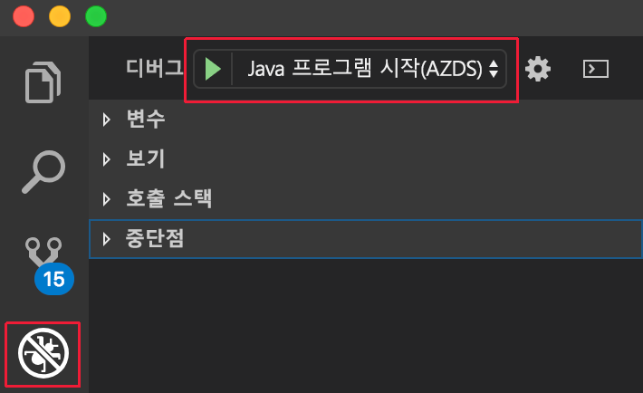

# <a name="quickstart-create-a-kubernetes-dev-space-with-azure-dev-spaces-java-and-vs-code"></a>빠른 시작: Azure Dev Spaces(Java 및 VS Code)를 사용하여 Kubernetes 개발 환경 만들기

이 가이드에서는 다음을 수행하는 방법을 배우게 됩니다.

- Azure에서 관리되는 Kubernetes 클러스터를 사용하여 Azure Dev Spaces를 설정합니다.
- VS Code 및 명령줄을 사용하여 컨테이너에서 반복적으로 코드를 개발합니다.
- VS Code에서 개발 환경의 코드를 디버그합니다.

> [!Note]
> **의문 사항이 있으면** 언제든지 [문제 해결](troubleshooting.md) 섹션을 참조하거나 이 페이지에 의견을 게시하세요. 또한 더 자세한 [자습서](get-started-netcore.md)를 시도해 볼 수도 있습니다.

## <a name="prerequisites"></a>필수 조건

- Azure 구독. 계정이 없는 경우 [무료 계정](https://azure.microsoft.com/free)에 만들 수 있습니다.
- [Visual Studio Code](https://code.visualstudio.com/download)
- [Azure CLI](/cli/azure/install-azure-cli?view=azure-cli-latest) 버전 2.0.43 이상.
- 미국 동부, 미국 동부 2, 미국 중부, 미국 서부 2, 서유럽, 동남 아시아, 캐나다 중부 또는 캐나다 동부 지역에서 **Http 애플리케이션 라우팅**이 활성화된 상태로 Kubernetes 1.10.3 이상을 실행하는 Kubernetes 클러스터.

    ```cmd
    az group create --name MyResourceGroup --location <region>
    az aks create -g MyResourceGroup -n myAKS --location <region> --kubernetes-version 1.10.9 --enable-addons http_application_routing --generate-ssh-keys
    ```

## <a name="set-up-azure-dev-spaces"></a>Azure Dev Spaces 설치

1. AKS 클러스터에 Dev Spaces 설치: `az aks use-dev-spaces -g MyResourceGroup -n MyAKS`
1. VS Code용 [Azure Dev Spaces 확장](https://marketplace.visualstudio.com/items?itemName=azuredevspaces.azds)을 다운로드합니다. 확장의 Marketplace 페이지 및 VS Code에서 [설치]를 한 번 클릭합니다.
1. VS Code용 [Java Debugger for Azure Dev Spaces](https://marketplace.visualstudio.com/items?itemName=vscjava.vscode-java-debugger-azds) 확장을 다운로드합니다. 확장의 Marketplace 페이지 및 VS Code에서 [설치]를 한 번 클릭합니다.

## <a name="build-and-run-code-in-kubernetes"></a>Kubernetes에서 코드 빌드 및 실행

1. GitHub에서 샘플 코드 다운로드: [https://github.com/Azure/dev-spaces](https://github.com/Azure/dev-spaces) 
1. webfrontend 폴더로 디렉터리 변경: `cd dev-spaces/samples/java/getting-started/webfrontend`
1. Docker 및 Helm 차트 자산 생성: `azds prep --public`
1. AKS에서 코드를 빌드하고 실행합니다. **webfrontend 폴더**의 터미널 창에서 `azds up` 명령을 실행합니다.
1. 콘솔 출력에서 `up` 명령으로 생성된 URL에 대한 정보를 검색합니다. 다음과 같은 형식입니다.

   ```output
    (pending registration) Service 'webfrontend' port 'http' will be available at <url>
    Service 'webfrontend' port 80 (TCP) is available at http://localhost:<port>
   ```

   브라우저 창에서 이 URL을 열고 웹앱 로드를 확인합니다.

   > [!Note]
   > 첫 번째 실행 시 공용 DNS를 준비하는 데 몇 분 정도 걸릴 수 있습니다. 공용 URL이 확인되지 않으면 콘솔 출력에 표시되는 http://localhost:<portnumber> URL을 대신 사용할 수 있습니다. localhost URL을 사용하는 경우 컨테이너가 로컬로 실행되는 것처럼 보이지만, 실제로는 AKS에서 실행되고 있습니다. 편의상 로컬 컴퓨터에서 서비스와 쉽게 상호 작용할 수 있도록 Azure Dev Spaces는 Azure에서 실행되는 컨테이너에 대한 임시 SSH 터널을 만듭니다. DNS 레코드 준비되면 돌아와서 나중에 공용 URL을 시도해볼 수 있습니다.

### <a name="update-a-code-file"></a>코드 파일 업데이트

1. 터미널 창에서 `Ctrl+C`(`azds up` 중지)를 누릅니다.
1. `src/main/java/com/ms/sample/webfrontend/Application.java`라는 코드 파일을 열고 인사말 메시지를 편집합니다. `return "Hello from webfrontend in Azure!";`
1. 파일을 저장합니다.
1. 터미널 창에서 `azds up`를 실행합니다.

이 명령은 컨테이너 이미지를 다시 빌드하고 Helm 차트를 다시 배포합니다. 실행 중인 애플리케이션에서 적용하는 코드 변경 내용을 보려면 브라우저를 새로 고칩니다.

하지만 코드 개발에 사용할 수 있는 *훨씬 더 빠른 방법*이 있으며, 이에 대해서는 다음 섹션에서 살펴볼 예정입니다.

## <a name="debug-a-container-in-kubernetes"></a>Kubernetes에서 컨테이너 디버깅

이 섹션에서는 VS Code를 사용하여 Azure에서 실행 중인 컨테이너를 직접 디버그합니다. 또한 편집-실행-테스트를 더 빠르게 반복하는 방법도 알아봅니다.


### <a name="initialize-debug-assets-with-the-vs-code-extension"></a>VS Code 확장을 사용하여 디버그 자산 초기화
먼저 VS Code가 Azure에서 개발 환경과 통신하도록 코드 프로젝트를 구성해야 합니다. Azure Dev Spaces에 대한 VS Code 확장은 디버그 구성을 설정하는 도우미 명령을 제공합니다.

**명령 팔레트**(**보기 | 명령 팔레트** 메뉴를 사용하여)를 열고, 자동 완성을 사용하여 입력하고 이 명령을 선택합니다. `Azure Dev Spaces: Prepare configuration files for Azure Dev Spaces`

이렇게 하면 `.vscode` 폴더 아래에 Azure Dev Spaces에 대한 디버그 구성이 추가됩니다.


### <a name="select-the-azds-debug-configuration"></a>AZDS 디버그 구성 선택
1. 디버그 보기를 열려면 VS Code 측면의 **활동 표시줄**에서 디버그 아이콘을 클릭합니다.
1. 활성 디버그 구성으로 **Java 프로그램 시작(AZDS)** 을 선택합니다.



> [!Note]
> 명령 팔레트에 Azure Dev Spaces 명령이 보이지 않으면 Azure Dev Spaces용 VS Code 확장 프로그램을 설치했는지 확인합니다. VS Code에서 연 작업 영역이 azds.yaml을 포함하는 폴더인지 확인합니다.

### <a name="debug-the-container-in-kubernetes"></a>Kubernetes에서 컨테이너 디버깅
**F5** 키를 눌러 Kubernetes에서 코드를 디버깅하세요.

`up` 명령과 마찬가지로 코드가 개발 환경에 동기화되고 컨테이너가 빌드되어 Kubernetes에 배포됩니다. 물론 이번에는 디버거가 원격 컨테이너에 연결됩니다.

> [!Tip]
> VS Code 상태 표시줄에 클릭 가능한 URL이 표시됩니다.

예를 들어 `src/main/java/com/ms/sample/webfrontend/Application.java` 원본 파일의 `greeting()` 함수 내에서 서버 측 코드 파일에 중단점을 설정합니다. 브라우저 페이지를 새로 고치면 중단점에 도달합니다.

코드가 로컬에서 실행되는 경우처럼 호출 스택, 지역 변수, 예외 정보 등과 같은 디버그 정보에 대한 전체 액세스 권한이 있습니다.

### <a name="edit-code-and-refresh"></a>코드 편집 및 새로 고침
디버거를 활성화한 상태에서 코드를 편집합니다. 예를 들어, `src/main/java/com/ms/sample/webfrontend/Application.java`에서 인사말을 수정합니다. 

```java
public String greeting()
{
    return "I'm debugging Java code in Azure!";
}
```

파일을 저장하고, **디버그 작업 창**에서 **새로 고침** 단추를 클릭합니다. 


코드 편집이 완료될 때마다 상당한 시간이 소요되는 새 컨테이너 이미지 다시 빌드 및 다시 배포 작업을 수행하는 대신 Azure Dev Spaces는 기존 컨테이너 내에서 코드를 점진적으로 다시 컴파일하여 더 빠른 편집/디버그 루프를 제공합니다.

브라우저에서 웹앱을 새로 고칩니다. 사용자 지정 메시지가 UI에 표시되어야 합니다.

**이제 코드를 신속하게 반복하고 Kubernetes에서 직접 디버깅할 수 있는 방법이 있습니다.**

## <a name="next-steps"></a>다음 단계

Azure Dev Spaces를 통해 여러 컨테이너에서 더 복잡한 앱을 개발할 수 있는 방법 및 사용자가 다양한 환경에서 다양한 코드 버전이나 분기로 작업하여 공동 개발을 간소화하는 방법을 알아봅니다.

> [!div class="nextstepaction"]
> [여러 컨테이너 작업 및 팀 개발](team-development-java.md)
