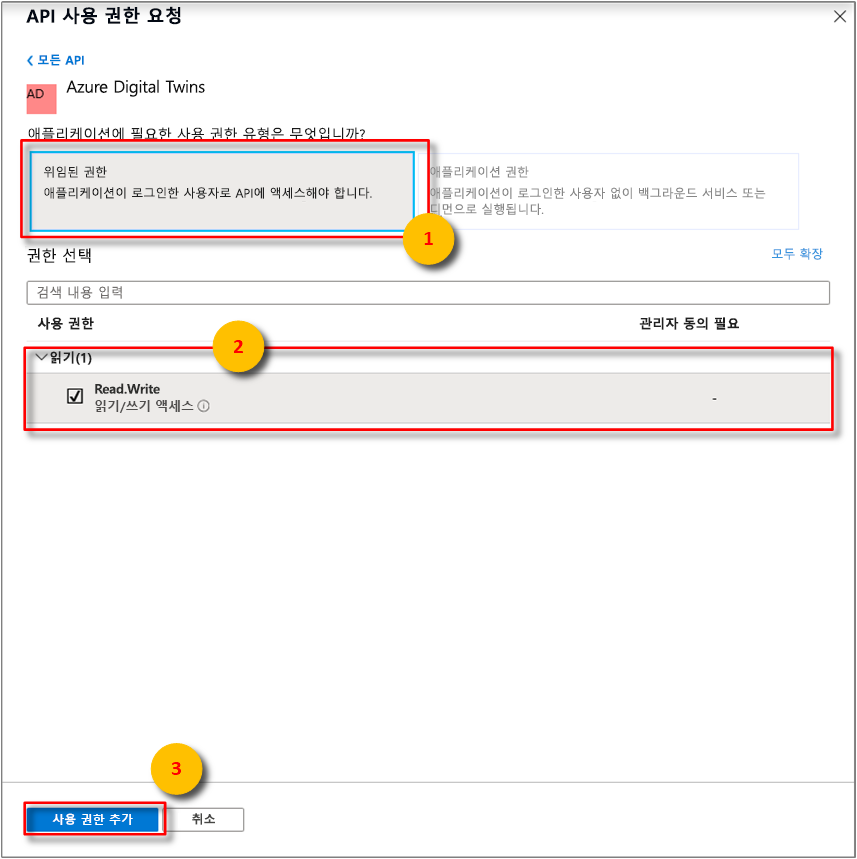

# <a name="how-to-configure-postman-for-azure-digital-twins"></a>Azure Digital Twins용 Postman을 구성하는 방법

이 문서에서는 Azure Digital Twins 관리 API와 상호 작용하고 테스트하기 위해 Postman REST 클라이언트를 구성하는 방법을 설명합니다. 구체적으로 다음을 설명합니다.

* OAuth 2.0 암시적 허용 흐름을 사용하도록 Azure Active Directory 애플리케이션을 구성하는 방법
* Postman REST 클라이언트를 사용하여 관리 API에 토큰-관련 HTTP 요청을 수행하는 방법
* Postman을 사용하여 관리 API에 대해 다중 파트 POST 요청을 수행하는 방법

## <a name="postman-summary"></a>Postman 요약

[Postman](https://www.getpostman.com/)과 같은 REST 클라이언트 도구를 사용하여 Azure Digital Twins를 시작하여 로컬 테스트 환경을 준비합니다. Postman 클라이언트를 통해 복잡한 HTTP 요청을 신속하게 만들 수 있습니다. [www.getpostman.com/apps](https://www.getpostman.com/apps)로 이동하여 Postman 클라이언트의 데스크톱 버전을 다운로드합니다.

[Postman](https://www.getpostman.com/)은 유용한 데스크톱 및 플러그 인 기반 GUI에 대한 주요 HTTP 요청을 찾는 REST 테스트 도구입니다. 

Postman 클라이언트를 통해 솔루션 개발자는 HTTP 요청의 종류(*POST*, *GET*, *UPDATE*, *PATCH* 및 *DELETE*), 호출할 API 엔드포인트 및 SSL의 사용을 지정할 수 있습니다. Postman은 또한 HTTP 요청 헤더, 매개 변수, 양식 데이터 및 본문 추가를 지원합니다.

## <a name="configure-azure-active-directory-to-use-the-oauth-20-implicit-grant-flow"></a>OAuth 2.0 암시적 허용 흐름을 사용하도록 Azure Active Directory를 구성합니다.

OAuth 2.0 암시적 허용 흐름을 사용하도록 Azure Active Directory 앱을 구성합니다.

1. [이 빠른 시작](https://docs.microsoft.com/azure/active-directory/develop/quickstart-v1-integrate-apps-with-azure-ad)의 단계에 따라 Native 형식의 Azure AD 애플리케이션을 만듭니다. 또는 기존 Native 앱 등록을 다시 사용할 수 있습니다.

1. **필수 권한** 아래에서 **추가**를 선택하고 **API 액세스 추가** 아래에 **Azure Digital Twins**를 입력합니다. 검색에서 API를 찾을 수 없는 경우 **Azure Smart Spaces**을 대신 검색합니다. 그런 다음, **사용 권한 부여 > 위임된 권한**과 **완료**를 차례로 선택합니다.

    

1. **매니페스트**를 클릭하여 앱에 대한 애플리케이션 매니페스트를 엽니다. *oauth2AllowImplicitFlow*를 `true`로 설정합니다.

      ![Azure Active Directory 암시적 흐름][1]

1. **회신 URL**을 `https://www.getpostman.com/oauth2/callback`으로 구성합니다.

      ![Azure Active Directory 회신 URL][2]

1. Azure Active Directory 앱의 **애플리케이션 ID**를 복사하고 유지합니다. 이어지는 단계에서 사용됩니다.

## <a name="obtain-an-oauth-20-token"></a>OAuth 2.0 토큰 가져오기

다음으로 Postman을 설정하고 구성하여 Azure Active Directory 토큰을 가져옵니다. 그런 다음, 획득한 토큰을 사용하여 Azure Digital Twins로 인증된 HTTP 요청을 만듭니다.

1. [www.getpostman.com](https://www.getpostman.com/)으로 이동하여 앱을 다운로드합니다.
1. **권한 부여 URL**이 올바른지 확인합니다. 다음과 같은 형식이어야 합니다.

    ```plaintext
    https://login.microsoftonline.com/YOUR_AZURE_TENANT.onmicrosoft.com/oauth2/authorize?resource=0b07f429-9f4b-4714-9392-cc5e8e80c8b0
    ```

    | 이름  | 다음 항목으로 교체 | 예 |
    |---------|---------|---------|
    | YOUR_AZURE_TENANT | 테넌트 또는 조직의 이름 | `microsoft` |

1. **권한 부여 탭**을 선택하고, **OAuth 2.0**을 선택한 다음, **새 액세스 토큰 가져오기**를 선택합니다.

    | 필드  | 값 |
    |---------|---------|
    | 권한 부여 유형 | `Implicit` |
    | 콜백 URL | `https://www.getpostman.com/oauth2/callback` |
    | 인증 URL | 2단계의 **권한 부여 URL**을 사용합니다. |
    | 클라이언트 ID | 이전 섹션에서 생성되거나 용도가 변경된 Azure Active Directory 앱에 대해 **애플리케이션 ID**를 사용합니다. |
    | Scope | 비워 둠 |
    | 시스템 상태 | 비워 둠 |
    | 클라이언트 인증 | `Send as Basic Auth header` |

1. 클라이언트는 이제 다음과 같아야 합니다.

   ![Postman 클라이언트 예제][3]

1. **토큰 요청**을 선택합니다.

    >[!TIP]
    >"OAuth 2를 완료할 수 없습니다."라는 오류 메시지가 나타나면 다음과 같이 시도하세요.
    > * Postman을 닫은 후 다시 열고, 다시 시도합니다.
  
1. 아래로 스크롤하고 **토큰 사용**을 선택합니다.

<div id="multi"></div>

## <a name="make-a-multipart-post-request"></a>다중 파트 POST 요청 수행

이전 단계를 완료한 후 인증된 HTTP 다중 파트 POST 요청을 수행하도록 Postman을 구성합니다.

1. **헤더** 탭 아래에서 값이 `multipart/mixed`인 HTTP 요청 헤더 키 **Content-Type**을 추가합니다.

   ![콘텐츠 형식 multipart/mixed][4]

1. 텍스트가 아닌 데이터를 파일로 직렬화합니다. JSON 데이터는 JSON 파일로 저장됩니다.
1. **본문** 탭 아래에서 **키** 이름을 할당하고 `file` 또는 `text`를 선택하여 각 파일을 추가합니다.
1. 그런 후 **파일 선택** 단추를 사용하여 각 파일을 선택합니다.

   ![Postman 클라이언트 예제][5]

   >[!NOTE]
   > * Postman 클라이언트에서는 다중 파트 청크에 **Content-Type** 또는 **Content-Disposition**을 수동으로 할당할 필요가 없습니다.
   > * 각 파트에 대해 해당 헤더를 지정할 필요가 없습니다.
   > * 전체 요청에 대해서는 `multipart/mixed` 또는 다른 적절한 **Content-Type**을 선택해야 합니다.

1. 마지막으로, **보내기**를 클릭하여 다중 파트 HTTP POST 요청을 제출합니다.

## <a name="next-steps"></a>다음 단계

- Digital Twins 관리 API 및 이를 사용하는 방법에 대해 자세히 알아보려면 [Azure Digital Twins 관리 API 사용 방법](how-to-navigate-apis.md)을 읽어보세요.

- 다중 파트 요청을 사용하여 [Azure Digital Twins 엔터티에 blob을 추가](./how-to-add-blobs.md)합니다.

- Management API를 사용하여 인증에 대해 알아보려면 [API를 사용하여 인증](./security-authenticating-apis.md)을 참조하세요.

<!-- Images -->
[1]: media/how-to-configure-postman/implicit-flow.png
[2]: media/how-to-configure-postman/reply-url.png
[3]: media/how-to-configure-postman/postman-oauth-token.png
[4]: media/how-to-configure-postman/content-type.png
[5]: media/how-to-configure-postman/form-body.png