# <a name="quickstart-create-a-hybrid-mode-instance-with-azure-portal--azure-database-migration-service"></a>빠른 시작: Azure Portal 및 Azure Database Migration Service를 사용하여 하이브리드 모드 인스턴스 만들기

Azure Database Migration Service 하이브리드 모드는 클라우드에서 실행 중인 Azure Database Migration Service 인스턴스와 온-프레미스에서 호스트되는 마이그레이션 작업자를 함께 사용하여 데이터베이스 마이그레이션을 관리합니다. 하이브리드 모드는 온-프레미스 네트워크와 Azure 간에 사이트 간 연결이 부족하거나 사이트 간 연결 대역폭이 제한된 경우에 특히 유용합니다.

>[!NOTE]
>현재 하이브리드 모드에서 실행되는 Azure Database Migration Service는 다음과 같은 항목으로 SQL Server 마이그레이션을 지원합니다.
>
>- 가동 중지 시간이 거의 없는(온라인) Azure SQL Managed Instance.
>- 어느 정도의 가동 중지 시간(오프라인)이 있는 Azure SQL Database 단일 데이터베이스
>- MongoDb에서 가동 중지 시간이 거의 없는(온라인) Azure CosmosDB로
>- MongoDb에서 어느 정도의 가동 중지 시간(오프라인)이 있는 Azure CosmosDB로

이 빠른 시작에서는 Azure Portal을 사용하여 하이브리드 모드에서 Azure Database Migration Service의 인스턴스를 만듭니다. 그런 다음, 온-프레미스 네트워크에서 Hybrid Worker를 다운로드, 설치 및 설정합니다. 미리 보기 중에 Azure Database Migration Service 하이브리드 모드를 사용하여 SQL Server 온-프레미스 인스턴스에서 Azure SQL Database으로 데이터를 마이그레이션할 수 있습니다.

> [!NOTE]
> Azure Database Migration Service 하이브리드 설치 관리자는 Microsoft Windows Server 2012 R2, Window Server 2016, Windows Server 2019 및 Windows 10에서 실행됩니다.

> [!IMPORTANT]
> Azure Database Migration Service 하이브리드 설치 관리자에는 .NET 4.7.2 이상이 필요합니다. 최신 버전의 .NET을 찾으려면 [.NET Framework 다운로드](https://dotnet.microsoft.com/download/dotnet-framework) 페이지를 참조하세요.

Azure 구독이 아직 없는 경우 시작하기 전에 [체험](https://azure.microsoft.com/free/) 계정을 만듭니다.

## <a name="sign-in-to-the-azure-portal"></a>Azure Portal에 로그인

웹 브라우저를 열고 [Microsoft Azure Portal](https://portal.azure.com/)로 이동한 다음 자격 증명을 입력하여 포털에 로그인합니다.

기본 보기는 서비스 대시보드입니다.

## <a name="register-the-resource-provider"></a>리소스 공급자 등록

첫 번째 Azure Database Migration Service 인스턴스를 만들기 전에 Microsoft.DataMigration 리소스 공급자를 등록합니다.

1. Azure Portal에서 **구독** 을 선택하고, Azure Database Migration Service의 인스턴스를 만들 구독을 선택한 다음, **리소스 공급자** 를 선택합니다.

    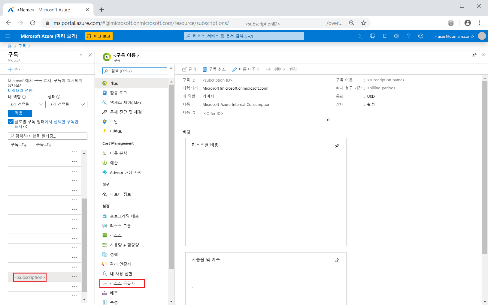

2. 마이그레이션을 검색한 다음 **Microsoft.DataMigration** 의 오른쪽에서 **등록** 을 선택합니다.

    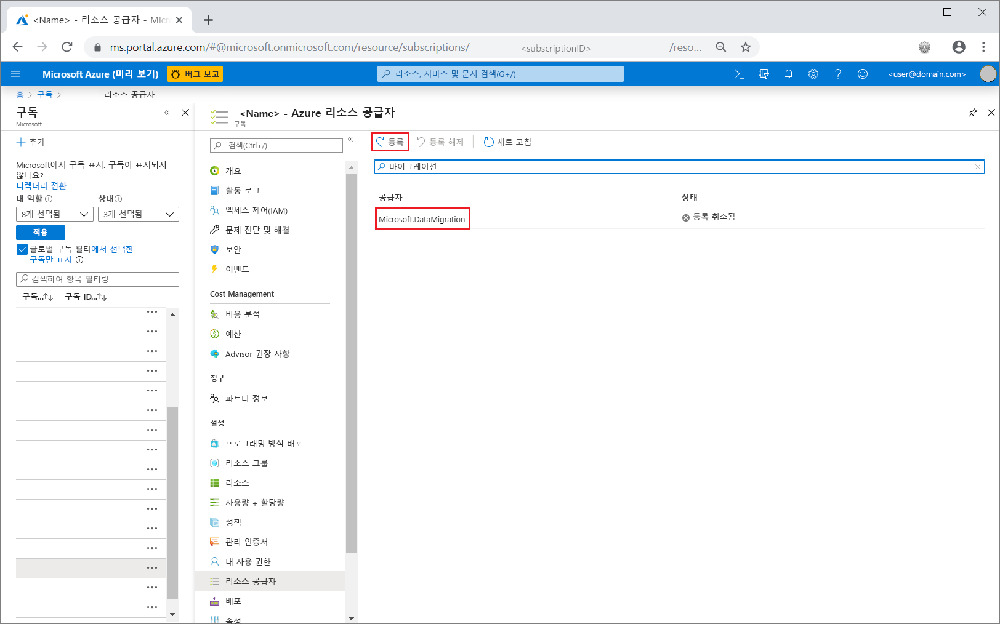

## <a name="create-an-instance-of-the-service"></a>서비스 인스턴스 만들기

1. + **리소스 만들기** 를 선택하여 Azure Database Migration Service의 인스턴스를 만듭니다.

2. Marketplace에서 "migration"을 검색하고 **Azure Database Migration Service** 를 선택한 다음, **Azure Database Migration Service** 화면에서 **만들기** 를 선택합니다.

3. **마이그레이션 서비스 만들기** 화면에서:

    - Azure Database Migration Service 인스턴스를 식별할 수 있도록 기억하기 쉽고 고유한 **서비스 이름** 을 선택합니다.
    - 인스턴스를 만들려는 Azure **구독** 을 선택합니다.
    - 기존 **리소스 그룹** 을 선택하거나 새 리소스 그룹을 만듭니다.
    - 원본 또는 대상 서버에 가장 가까운 **위치** 를 선택합니다.
    - **서비스 모드** 에서 **하이브리드(미리 보기)** 를 선택합니다.

         

4. **검토 + 만들기** 를 선택합니다.

5. **검토 + 만들기** 탭에서 용어를 검토하고, 제공된 기타 정보를 확인한 다음, **만들기** 를 선택합니다.

    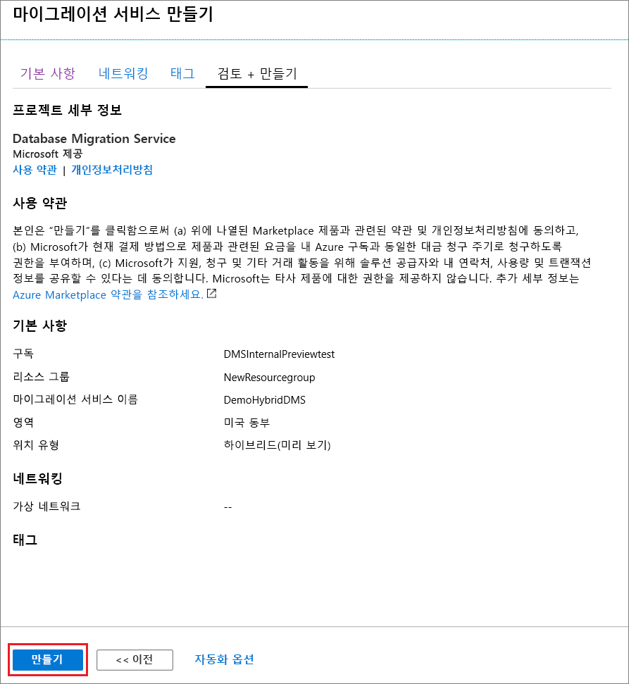

    잠시 후에 하이브리드 모드에서 Azure Database Migration Service 인스턴스가 만들어지고 사용할 준비가 됩니다. Azure Database Migration Service 인스턴스가 다음 이미지와 같이 표시됩니다.

    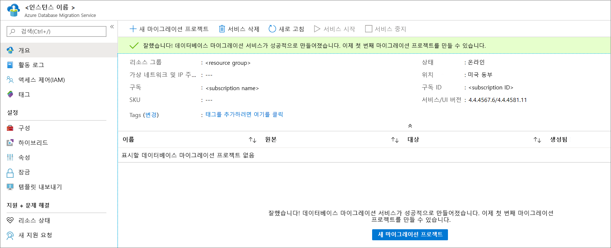

6. 서비스를 만든 후 **속성** 을 선택하고, **리소스 ID** 상자에 표시된 값을 복사합니다. 이 값은 Azure Database Migration Service Hybrid Worker를 설치하는 데 사용합니다.

    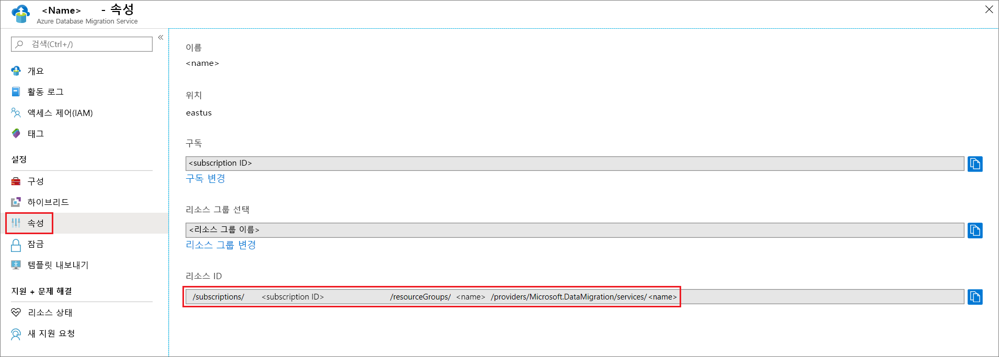

## <a name="create-azure-app-registration-id"></a>Azure 앱 등록 ID 만들기

온-프레미스 Hybrid Worker가 클라우드의 Azure Database Migration Service와 통신하는 데 사용할 수 있는 Azure 앱 등록 ID를 만들어야 합니다.

1. Azure Portal에서 **Azure Active Directory** 를 선택한 다음, **앱 등록** 을 선택하고 **새 등록** 을 선택합니다.
2. 애플리케이션의 이름을 지정한 다음, **지원되는 계정 유형** 에서 지원할 계정 유형을 선택하고 애플리케이션을 사용할 수 있는 사용자를 지정합니다.

    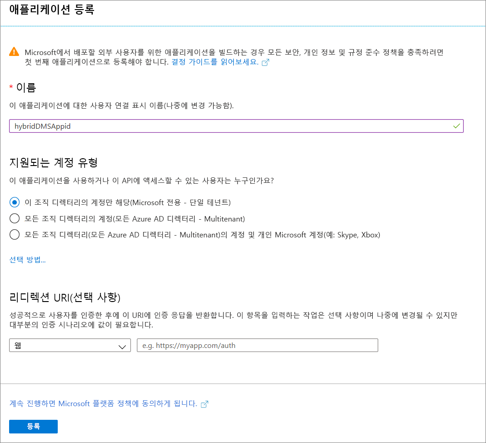

3. **리디렉션 URI(선택 사항)** 필드에 대해 기본값을 그대로 사용하고 **등록** 을 선택합니다.

4. 앱 ID 등록이 완료된 후 **애플리케이션(클라이언트) ID** 를 기록해 둡니다. 이 ID는 Hybrid Worker를 설치하는 데 사용됩니다.

5. Azure Portal에서 Azure Database Migration Service로 이동하고, **액세스 제어(IAM)** 를 선택한 다음, **역할 할당 추가** 를 선택하여 앱 ID에 참가자 액세스 권한을 할당합니다.

    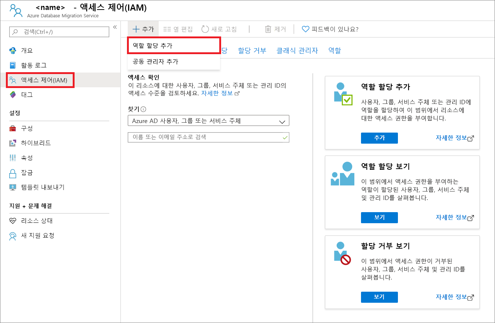

6. 역할로 **참가자** 를 선택하고, **Azure AD 사용자 또는 서비스 주체** 에 액세스 권한을 할당한 후 앱 ID 이름을 선택합니다.

    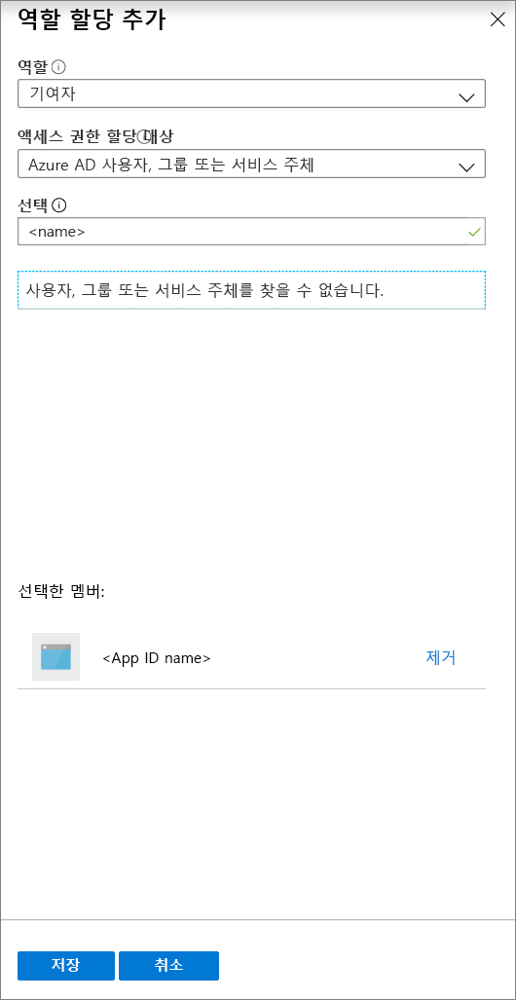

7. **저장** 을 선택하여 Azure Database Migration Service 리소스에 앱 ID에 대한 역할 할당을 저장합니다.

## <a name="download-and-install-the-hybrid-worker"></a>Hybrid worker 다운로드 및 설치

1. Azure Portal에서 Azure Database Migration Service 인스턴스로 이동합니다.

2. **설정** 에서 **하이브리드** 를 선택한 다음, **설치 관리자 다운로드** 를 선택하여 Hybrid Worker를 다운로드합니다.

    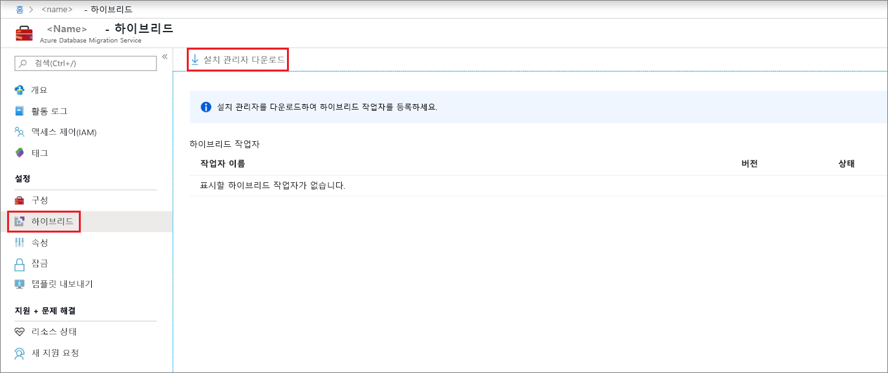

3. Azure Database Migration Service Hybrid Worker를 호스트할 서버에서 ZIP 파일의 압축을 풉니다.

    > [!IMPORTANT]
    > Azure Database Migration Service 하이브리드 설치 관리자에는 .NET 4.7.2 이상이 필요합니다. 최신 버전의 .NET을 찾으려면 [.NET Framework 다운로드](https://dotnet.microsoft.com/download/dotnet-framework) 페이지를 참조하세요.

4. 설치 폴더에서 **dmsSettings.json** 파일을 찾아 열고, **ApplicationId** 및 **resourceId** 를 지정한 다음, 파일을 저장합니다.

    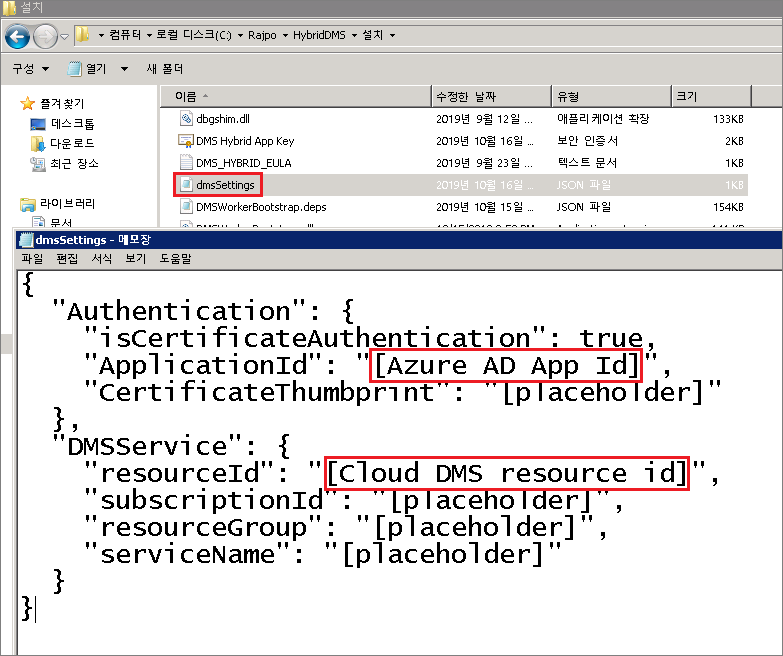

5. 다음 명령을 사용하여 Azure Database Migration Service가 Hybrid Worker의 통신을 인증하는 데 사용할 수 있는 인증서를 생성합니다.

    ```
    <drive>:\<folder>\Install>DMSWorkerBootstrap.exe -a GenerateCert
    ```

    인증서가 Installer 폴더에 생성됩니다.

    

6. Azure Portal에서 앱 ID로 이동한 후 **관리** 아래에서 **인증서 및 비밀** 을 선택하고 **인증서 업로드** 를 선택하여 생성한 퍼블릭 인증서를 선택합니다.

    

7. 다음 명령을 실행하여 온-프레미스 서버에 Azure Database Migration Service Hybrid Worker를 설치합니다.

    ```
    <drive>:\<folder>\Install>DMSWorkerBootstrap.exe -a Install -IAcceptDMSLicenseTerms -d
    ```

    > [!NOTE]
    > install 명령을 실행할 때 다음 매개 변수를 사용할 수도 있습니다.
    >
    > - **-TelemetryOptOut** - Worker가 원격 분석 데이터를 보내는 것을 중지하지만 로컬에서 최소한의 기록을 계속합니다.  설치 관리자는 원격 분석 데이터를 계속 보냅니다.
    > - **-p {InstallLocation}** . 기본적으로 “C:\Program Files\DatabaseMigrationServiceHybrid”인 설치 경로를 변경할 수 있습니다.

8. 오류가 발생하지 않고 설치 관리자가 실행되면 서비스는 Azure Database Migration Service에 온라인 상태를 표시하며, 이것은 데이터베이스를 마이그레이션할 준비가 되었음을 나타냅니다.

    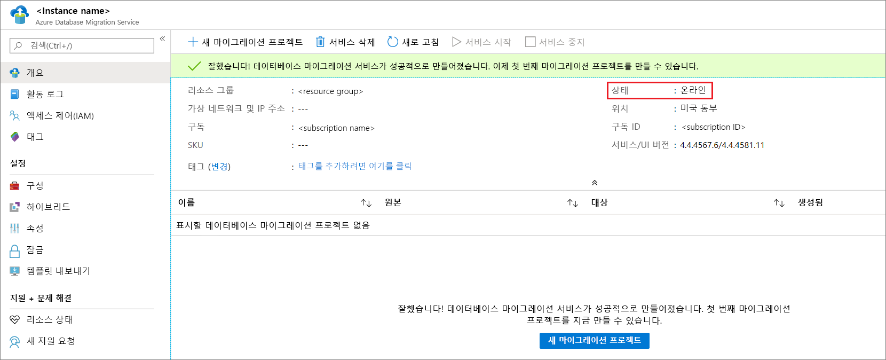

## <a name="uninstall-azure-database-migration-service-hybrid-mode"></a>Azure Database Migration Service 하이브리드 모드 제거

현재는 다음 명령을 사용하여 온-프레미스 서버의 Azure Database Migration Service Hybrid Worker 설치 관리자를 통해서만 Azure Database Migration Service 하이브리드 모드를 제거할 수 있습니다.

```
<drive>:\<folder>\Install>DMSWorkerBootstrap.exe -a uninstall
```

> [!NOTE]
> uninstall 명령을 실행할 때 “-ReuseCert” 매개 변수를 사용하여 generateCert 워크플로에서 생성된 AdApp 인증서를 유지할 수도 있습니다.  이렇게 하면 이전에 생성되고 업로드된 동일한 인증서를 사용할 수 있습니다.

## <a name="set-up-the-azure-database-migration-service-hybrid-worker-using-powershell"></a>PowerShell을 사용하여 Azure Database Migration Service Hybrid Worker 설정

Azure Portal을 통해 Azure Database Migration Service Hybrid Worker를 설치하는 것 외에도, 하이브리드 모드에서 신규 Azure Database Migration Service 인스턴스를 만든 후 Worker 설치 단계를 자동화하는 데 사용할 수 있는 [PowerShell 스크립트](https://techcommunity.microsoft.com/gxcuf89792/attachments/gxcuf89792/MicrosoftDataMigration/119/1/DMS_Hybrid_Script.zip)가 제공됩니다. 스크립트:

1. 신규 AdApp을 만듭니다.
2. 설치 관리자를 다운로드합니다.
3. generateCert 워크플로를 실행합니다.
4. 인증서를 업로드합니다.
5. Azure Database Migration Service 인스턴스에 AdApp을 기여자로 추가합니다.
6. 설치 워크플로를 실행합니다.

이 스크립트는 환경에 필요한 모든 권한이 사용자에게 이미 있는 경우, 빠른 프로토타입 생성을 위해 사용할 수 있습니다. 프로덕션 환경에서는 AdApp과 Cert의 요구 사항이 서로 달라서 스크립트가 실패할 수 있습니다.

> [!IMPORTANT]
> 이 스크립트는 하이브리드 모드에 기존 Azure Database Migration Service 인스턴스가 있고, 사용된 Azure 계정에 테넌트에서 AdApps를 만들고 구독에서 Azure RBAC를 수정할 수 있는 권한이 있다고 가정합니다.

스크립트 상단에 있는 매개 변수를 입력한 다음, 관리자 PowerShell 인스턴스에서 스크립트를 실행합니다.

## <a name="next-steps"></a>다음 단계

> [!div class="nextstepaction"]
> [SQL Server에서 Azure SQL Managed Instance로 온라인 마이그레이션](tutorial-sql-server-managed-instance-online.md)
> [SQL Server에서 Azure SQL Database로 오프라인 마이그레이션](tutorial-sql-server-to-azure-sql.md)
