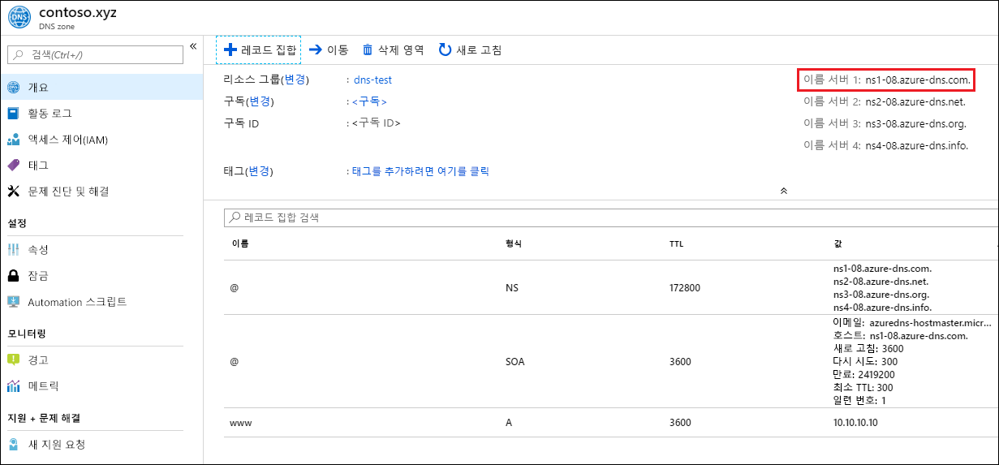

# <a name="quickstart-create-an-azure-dns-zone-and-record-using-the-azure-portal"></a>빠른 시작: Azure Portal을 사용하여 Azure DNS 영역 및 레코드 만들기

공용 도메인에서 호스트 이름을 확인하기 위한 Azure DNS를 구성할 수 있습니다. 예를 들어 도메인 이름 등록 기관에서 *contoso.xyz* 도메인 이름을 구입한 경우, Azure DNS에서 *contoso.xyz* 도메인을 호스팅하고 *www.contoso.xyz*를 웹 서버 또는 웹앱의 IP 주소로 확인하도록 구성할 수 있습니다.

이 빠른 시작에서는 테스트 도메인을 만든 다음, *www*를 *10.10.10.10* IP 주소로 확인하는 주소 레코드를 만듭니다.

>[!IMPORTANT]
>이 빠른 시작에 나오는 모든 이름 및 IP 주소는 예제일 뿐이며 실제 시나리오를 나타내지 않습니다.

<!---
You can also perform these steps using [Azure PowerShell](dns-getstarted-powershell.md) or the cross-platform [Azure CLI](dns-getstarted-cli.md).
--->

Azure 구독이 아직 없는 경우 시작하기 전에 [체험 계정](https://azure.microsoft.com/free/?WT.mc_id=A261C142F)을 만듭니다.

모든 포털 단계를 위해 [Azure Portal](https://portal.azure.com)에 로그인합니다.

## <a name="create-a-dns-zone"></a>DNS 영역 만들기

DNS 영역에는 도메인에 대한 DNS 항목이 포함됩니다. Azure DNS에서 도메인 호스팅을 시작하려면 해당 도메인 이름의 DNS 영역을 만듭니다. 

**DNS 영역을 만들려면**

1. 왼쪽 위에서 **리소스 만들기**를 선택한 다음, **네트워킹**, **DNS 영역**을 차례로 선택합니다.

1. **DNS 영역 만들기** 페이지에서 다음 값을 입력하거나 선택합니다.

   - **이름**: 이 빠른 시작 예제의 경우 *contoso.xyz*를 입력합니다. DNS 영역 이름으로는 Azure DNS 서버에 아직 구성되지 않은 모든 값을 사용할 수 있습니다. 실제 값은 도메인 이름 등록 기관에서 구입한 도메인입니다.
   - **리소스 그룹**: **새로 만들기**를 선택하고, *MyResourceGroup*을 입력하고, **확인**을 선택합니다. 리소스 그룹 이름은 Azure 구독 내에서 고유해야 합니다. 

1. **만들기**를 선택합니다.

   

영역을 만드는 데 몇 분이 걸릴 수 있습니다.

## <a name="create-a-dns-record"></a>DNS 레코드 만들기

DNS 영역 내에서 도메인에 대한 DNS 항목 또는 레코드를 만듭니다. 호스트 이름을 IPv4 주소로 확인하는 새 주소 레코드 또는 'A' 레코드를 만듭니다.

**'A' 레코드를 만들려면**

1. Azure Portal의 **모든 리소스**에서 **MyResourceGroup** 리소스 그룹의 **contoso.xyz** DNS 영역을 엽니다. 보다 쉽게 찾기 위해 **이름으로 필터링** 상자에 *contoso.xyz*를 입력할 수 있습니다.

1. **DNS 영역** 페이지의 위쪽에서 **+ 레코드 집합**을 선택합니다.

1. **레코드 집합 추가** 페이지에서 다음 값을 입력하거나 선택합니다.

   - **이름**: *www*를 입력합니다. 레코드 이름은 지정된 IP 주소로 확인하려는 호스트 이름입니다.
   - **형식**: **A**를 선택합니다. 'A' 레코드가 가장 일반적이지만, 메일 서버('MX'), IP v6 주소('AAAA') 등에 대한 다른 레코드 형식도 있습니다. 
   - **TTL**: *1*을 입력합니다. DNS 요청의 *Time-to-live*는 DNS 서버 및 클라이언트가 응답을 캐시할 수 있는 시간을 지정합니다.
   - **TTL 단위**: **시간**을 선택합니다. **TTL** 값에 대한 시간 단위입니다. 
   - **IP 주소**: 이 빠른 시작 예제의 경우 *10.10.10.10*을 입력합니다. 이 값은 레코드 이름이 확인하는 IP 주소입니다. 실제 시나리오에서는 웹 서버의 공용 IP 주소를 입력합니다.

이 빠른 시작은 단지 테스트용이므로 도메인 이름 등록 기관에서 Azure DNS 이름 서버를 구성할 필요가 없습니다. 실제 프로덕션 도메인을 사용하면 인터넷 상의 누구든지 호스트 이름을 확인하여 웹 서버 또는 앱에 연결할 수 있습니다. 도메인 이름 등록 기관을 방문하여 이름 서버 레코드를 Azure DNS 이름 서버로 바꿉니다. 자세한 내용은 [자습서: Azure DNS에서 도메인 호스트](dns-delegate-domain-azure-dns.md#delegate-the-domain)를 참조하세요.

## <a name="test-the-name-resolution"></a>이름 확인 테스트

이제 테스트 'A' 레코드가 포함된 테스트 DNS 영역이 있으므로 *nslookup*이라는 도구를 사용하여 이름 확인을 테스트할 수 있습니다. 

**DNS 이름 확인을 테스트하려면**

1. Azure Portal의 **모든 리소스**에서 **MyResourceGroup** 리소스 그룹의 **contoso.xyz** DNS 영역을 엽니다. 보다 쉽게 찾기 위해 **이름으로 필터링** 상자에 *contoso.xyz*를 입력할 수 있습니다.

1. **개요** 페이지의 이름 서버 목록에서 이름 서버 이름 중 하나를 복사합니다. 

   

1. 명령 프롬프트를 열고 다음 명령을 실행합니다.

   ```
   nslookup www.contoso.xyz <name server name>
   ```

   예를 들면 다음과 같습니다.

   ```
   nslookup www.contoso.xyz ns1-08.azure-dns.com.
   ```

   다음 화면과 유사한 출력이 표시됩니다.

   

호스트 이름 **www\.contoso.xyz**는 구성한 대로 **10.10.10.10**으로 확인됩니다. 이 결과는 이름 확인이 올바르게 작동하는지 확인합니다. 

## <a name="clean-up-resources"></a>리소스 정리

이 빠른 시작에서 만든 리소스가 더 이상 필요하지 않으면 **MyResourceGroup** 리소스 그룹을 삭제하여 제거합니다. **MyResourceGroup** 리소스 그룹을 열고 **리소스 그룹 삭제**를 선택합니다.

## <a name="next-steps"></a>다음 단계

> [!div class="nextstepaction"]
> [사용자 지정 도메인에서 웹앱에 대한 DNS 레코드 만들기](./dns-web-sites-custom-domain.md)