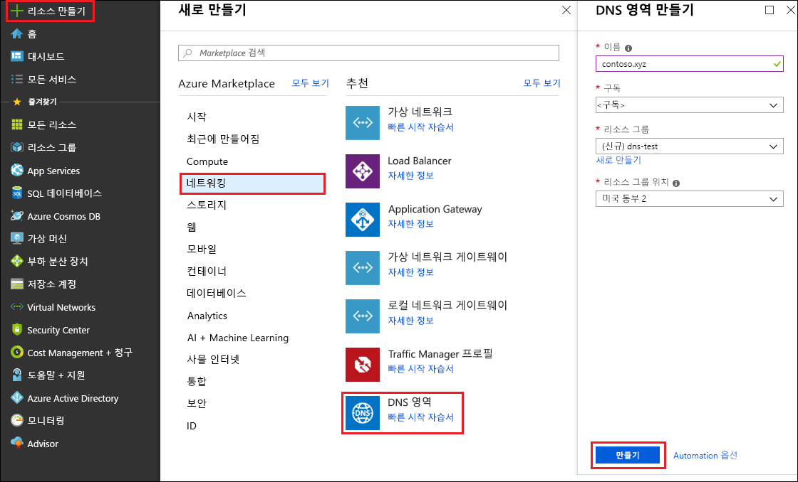

# Azure Portal을 사용하여 Azure DNS 시작

> [!div class="op_single_selector"]
> * [Azure 포털](dns-getstarted-portal.md)
> * [PowerShell](dns-getstarted-powershell.md)
> * [Azure CLI 1.0](dns-getstarted-cli-nodejs.md)
> * [Azure CLI 2.0](dns-getstarted-cli.md)

이 문서에서는 Azure Portal을 사용하여 DNS 영역 및 레코드를 만드는 단계를 안내합니다. Azure PowerShell 또는 플랫폼 간 Azure CLI를 사용하여 이러한 단계를 수행할 수도 있습니다.

DNS 영역은 특정 도메인에 대한 DNS 레코드를 호스트하는 데 사용됩니다. Azure DNS에서 도메인 호스팅을 시작하려면 해당 도메인 이름의 DNS 영역을 만들어야 합니다. 그러면 이 DNS 영역 안에 도메인의 각 DNS 레코드가 생성됩니다. 마지막으로 DNS 영역을 인터넷에 게시하려면 도메인에 대한 이름 서버를 구성해야 합니다. 아래에서는 이러한 각 단계에 대해 설명합니다.

## DNS 영역 만들기

1. Azure 포털에 로그인합니다.
2. 허브 메뉴에서 **새로 만들기 > 네트워킹 >**을 클릭한 다음 **DNS 영역**을 클릭하여 DNS 영역 블레이드 만들기를 엽니다.

    

4. **DNS 영역 만들기** 블레이드에서 DNS 영역의 이름을 지정합니다. 예를 들어 *contoso.com*입니다.
 
    

5. 다음으로, 사용할 리소스 그룹을 지정합니다. 새 리소스 그룹을 만들거나 이미 있는 리소스 그룹을 선택할 수 있습니다. 새 리소스 그룹을 만드는 경우 **위치** 드롭다운을 사용하여 리소스 그룹의 위치를 지정합니다. 이 설정은 리소스 그룹의 위치를 나타내며 DNS 영역에는 영향이 없습니다. DNS 영역 위치는 항상 "전역"이며 표시되지 않습니다.

6. 대시보드에서 새 영역을 쉽게 찾으려는 경우 **대시보드에 고정** 확인란을 선택된 상태로 그대로 둘 수 있습니다. 그런 다음 **Create**를 클릭합니다.

    

7. 만들기를 클릭하면 대시보드에 새 영역이 구성되고 있는 것을 볼 수 있습니다.

    

8. 새 영역이 만들어지면 대시보드에서 새 영역에 대한 블레이드가 열립니다.

## DNS 레코드 만들기

다음 예제에서는 새로운 'A' 레코드를 만드는 과정을 안내합니다. 다른 레코드 유형을 알아보고 기존 레코드를 수정하려면 [Azure Portal을 사용하여 DNS 레코드 및 레코드 집합 관리](dns-operations-recordsets-portal.md)를 참조하세요. 

1. **DNS 영역** 블레이드의 위쪽에서 **+레코드 집합**을 클릭하여 **레코드 집합 추가** 블레이드를 엽니다.

    

4. **레코드 집합 추가** 블레이드에서 레코드 집합의 이름을 지정합니다. 예를 들어 레코드 집합의 이름을 "**www**"로 지정할 수 있습니다.

    

5. 만들려는 레코드 유형을 선택합니다. 이 예에서는 **A**를 선택합니다.
6. **TTL**을 설정합니다. 라이브되는 기본 시간은&1;시간입니다.
7. 레코드의 IP 주소를 추가합니다.
8. 블레이드의 맨 아래에서 **확인**을 선택하여 DNS 레코드를 만듭니다.

## 레코드 보기

DNS 영역 블레이드의 아래쪽에서 DNS 영역에 대한 레코드를 볼 수 있습니다. 모든 영역에 생성된 기본 NS 및 SOA 레코드와 사용자가 생성한 모든 새 레코드가 표시됩니다.

## 이름 서버 업데이트

DNS 영역 및 레코드가 적절히 설정되었다면 Azure DNS 이름 서버를 사용하도록 도메인 이름을 구성해야 합니다. 이렇게 하면 인터넷에 있는 다른 사용자가 DNS 레코드를 찾을 수 있습니다.

영역에 대한 이름 서버는 Azure 포털에 제공됩니다.

이러한 이름 서버는 사용자가 도메인 이름을 구입한 도메인 이름 등록 기관에서 구성해야 합니다. 등록 기관에서 도메인에 대한 이름 서버를 설정하는 옵션을 제공합니다. 자세한 내용은 [Azure DNS에 도메인 위임](dns-domain-delegation.md)을 참조하세요.

## 다음 단계

Azure DNS에 대한 자세한 내용은 [Azure DNS 개요](dns-overview.md)를 참조하세요.

Azure DNS에서 DNS 레코드 관리에 대한 자세한 내용은 [Azure Portal을 사용하여 DNS 레코드 및 레코드 집합 관리](dns-operations-recordsets-portal.md)를 참조하세요.

