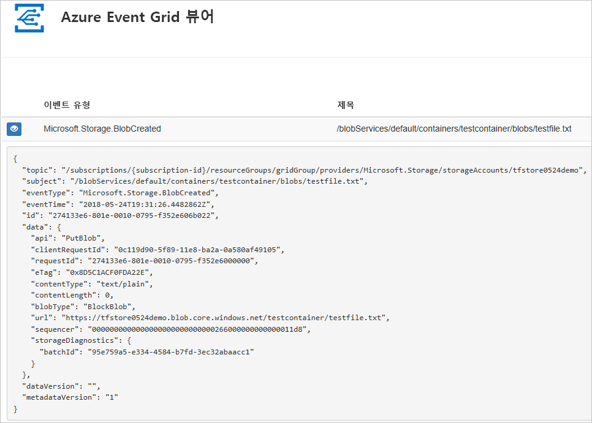
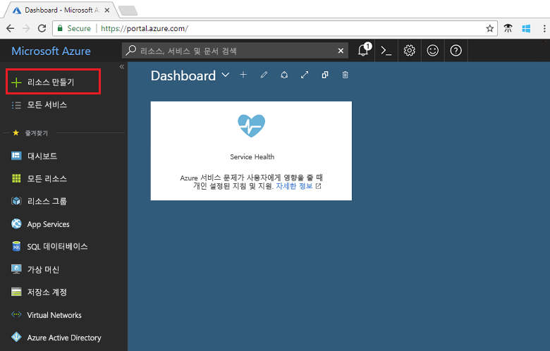
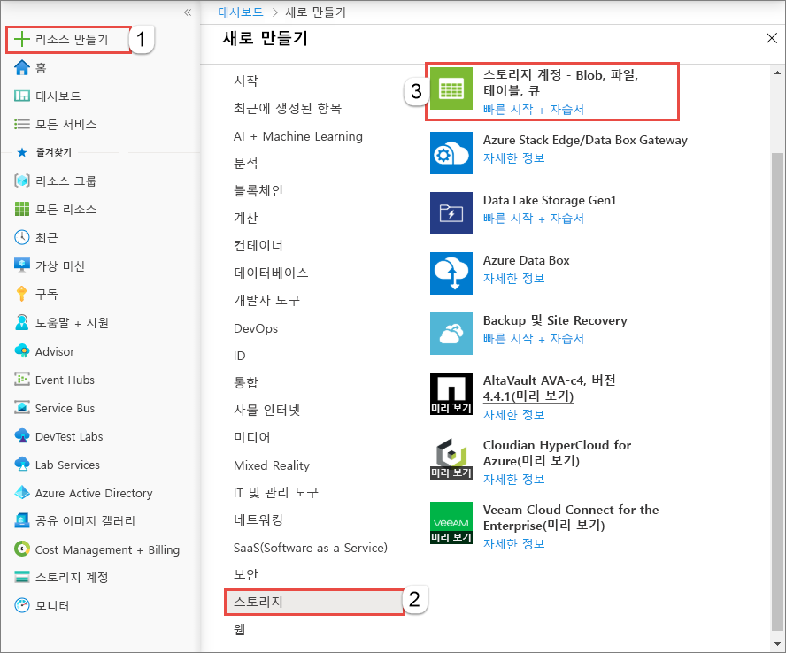
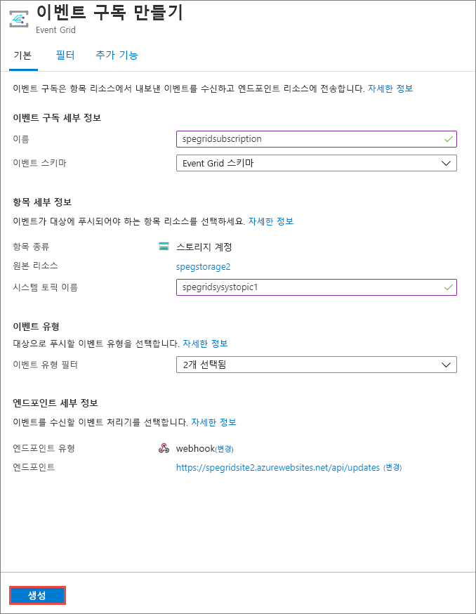
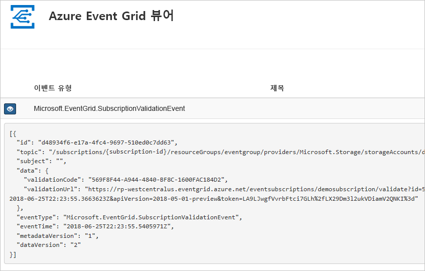
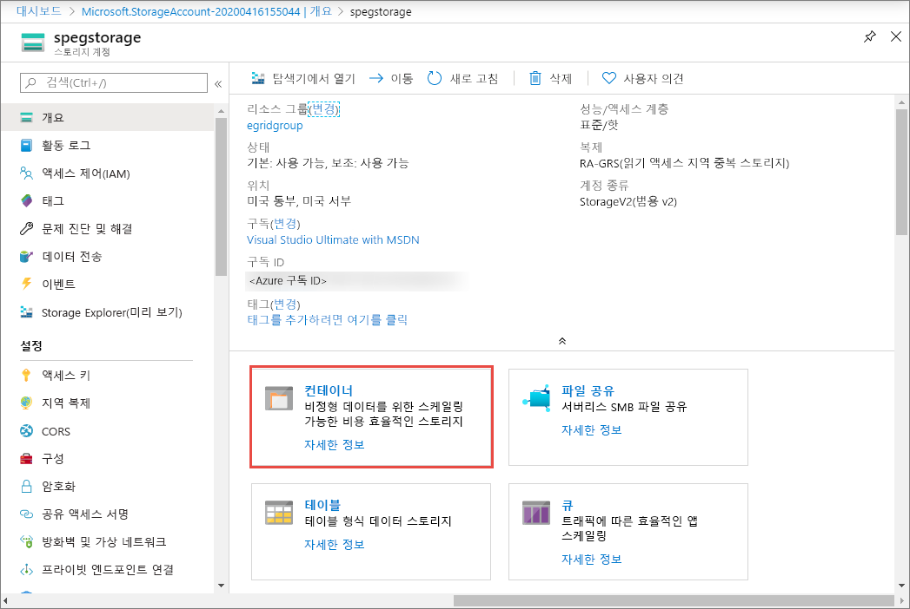

# <a name="create-and-route-blob-storage-events-with-the-azure-portal-and-event-grid"></a>Azure Portal 및 Event Grid를 사용하여 Blob 저장소 이벤트 만들기 및 라우팅

Azure Event Grid는 클라우드에 대한 이벤트 서비스입니다. 이 문서에서는 Azure Portal을 사용하여 Blob 저장소 계정을 만들고, 해당 Blob 저장소에 대한 이벤트를 구독하고, 결과를 보기 위한 이벤트를 트리거합니다. 일반적으로 이벤트 데이터를 처리하고 작업을 수행하는 엔드포인트에 이벤트를 보냅니다. 그러나 이 문서를 간소화하기 위해 메시지를 수집하고 표시하는 웹앱에 이벤트를 보냅니다.

[!INCLUDE [quickstarts-free-trial-note.md](../../includes/quickstarts-free-trial-note.md)]

작업을 완료하면 이벤트 데이터가 웹앱에 보내진 것을 확인할 수 있습니다.



## <a name="create-a-storage-account"></a>저장소 계정 만들기

Blob Storage 이벤트를 사용하려면 [Blob Storage 계정](../storage/common/storage-create-storage-account.md?toc=%2fazure%2fstorage%2fblobs%2ftoc.json#blob-storage-accounts) 또는 [범용 v2 저장소 계정](../storage/common/storage-account-options.md#general-purpose-v2-accounts)이 필요합니다. **범용 v2(GPv2)** 는 Blob, 파일, 큐 및 테이블을 포함하여 모든 저장소 서비스에서 모든 기능을 지원하는 저장소 계정입니다. **Blob Storage 계정**은 Azure Storage에서 Blob와 같은 구조화되지 않은 데이터(개체) 저장을 위한 특수 Storage 계정입니다. Blob Storage 계정은 범용 저장소 계정과 유사하면서, 현재 사용되고 있는 모든 뛰어난 내구성, 가용성, 확장성 및 성능 기능을 공유합니다(예: 블록 Blob 및 추가 Blob에 대한 100% API 일관성). 블록 또는 연결 Blob 저장소만 필요한 응용 프로그램의 경우 Blob 저장소 계정을 사용하는 것이 좋습니다. 

1. [Azure 포털](https://portal.azure.com/)에 로그인합니다.

1. Blob 저장소를 만들려면 **리소스 만들기**를 선택합니다. 

   

1. 사용할 수 있는 옵션을 필터링하려면 **저장소**를 선택하고, **저장소 계정 - Blob, 파일, 테이블, 큐**를 선택합니다.

   

1. 계정에 대한 고유 이름을 포함하여 Blob 저장소에 대한 값을 제공합니다. 계정 유형의 경우 **Blob 저장소**를 선택합니다. 위치의 경우 Event Grid를 지원하는 [위치](overview.md) 중 하나를 선택합니다. 값 입력을 완료한 후 **만들기**를 선택합니다.

   

## <a name="create-a-message-endpoint"></a>메시지 끝점 만들기

Blob 저장소 계정에 대한 이벤트를 구독하기 전에 이벤트 메시지에 대한 엔드포인트를 만들어 보겠습니다. 일반적으로 엔드포인트는 이벤트 데이터를 기반으로 작업을 수행합니다. 이 빠른 시작을 간소화하기 위해 이벤트 메시지를 표시하는 [미리 작성된 웹앱](https://github.com/dbarkol/azure-event-grid-viewer)을 배포합니다. 배포된 솔루션은 App Service 계획, App Service 웹앱 및 GitHub의 소스 코드를 포함합니다.

1. **Azure에 배포**를 선택하여 구독에 솔루션을 배포합니다. Azure Portal에서 매개 변수에 대한 값을 제공합니다.

   <a href="https://portal.azure.com/#create/Microsoft.Template/uri/https%3A%2F%2Fraw.githubusercontent.com%2Fdbarkol%2Fazure-event-grid-viewer%2Fmaster%2Fazuredeploy.json" target="_blank"></a>

1. 배포가 완료될 때까지 몇 분 정도 걸릴 수 있습니다. 배포가 성공된 후 실행하는지 확인하려면 웹앱을 봅니다. 웹 브라우저에서 `https://<your-site-name>.azurewebsites.net`으로 이동합니다.

1. 참조하는 사이트에 이벤트가 아직 게시되지 않았습니다.

   

[!INCLUDE [event-grid-register-provider-portal.md](../../includes/event-grid-register-provider-portal.md)]

## <a name="subscribe-to-the-blob-storage"></a>Blob 저장소 구독

항목을 구독하여 Event Grid에 추적하려는 이벤트와 이벤트를 보낼 위치를 알립니다.

1. 포털에서 Blob 저장소 및 **이벤트**를 차례로 선택합니다.

   

1. 이벤트 뷰어 앱에 이벤트를 보내려면 엔드포인트에 대한 웹 후크를 사용합니다. **추가 옵션** 및 **웹 후크**를 차례로 합니다.

   

1. 이벤트 구독은 Blob 저장소에 대한 값으로 미리 채워집니다. 웹 후크 엔드포인트의 경우 웹앱의 URL을 제공하고 `api/updates`를 홈 페이지 URL에 추가합니다. 구독에 이름을 지정합니다. 완료되면 **만들기**를 선택합니다.

   

1. 웹앱을 다시 확인하고, 구독 유효성 검사 이벤트를 보냈음을 확인합니다. 눈 모양 아이콘을 선택하여 이벤트 데이터를 확장합니다. Event Grid는 유효성 검사 이벤트를 보내므로 엔드포인트는 이벤트 데이터를 수신하려는 것을 확인할 수 있습니다. 웹앱은 구독의 유효성을 검사하는 코드를 포함합니다.

   

이제 이벤트를 트리거하여 Event Grid가 메시지를 사용자 끝점에 어떻게 배포하는지 살펴 보겠습니다.

## <a name="send-an-event-to-your-endpoint"></a>엔드포인트에 이벤트 보내기

파일을 업로드하여 Blob 저장소에 대한 이벤트를 트리거합니다. 파일에는 특정 콘텐츠가 필요하지 않습니다. 문서에서는 testfile.txt라는 파일이 있다고 해도 모든 파일을 사용할 수 있다고 가정합니다.

1. Blob 저장소의 경우 **Blob**을 선택합니다.

   

1. **+컨테이너**를 선택합니다. 컨테이너에 이름을 지정하고 모든 액세스 수준을 사용합니다.

   

1. 새 컨테이너를 선택합니다.

   

1. 파일을 업로드하려면 **업로드**를 선택합니다.

   

1. 테스트 파일을 찾아서 업로드합니다.

1. 이벤트를 트리거했고 Event Grid가 구독할 때 구성한 엔드포인트로 메시지를 보냈습니다. 웹앱을 본 다음, Blob 이벤트를 수신했다고 알립니다. 

  ```json
  {
    "topic": "/subscriptions/{subscription-id}/resourceGroups/eventgroup/providers/Microsoft.Storage/storageAccounts/demoblob0625",
    "subject": "/blobServices/default/containers/eventcontainer/blobs/testfile.txt",
    "eventType": "Microsoft.Storage.BlobCreated",
    "eventTime": "2018-06-25T22:50:41.1823131Z",
    "id": "89a2f9da-c01e-00bb-13d6-0c599506e4e3",
    "data": {
      "api": "PutBlockList",
      "clientRequestId": "41341a9b-e977-4a91-9000-c64125039047",
      "requestId": "89a2f9da-c01e-00bb-13d6-0c5995000000",
      "eTag": "0x8D5DAEE13C8F9ED",
      "contentType": "text/plain",
      "contentLength": 4,
      "blobType": "BlockBlob",
      "url": "https://demoblob0625.blob.core.windows.net/eventcontainer/testfile.txt",
      "sequencer": "00000000000000000000000000001C24000000000004712b",
      "storageDiagnostics": {
        "batchId": "ef633252-32fd-464b-8f5a-0d10d68885e6"
      }
    },
    "dataVersion": "",
    "metadataVersion": "1"
  }
  ```

## <a name="clean-up-resources"></a>리소스 정리

이 이벤트로 작업을 계속하려는 경우 이 문서에서 만든 리소스를 정리하지 마세요. 계속하지 않으려는 경우 이 문서에서 만든 리소스를 삭제합니다.

리소스 그룹을 선택하고 **리소스 그룹 삭제**를 선택합니다.

## <a name="next-steps"></a>다음 단계

이제 사용자 지정 항목 및 이벤트 구독을 만드는 방법에 대해 알아보았습니다. 다음으로 어떤 Event Grid가 도움이 되는지 자세히 알아보세요.

- [Event Grid 정보](overview.md)
- [Blob Storage 이벤트를 사용자 지정 웹 끝점으로 라우팅](../storage/blobs/storage-blob-event-quickstart.md?toc=%2fazure%2fevent-grid%2ftoc.json)
- [Azure Event Grid 및 Logic Apps를 사용하여 가상 머신 변경 모니터링](monitor-virtual-machine-changes-event-grid-logic-app.md)
- [데이터 웨어하우스로 빅 데이터 스트림](event-grid-event-hubs-integration.md)
