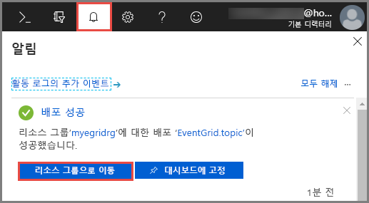
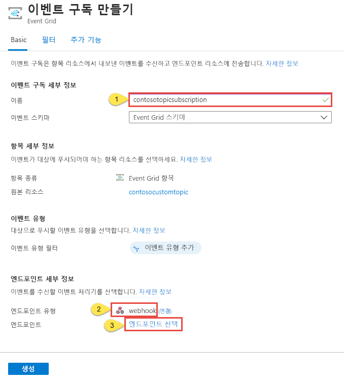

# <a name="create-and-route-custom-events-with-the-azure-portal-and-event-grid"></a>Azure Portal 및 Event Grid를 사용하여 사용자 지정 이벤트 만들기 및 라우팅

Azure Event Grid는 클라우드에 대한 이벤트 서비스입니다. 이 문서에서는 Azure Portal을 사용하여 사용자 지정 토픽을 만들고 해당 토픽을 구독하며 이벤트를 트리거하여 결과를 확인합니다. 이벤트 데이터를 기록하는 Azure 함수에 이벤트를 보냅니다. 작업을 완료하면 이벤트 데이터가 엔드포인트에 전송되고 기록되었음을 확인합니다.

[!INCLUDE [quickstarts-free-trial-note.md](../../includes/quickstarts-free-trial-note.md)]

[!INCLUDE [event-grid-register-provider-portal.md](../../includes/event-grid-register-provider-portal.md)]

## <a name="create-a-custom-topic"></a>사용자 지정 토픽 만들기

Event Grid 항목은 이벤트를 게시하는 사용자 정의 엔드포인트를 제공합니다. 

1. [Azure Portal](https://portal.azure.com/)에 로그인합니다.

1. 사용자 지정 항목을 만들려면 **리소스 만들기**를 선택합니다. 

   

1. *Event Grid 항목*을 검색하고 사용 가능한 옵션 중에서 선택합니다.

   

1. **만들기**를 선택합니다.

   

1. 사용자 지정 항목의 고유한 이름을 입력합니다. DNS 항목으로 표시되기 때문에 토픽 이름은 고유해야 합니다. 이미지에 표시된 이름은 사용하지 마십시오. 대신, 고유한 이름을 만듭니다. 리소스 그룹에 대한 이름을 입력합니다. **만들기**를 선택합니다.

   

1. 사용자 지정 항목을 만든 후 성공 알림이 표시됩니다.

   

   배포가 실패한 경우 오류의 원인을 찾습니다. **배포 실패**를 선택합니다.

   

   오류 메시지를 선택합니다.

   

   다음 이미지에는 사용자 지정 항목에 대한 이름이 이미 사용 중이므로 실패한 배포가 나와 있습니다. 이 오류가 표시되는 경우 다른 이름을 사용하여 배포를 다시 시도하십시오.

   

## <a name="create-an-azure-function"></a>Azure Function 만들기

토픽을 구독하기 전에 이벤트 메시지에 대한 엔드포인트를 만들어 보겠습니다. 이 문서에서는 Azure Functions를 사용하여 엔드포인트에 대한 함수 앱을 만듭니다.

1. 함수를 만들려면 **리소스 만들기**를 선택합니다.

   

1. **계산** 및 **함수 앱**을 선택합니다.

   

1. Azure 함수에 사용할 고유한 이름을 입력합니다. 이미지에 표시된 이름은 사용하지 마십시오. 이 문서에서 만든 리소스 그룹을 선택합니다. 호스팅 계획의 경우 **소비 계획**을 사용합니다. 제안된 새 저장소 계정을 사용합니다. Application Insights를 끌 수 있습니다. 값을 입력한 후 **만들기**를 선택합니다.

   

1. 배포가 완료되면 **리소스로 이동**을 선택합니다.

   

1. **함수** 옆에 있는 **+** 를 선택합니다.

   

1. 사용 가능한 옵션에서 **사용자 지정 함수**를 선택합니다.

   

1. **Event Grid 트리거**가 나올 때까지 아래로 스크롤합니다. **C#** 을 선택합니다.

   

1. 기본값을 적용하고 **만들기**를 선택합니다.

   

사용자 함수가 이벤트를 받을 준비가 되었습니다.

## <a name="subscribe-to-a-topic"></a>토픽 구독

항목을 구독하여 Event Grid에 추적하려는 이벤트와 이벤트를 보낼 위치를 알립니다.

1. Azure 함수에서 **Event Grid 구독 추가**를 선택합니다.

   

1. 구독의 값을 입력합니다. 항목 형식에서 **Event Grid 항목**을 선택합니다. 구독 및 리소스 그룹의 경우 사용자 지정 항목을 만든 구독 및 리소스 그룹을 선택합니다. 예를 들어, 사용자 지정 항목의 이름을 선택합니다. 구독자 엔드포인트는 함수에 대한 URL로 미리 채워집니다.

   

1. 이벤트를 트리거하기 전에 전송될 때 이벤트 데이터를 볼 수 있도록 함수에 대한 로그를 엽니다. 사용자 Azure 함수의 맨 아래에서 **로그**를 선택합니다.

   

이제 이벤트를 트리거하여 Event Grid가 메시지를 사용자 엔드포인트에 어떻게 배포하는지 살펴 보겠습니다. 이 문서를 간소화하기 위해 Cloud Shell을 사용하여 사용자 지정 항목에 샘플 이벤트 데이터를 보냅니다. 일반적으로 응용 프로그램 또는 Azure 서비스는 이벤트 데이터를 보냅니다.

[!INCLUDE [cloud-shell-try-it.md](../../includes/cloud-shell-try-it.md)]

## <a name="send-an-event-to-your-topic"></a>토픽에 이벤트 보내기

Azure CLI 또는 PowerShell을 사용하여 사용자 지정 항목에 테스트 이벤트를 보냅니다.

첫 번째 예제에서는 Azure CLI를 사용합니다. 항목에 대한 URL 및 키와 샘플 이벤트 데이터를 가져옵니다. `<topic_name>`의 항목 이름을 사용합니다. 전체 이벤트를 보려면 `echo "$body"`를 사용합니다. JSON의 `data` 요소는 이벤트의 페이로드입니다. 모든 잘 구성된(Well-Formed) JSON은 이 필드에 배치될 수 있습니다. 또한 고급 라우팅 및 필터링을 위해 제목 필드를 사용할 수 있습니다. CURL은 HTTP 요청을 보내는 유틸리티입니다.

```azurecli-interactive
endpoint=$(az eventgrid topic show --name <topic_name> -g myResourceGroup --query "endpoint" --output tsv)
key=$(az eventgrid topic key list --name <topic_name> -g myResourceGroup --query "key1" --output tsv)

body=$(eval echo "'$(curl https://raw.githubusercontent.com/Azure/azure-docs-json-samples/master/event-grid/customevent.json)'")

curl -X POST -H "aeg-sas-key: $key" -d "$body" $endpoint
```

두 번째 예제에서는 PowerShell을 사용하여 비슷한 단계를 수행합니다.

```azurepowershell-interactive
$endpoint = (Get-AzureRmEventGridTopic -ResourceGroupName gridResourceGroup -Name <topic-name>).Endpoint
$keys = Get-AzureRmEventGridTopicKey -ResourceGroupName gridResourceGroup -Name <topic-name>

$eventID = Get-Random 99999

#Date format should be SortableDateTimePattern (ISO 8601)
$eventDate = Get-Date -Format s

#Construct body using Hashtable
$htbody = @{
    id= $eventID
    eventType="recordInserted"
    subject="myapp/vehicles/motorcycles"
    eventTime= $eventDate   
    data= @{
        make="Ducati"
        model="Monster"
    }
    dataVersion="1.0"
}

#Use ConvertTo-Json to convert event body from Hashtable to JSON Object
#Append square brackets to the converted JSON payload since they are expected in the event's JSON payload syntax
$body = "["+(ConvertTo-Json $htbody)+"]"

Invoke-WebRequest -Uri $endpoint -Method POST -Body $body -Headers @{"aeg-sas-key" = $keys.Key1}
```

이벤트를 트리거했고 Event Grid가 구독할 때 구성한 엔드포인트로 메시지를 보냈습니다. 이벤트 데이터를 보려면 로그를 검토합니다.


## <a name="clean-up-resources"></a>리소스 정리

이 이벤트로 작업을 계속하려는 경우 이 문서에서 만든 리소스를 정리하지 마세요. 계속하지 않으려는 경우 이 문서에서 만든 리소스를 삭제합니다.

리소스 그룹을 선택하고 **리소스 그룹 삭제**를 선택합니다.

## <a name="next-steps"></a>다음 단계

이제 사용자 지정 항목 및 이벤트 구독을 만드는 방법에 대해 알아보았습니다. 다음으로 어떤 Event Grid가 도움이 되는지 자세히 알아보세요.

- [Event Grid 정보](overview.md)
- [Blob Storage 이벤트를 사용자 지정 웹 엔드포인트로 라우팅](../storage/blobs/storage-blob-event-quickstart.md?toc=%2fazure%2fevent-grid%2ftoc.json)
- [Azure Event Grid 및 Logic Apps를 사용하여 가상 머신 변경 모니터링](monitor-virtual-machine-changes-event-grid-logic-app.md)
- [데이터 웨어하우스로 빅 데이터 스트림](event-grid-event-hubs-integration.md)
