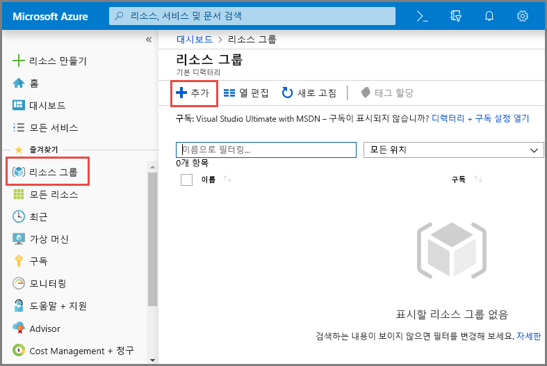
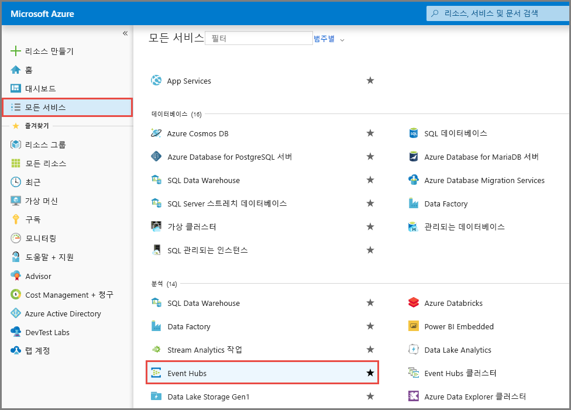
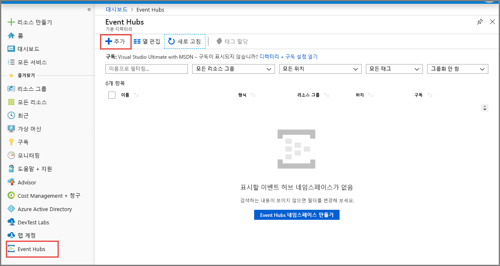
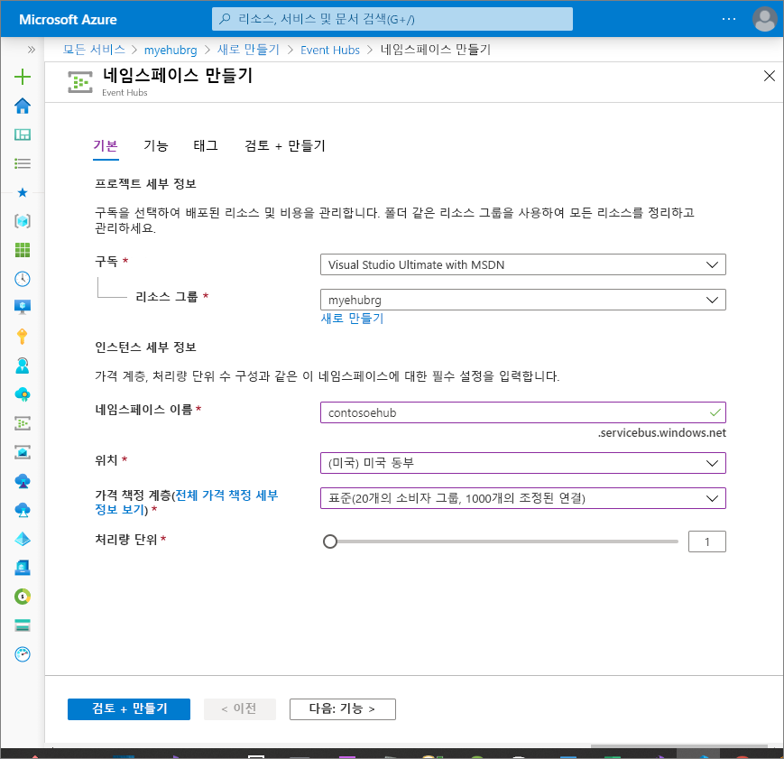
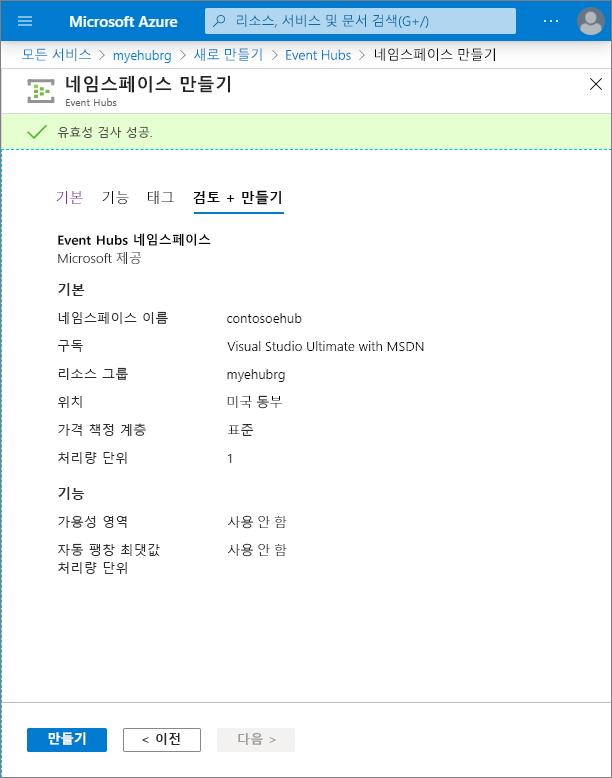
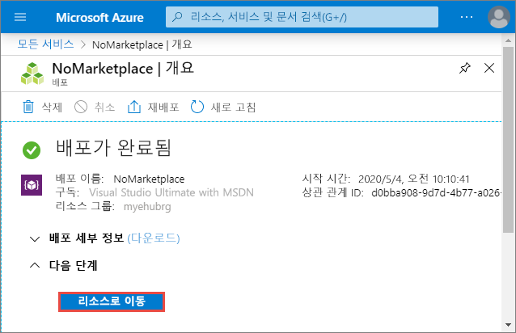
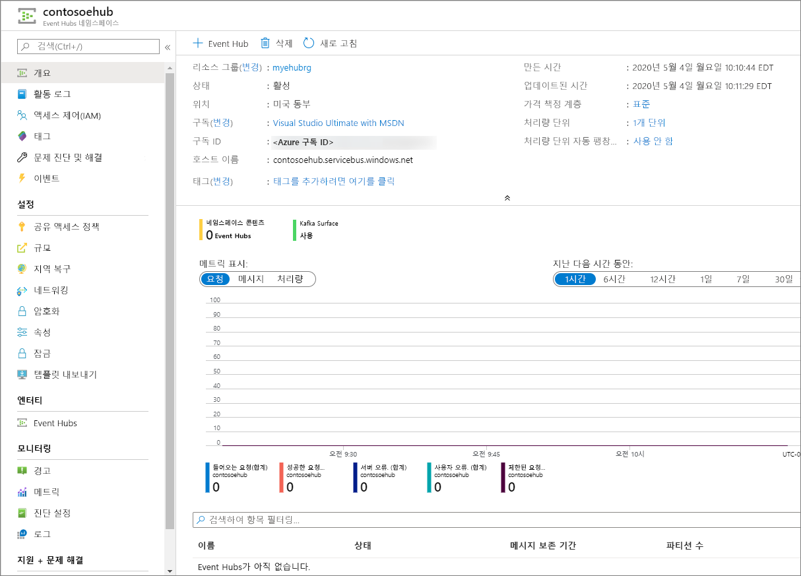
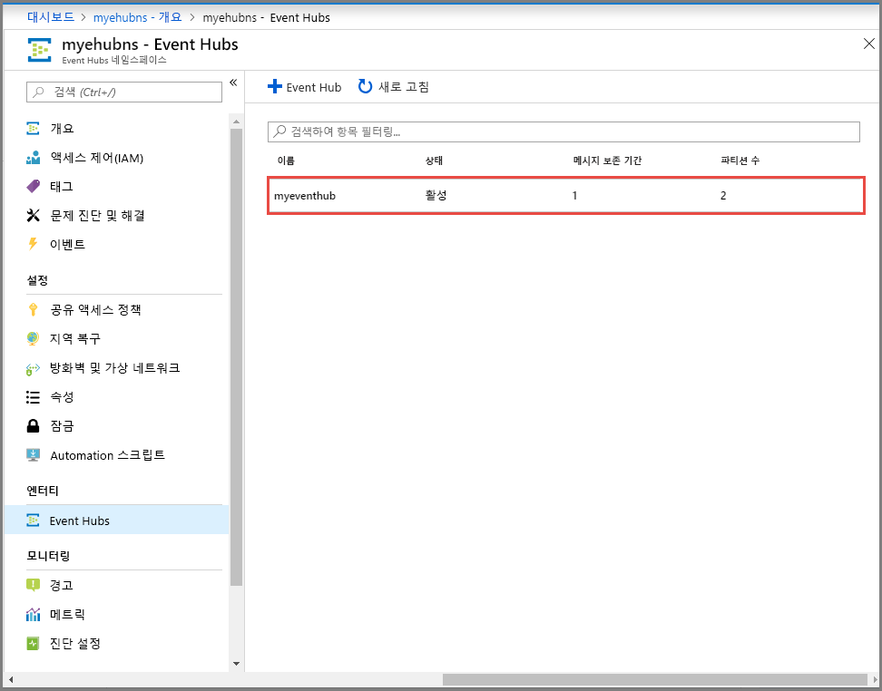

# 빠른 시작: Azure Portal을 사용하여 이벤트 허브 만들기
Azure Event Hubs는 초당 수백만 개의 이벤트를 수신하여 처리할 수 있는 빅 데이터 스트리밍 플랫폼이자 이벤트 수집 서비스입니다. Event Hubs는 분산된 소프트웨어와 디바이스에서 생성된 이벤트, 데이터 또는 원격 분석을 처리하고 저장할 수 있습니다. Event Hub로 전송된 데이터는 실시간 분석 공급자 또는 일괄 처리/스토리지 어댑터를 사용하여 변환하고 저장할 수 있습니다. Event Hubs에 대한 자세한 개요는 [Event Hubs 개요](event-hubs-about.md) 및 [Event Hubs 기능](event-hubs-features.md)을 참조하세요.

Azure 빠른 시작에서 [Azure Portal](https://portal.azure.com)을 사용하여 이벤트 허브를 만듭니다.

## 사전 요구 사항

이 빠른 시작을 완료하려면 다음 항목이 있어야 합니다.

- 동작합니다. 구독이 없으면 시작하기 전에 [계정을 만드세요](https://azure.microsoft.com/free/).

## 리소스 그룹 만들기

리소스 그룹은 Azure 리소스에 대한 논리적 컬렉션입니다. 모든 리소스는 리소스 그룹에서 배포 및 관리됩니다. 리소스 그룹을 만들려면

1. [Azure Portal](https://portal.azure.com)에 로그인합니다.
1. 왼쪽 탐색에서 **리소스 그룹**을 클릭합니다. 그런 다음, **추가**를 클릭합니다.

   

1. **구독**에서 리소스 그룹을 만들려는 Azure 구독의 이름을 선택합니다.
1. 고유한 **리소스 그룹 이름**을 입력합니다. 시스템에서 즉시 이 이름이 현재 선택한 Azure 구독에서 사용 가능한지 확인합니다.
1. 리소스 그룹의 **Azure 지역**을 선택합니다.
1. **검토 + 만들기**를 선택합니다.

   
1. **검토 + 만들기** 창에서 **만들기**를 선택합니다. 

## Event Hubs 네임스페이스 만들기

Event Hubs 네임스페이스는 정규화된 도메인 이름으로 참조되는 고유한 범위 지정 컨테이너를 제공하며, 하나 이상의 이벤트 허브를 만듭니다. 포털을 사용하여 리소스 그룹에 네임스페이스를 만들려면 다음 작업을 수행합니다.

1. Azure Portal 화면의 왼쪽 위에서 **리소스 만들기**를 클릭합니다.
1. 왼쪽 메뉴에서 **모든 서비스**를 선택하고, **분석** 범주의 **Event Hubs** 옆에서 **별표(`*`)** 를 선택합니다. 왼쪽 탐색 메뉴에서 **Event Hubs**가 **즐겨찾기**에 추가되었는지 확인합니다. 
    
   
1. 왼쪽 탐색 메뉴의 **즐겨찾기** 아래에서 **Event Hubs**를 선택하고, 도구 모음에서 **추가**를 선택합니다.

   
1. **네임스페이스 만들기** 페이지에서 다음 단계를 수행합니다.  
   1. 네임스페이스를 만들려는 **구독**을 선택합니다.  
   1. 이전 단계에서 만든 **리소스 그룹**을 선택합니다.   
   1. 네임스페이스의 **이름**을 입력합니다. 시스템에서 사용 가능한 이름인지 즉시 확인합니다.  
   1. 네임스페이스의 **위치**를 선택합니다.      
   1. **가격 책정 계층**(기본 또는 표준)을 선택합니다.    
   1. **처리량 단위** 설정을 그대로 둡니다. 처리량 단위에 대한 자세한 내용은 [Event Hubs 확장성](event-hubs-scalability.md#throughput-units)을 참조하세요.  
   1. 페이지 아래쪽에서 **검토 + 만들기**를 선택합니다.
      
      
   1. **검토 + 만들기** 페이지에서 설정을 검토하고 **만들기**를 선택합니다. 배포가 완료될 때가지 기다립니다. 
      
      
      
   1. **배포** 페이지에서 **리소스로 이동**을 선택하여 네임스페이스에 대한 페이지로 이동합니다. 
      
        
   1. 다음 예제와 유사한 **Event Hubs 네임스페이스** 페이지가 표시되는지 확인합니다.   
      
             

      > [!NOTE]
      > Azure Event Hubs는 Kafka 엔드포인트를 제공합니다. 이 엔드포인트를 통해 Event Hubs 네임스페이스가 [Apache Kafka](https://kafka.apache.org/intro) 메시지 프로토콜 및 API를 고유하게 해석할 수 있습니다. 이 기능을 사용하면 프로토콜 클라이언트를 변경하거나 자체 클러스터를 실행하지 않고도 Kafka 항목과 마찬가지로 이벤트 허브와 통신할 수 있습니다. Event Hubs는 [Apache Kafka 버전 1.0](https://kafka.apache.org/10/documentation.html) 이상을 지원합니다. 자세한 내용은 [Apache Kafka 애플리케이션에서 Event Hubs 사용](event-hubs-for-kafka-ecosystem-overview.md)을 참조하세요.
    
## 이벤트 허브 만들기

네임스페이스에 이벤트 허브를 만들려면 다음 작업을 수행합니다.

1. Event Hubs 네임스페이스 페이지의 왼쪽 메뉴에서 **Event Hubs**를 선택합니다.
1. 창의 위쪽에서 **+ 이벤트 허브**를 클릭합니다.
   
    
1. 이벤트 허브의 이름을 입력한 다음, **만들기**를 클릭합니다.
   
    
1. 경고에서 이벤트 허브 만들기의 상태를 확인할 수 있습니다. 이벤트 허브가 만들어지면 다음 이미지처럼 이벤트 허브 목록에 표시됩니다.

    

## 다음 단계

이 문서에서는 리소스 그룹, Event Hubs 네임스페이스 및 이벤트 허브를 만들었습니다. 이벤트 허브에서 이벤트를 보내거나 받기 위한 단계별 지침은 **이벤트 보내기 및 받기** 자습서를 참조하세요. 

- [.NET Core](get-started-dotnet-standard-send-v2.md)
- [Java](get-started-java-send-v2.md)
- [Python](get-started-python-send-v2.md)
- [JavaScript](get-started-node-send-v2.md)
- [Go](event-hubs-go-get-started-send.md)
- [C(보내기 전용)](event-hubs-c-getstarted-send.md)
- [Apache Storm(받기 전용)](event-hubs-storm-getstarted-receive.md)

[Azure portal]: https://portal.azure.com/
[3]: ./media/event-hubs-quickstart-portal/sender1.png
[4]: ./media/event-hubs-quickstart-portal/receiver1.png
