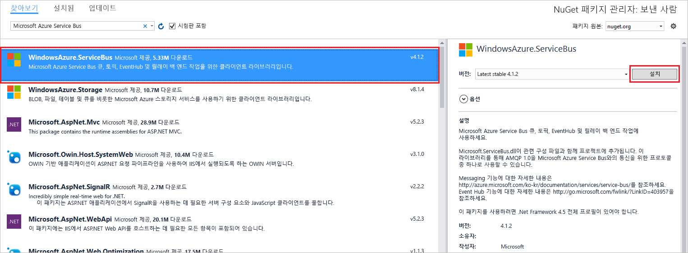

# <a name="send-events-to-azure-event-hubs-using-the-net-framework"></a>.NET Framework를 사용하여 Azure Event Hubs로 이벤트 전송
Azure Event Hubs는 초당 수백만 개의 이벤트를 수신하여 처리할 수 있는 빅 데이터 스트리밍 플랫폼이자 이벤트 수집 서비스입니다. Event Hubs는 분산된 소프트웨어와 장치에서 생성된 이벤트, 데이터 또는 원격 분석을 처리하고 저장할 수 있습니다. Event Hub로 전송된 데이터는 실시간 분석 공급자 또는 일괄 처리/저장소 어댑터를 사용하여 변환하고 저장할 수 있습니다. Event Hubs에 대한 자세한 개요는 [Event Hubs 개요](event-hubs-about.md) 및 [Event Hubs 기능](event-hubs-features.md)을 참조하세요.

이 자습서는 .NET Framework를 사용하여 C#으로 작성된 콘솔 응용 프로그램을 사용하여 이벤트 허브로 이벤트를 전송하는 방법을 보여줍니다. 

## <a name="prerequisites"></a>필수 조건
이 자습서를 완료하려면 다음 필수 구성 요소가 필요합니다.

* [Microsoft Visual Studio 2017 이상](http://visualstudio.com).

## <a name="create-an-event-hubs-namespace-and-an-event-hub"></a>Event Hubs 네임스페이스 및 이벤트 허브 만들기
첫 번째 단계에서는 [Azure Portal](https://portal.azure.com)을 사용하여 Event Hubs 형식의 네임스페이스를 만들고 응용 프로그램에서 Event Hub와 통신하는 데 필요한 관리 자격 증명을 얻습니다. 네임스페이스와 이벤트 허브를 만들려면 [이 문서](event-hubs-create.md)의 절차를 수행한 다음, 이 자습서의 다음 단계를 진행하세요.

## <a name="create-a-console-application"></a>콘솔 응용 프로그램 만들기

Visual Studio에서 **콘솔 응용 프로그램** 프로젝트 템플릿을 사용하여 Visual C# 데스크톱 응용 프로그램 프로젝트를 새로 만듭니다. 프로젝트의 이름을 **Sender**로 지정합니다.
   


## <a name="add-the-event-hubs-nuget-package"></a>Event Hubs NuGet 패키지 추가

1. 솔루션 탐색기에서 **Sender** 프로젝트를 마우스 오른쪽 단추로 클릭한 다음 **솔루션에 대한 NuGet 패키지 관리**를 클릭합니다. 
2. **찾아보기** 탭을 클릭한 다음 `WindowsAzure.ServiceBus`를 검색합니다. **설치**를 클릭하고 사용 약관에 동의합니다. 
   
    
   
    Visual Studio는 [Azure Service Bus 라이브러리 NuGet 패키지](https://www.nuget.org/packages/WindowsAzure.ServiceBus)에 대한 참조를 다운로드, 설치 및 추가합니다.

## <a name="write-code-to-send-messages-to-the-event-hub"></a>이벤트 허브에 메시지를 전송하는 코드 작성

1. **Program.cs** 파일 위에 다음 `using` 문을 추가합니다.
   
      ```csharp
      using System.Threading;
      using Microsoft.ServiceBus.Messaging;
      ```
2. **Program** 클래스에 다음 필드를 추가하고, 이전 섹션에서 만든 Event Hub 이름과 이전에 저장한 네임스페이스 수준 연결 문자열로 위치 지정자 값을 대체합니다.
   
        ```csharp
        static string eventHubName = "Your Event Hub name";
        static string connectionString = "namespace connection string";
        ```
3. **Program** 클래스에 다음 메서드를 추가합니다.
   
      ```csharp
      static void SendingRandomMessages()
      {
          var eventHubClient = EventHubClient.CreateFromConnectionString(connectionString, eventHubName);
          while (true)
          {
              try
              {
                  var message = Guid.NewGuid().ToString();
                  Console.WriteLine("{0} > Sending message: {1}", DateTime.Now, message);
                  eventHubClient.Send(new EventData(Encoding.UTF8.GetBytes(message)));
              }
              catch (Exception exception)
              {
                  Console.ForegroundColor = ConsoleColor.Red;
                  Console.WriteLine("{0} > Exception: {1}", DateTime.Now, exception.Message);
                  Console.ResetColor();
              }
       
              Thread.Sleep(200);
          }
      }
      ```
   
      이 메서드는 200ms 지연과 함께 Event Hub에 이벤트를 지속적으로 보냅니다.
4. 마지막으로 **Main** 메서드에 다음 줄을 추가합니다.
   
      ```csharp
      Console.WriteLine("Press Ctrl-C to stop the sender process");
      Console.WriteLine("Press Enter to start now");
      Console.ReadLine();
      SendingRandomMessages();
      ```
5. 프로그램을 실행하고 오류가 없는지 확인합니다.
  
축하합니다! 이제 Event Hub에 메시지를 보냈습니다.

## <a name="next-steps"></a>다음 단계
이 빠른 시작에서는 .NET Framework를 사용하여 이벤트 허브로 메시지를 전송했습니다. .NET Framework를 사용하여 이벤트 허브에서 이벤트를 수신하는 방법을 알아보려면 [이벤트 허브에서 이벤트 수신 - .NET Framework](event-hubs-dotnet-framework-getstarted-receive-eph.md)를 참조하세요.

<!-- Images. -->
[19]: ./media/event-hubs-csharp-ephcs-getstarted/create-eh-proj1.png
[20]: ./media/event-hubs-csharp-ephcs-getstarted/create-eh-proj2.png
[21]: ./media/event-hubs-csharp-ephcs-getstarted/run-csharp-ephcs1.png
[22]: ./media/event-hubs-csharp-ephcs-getstarted/run-csharp-ephcs2.png

