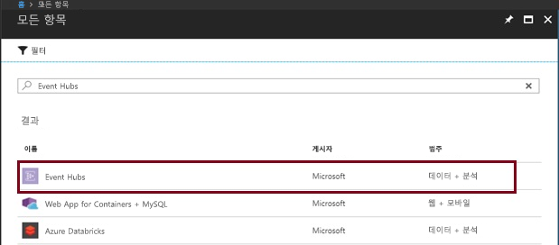

# <a name="data-streaming-with-event-hubs-using-the-kafka-protocol"></a>Kafka 프로토콜을 사용하여 Event Hubs로 데이터 스트리밍
이 빠른 시작에서는 프로토콜 클라이언트를 변경하거나 사용자 고유의 클러스터를 실행하지 않고 Kafka 지원 Event Hubs로 스트리밍하는 방법을 보여줍니다. 생산자와 소비자가 애플리케이션 구성을 간단하게 변경하여 Kafka 지원 Event Hubs로 대화하는 방법을 알아봅니다. Azure Event Hubs는 [Apache Kafka 버전 1.0](https://kafka.apache.org/10/documentation.html)을 지원합니다.

> [!NOTE]
> 이 샘플은 [GitHub](https://github.com/Azure/azure-event-hubs-for-kafka/tree/master/quickstart/java)에서 사용할 수 있습니다.

## <a name="prerequisites"></a>필수 조건

이 빠른 시작을 완료하려면 다음 필수 구성 요소가 있어야 합니다.

* [Apache Kafka용 Event Hubs](event-hubs-for-kafka-ecosystem-overview.md) 문서를 참조하세요.
* Azure 구독. 구독이 없으면 시작하기 전에 [체험 계정](https://azure.microsoft.com/free/?ref=microsoft.com&utm_source=microsoft.com&utm_medium=docs&utm_campaign=visualstudio)을 만듭니다.
* [Java Development Kit(JDK) 1.7+](https://aka.ms/azure-jdks).
* Maven 이진 아카이브를 [다운로드](https://maven.apache.org/download.cgi)하여 [설치](https://maven.apache.org/install.html)합니다.
* [Git](https://www.git-scm.com/)
* [Kafka 지원 Event Hubs 네임스페이스](event-hubs-create.md)

## <a name="create-a-kafka-enabled-event-hubs-namespace"></a>Kafka 지원 Event Hubs 네임스페이스 만들기

1. [Azure Portal](https://portal.azure.com)에 로그인하고, 화면 왼쪽 위에서 **리소스 만들기**를 클릭합니다.

2. Event Hubs를 검색하고 아래 표시된 옵션을 선택합니다.
    
    
 
3. 고유 이름을 제공하고 네임스페이스에서 Kafka를 사용하도록 설정합니다. **만들기**를 클릭합니다. 참고: Kafka용 Event Hubs는 표준 및 전용 계층 Event Hubs에서만 지원됩니다. 기본 계층 Event Hubs는 Kafka 작업에 대한 응답으로 토픽 권한 부여 오류를 반환합니다.
    
    
 
4. 네임스페이스가 만들어지면 **설정** 탭에서 **공유 액세스 정책**을 클릭하여 연결 문자열을 가져옵니다.

    

5. 기본 **RootManageSharedAccessKey**를 선택하거나 새 정책을 추가할 수 있습니다. 정책 이름을 클릭하고 연결 문자열을 복사합니다. 
    
    
 
6. 이 연결 문자열을 Kafka 애플리케이션 구성에 추가합니다.

이제 Kafka 프로토콜을 사용하는 애플리케이션에서 Event Hubs로 이벤트를 스트리밍할 수 있습니다.

## <a name="send-and-receive-messages-with-kafka-in-event-hubs"></a>Event Hubs에서 Kafka로 메시지 보내고 받기

1. [Kafka용 Azure Event Hubs 리포지토리](https://github.com/Azure/azure-event-hubs-for-kafka)를 복제합니다.

2. `azure-event-hubs-for-kafka/quickstart/java/producer`로 이동합니다.

3. 다음과 같이 `src/main/resources/producer.config`에서 생산자에 대한 구성 세부 정보를 업데이트합니다.

    ```xml
    bootstrap.servers={YOUR.EVENTHUBS.FQDN}:9093
    security.protocol=SASL_SSL
    sasl.mechanism=PLAIN
    sasl.jaas.config=org.apache.kafka.common.security.plain.PlainLoginModule required username="$ConnectionString" password="{YOUR.EVENTHUBS.CONNECTION.STRING}";
    ```
    
4. 생산자 코드를 실행하고 Kafka 지원 Event Hubs로 스트리밍합니다.
   
    ```shell
    mvn clean package
    mvn exec:java -Dexec.mainClass="TestProducer"                                    
    ```
    
5. `azure-event-hubs-for-kafka/quickstart/java/consumer`로 이동합니다.

6. 다음과 같이 `src/main/resources/consumer.config`에서 소비자에 대한 구성 세부 정보를 업데이트합니다.
   
    ```xml
    bootstrap.servers={YOUR.EVENTHUBS.FQDN}:9093
    security.protocol=SASL_SSL
    sasl.mechanism=PLAIN
    sasl.jaas.config=org.apache.kafka.common.security.plain.PlainLoginModule required username="$ConnectionString" password="{YOUR.EVENTHUBS.CONNECTION.STRING}";
    ```

7. Kafka 지원 Event Hubs에서 Kafka 클라이언트를 사용하여 소비자 코드 및 프로세스를 실행합니다.

    ```java
    mvn clean package
    mvn exec:java -Dexec.mainClass="TestConsumer"                                    
    ```

Event Hubs Kafka 클러스터에 이벤트가 있는 경우 이제 소비자로부터 해당 이벤트를 수신하기 시작합니다.

## <a name="next-steps"></a>다음 단계
이 문서에서는 프로토콜 클라이언트를 변경하거나 사용자 고유의 클러스터를 실행하지 않고 Kafka 지원 Event Hubs로 스트리밍하는 방법을 배웠습니다. 자세히 알아보려면 다음 자습서를 계속합니다.

* [Event Hubs에 대해 알아봅니다](event-hubs-what-is-event-hubs.md).
* [Kafka용 Event Hubs에 대해 알아보기](event-hubs-for-kafka-ecosystem-overview.md)
* [Kafka GitHub용 Event Hubs에서 더 많은 샘플 탐색](https://github.com/Azure/azure-event-hubs-for-kafka)
* [MirrorMaker](https://cwiki.apache.org/confluence/pages/viewpage.action?pageId=27846330)를 사용하여 [온-프레미스 Kafka에서 클라우드의 Kafka 지원 Event Hubs로 이벤트를 스트림합니다.](event-hubs-kafka-mirror-maker-tutorial.md)
* [Apache Flink](event-hubs-kafka-flink-tutorial.md) 또는 [Akka 스트림](event-hubs-kafka-akka-streams-tutorial.md)을 사용하여 Kafka 지원 Event Hubs에 스트리밍하는 방법을 알아봅니다.
