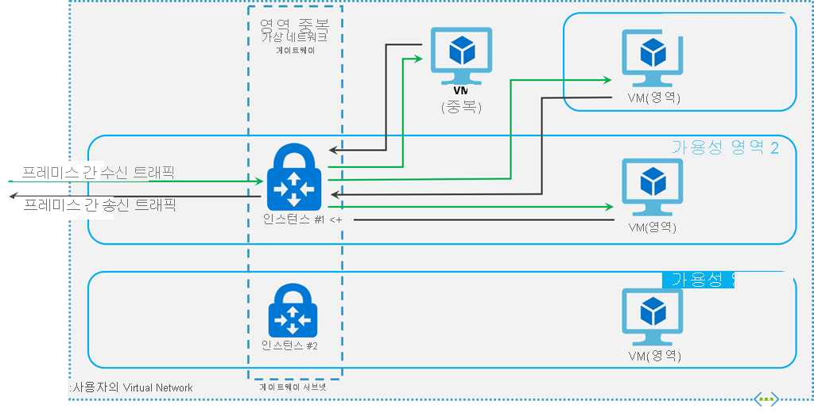

# <a name="about-expressroute-virtual-network-gateways"></a>Express 경로 가상 네트워크 게이트웨이 정보

Express 경로를 통해 Azure 가상 네트워크와 온-프레미스 네트워크를 연결 하려면 먼저 가상 네트워크 게이트웨이를 만들어야 합니다. 가상 네트워크 게이트웨이는 네트워크 간 exchange IP 경로와 네트워크 트래픽 라우팅의 두 가지 용도로 사용 됩니다. 이 문서에서는 SKU의 게이트웨이 유형, 게이트웨이 Sku 및 예상 성능에 대해 설명 합니다. 또한이 문서에서는 온-프레미스 네트워크의 네트워크 트래픽이 가상 네트워크 게이트웨이를 우회 하 여 성능을 향상 시킬 수 있도록 해 주는 기능인 Express [경로 fastpath](#fastpath)에 대해 설명 합니다.

## <a name="gateway-types"></a>게이트웨이 유형

가상 네트워크 게이트웨이를 만들 때 몇 가지 설정을 지정해야 합니다. 필수 설정 중 하나인 '-GatewayType'은 게이트웨이를 ExpressRoute에 사용할 것인지 아니면 VPN 트래픽에 사용할 것인지 지정합니다. 두 가지 게이트웨이 유형은 다음과 같습니다.

* **Vpn** - 공용 인터넷을 통해 암호화된 트래픽을 전송하려면 'Vpn' 유형의 게이트웨이를 사용합니다. 이를 VPN 게이트웨이라고도 합니다. 사이트 간, 지점 및 사이트 간, VNet 간 연결은 모두 VPN Gateway를 사용합니다.

* **ExpressRoute** - 프라이빗 연결을 통해 네트워크 트래픽을 전송하려면 'ExpressRoute' 유형의 게이트웨이를 사용합니다. 이를 ExpressRoute 게이트웨이라고도 하며 ExpressRoute를 구성할 때 사용되는 게이트웨이 유형입니다.

각각의 가상 네트워크에는 게이트웨이 유형당 하나의 가상 네트워크 게이트웨이가 있을 수 있습니다. 예를 들어 -GatewayType Vpn을 사용하는 하나의 가상 네트워크 게이트웨이와 -GatewayType ExpressRoute를 사용하는 하나의 가상 네트워크 게이트웨이가 있을 수 있습니다.

## <a name="gateway-skus"></a><a name="gwsku"></a>게이트웨이 SKU
[!INCLUDE [expressroute-gwsku-include](../../includes/expressroute-gwsku-include.md)]

게이트웨이를 보다 강력한 게이트웨이 SKU로 업그레이드 하려는 경우 대부분의 경우 ' AzVirtualNetworkGateway ' PowerShell cmdlet을 사용할 수 있습니다. 표준 및 고성능 SKU로 업그레이드하는 경우에 가능합니다. 하지만 초고성능 SKU로 업그레이드하려면 게이트웨이를 다시 만들어야 합니다. 게이트웨이를 다시 만들면 가동 중지 시간이 발생합니다.

### <a name="estimated-performances-by-gateway-sku"></a><a name="aggthroughput"></a>게이트웨이 SKU에서 예상된 성능
다음 표에서는 게이트웨이 형식과 예상된 성능을 보여줍니다. 이 표는 리소스 관리자 배포 모델과 클래식 배포 모델 모두에 적용됩니다.

[!INCLUDE [expressroute-table-aggthroughput](../../includes/expressroute-table-aggtput-include.md)]

> [!IMPORTANT]
> 애플리케이션 성능은 엔드투엔드 대기 시간 및 애플리케이션을 여는 트래픽 흐름 수와 같은 여러 요인에 따라 달라집니다. 테이블의 숫자는 이상적인 환경에서 애플리케이션이 이론상 수행할 수 있는 상한값을 나타냅니다.
>
>

## <a name="gateway-subnet"></a><a name="gwsub"></a>게이트웨이 서브넷

Express 경로 게이트웨이를 만들려면 먼저 게이트웨이 서브넷을 만들어야 합니다. 게이트웨이 서브넷은 가상 네트워크 게이트웨이 VM 및 서비스에서 사용하는 IP 주소를 포함합니다. 가상 네트워크 게이트웨이를 만들 때 게이트웨이 Vm은 게이트웨이 서브넷에 배포 되 고 필요한 Express 경로 게이트웨이 설정으로 구성 됩니다. 다른 Vm (예: 추가 Vm)을 게이트웨이 서브넷에 배포 하지 마십시오. 게이트웨이 서브넷이 제대로 작동하려면 이름을 'GatewaySubnet'으로 지정해야 합니다. 게이트웨이 서브넷 이름을 'GatewaySubnet'으로 지정하면 Azure에서 해당 서브넷이 가상 네트워크 게이트웨이 VM 및 서비스를 배포할 서브넷임을 알 수 있습니다.

>[!NOTE]
>[!INCLUDE [vpn-gateway-gwudr-warning.md](../../includes/vpn-gateway-gwudr-warning.md)]
>

게이트웨이 서브넷을 만드는 경우 서브넷이 포함하는 IP 주소의 수를 지정합니다. 게이트웨이 서브넷의 IP 주소는 게이트웨이 VM 및 게이트웨이 서비스에 할당됩니다. 일부 구성에는 다른 구성보다 더 많은 IP 주소가 필요합니다. 

게이트웨이 서브넷 크기를 계획할 때 만들려는 구성에 대 한 설명서를 참조 하세요. 예를 들어 Express 경로/VPN Gateway 공존 구성에는 대부분의 다른 구성 보다 더 큰 게이트웨이 서브넷이 필요 합니다. 또한 이후 추가 구성이 추가될 가능성에 대비하여 게이트웨이 서브넷에 IP 주소가 충분히 포함되어 있는지 확인하려고 할 수 있습니다. 게이트웨이 서브넷을/29만 큼 작게 만들 수 있지만, 사용 가능한 주소 공간이 있는 경우/27 이상의 게이트웨이 서브넷을 만드는 것이 좋습니다 (/27,/26 등). 이렇게 하면 대부분의 구성이 적용 됩니다.

다음 Resource Manager PowerShell 예제에서는 이름이 GatewaySubnet인 게이트웨이 서브넷을 보여 줍니다. CIDR 표기법이 /27을 지정하는 것을 확인할 수 있으며 이는 이번에 존재하는 대부분의 구성에 대한 충분한 IP 주소를 허용합니다.

```azurepowershell-interactive
Add-AzVirtualNetworkSubnetConfig -Name 'GatewaySubnet' -AddressPrefix 10.0.3.0/27
```

[!INCLUDE [vpn-gateway-no-nsg](../../includes/vpn-gateway-no-nsg-include.md)]

### <a name="zone-redundant-gateway-skus"></a><a name="zrgw"></a>영역 중복 게이트웨이 SKU

Azure Availability Zones에 ExpressRoute 게이트웨이를 배포할 수도 있습니다. 이렇게 하면 게이트웨이가 여러 가용성 영역에 물리적으로 그리고 논리적으로 분리되므로 Azure로의 온-프레미스 네트워크 연결을 영역 수준 장애로부터 보호할 수 있습니다.



영역 중복 게이트웨이는 ExpressRoute 게이트웨이에 특정 새 게이트웨이 SKU를 사용합니다.

* ErGw1AZ
* ErGw2AZ
* ErGw3AZ

새 게이트웨이 SKU는 사용자의 요구 사항에 가장 적합한 다른 배포 옵션도 지원합니다. 새 게이트웨이 SKU를 사용하여 가상 네트워크 게이트웨이를 만들 때 특정 영역에 게이트웨이를 배포하는 옵션도 제공됩니다. 이를 영역 게이트웨이라고 합니다. 영역 게이트웨이를 배포하면 게이트웨이의 모든 인스턴스가 동일한 가용성 영역에 배포됩니다.

## <a name="fastpath"></a><a name="fastpath"></a>FastPath

Express 경로 가상 네트워크 게이트웨이는 네트워크 경로를 교환 하 고 네트워크 트래픽을 라우팅하는 데 적합 합니다. FastPath는 온-프레미스 네트워크와 가상 네트워크 간의 데이터 경로 성능을 향상 시 키도 록 설계 되었습니다. 사용 하도록 설정 하면 FastPath는 게이트웨이를 우회 하 여 가상 네트워크의 가상 머신으로 네트워크 트래픽을 직접 보냅니다.

제한 사항 및 요구 사항을 포함 하 여 FastPath에 대 한 자세한 내용은 [Fastpath 정보](about-fastpath.md)를 참조 하세요.

## <a name="rest-apis-and-powershell-cmdlets"></a><a name="resources"></a>REST API 및 PowerShell cmdlet
가상 네트워크 게이트웨이 구성을 위해 REST API와 PowerShell cmdlet을 사용할 경우 추가 기술 리소스 및 특정 구문 요구 사항에 대해서는 다음 페이지를 참조하세요.

| **기존** | **리소스 관리자** |
| --- | --- |
| [PowerShell](https://docs.microsoft.com/powershell/module/servicemanagement/azure/?view=azuresmps-4.0.0#azure) |[PowerShell](https://docs.microsoft.com/powershell/module/az.network#networking) |
| [REST API](https://msdn.microsoft.com/library/jj154113.aspx) |[REST API](https://msdn.microsoft.com/library/mt163859.aspx) |

## <a name="next-steps"></a>다음 단계

사용 가능한 연결 구성에 대 한 자세한 내용은 [express 경로 개요](expressroute-introduction.md)를 참조 하세요.

Express 경로 게이트웨이를 만드는 방법에 대 한 자세한 내용은 [express 경로에 대 한 가상 네트워크 게이트웨이 만들기](expressroute-howto-add-gateway-resource-manager.md)를 참조 하세요.

영역 중복 게이트웨이를 구성 하는 방법에 대 한 자세한 내용은 [영역 중복 가상 네트워크 게이트웨이 만들기](../../articles/vpn-gateway/create-zone-redundant-vnet-gateway.md)를 참조 하세요.

FastPath에 대 한 자세한 내용은 [FastPath 정보](about-fastpath.md)를 참조 하세요.