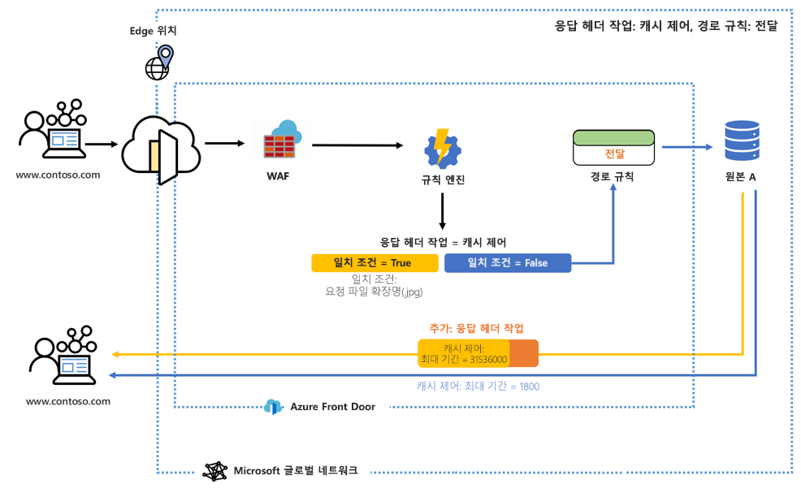
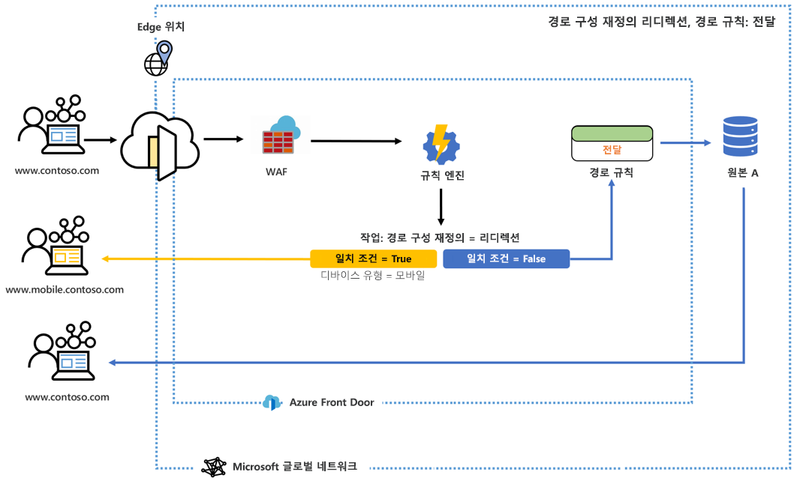

# Azure Front Door의 규칙 엔진은 무엇인가요? 

규칙 엔진을 사용하면 에지에서 HTTP 요청을 처리하는 방법을 사용자 지정하고, 더 자세히 제어된 동작을 웹 애플리케이션에 제공할 수 있습니다. Azure Front Door 규칙 엔진에는 다음과 같은 몇 가지 주요 기능이 있습니다.

* 모든 최종 사용자가 보안 연결을 통해 콘텐츠와 상호 작용할 수 있도록 HTTPS를 적용합니다.
* CORS(원본 간 리소스 공유) 시나리오에 대한 브라우저 기반 취약성(예: HSTS(HTTP Strict-Transport-Security), X-XSS-Protection, Content-Security-Policy, X-Frame-Options 및 Access-Control-Allow-Origin 헤더)을 방지하기 위해 보안 헤더를 구현합니다. 쿠키를 사용하여 보안 기반 특성을 정의할 수도 있습니다.
* 요청 헤더 콘텐츠, 쿠키 또는 쿼리 문자열의 패턴을 기반으로 하여 요청을 애플리케이션의 모바일 또는 데스크톱 버전으로 라우팅합니다.
* 새 호스트 이름, 경로 또는 프로토콜로 보내기 위해 리디렉션 기능을 사용하여 301, 302, 307 및 308 리디렉션을 클라이언트에 반환합니다.
- 들어오는 요청에 따라 경로의 캐싱 구성을 동적으로 수정합니다.
- 요청 URL 경로를 다시 작성하고 구성된 백 엔드 풀의 적절한 백 엔드에 요청을 전달합니다.

## Architecture 

규칙 엔진은 에지에서 요청을 처리합니다. 요청이 Front Door 엔드포인트에 도달하면 먼저 WAF가 실행된 다음, 프런트 엔드/도메인에 연결된 규칙 엔진 구성이 실행됩니다. 규칙 엔진 구성이 실행되면 부모 회람 규칙이 이미 일치한다는 것을 의미합니다. 각 규칙의 모든 작업이 실행되도록 하려면 규칙 내의 모든 일치 조건이 충족되어야 합니다. 요청이 규칙 엔진 구성의 조건과 일치하지 않으면 기본 회람 규칙이 실행됩니다. 

예를 들어 다음 다이어그램에서 규칙 엔진은 응답 헤더를 추가하도록 구성됩니다. 일치 조건이 충족되면 헤더에서 캐시 제어의 최대 기간을 변경합니다. 

또 다른 예로 일치 조건인 디바이스 유형이 true이면 사용자를 사이트의 모바일 버전으로 보내도록 규칙 엔진이 구성되었습니다. 

두 예제에서 일치 조건이 하나도 충족되지 않으면 지정된 경로 규칙이 실행됩니다. 

## 용어 

AFD 규칙 엔진을 사용하면 각각 규칙 세트로 구성된 규칙 엔진 구성 조합을 만들 수 있습니다. 다음은 규칙 엔진을 구성할 때 접하게 될 몇 가지 유용한 용어에 대한 설명입니다. 

- *규칙 엔진 구성*: 단일 경로 규칙에 적용되는 규칙 세트입니다. 각 구성은 25개의 규칙으로 제한됩니다. 10개까지 구성을 만들 수 있습니다. 
- *규칙 엔진 규칙*: 최대 10개의 일치 조건과 5개의 작업으로 구성된 규칙입니다.
- *일치 조건*: 들어오는 요청을 구문 분석하는 데 활용할 수 있는 많은 일치 조건이 있습니다. 규칙 하나에 최대 10개의 일치 조건을 포함할 수 있습니다. 일치 조건은 **AND** 연산자를 사용하여 평가됩니다. 일치 조건의 전체 목록은 [여기](front-door-rules-engine-match-conditions.md)서 찾을 수 있습니다. 
- *작업*: 작업은 들어오는 요청에 대해 수행되는 작업을 지시합니다. 현재 요청/응답 헤더 작업, 전달, 리디렉션 및 재작성을 모두 사용할 수 있습니다. 하나의 규칙에는 최대 5개의 작업이 포함되지만, 경로 구성 재정의는 하나만 포함될 수 있습니다.  작업 전체 목록은 [여기](front-door-rules-engine-actions.md)서 찾을 수 있습니다.

## 다음 단계

- 첫 번째 [규칙 엔진 구성](front-door-tutorial-rules-engine.md)을 구성하는 방법을 알아봅니다. 
- [Front Door를 만드는](quickstart-create-front-door.md) 방법을 알아봅니다.
- [Front Door의 작동 원리](front-door-routing-architecture.md)를 알아봅니다.
