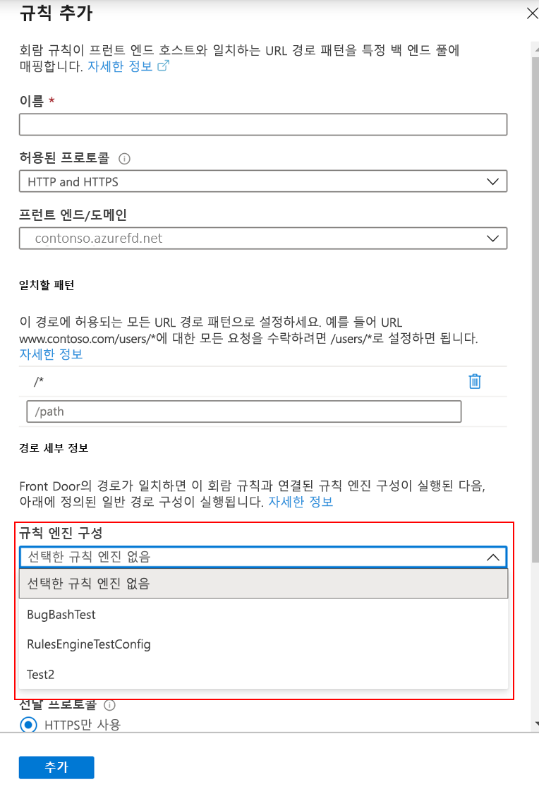

# <a name="tutorial-configure-your-rules-engine"></a>자습서: 규칙 엔진 구성

이 자습서에서는 Azure Portal 및 CLI에서 규칙 엔진 구성과 첫 번째 규칙을 만드는 방법을 보여줍니다. 

이 자습서에서는 다음 작업 방법을 알아봅니다.
> [!div class="checklist"]
> - 포털을 사용하여 규칙 엔진을 구성합니다.
> - Azure CLI를 사용하여 규칙 엔진 구성

## <a name="prerequisites"></a>사전 요구 사항

* 이 자습서의 단계를 완료하려면 먼저 Front Door를 만들어야 합니다. 자세한 내용은 [빠른 시작: Front Door 만들기](quickstart-create-front-door.md)를 참조하세요.

## <a name="configure-rules-engine-in-azure-portal"></a>Azure Portal에서 규칙 엔진 구성
1. Front Door 리소스 내에서 **설정**로 이동하여 **규칙 엔진 구성**을 선택합니다. **추가**를 클릭하고, 구성 이름을 지정하고, 첫 번째 규칙 엔진 구성 만들기를 시작합니다.

    

1. **규칙 추가**를 클릭하여 첫 번째 규칙을 만듭니다. 그런 다음, **조건 추가** 또는 **작업 추가**를 클릭하여 규칙을 정의할 수 있습니다.
    
    > [!NOTE]
    >- 규칙에서 조건 또는 작업을 삭제하려면 특정 조건 또는 작업의 오른쪽에 있는 휴지통을 사용합니다.
    > - 들어오는 모든 트래픽에 적용되는 규칙을 만들려면 조건을 지정하지 마세요.
    > - 첫 번째 일치 조건이 충족될 때 규칙 평가를 중지하려면 **남은 규칙 평가 중지**를 선택합니다. 이 확인란을 선택하고 특정 규칙의 일치 조건을 모두 충족하는 경우 구성의 나머지 규칙은 실행되지 않습니다.  

     

1. [위로 이동], [아래로 이동] 및 [맨 위로 이동] 단추를 사용하여 구성 내 규칙의 우선 순위를 결정합니다. 우선 순위는 오름차순, 즉, 맨 처음에 표시되는 규칙이 가장 중요한 규칙입니다.

1. 규칙을 하나 이상 만들었으면 **저장**을 누릅니다. 그러면 규칙 엔진 구성이 만들어집니다.

1. 구성을 하나 이상 만들었으면 규칙 엔진 구성을 경로 규칙에 연결합니다. 단일 구성을 여러 경로 규칙에 적용할 수 있지만, 경로 규칙에는 규칙 엔진 구성을 하나만 포함할 수 있습니다. 연결하려면 **Front Door 디자이너** > **경로 규칙**으로 이동합니다. 규칙 엔진 구성을 추가할 경로 규칙을 선택하고, **경로 세부 정보** > **규칙 엔진 구성**으로 이동하고, 연결할 구성을 선택합니다.

    


## <a name="configure-rules-engine-in-azure-cli"></a>Azure CLI에서 규칙 엔진 구성

1. 아직 [Azure CLI](/cli/azure/install-azure-cli?preserve-view=true&view=azure-cli-latest)를 설치하지 않았다면 설치합니다. “front-door” 확장을 추가합니다(az extension add --name front-door). 그런 다음, 로그인하고 본인의 구독으로 전환합니다(az account set --subscription <name_or_Id>).

1. 먼저 규칙 엔진을 만듭니다. 이 예제에서는 헤더 기반 작업과 일치 조건이 각각 하나씩 있는 규칙 하나를 보여줍니다. 

    ```azurecli-interactive
    az network front-door rules-engine rule create -f {front_door} -g {resource_group} --rules-engine-name {rules_engine} --name {rule1} --priority 1 --action-type RequestHeader --header-action Overwrite --header-name Rewrite --header-value True --match-variable RequestFilenameExtension --operator Contains --match-values jpg png --transforms Lowercase
    ```

1. 모든 규칙을 나열합니다. 

    ```azurecli-interactive
    az network front-door rules-engine rule list -f {front_door} -g {rg} --name {rules_engine}
    ```

1. 전달 경로 재정의 작업을 추가합니다. 

    ```azurecli-interactive
    az network front-door rules-engine rule action add -f {front_door} -g {rg} --rules-engine-name {rules_engine} --name {rule1} --action-type ForwardRouteOverride --backend-pool {backend_pool_name} --caching Disabled
    ```

1. 규칙의 모든 작업을 나열합니다. 

    ```azurecli-interactive
    az network front-door rules-engine rule action list -f {front_door} -g {rg} -r {rules_engine} --name {rule1}
    ```

1. 회람 규칙에 규칙 엔진 구성을 연결합니다.  

    ```azurecli-interactive
    az network front-door routing-rule update -g {rg} -f {front_door} -n {routing_rule_name} --rules-engine {rules_engine}
    ```

1. 규칙 엔진의 연결을 해제합니다. 

    ```azurecli-interactive
    az network front-door routing-rule update -g {rg} -f {front_door} -n {routing_rule_name} --remove rulesEngine # case sensitive word ‘rulesEngine’
    ```

자세한 내용은 [여기](/cli/azure/ext/front-door/network/front-door/rules-engine?preserve-view=true&view=azure-cli-latest)서 AFD 규칙 엔진 명령 전체 목록을 참조하세요.   

## <a name="clean-up-resources"></a>리소스 정리

이전 단계에서 규칙 엔진 구성을 라우팅 규칙에 구성하고 연결했습니다. 더 이상 Front Door와 연결된 규칙 엔진 구성을 원하지 않는 경우 다음 단계를 수행하여 구성을 제거할 수 있습니다.

1. 규칙 엔진 이름 옆에 있는 세 개의 점을 클릭하여 규칙 엔진 구성에서 라우팅 규칙의 연결을 해제합니다.

    :::image type="content" source="./media/front-door-rules-engine/front-door-rule-engine-routing-association.png" alt-text="라우팅 규칙 연결":::

1. 이 규칙 엔진 구성이 연결된 모든 라우팅 규칙을 선택 취소하고 저장을 클릭합니다.

    :::image type="content" source="./media/front-door-rules-engine/front-door-routing-rule-association.png" alt-text="라우팅 규칙 연결":::

1. 이제 Front Door에서 규칙 엔진 구성을 삭제할 수 있습니다.

    :::image type="content" source="./media/front-door-rules-engine/front-door-delete-rule-engine-configuration.png" alt-text="라우팅 규칙 연결":::

## <a name="next-steps"></a>다음 단계

이 자습서에서는 다음 작업 방법을 알아보았습니다.

* 규칙 엔진 구성 만들기
* 구성을 Front Door 라우팅 규칙에 연결합니다.

규칙 엔진을 사용하여 보안 헤더를 추가하는 방법을 알아보려면 다음 자습서를 계속 진행합니다.

> [!div class="nextstepaction"]
> [규칙 엔진을 사용하는 보안 헤더](front-door-security-headers.md)