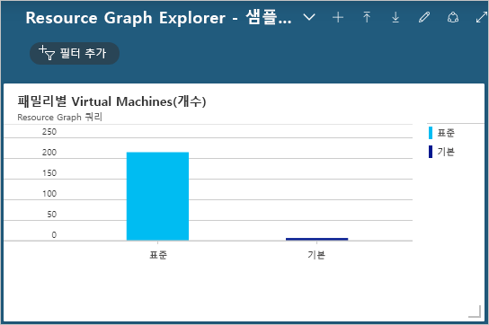

# <a name="quickstart-run-your-first-resource-graph-query-using-azure-resource-graph-explorer"></a>빠른 시작: Azure Resource Graph Explorer를 사용하여 첫 번째 Resource Graph 쿼리 실행

Azure Resource Graph의 강력한 기능은 Azure Resource Graph Explorer를 통해 Azure Portal에서 직접 사용할 수 있습니다. Resource Graph Explorer는 쿼리할 수 있는 Azure Resource Manager 리소스 종류 및 속성에 대해 탐색 가능한 정보를 제공합니다. 또한 Resource Graph Explorer는 여러 쿼리를 사용하고, 결과를 평가하며, 쿼리 결과 중 일부를 Azure 대시보드에 고정할 수 있는 차트로 변환하는 데 사용할 수 있는 깔끔한 인터페이스를 제공합니다.

이 빠른 시작의 끝부분에서는 Azure Portal 및 Resource Graph Explorer를 사용하여 첫 번째 Resource Graph 쿼리를 실행하고 결과를 대시보드에 고정했습니다.

Azure 구독이 아직 없는 경우 시작하기 전에 [체험](https://azure.microsoft.com/free/) 계정을 만듭니다.

## <a name="run-your-first-resource-graph-query"></a>첫 번째 Resource Graph 실행

첫 번째 Resource Graph 쿼리를 실행하려면 [Azure Portal](https://portal.azure.com)을 열어 다음 단계에 따라 Resource Graph Explorer를 찾아서 사용합니다.

1. 왼쪽 창에서 **모든 서비스**를 선택합니다. **Resource Graph Explorer**를 검색하고 선택합니다.

1. 창의 **쿼리 1** 부분에서 `Resources | project name, type | limit 5` 쿼리를 입력하고, **쿼리 실행**을 선택합니다.

   > [!NOTE]
   > 이 쿼리 예제에서는 `order by`와 같은 정렬 한정자를 제공하지 않으므로 이 쿼리를 여러 번 실행하면 요청마다 다른 리소스 세트가 생성될 수 있습니다.

1. **결과** 탭에서 쿼리 응답을 검토합니다. **메시지** 탭을 선택하여 결과 수 및 쿼리 기간을 포함하여 쿼리에 대한 세부 정보를 확인합니다. 오류가 있는 경우 이 탭 아래에 표시됩니다.

1. **Name** 속성을 기준으로 정렬(`order by`)하도록 쿼리를 업데이트합니다(`Resources | project name, type | limit 5 | order by name asc`). 그런 다음, **쿼리 실행**을 선택합니다.

   > [!NOTE]
   > 첫 번째 쿼리와 마찬가지로 이 쿼리를 여러 번 실행하면 요청마다 다른 리소스 집합이 생성될 수 있습니다. 쿼리 명령의 순서는 중요합니다. 이 예제에서 `order by`는 `limit` 뒤에 옵니다. 이렇게 하면 먼저 쿼리 결과가 제한된 후 정렬됩니다.

1. 먼저 **Name** 속성을 기준으로 정렬(`order by`)한 다음, 상위 5개 결과로 제한(`limit`)하도록 쿼리를 업데이트합니다(`Resources | project name, type | order by name asc | limit 5`). 그런 다음, **쿼리 실행**을 선택합니다.

최종 쿼리가 여러 번 실행될 때 환경이 전혀 변경되지 않는다고 가정하면 반환되는 결과는 일관되고, 예상대로 **Name** 속성을 기준으로 정렬되지만 여전히 상위 5개 결과로 제한됩니다.

### <a name="schema-browser"></a>스키마 브라우저

스키마 브라우저는 Resource Graph Explorer의 왼쪽 창에 있습니다. 이 리소스 목록에는 Azure Resource Graph에서 지원하고 액세스할 수 있는 테넌트에 있는 Azure 리소스의 모든 _리소스 종류_가 표시됩니다. 리소스 종류 또는 하위 속성을 펼치면 Resource Graph 쿼리를 만드는 데 사용할 수 있는 자식 속성이 표시됩니다.

리소스 종류를 선택하면 `where type =="<resource type>"`이 쿼리 상자에 배치됩니다. 자식 속성 중 하나를 선택하면 `where <propertyName> == "INSERT_VALUE_HERE"`가 쿼리 상자에 추가됩니다.
스키마 브라우저는 쿼리에 사용할 속성을 검색하는 좋은 방법입니다. 원하는 결과를 얻기 위해 _INSERT\_VALUE\_HERE_를 사용자 고유의 값으로 바꾸고, 조건, 연산자 및 함수를 사용하여 쿼리를 조정합니다.

## <a name="create-a-chart-from-the-resource-graph-query"></a>Resource Graph 쿼리에서 차트 만들기

위의 마지막 쿼리를 실행한 후 **차트** 탭을 선택하면 "결과 세트가 원형 차트 시각화와 호환되지 않습니다."라는 메시지가 표시됩니다. 결과를 나열하는 쿼리는 차트로 만들 수 없지만, 리소스 수를 제공하는 쿼리는 만들 수 있습니다. [샘플 쿼리 - OS 유형별 가상 머신 개수 계산](./samples/starter.md#count-virtual-machines-by-os-type)을 사용하여 Resource Graph 쿼리에서 시각화를 만들어 보겠습니다.

1. 창의 **쿼리 1** 부분에서 다음 쿼리를 입력하고 **쿼리 실행**을 선택합니다.

   ```kusto
   Resources
   | where type =~ 'Microsoft.Compute/virtualMachines'
   | summarize count() by tostring(properties.storageProfile.osDisk.osType)
   ```

1. **결과** 탭을 선택하고, 이 쿼리에 대한 응답에서 개수를 제공하는지 확인합니다.

1. **차트** 탭을 선택합니다. 이제 쿼리 결과가 시각화됩니다. _차트 종류 선택..._ 에서 종류를 _막대형 차트_ 또는 _도넛형 차트_로 변경하여 사용 가능한 시각화 옵션을 시험해 봅니다.

## <a name="pin-the-query-visualization-to-a-dashboard"></a>대시보드에 쿼리 시각화 고정

시각화할 수 있는 쿼리의 결과가 있으면 해당 데이터 시각화를 대시보드 중 하나에 고정할 수 있습니다. 위의 쿼리가 실행되면 다음 단계를 수행합니다.

1. **저장**을 선택하고, "OS 유형별 VM 수"라는 이름을 제공합니다. 그런 다음, 오른쪽 창의 아래쪽에서 **저장**을 선택합니다.

1. **쿼리 실행**을 선택하여 쿼리가 저장되었으므로 다시 실행합니다.

1. **차트** 탭에서 데이터 시각화를 선택합니다. 그런 다음, **대시보드에 고정**을 선택합니다.

1. 표시되는 포털 알림을 선택하거나 왼쪽 창에서 **대시보드**를 선택합니다.

이제 쿼리 이름과 일치하는 타일의 제목이 있는 대시보드에서 쿼리를 사용할 수 있습니다. 쿼리를 고정할 때 저장하지 않은 경우 '쿼리 1'이라는 이름이 대신 지정됩니다.

쿼리 및 결과 데이터 시각화는 대시보드가 로드될 때마다 실행 및 업데이트되어 워크플로에서 직접 Azure 환경에 대한 실시간 동적 인사이트를 제공합니다.

> [!NOTE]
> 목록을 생성하는 쿼리도 대시보드에 고정할 수 있습니다. 이 기능은 쿼리의 데이터 시각화로만 제한되지 않습니다.

## <a name="import-example-resource-graph-explorer-dashboards"></a>Resource Graph Explorer 대시보드 예제 가져오기

Resource Graph 쿼리 예제와 Resource Graph Explorer를 사용하여 Azure Portal 워크플로를 향상시키는 방법을 제공하려면 다음 대시보드 예제를 사용해 보세요.

- [Resource Graph Explorer - 샘플 대시보드 #1](https://github.com/Azure-Samples/Governance/blob/master/src/resource-graph/portal-dashboards/sample-1/resourcegraphexplorer-sample-1.json)

  [](./media/arge-sample1-large.png#lightbox)

- [Resource Graph Explorer - 샘플 대시보드 #2](https://github.com/Azure-Samples/Governance/blob/master/src/resource-graph/portal-dashboards/sample-2/resourcegraphexplorer-sample-2.json)

  [](./media/arge-sample2-large.png#lightbox)

> [!NOTE]
> 위의 대시보드 예제 스크린샷의 개수 및 차트는 Azure 환경에 따라 달라집니다.

1. 평가하려는 샘플 대시보드를 선택하고 다운로드합니다.

1. Azure Portal의 왼쪽 창에서 **대시보드**를 선택합니다.

1. **업로드**를 선택한 다음, 다운로드한 샘플 대시보드 파일을 찾아서 선택합니다. 그런 다음, **열기**를 선택합니다.

가져온 대시보드가 자동으로 표시됩니다. 이제 Azure Portal에 있으므로 필요에 따라 검색하고 변경하거나, 예제에서 팀과 공유할 새 대시보드를 만들어 팀과 공유할 수 있습니다. 대시보드를 사용하는 방법에 대한 자세한 내용은 [Azure Portal에서 대시보드 만들기 및 공유](../../azure-portal/azure-portal-dashboards.md)를 참조하세요.

## <a name="clean-up-resources"></a>리소스 정리

Azure Portal 환경에서 Resource Graph 샘플 대시보드를 제거하려면 다음 단계를 수행할 수 있습니다.

1. 왼쪽 창에서 **대시보드**를 선택합니다.

1. 대시보드 드롭다운에서 삭제하려는 Resource Graph 샘플 대시보드를 선택합니다.

1. 대시보드 위쪽의 대시보드 메뉴에서 **삭제**를 선택하고, **확인**을 선택하여 확인합니다.

## <a name="next-steps"></a>다음 단계

- [쿼리 언어](./concepts/query-language.md)에 대한 자세한 정보를 가져옵니다.
- [리소스를 살펴 보는](./concepts/explore-resources.md) 방법을 자세히 알아보세요.
- [Azure CLI](first-query-azurecli.md)로 첫 번째 쿼리를 실행합니다.
- [시작 쿼리](./samples/starter.md) 샘플을 참조하세요.
- [고급 쿼리](./samples/advanced.md) 샘플을 살펴봅니다.
- [UserVoice](https://feedback.azure.com/forums/915958-azure-governance)에서 피드백을 제공합니다.