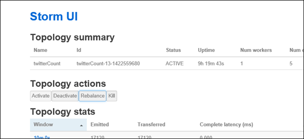

<properties
   pageTitle="HDInsight에서 클러스터 크기 조정 | Azure"
   description="클러스터를 삭제한 후 다시 생성하지 않고 HDInsight에서 실행되는 클러스터의 데이터 노드 수를 변경합니다."
   services="hdinsight"
   documentationCenter=""
   authors="bradsev"
   manager="paulettm"
   editor="cgronlun"/>

<tags
   ms.service="hdinsight"
   ms.devlang=""
   ms.topic="article"
   ms.tgt_pltfrm="na"
   ms.workload="big-data"
   ms.date="02/18/2015"
   ms.author="bradsev"/>

# HDInsight에서 클러스터 크기 조정

클러스터 크기 조정 기능을 사용하여 클러스터를 삭제한 후 다시 생성하지 않고 HDInsight에서 실행되는 클러스터에서 사용되는 데이터 노드 수를 변경합니다. PowerShell, HDInsight SDK를 사용하여 또는 Azure 포털에서 작업을 수행할 수 있습니다.

> [WACOM.NOTE] Hadoop과 Storm 클러스터 형식만 현재 릴리스에서지원됩니다. HBase 클러스터에 대한 지원이 곧 추가됩니다. 

## 기능 세부사항
이 섹션에서는 HDInsight에서 지원되는 클러스터의 각 형식에 대한 데이터 노드 수를 변경하는 영향에 대해 설명합니다.

* Hadoop
* Storm
* HBase 

## Hadoop 

### 데이터 노드 추가
모든 보류 중인 또는 실행 중인 작업에 영향을 주지 않고 실행되는 Hadoop 클러스터의 데이터 노드 수를 원활하게 늘릴 수 있습니다. 작업이 진행 중인 동안에 새 작업을 제출할 수 있습니다. 크기 조정 작업의 오류는 정상적으로 처리되므로 클러스터는 항상 기능 상태로 남아 있습니다.

### 데이터 노드 제거
데이터 노드 수를 줄여 Hadoop 클러스터를 축소하고 클러스터의 서비스 중 일부는 다시 시작됩니다. 그러면 실행 중인 작업과 보류 중인 작업이 크기 조정 작업을 완료하지 못하고 실패합니다. 그러나 작업이 완료되면 작업을 다시 제출할 수 있습니다.

## Storm
실행 중인 동안 Storm 클러스터에 데이터 노드를 원활하게 추가하거나 제거할 수 있습니다. 하지만 크기 조정 작업이 성공적으로 완료되면 다시 토폴로지 균형을 조정해야 합니다.

다음 두 가지 방법으로 사용하여 균형을 조정할 수 있습니다.

* Storm 웹 UI
* CLI 도구 

자세한 내용은 [Apache Storm 문서](http://storm.apache.org/documentation/Understanding-the-parallelism-of-a-Storm-topology.html)(영문)를 참조하세요.

Storm 웹 UI는 HDInsight 클러스터에서 제공됩니다.

다음은 CLI 명령을 사용하여 Storm 토폴로지 균형을 다시 조정하는 방법의 예입니다.

	## Reconfigure the topology "mytopology" to use 5 worker processes,
	## the spout "blue-spout" to use 3 executors and
	## the bolt "yellow-bolt" to use 10 executors.

	$ storm rebalance mytopology -n 5 -e blue-spout=3 -e yellow-bolt=10

## HBase
지금은 HBase 유형 클러스터에 대한 클러스터 크기 조정 작업이 지원되지 않습니다.

## 필수 조건:

* HDInsight 버전 3.1.3 이상을 사용하는 클러스터만 지원됩니다. 클러스터 버전을 확실히 알 수 없는 경우 HDInsight 클러스터 이름을 클릭하거나 Azure PowerShell에서 `Get-AzureHDInsightCluster -name <clustername>` 명령을 실행하여 Azure 포털에서 클러스터 버전을 확인하십시오.

* PowerShell에서 작업을 수행하는 데 Azure PowerShell 버전 0.8.14 이상이 필요합니다. [Azure 다운로드](http://azure.microsoft.com/ downloads/) 웹 사이트에서 명령줄 도구 섹션의 PowerShell 최신 버전을 다운로드할 수 있습니다. PowerShell 창에서 다음 명령을 사용하여 설치된 Azure PowerShell 버전을 확인할 수 있습니다. `(get-module Azure).Version`

## 클러스터 크기 조정 사용 방법

### Azure 포털
Azure HDInsight 클러스터 대시보드의 **크기 조정** 탭에서 실행 중인 클러스터의 크기를 변경할 수 있습니다.

### PowerShell
PowerShell을 사용하여 Hadoop 클러스터 크기를 변경하려면 클라이언트 컴퓨터에서 다음 명령을 실행합니다.

	Set-AzureHDInsightClusterSize -ClusterSizeInNodes <NewSize> -name <clustername>	

> [WACOM.NOTE] 이 명령을 사용하려면 클라이언트 컴퓨터에 Azure PowerShell 버전 0.8.14 이상이 설치되어 있어야 합니다.

### SDK
HDInsight SDK를 사용하여 Hadoop 클러스터 크기를 변경하려면 다음 두 방법 중 하나를 사용합니다. 

	ChangeClusterSize(string dnsName, string location, int newSize) 

또는 

	ChangeClusterSizeAsync(string dnsName, string location, int newSize) 

이 메서드의 동기 및 비동기 버전은 모두 [ClusterDetails](http://msdn.microsoft.com/library/microsoft.windowsazure.management.hdinsight.clusterdetails_properties.aspx) 개체를 반환합니다.

이 메서드의 동기 버전을 사용하는 방법을 보여주는 샘플 코드는 다음과 같습니다.

	using System;
	using System.Collections.Generic;
	using System.Linq;
	using System.Text;
	using System.Threading.Tasks;
	using System.Security.Cryptography.X509Certificates;
	using Microsoft.WindowsAzure.Management.HDInsight;
	using Microsoft.WindowsAzure.Management.HDInsight.ClusterProvisioning;

	namespace HDInsightClusterScaling
	{
	    class Program
	    {
	        static void Main(string[] args)
	        {
	            // Friendly name for the certificate your created earlier  
	            string certfriendlyname = "<CertificateFriendlyName>";     
	            string subscriptionid = "<SubscriptionID>";
	            string clustername = "<ClusterDNSName>";
	     		string location = "<ClusterLocation>"";
				int newSize = <NewClusterSize>;
	
	            // Get the certificate object from certificate store using the friendly name to identify it
	            X509Store store = new X509Store();
	            store.Open(OpenFlags.ReadOnly);
	            X509Certificate2 cert = store.Certificates.Cast<X509Certificate2>().First(item => item.FriendlyName == certfriendlyname);
	
	            // Create an HDInsightClient object
	            HDInsightCertificateCredential creds = new HDInsightCertificateCredential(new Guid(subscriptionid), cert);
	            var client = HDInsightClient.Connect(creds);
	
	            Console.WriteLine("Rescaling HDInsight cluster ...");
	
	            // Change cluster size
	     		ClusterDetails cluster = client.ChangeClusterSize(clustername, location, newSize);
	            
	            Console.WriteLine("Cluster Rescaled: {0} \n New Cluster Size = {1}", cluster.ConnectionUrl, cluster.ClusterSizeInNodes);
	            Console.WriteLine("Press ENTER to continue.");
	            Console.ReadKey();
	        }
	    }
	}

HDInsight .NET SDK 사용 정보에 대한 자세한 내용은 [사용자 지정 옵션을 사용하여 HDInsight에서 Hadoop 클러스터 프로비전](http://azure.microsoft.com/ documentation/articles/hdinsight-provision-clusters/) 주제를 참조하세요.
<!--HONumber=45--> 
