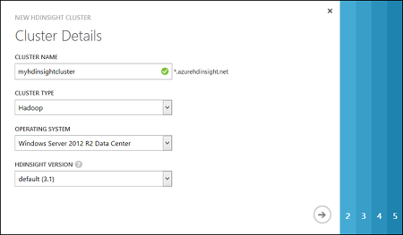
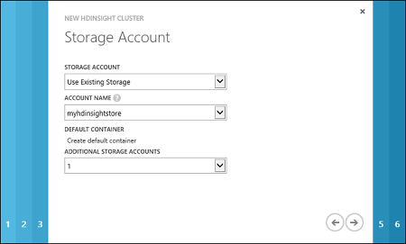
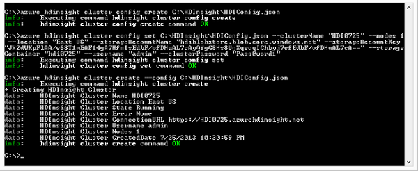

<properties linkid="manage-services-hdinsight-provision-hdinsight-clusters" urlDisplayName="HDInsight Administration" pageTitle="Provision HDInsight clusters | Azure" metaKeywords="hdinsight, hdinsight administration, hdinsight administration azure" description="Learn how to provision clusters for Azure HDInsight using the management portal, PowerShell, or the command line." umbracoNaviHide="0" disqusComments="1" editor="cgronlun" manager="paulettm" services="hdinsight" documentationCenter="" title="Provision HDInsight clusters" authors="jgao" />

HDInsight 클러스터 프로비전
===========================

이 문서에서는 HDInsight 클러스터를 프로비전하는 여러 가지 방법에 대해 알아봅니다.

**필수 조건:**

이 문서를 시작하기 전에 다음이 있어야 합니다.

-   Azure 구독. Azure는 구독 기반 플랫폼입니다. HDInsight PowerShell cmdlet은 구독을 사용하여 작업을 수행합니다. 구독을 얻는 방법에 대한 자세한 내용은 [구매 옵션](https://www.windowsazure.com/en-us/pricing/purchase-options/), [구성원 제공 항목](https://www.windowsazure.com/en-us/pricing/member-offers/) 또는 [무료 평가판](https://www.windowsazure.com/en-us/pricing/free-trial/)을 참조하십시오.

이 문서에서는 다음을 수행합니다.
--------------------------------

-   [Azure 관리 포털 사용](#portal)
-   [Azure PowerShell 사용](#powershell)
-   [플랫폼 간 명령줄 사용](#cli)
-   [HDInsight .NET SDK 사용](#sdk)
-   [다음 단계](#nextsteps)

Azure 관리 포털 사용
--------------------

HDInsight 클러스터는 Azure Blob 저장소 컨테이너를 기본 파일 시스템으로 사용합니다. HDInsight 클러스터를 만들려면 먼저 동일한 데이터 센터에 위치한 Azure 저장소 계정이 필요합니다. 자세한 내용은 [HDInsight와 함께 Azure Blob 저장소 사용](/en-us/manage/services/hdinsight/howto-blob-store/)을 참조하십시오. Azure 저장소 계정 만들기에 대한 자세한 내용은 [저장소 계정을 만드는 방법](/en-us/manage/services/storage/how-to-create-a-storage-account/)을 참조하십시오.

> [WACOM.NOTE] 현재 동남아시아, 북유럽, 서유럽, 미국 동부 및 미국 서부 지역에서만 HDInsight 클러스터를 호스트할 수 있습니다.

이 세션에서는 사용자 지정 만들기 옵션을 사용하여 HDInsight 클러스터를 만드는 절차를 설명합니다. 빠른 생성 옵션 사용에 대한 자세한 내용은 [Azure HDInsight 시작](/en-us/manage/services/hdinsight/get-started-hdinsight/)을 참조하십시오.

**사용자 지정 만들기 옵션을 사용하여 HDInsight 클러스터를 만들려면**

1.  [Azure 관리 포털](https://manage.windowsazure.com/)에 로그인합니다.
2.  페이지 아래에서 **+ 새로 만들기**를 클릭한 후 **데이터 서비스**, **HDInsight**, **사용자 지정 만들기**를 차례로 클릭합니다.
3.  클러스터 세부 정보 페이지에서 다음 값을 입력하거나 선택합니다.

    <table border='1'>
		<tr>
			<th>속성</th>
			<th>값</th>
		</tr>
		<tr>
			<td>클러스터 이름</td>
			<td>
클러스터의 이름 

				<ul>
				<li>DNS 이름은 영숫자로 시작되고 끝나야 하며 대시를 포함할 수 있습니다.</li>
				<li>필드는 3자에서 63자의 문자열이어야 합니다.</li>
				</ul>
			</td>
		</tr>
		<tr>
			<td>데이터 노드</td>
			<td>클러스터의 노드 수 지정. 기본값은 4입니다.</td>
		</tr>
		<tr>
			<td>HDINSIGHT 버전</td>
			<td>버전 선택. 기본값은 Hadoop 1.2 클러스터에서 실행되는 2.0 버전입니다. 3.0은 Hadoop 2.2 클러스터를 사용합니다. 자세한 내용은 <a href="http://www.windowsazure.com/en-us/manage/services/hdinsight/versioning-in-hdinsight/">Azure HDInsight에 포함된 Hadoop 버전</a>(영문)을 참조하십시오.</td>
		</tr>
		<tr>
			<td>지역</td>
			<td>클러스터가 설치된 데이터 센터 지정. 위치는 기본 파일 시스템으로 사용할 Azure Blob 저장소와 같아야 합니다. 현재 \*동남아시아\*, \*북유럽\*, \*서유럽\*, \*미국 동부\* 또는 \*미국 서부\*만 선택할 수 있습니다.</td>
		</tr>
	</table>

    

4.  페이지 오른쪽 아래 모서리에 있는 오른쪽 화살표를 클릭합니다.
5.  클러스터 사용자 구성 페이지에서 다음 값을 입력하거나 선택합니다.

    <table border='1'>
		<tr>
			<th>속성</th>
			<th>값</th>
		</tr>
		<tr>
			<td>사용자 이름</td>
			<td>HDInsight 클러스터 사용자 이름 지정</td>
		</tr>
		<tr>
			<td>
암호

암호 확인
</td>
			<td>HDInsight 클러스터 사용자 암호 지정</td>
		</tr>
		<tr>
			<td>Hive/Oozie Metastore 입력</td>
			<td>동일한 데이터 센터에서 Hive/Oozie 메타스토어로 사용할 SQL 데이터베이스 지정</td>
		</tr>
		<tr>
			<td>HIVE META/OOZIESTORE 데이터베이스</td>
			<td>Hive/OOzie용 메타스토어로 사용할 Azure SQL 데이터베이스 지정. 이 SQL 데이터베이스는 HDInsight 클러스터와 동일한 데이터 센터에 있어야 합니다. 목록 상자에는 Cluster Details 페이지에서 지정한 것과 동일한 데이터 센터에 있는 SQL 데이터베이스만 나열됩니다.</td>
		</tr>
		<tr>
			<td>데이터베이스 사용자</td>
			<td>데이터베이스에 연결하는 데 사용할 SQL 데이터베이스 사용자 지정</td>
		</tr>
		<tr>
			<td>데이터베이스 사용자 암호</td>
			<td>SQL 데이터베이스 사용자 암호 지정</td>
		</tr>
	</table>

    버전 2.0 HDInsight 클러스터의 경우 여기서 제공되는 자격 증명은 클러스터의 서비스에만 액세스할 수 있습니다. 클러스터가 만들어진 후에 원격 데스크톱을 설정할 수 있습니다.

    

6.  페이지 오른쪽 아래 모서리에 있는 오른쪽 화살표를 클릭합니다.
7.  저장소 계정 페이지에서 다음 값을 입력하거나 선택합니다.

    <table border='1'>
		<tr>
			<th>속성</th>
			<th>값</th>
		</tr>
		<tr>
			<td>저장소 계정</td>
			<td>HDInsight 클러스터의 기본 파일 시스템으로 사용할 Azure 저장소 계정 지정. 세 가지 옵션 중 하나를 선택할 수 있습니다.
			<ul>
				<li>기존 저장소 사용</li>
				<li>새 저장소 만들기</li>
				<li>다른 구독의 저장소 사용</li>
			</ul>
			</td>
		</tr>
		<tr>
			<td>계정 이름</td>
			<td><b>기존 저장소 사용</b> 을 선택한 경우 목록 상자에는 동일한 데이터 센터에 위치한 저장소 계정만 나열됩니다.</td>
		</tr>
		<tr>
			<td>계정 키</td>
			<td>이 필드는 저장소 계정 필드에서 <strong>다른 구독의 저장소 사용</strong> 을 선택한 경우에만 사용할 수 있습니다.</td>
		</tr>	
		<tr>
			<td>기본 컨테이너</td>
			<td>HDInsight 클러스터의 기본 파일 시스템으로 사용할 저장소 계정의 기본 컨테이너. 저장소 계정 필드에서 <strong>기존 저장소 사용</strong> 을 선택하고 기본 컨테이너 필드에서 <strong>기본 컨테이너 만들기</strong> 를 선택한 경우 기본 컨테이너 이름은 클러스터의 이름과 동일합니다. 클러스터의 이름을 가진 컨테이너가 이미 있는 경우에는 컨테이너 이름에 시퀀스 번호가 추가됩니다. 예를 들어 mycontainer1, mycontainer2 등과 같습니다.</td>
		</tr>
		<tr>
			<td>추가 저장소 계정</td>
			<td>HDInsight는 여러 저장소 계정을 지원합니다. 클러스터에서 사용할 수 있는 추가 저장소 계정의 수에는 제한이 없습니다. 하지만 관리 포털을 사용하여 클러스터를 만드는 경우에는 UI 제약으로 인해 7개로 제한됩니다. 이 필드에서 지정하는 각 추가 저장소 계정은 계정 정보를 지정할 수 있는 저장소 계정 페이지를 더합니다. 예를 들어 다음 스크린샷에서 하나의 추가 저장소 계정이 선택되면 4페이지가 대화 상자에 추가됩니다.</td>
		</tr>		
	</table>

    

8.  페이지 오른쪽 아래 모서리에 있는 오른쪽 화살표를 클릭합니다.
9.  저장소 계정 페이지에서 추가 저장소 계정에 대해 계정 정보를 입력합니다.

    

10. 오른쪽 아래 모서리에 있는 완료 단추(확인 아이콘)를 클릭하여 HDInsight 클러스터 프로비전 프로세스를 시작합니다.

클러스터를 프로비전하는 데는 몇 분 정도 걸릴 수 있습니다. 프로비전 프로세스가 완료되면 클러스터의 상태 열에 **실행 중**이 표시됩니다.

> [WACOM.NOTE] HDInsight 클러스터의 Azure 저장소 계정을 선택하고 나면 계정을 삭제할 수 없으며 다른 계정으로 변경할 수도 없습니다.

Azure PowerShell 사용
---------------------

Azure PowerShell은 Azure에서 작업의 배포와 관리를 제어 및 자동화하기 위해 사용할 수 있는 강력한 스크립팅 환경입니다. HDInsight PowerShell cmdlet을 실행하도록 워크스테이션을 구성하는 방법에 대한 자세한 내용은 [Azure PowerShell 설치 및 구성](/en-us/documentation/articles/install-configure-powershell/)을 참조하십시오. HDInsight와 함께 PowerShell을 사용하는 방법에 대한 자세한 내용은 [PowerShell을 사용하여 HDInsight 관리](/en-us/manage/services/hdinsight/administer-hdinsight-using-powershell/)를 참조하십시오. HDInsight PowerShell cmdlet의 목록은 [HDInsight cmdlet 참조](http://msdn.microsoft.com/en-us/library/windowsazure/dn479228.aspx)를 참조하십시오.

PowerShell을 사용하여 HDInsight 클러스터를 프로비전하려면 다음 절차가 필요합니다.

-   Azure 저장소 계정 만들기
-   Azure Blob 컨테이너 만들기
-   HDInsight 클러스터 만들기

HDInsight는 Azure Blob 저장소 컨테이너를 기본 파일 시스템으로 사용합니다. HDInsight 클러스터를 만들려면 먼저 Azure 저장소 계정 및 저장소 컨테이너가 필요합니다. 저장소 계정은 HDInsight 클러스터와 동일한 데이터 센터에 있어야 합니다.

**Azure 저장소 계정을 만들려면**

-   Azure PowerShell 콘솔 창에서 다음 명령을 실행합니다.

          $storageAccountName = "<StorageAcccountName>"
          $location = "<MicrosoftDataCenter>"     # For example, "West US"
            
          # Create an Azure storage account
          New-AzureStorageAccount -StorageAccountName $storageAccountName -Location $location

    저장소 계정이 이미 있지만 계정 이름과 계정 키를 모르는 경우 다음 PowerShell 명령을 사용하여 정보를 검색할 수 있습니다.

          # List storage accounts for the current subscription
          Get-AzureStorageAccount

          # List the keys for a storage account
          Get-AzureStorageKey "<StorageAccountName>"

**Azure 저장소 컨테이너를 만들려면**

-   Azure PowerShell 창에서 다음 명령을 실행합니다.

          $storageAccountName = "<StorageAccountName>"
          $storageAccountKey = "<StorageAccountKey>"
          $containerName="<ContainerName>"

          # Create a storage context object
          $destContext = New-AzureStorageContext -StorageAccountName $storageAccountName 
                                                 -StorageAccountKey $storageAccountKey  
             
          # Create a Blob storage container
          New-AzureStorageContainer -Name $containerName -Context $destContext

저장소 계정 및 Blob 컨테이너가 준비되면 클러스터를 만들 준비가 되었습니다.

**HDInsight 클러스터를 프로비전하려면**

-   Azure PowerShell 창에서 다음 명령을 실행합니다.

         $subscriptionName = "<SubscriptionName>"      	  # The name of the Azure subscription.
          $storageAccountName = "<StorageAccountName>"    # The Azure storage account that hosts the default container. The default container will be used as the default file system.
          $containerName = "<ContainerName>"              # The Azure Blob storage container that will be used as the default file system for the HDInsight cluster.

          $clusterName = "<HDInsightClusterName>"         # The name you will name your HDInsight cluster.
          $location = "<MicrosoftDataCenter>"             # The location of the HDInsight cluster. It must in the same data center as the storage account.
          $clusterNodes = <ClusterSizeInNodes>            # The number of nodes in the HDInsight cluster.

          # Get the storage primary key based on the account name
          Select-AzureSubscription $subscriptionName
          $storageAccountKey = Get-AzureStorageKey $storageAccountName | %{ $_.Primary }

          # Create a new HDInsight cluster
          New-AzureHDInsightCluster -Name $clusterName -Location $location -DefaultStorageAccountName "$storageAccountName.blob.core.windows.net" -DefaultStorageAccountKey $storageAccountKey -DefaultStorageContainerName $containerName  -ClusterSizeInNodes $clusterNodes

    클러스터 프로비전이 완료되는 데 몇 분 정도 걸릴 수 있습니다.

    

클러스터를 프로비전하고 두 개 이상의 Azure Blob 저장소나 사용자 지정 Hive 및 Oozie 메타스토어에 연결되도록 구성할 수도 있습니다. 이 고급 기능을 사용하면 데이터 및 메타데이터의 수명을 클러스터의 수명과 분리할 수 있습니다.

**구성을 사용하여 HDInsight 클러스터를 프로비전하려면**

-   Windows PowerShell 창에서 다음 명령을 실행합니다.

         $subscriptionName = "<SubscriptionName>"
          $clusterName = "<ClusterName>"
          $location = "<MicrosoftDataCenter>"
          $clusterNodes = <ClusterSizeInNodes>
            
          $storageAccountName_Default = "<DefaultFileSystemStorageAccountName>"
          $containerName_Default = "<DefaultFileSystemContainerName>"
            
          $storageAccountName_Add1 = "<AdditionalStorageAccountName>"
            
          $hiveSQLDatabaseServerName = "<SQLDatabaseServerNameForHiveMetastore>"
          $hiveSQLDatabaseName = "<SQLDatabaseDatabaseNameForHiveMetastore>"
          $oozieSQLDatabaseServerName = "<SQLDatabaseServerNameForOozieMetastore>"
          $oozieSQLDatabaseName = "<SQLDatabaseDatabaseNameForOozieMetastore>"
            
          # Get the storage account keys
          Select-AzureSubscription $subscriptionName
          $storageAccountKey_Default = Get-AzureStorageKey $storageAccountName_Default | %{ $_.Primary }
          $storageAccountKey_Add1 = Get-AzureStorageKey $storageAccountName_Add1 | %{ $_.Primary }
            
          $oozieCreds = Get-Credential -Message "Oozie metastore"
          $hiveCreds = Get-Credential -Message "Hive metastore"
            
          # Create a Blob storage container
          #$dest1Context = New-AzureStorageContext -StorageAccountName $storageAccountName_Default -StorageAccountKey $storageAccountKey_Default  
          #New-AzureStorageContainer -Name $containerName_Default -Context $dest1Context
            
          # Create a new HDInsight cluster
          $config = New-AzureHDInsightClusterConfig -ClusterSizeInNodes $clusterNodes |
              Set-AzureHDInsightDefaultStorage -StorageAccountName "$storageAccountName_Default.blob.core.windows.net" -StorageAccountKey $storageAccountKey_Default -StorageContainerName $containerName_Default |
              Add-AzureHDInsightStorage -StorageAccountName "$storageAccountName_Add1.blob.core.windows.net" -StorageAccountKey $storageAccountKey_Add1 |
              Add-AzureHDInsightMetastore -SqlAzureServerName "$hiveSQLDatabaseServerName.database.windows.net" -DatabaseName $hiveSQLDatabaseName -Credential $hiveCreds -MetastoreType HiveMetastore |
              Add-AzureHDInsightMetastore -SqlAzureServerName "$oozieSQLDatabaseServerName.database.windows.net" -DatabaseName $oozieSQLDatabaseName -Credential $oozieCreds -MetastoreType OozieMetastore |
                  New-AzureHDInsightCluster -Name $clusterName -Location $location

**HDInsight 클러스터를 나열하려면**

-   Azure PowerShell 창에서 다음 명령을 실행합니다.

          Get-AzureHDInsightCluster -Name <ClusterName>

플랫폼 간 명령줄 사용
---------------------

HDInsight 클러스터를 프로비전하는 다른 옵션은 플랫폼 간 명령줄 인터페이스입니다. 명령줄 도구는Node.js로 구현되며 Windows, Mac, Linux를 포함하여 Node.js를 지원하는 플랫폼에서 사용할 수 있습니다. 명령줄 도구는 오픈 소스입니다. 소스 코드는 GitHub(<https://github.com/WindowsAzure/azure-sdk-tools-xplat>)에서 관리합니다. 명령줄 인터페이스 사용 방법에 대한 일반적인 설명은 [Mac 및 Linux에서 Azure 명령줄 도구를 사용하는 방법](/en-us/develop/nodejs/how-to-guides/command-line-tools/)을 참조하십시오. 포괄적인 참조 설명서는 [Mac 및 Linux용 Azure 명령줄 도구](/en-us/manage/linux/other-resources/command-line-tools/)를 참조하십시오. 이 문서에서는 Windows에서 명령줄 인터페이스를 사용하는 방법만 다룹니다.

플랫폼 간 명령줄을 사용하여 HDInsight 클러스터를 프로비전하려면 다음 절차가 필요합니다.

-   플랫폼 간 명령줄 설치
-   Azure 계정 게시 설정 다운로드 및 가져오기
-   Azure 저장소 계정 만들기
-   클러스터 프로비전

명령줄 인터페이스는 *NPM(Node.js 패키지 관리자)* 또는 Windows Installer를 사용하여 설치할 수 있습니다.

**NPM을 사용하여 명령줄 인터페이스를 설치하려면**

1.  **www.nodejs.org**로 이동합니다.
2.  **INSTALL**을 클릭하고 기본 설정을 사용하여 지침을 따릅니다.
3.  워크스테이션에서 **명령 프롬프트**(또는 *Azure 명령 프롬프트* 또는 *VS2012용 개발자 명령 프롬프트*)를 엽니다.
4.  명령 프롬프트 창에서 다음 명령을 실행합니다.

        npm install -g azure-cli

    > [WACOM.NOTE] NPM 명령을 찾을 수 없다는 오류 메시지가 나타나는 경우 PATH 환경 변수에 있는 다음 경로를 확인합니다. *C:\\Program Files (x86)\\nodejs;C:\\Users[username]\\AppData\\Roaming\\npm* 또는 *C:\\Program Files\\nodejs;C:\\Users[username]\\AppData\\Roaming\\npm*

5.  다음 명령을 실행하여 설치를 확인합니다.

        azure hdinsight -h

    여러 수준에서 *-h* 스위치를 사용하여 도움말 정보를 표시할 수 있습니다. 예를 들면 다음과 같습니다.

        azure -h
        azure hdinsight -h
        azure hdinsight cluster -h
        azure hdinsight cluster create -h

**Windows Installer를 사용하여 명령줄 인터페이스를 설치하려면**

1.  **http://www.windowsazure.com/ko-kr/downloads/**로 이동합니다.
2.  **명령줄 도구** 섹션으로 스크롤하여 **플랫폼 간 명령줄 인터페이스**를 클릭하고 웹 플랫폼 설치 관리자 마법사를 따릅니다.

명령줄 인터페이스를 사용하려면 먼저 워크스테이션과 Azure 사이의 연결을 구성해야 합니다. Azure 구독 정보는 명령줄 인터페이스에서 계정에 연결하는 데 사용됩니다. 이 정보는 Azure의 게시 설정 파일에서 구할 수 있습니다. 그런 다음 게시 설정 파일을 영구적 로컬 구성 설정으로 가져와서 명령줄 인터페이스에서 후속 작업에 사용할 수 있습니다. 게시 설정을 한 번만 가져와야 합니다.

> [WACOM.NOTE] 게시 설정 파일에는 중요 정보가 포함되어 있습니다. 파일을 삭제하거나 파일이 포함된 사용자 폴더를 암호화하는 추가 단계를 수행하는 것이 좋습니다. Windows에서 폴더 속성을 수정하거나 BitLocker를 사용합니다.

**게시 설정을 다운로드하거나 가져오려면**

1.  **명령 프롬프트**를 엽니다.
2.  다음 명령을 실행하여 게시 설정 파일을 다운로드합니다.

        azure account download

    

    이 명령은 URL을 비롯하여 파일 다운로드 지침을 보여 줍니다.

3.  **Internet Explorer**를 열고 명령 프롬프트 창에 나열된 URL로 이동합니다.
4.  **저장**을 클릭하여 워크스테이션에 파일을 저장합니다.
5.  명령 프롬프트 창에서 다음 명령을 실행하여 게시 설정 파일을 가져옵니다.

        azure account import <file>

    이전 스크린샷에서 게시 설정 파일은 워크스테이션의 C:\\HDInsight 폴더에 저장되었습니다.

HDInsight는 Azure Blob 저장소 컨테이너를 기본 파일 시스템으로 사용합니다. HDInsight 클러스터를 만들려면 먼저 Azure 저장소 계정이 필요합니다. 저장소 계정은 동일한 데이터 센터에 위치해야 합니다.

**Azure 저장소 계정을 만들려면**

-   명령 프롬프트 창에서 다음 명령을 실행합니다.

          azure account storage create [options] <StorageAccountName>

Azure 관리 포털을 사용하여 Azure 저장소 계정을 만드는 방법에 대한 자세한 내용은 [저장소 계정을 만드는 방법](/en-us/manage/services/storage/how-to-create-a-storage-account/)을 참조하십시오.

저장소 계정이 이미 있지만 계정 이름과 계정 키를 모르는 경우 다음 명령을 사용하여 정보를 검색할 수 있습니다.

    -- lists storage accounts
    azure account storage list
    -- Shows a storage account
    azure account storage show <StorageAccountName>
    -- Lists the keys for a storage account
    azure account storage keys list <StorageAccountName>

관리 포털을 사용하여 정보를 가져오는 방법에 대한 자세한 내용은 *방법: 저장소 액세스 키 보기, 복사 및 다시 생성* 섹션([저장소 계정을 관리하는 방법](/en-us/manage/services/storage/how-to-manage-a-storage-account/))을 참조하십시오.

*azure hdinsight cluster create* 명령은 컨테이너가 없는 경우 컨테이너를 만듭니다. 미리 컨테이너를 만들도록 선택하는 경우 다음 명령을 사용할 수 있습니다.

    azure storage container create --account-name <StorageAccountName> --account-key <StorageAccountKey> [ContainerName]

저장소 계정 및 Blob 컨테이너가 준비되면 클러스터를 만들 준비가 되었습니다.

**HDInsight 클러스터를 만들려면**

-   명령 프롬프트 창에서 다음 명령을 실행합니다.

          azure hdinsight cluster create --clusterName <ClusterName> --storageAccountName <StorageAccountName> --storageAccountKey <storageAccountKey> --storageContainer <StorageContainer> --nodes <NumberOfNodes> --location <DataCenterLocation> --username <HDInsightClusterUsername> --clusterPassword <HDInsightClusterPassword>

    

일반적으로 HDInsight 클러스터를 프로비전하고, 해당 작업을 실행한 후에 비용을 줄이기 위해 클러스터를 삭제합니다. 명령줄 인터페이스에는 클러스터를 프로비전할 때마다 다시 사용할 수 있도록 구성을 파일에 저장하는 옵션이 있습니다.

**구성 파일을 사용하여 HDInsight 클러스터를 프로비전하려면**

-   명령 프롬프트 창에서 다음 명령을 실행합니다.

          azure hdinsight cluster config create <file>
             
          azure hdinsight cluster config set <file> --clusterName <ClusterName> --nodes <NumberOfNodes> --location "<DataCenterLocation>" --storageAccountName "<StorageAccountName>.blob.core.windows.net" --storageAccountKey "<StorageAccountKey>" --storageContainer "<BlobContainerName>" --username "<Username>" --clusterPassword "<UserPassword>"
             
          azure hdinsight cluster config storage add <file> --storageAccountName "<StorageAccountName>.blob.core.windows.net"
                 --storageAccountKey "<StorageAccountKey>"
             
          azure hdinsight cluster config metastore set <file> --type "hive" --server "<SQLDatabaseName>.database.windows.net"
                 --database "<HiveDatabaseName>" --user "<Username>" --metastorePassword "<UserPassword>"
             
          azure hdinsight cluster config metastore set <file> --type "oozie" --server "<SQLDatabaseName>.database.windows.net"
                 --database "<OozieDatabaseName>" --user "<SQLUsername>" --metastorePassword "<SQLPassword>"
             
          azure hdinsight cluster create --config <file>

    

**클러스터 세부 정보를 나열하고 표시하려면**

-   클러스터 세부 정보를 나열하고 표시하려면 다음 명령을 사용합니다.

          azure hdinsight cluster list
          azure hdinsight cluster show <ClusterName>

    

**클러스터를 삭제하려면**

-   클러스터를 삭제하려면 다음 명령을 사용합니다.

          azure hdinsight cluster delete <ClusterName>

HDInsight .NET SDK 사용
-----------------------

HDInsight .NET SDK는 .NET에서 HDInsight로 더 쉽게 작업하도록 지원하는 .NET 클라이언트 라이브러리를 제공합니다.

SDK를 사용하여 HDInsight 클러스터를 프로비전하려면 다음 절차가 필요합니다.

-   HDInsight .NET SDK 설치
-   콘솔 응용 프로그램 만들기
-   응용 프로그램 실행

**HDInsight .NET SDK를 설치하려면**
[NuGet](http://nuget.codeplex.com/wikipage?title=Getting%20Started)에서 가장 최근에 게시된 SDK 빌드를 설치할 수 있습니다. 지침은 다음 절차에서 설명합니다.

**Visual Studio 콘솔 응용 프로그램을 만들려면**

1.  Visual Studio 2012를 엽니다.

2.  파일 메뉴에서 **새로 만들기**와 **프로젝트**를 차례로 클릭합니다.

3.  새 프로젝트에서 다음 값을 입력하거나 선택합니다.

    <table style="border-color: #c6c6c6; border-width: 2px; border-style: solid; border-collapse: collapse;">
		<tr>
			<th style="border-color: #c6c6c6; border-width: 2px; border-style: solid; border-collapse: collapse; width:90px; padding-left:5px; padding-right:5px;">속성</th>
			<th style="border-color: #c6c6c6; border-width: 2px; border-style: solid; border-collapse: collapse; width:90px; padding-left:5px; padding-right:5px;">값</th>
		</tr>
		<tr>
			<td style="border-color: #c6c6c6; border-width: 2px; border-style: solid; border-collapse: collapse; padding-left:5px;">Category</td>
			<td style="border-color: #c6c6c6; border-width: 2px; border-style: solid; border-collapse: collapse; padding-left:5px; padding-right:5px;">Templates/Visual C#/Windows</td>
		</tr>
		<tr>
			<td style="border-color: #c6c6c6; border-width: 2px; border-style: solid; border-collapse: collapse; padding-left:5px;">Template</td>
			<td style="border-color: #c6c6c6; border-width: 2px; border-style: solid; border-collapse: collapse; padding-left:5px;">Console Application</td>
    	</tr>
		<tr>
			<td style="border-color: #c6c6c6; border-width: 2px; border-style: solid; border-collapse: collapse; padding-left:5px;">Name</td>
			<td style="border-color: #c6c6c6; border-width: 2px; border-style: solid; border-collapse: collapse; padding-left:5px;">CreateHDICluster</td>
		</tr>
    </table>

4.  **확인**을 클릭하여 프로젝트를 만듭니다.

5.  **도구** 메뉴에서 **라이브러리 패키지 관리자**, **패키지 관리자 콘솔**을 차례로 클릭합니다.

6.  콘솔에서 다음 명령을 실행하여 패키지를 설치합니다.

         Install-Package Microsoft.WindowsAzure.Management.HDInsight

    .NET 라이브러리 및 이에 대한 참조가 현재의 Visual Studio 프로젝트에 추가됩니다.

7.  솔루션 탐색기에서 **Program.cs**를 두 번 클릭하여 엽니다.

8.  파일 맨 위에 다음 using 문을 추가합니다.

         using System.Security.Cryptography.X509Certificates;
         using Microsoft.WindowsAzure.Management.HDInsight;
         using Microsoft.WindowsAzure.Management.HDInsight.ClusterProvisioning;

9.  Main() 함수에서 다음 코드를 복사하여 붙여넣습니다.

         string certfriendlyname = "<CertificateFriendlyName>";
         string subscriptionid = "<WindowsAzureSubscriptionID>";
         string clustername = "<HDInsightClusterName>";
         string location = "<MicrosoftDataCenter>";
         string storageaccountname = "<WindowsAzureStorageAccountName>";     // Full path must be used
         string storageaccountkey = "<WindowsAzureStorageAccountKey>";
         string containername = "<HDInsightDefaultContainerName>";
         string username = "<HDInsightUsername>";
         string password = "<HDInsightUserPassword>";
         int clustersize = <NumberOfNodesInTheCluster>;

         // Get the certificate object from certificate store using the friendly name to identify it
         X509Store store = new X509Store();
         store.Open(OpenFlags.ReadOnly);
         X509Certificate2 cert = store.Certificates.Cast<X509Certificate2>().First(item => item.FriendlyName == certfriendlyname);

         // Create the storage account if it doesn't exist.

         // Create the container if it doesn't exist.

         // Create an HDInsightClient object
         HDInsightCertificateCredential creds = new HDInsightCertificateCredential(new Guid(subscriptionid), cert);
         var client = HDInsightClient.Connect(creds);

         // Supply th cluster information
         ClusterCreateParameters clusterInfo = new ClusterCreateParameters()
         {
             Name = clustername,
             Location = location,
             DefaultStorageAccountName = storageaccountname,
             DefaultStorageAccountKey = storageaccountkey,
             DefaultStorageContainer = containername,
             UserName = username,
             Password = password,
             ClusterSizeInNodes = clustersize
         };

         // Create the cluster
         Console.WriteLine("Creating the HDInsight cluster ...");

         ClusterDetails cluster = client.CreateCluster(clusterInfo);

         Console.WriteLine("Created cluster: {0}.", cluster.ConnectionUrl);
         Console.WriteLine("Press ENTER to continue.");
         Console.ReadKey();

10. main() 함수 시작 부분의 변수를 바꿉니다.

**응용 프로그램을 실행하려면**

Visual Studio에 응용 프로그램이 열려 있을 때 **F5**를 눌러 응용 프로그램을 실행합니다. 콘솔 창이 열리고 응용 프로그램의 상태가 표시되며 HDInsight 클러스터를 만드는 데는 몇 분 정도 걸릴 수 있습니다.

다음 단계
---------

이 문서에서는 HDInsight 클러스터를 프로비전하는 여러 가지 방법에 대해 알아보았습니다. 자세한 내용은 다음 문서를 참조하십시오.

-   [Azure HDInsight 시작](/en-us/manage/services/hdinsight/get-started-hdinsight/)
-   [PowerShell을 사용하여 HDInsight 관리](/en-us/manage/services/hdinsight/administer-hdinsight-using-powershell/)
-   [프로그래밍 방식으로 Hadoop 작업 제출](/en-us/manage/services/hdinsight/submit-hadoop-jobs-programmatically/)
-   [Azure HDInsight SDK 문서](http://msdnstage.redmond.corp.microsoft.com/en-us/library/dn479185.aspx)

[hdinsight-version]: /en-us/manage/services/hdinsight/versioning-in-hdinsight/
[hdinsight-sdk-documentation]: http://msdnstage.redmond.corp.microsoft.com/en-us/library/dn479185.aspx
[hdinsight-getting-started]: /en-us/manage/services/hdinsight/get-started-hdinsight/
[hdinsight-storage]: /en-us/manage/services/hdinsight/howto-blob-store/
[hdinsight-admin-powershell]: /en-us/manage/services/hdinsight/administer-hdinsight-using-powershell/
[hdinsight-submit-jobs]: /en-us/manage/services/hdinsight/submit-hadoop-jobs-programmatically/
[hdinsight-configure-powershell]: /en-us/manage/services/hdinsight/install-and-configure-powershell-for-hdinsight/ 
[hdinsight-powershell-reference]: http://msdn.microsoft.com/en-us/library/windowsazure/dn479228.aspx

[azure-create-storageaccount]: /en-us/manage/services/storage/how-to-create-a-storage-account/ 
[azure-management-portal]: https://manage.windowsazure.com/
[azure-command-line-tools]: /en-us/develop/nodejs/how-to-guides/command-line-tools/
[azure-command-line-tool]: /en-us/manage/linux/other-resources/command-line-tools/
[azure-manage-storageaccount]: /en-us/manage/services/storage/how-to-manage-a-storage-account/
[azure-purchase-options]: https://www.windowsazure.com/en-us/pricing/purchase-options/
[azure-member-offers]: https://www.windowsazure.com/en-us/pricing/member-offers/
[azure-free-trial]: https://www.windowsazure.com/en-us/pricing/free-trial/

[Powershell-install-configure]: /en-us/documentation/articles/install-configure-powershell/

[image-customprovision-page1]: ./media/hdinsight-provision-clusters/HDI.CustomProvision.Page1.png 
[image-customprovision-page2]: ./media/hdinsight-provision-clusters/HDI.CustomProvision.Page2.png 
[image-customprovision-page3]: ./media/hdinsight-provision-clusters/HDI.CustomProvision.Page3.png 
[image-customprovision-page4]: ./media/hdinsight-provision-clusters/HDI.CustomProvision.Page4.png 

[image-cli-account-download-import]: ./media/hdinsight-provision-clusters/HDI.CLIAccountDownloadImport.png
[image-cli-clustercreation]: ./media/hdinsight-provision-clusters/HDI.CLIClusterCreation.png
[image-cli-clustercreation-config]: ./media/hdinsight-provision-clusters/HDI.CLIClusterCreationConfig.png
[image-cli-clusterlisting]: ./media/hdinsight-provision-clusters/HDI.CLIListClusters.png "List and show clusters"

[image-hdi-ps-provision]: ./media/hdinsight-provision-clusters/HDI.ps.provision.png
