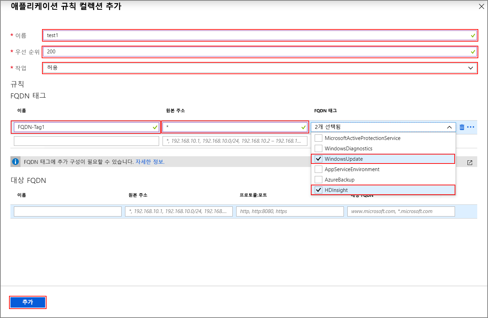
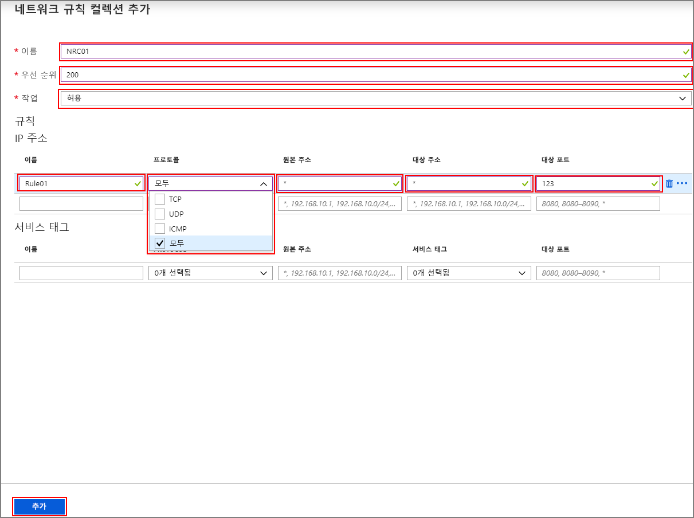

# <a name="configure-outbound-network-traffic-for-azure-hdinsight-clusters-using-firewall"></a>방화벽을 사용하여 Azure HDInsight 클러스터에 대한 아웃바운드 네트워크 트래픽 구성

이 문서에서는 Azure Firewall을 사용하여 HDInsight 클러스터에서 아웃바운드 트래픽을 보호하는 단계를 제공합니다. 아래 단계에서는 기존 클러스터에 대한 Azure Firewall를 구성한다고 가정합니다. 방화벽 뒤에 새 클러스터를 배포하는 경우 먼저 HDInsight 클러스터 및 서브넷을 만듭니다. 그런 후 이 가이드의 단계를 따릅니다.

## <a name="background"></a>배경

HDInsight 클러스터는 일반적으로 가상 네트워크에 배포됩니다. 클러스터에는 해당 가상 네트워크 외부의 서비스에 대해 종속성이 있습니다.

인바운드 관리 트래픽은 방화벽을 통해 전송할 수 없습니다. [여기](./hdinsight-service-tags.md)에 설명 된 대로 인바운드 트래픽에 대 한 nsg 서비스 태그를 사용할 수 있습니다. 

HDInsight 아웃바운드 트래픽 종속성은 FQDN으로 거의 완전히 정의되어 있습니다. 고정 IP 주소가 없는 경우가 여기에 해당합니다. 고정 주소가 없으면 NSG(네트워크 보안 그룹)에서 클러스터의 아웃바운드 트래픽을 잠글 수 없습니다. IP 주소가 변경 되 면 현재 이름 확인 및 사용에 따라 규칙을 설정할 수 없는 경우가 많습니다.

Fqdn을 기준으로 아웃 바운드 트래픽을 제어할 수 있는 방화벽으로 아웃 바운드 주소를 보호 합니다. Azure Firewall은 대상의 FQDN 또는 [FQDN 태그](../firewall/fqdn-tags.md)를 기준으로 아웃바운드 트래픽을 제한합니다.

## <a name="configuring-azure-firewall-with-hdinsight"></a>HDInsight를 사용하여 Azure Firewall 구성

Azure Firewall을 사용하여 기존 HDInsight의 송신을 잠그는 단계를 요약하면 다음과 같습니다.

1. 서브넷을 만듭니다.
1. 방화벽을 만듭니다.
1. 방화벽에 애플리케이션 규칙을 추가합니다.
1. 방화벽에 네트워크 규칙을 추가합니다.
1. 라우팅 테이블을 만듭니다.

### <a name="create-new-subnet"></a>새 서브넷 만들기

클러스터가 있는 가상 네트워크에 **AzureFirewallSubnet** 이라는 서브넷을 만듭니다.

### <a name="create-a-new-firewall-for-your-cluster"></a>클러스터에 대해 새 방화벽 만들기

**방화벽 배포** 의 단계를 사용하여 **Test-FW01** 이라는 방화벽을 만듭니다. 이 단계는 [자습서: Azure Portal을 사용하여 Azure Firewall 배포 및 구성](../firewall/tutorial-firewall-deploy-portal.md#deploy-the-firewall)을 참조하세요.

### <a name="configure-the-firewall-with-application-rules"></a>애플리케이션 규칙을 사용하여 방화벽 구성

클러스터가 중요한 통신을 주고받을 수 있도록 하는 애플리케이션 규칙 컬렉션을 만듭니다.

1. Azure Portal에서 새 방화벽 **Test-FW01** 을 선택합니다.

1. **설정** > **규칙** > **애플리케이션 규칙 컬렉션** >  **+ 애플리케이션 규칙 컬렉션 추가** 로 이동합니다.

    

1. **애플리케이션 규칙 컬렉션 추가** 화면에서 다음 정보를 제공합니다.

    **맨 위 섹션**

    | 속성|  값|
    |---|---|
    |속성| FwAppRule|
    |우선 순위|200|
    |작업|Allow|

    **FQDN 태그 섹션**

    | 속성 | 소스 주소 | FQDN 태그 | 메모 |
    | --- | --- | --- | --- |
    | Rule_1 | * | WindowsUpdate 및 HDInsight | HDI 서비스에 필요합니다. |

    **대상 FQDN 섹션**

    | 속성 | 원본 주소 | 프로토콜:포트 | 대상 FQDN | 메모 |
    | --- | --- | --- | --- | --- |
    | Rule_2 | * | https:443 | login.windows.net | Windows 로그인 작업을 허용합니다. |
    | Rule_3 | * | https:443 | login.microsoftonline.com | Windows 로그인 작업을 허용합니다. |
    | Rule_4 | * | https:443,http:80 | storage_account_name.blob.core.windows.net | `storage_account_name`을 실제 스토리지 계정 이름으로 바꿉니다. https 연결만 사용하려면 스토리지 계정에서 ["보안 전송 필요"](../storage/common/storage-require-secure-transfer.md)를 사용하도록 설정했는지 확인합니다. 개인 끝점을 사용 하 여 저장소 계정에 액세스 하는 경우에는이 단계가 필요 하지 않으며 저장소 트래픽이 방화벽에 전달 되지 않습니다.|

   

1. **추가** 를 선택합니다.

### <a name="configure-the-firewall-with-network-rules"></a>네트워크 규칙을 사용하여 방화벽 구성

HDInsight 클러스터를 올바르게 구성하기 위한 네트워크 규칙을 만듭니다.

1. 이전 단계에서 계속해서 **네트워크 규칙 컬렉션** >  **+ 네트워크 규칙 컬렉션 추가** 로 이동합니다.

1. **네트워크 규칙 컬렉션 추가** 화면에서 다음 정보를 제공합니다.

    **맨 위 섹션**

    | 속성|  값|
    |---|---|
    |속성| FwNetRule|
    |우선 순위|200|
    |작업|허용|

    **서비스 태그 섹션**

    | 속성 | 프로토콜 | 원본 주소 | 서비스 태그 | 대상 포트 | 메모 |
    | --- | --- | --- | --- | --- | --- |
    | Rule_5 | TCP | * | SQL | 1433 | HDInsight에서 제공 하는 기본 sql server를 사용 하는 경우 sql 트래픽을 기록 하 고 감사 하는 데 사용할 수 있는 SQL에 대 한 서비스 태그 섹션에서 네트워크 규칙을 구성 합니다. HDInsight 서브넷에서 SQL Server에 대한 서비스 엔드포인트를 구성하지 않은 경우 방화벽이 무시됩니다. Ambari, Oozie, 레인저 및 Hive metastore에 사용자 지정 SQL server를 사용 하는 경우 고유한 사용자 지정 SQL server에 대 한 트래픽만 허용 하면 됩니다.|
    | Rule_6 | TCP | * | Azure Monitor | * | (선택 사항) 자동 크기 조정 기능을 사용하려는 고객은 이 규칙을 추가해야 합니다. |
    
   

1. **추가** 를 선택합니다.

### <a name="create-and-configure-a-route-table"></a>경로 테이블 만들기 및 구성

다음 항목을 사용하여 경로 테이블을 만듭니다.

* [상태 및 관리 서비스](../hdinsight/hdinsight-management-ip-addresses.md#health-and-management-services-all-regions) 에서 다음 홉 유형의 **인터넷** 을 사용 하는 모든 IP 주소입니다. 특정 지역에 대 한 두 개의 Ip 뿐만 아니라 일반 지역의 4 개의 Ip를 포함 해야 합니다. 이 규칙은 ResourceProviderConnection이 *Inbound* 로 설정 된 경우에만 필요 합니다. ResourceProviderConnection이 *아웃 바운드* 로 설정 된 경우 이러한 IP는 udr에 필요 하지 않습니다. 

* 다음 홉이 Azure Firewall 프라이빗 IP 주소인 IP 주소 0.0.0.0/0에 대한 단일 가상 어플라이언스 경로

예를 들어, 미국 지역 "미국 동부"에서 만든 클러스터에 대한 경로 테이블을 구성하려면 다음 단계를 사용합니다.

1. Azure 방화벽 **Test-FW01** 을 선택합니다. **개요** 페이지에 나열된 **프라이빗 IP 주소** 를 복사합니다. 이 예제에서는 **샘플 주소 10.0.2.4** 를 사용합니다.

1. 그런 다음, **모든 서비스** > **네트워킹** > **경로 테이블** 및 **경로 테이블 만들기** 로 이동합니다.

1. 새 경로에서 **설정** > **경로** >  **+ 추가** 로 이동합니다. 다음 경로를 추가합니다.

| 경로 이름 | 주소 접두사 | 다음 홉 유형 | 다음 홉 주소 |
|---|---|---|---|
| 168.61.49.99 | 168.61.49.99/32 | 인터넷 | 해당 없음 |
| 23.99.5.239 | 23.99.5.239/32 | 인터넷 | 해당 없음 |
| 168.61.48.131 | 168.61.48.131/32 | 인터넷 | 해당 없음 |
| 138.91.141.162 | 138.91.141.162/32 | 인터넷 | 해당 없음 |
| 13.82.225.233 | 13.82.225.233/32 | 인터넷 | 해당 없음 |
| 40.71.175.99 | 40.71.175.99/32 | 인터넷 | 해당 없음 |
| 0.0.0.0 | 0.0.0.0/0 | 가상 어플라이언스 | 10.0.2.4 |

경로 테이블 구성을 완료합니다.

1. **설정** 에서 **서브넷** 를 선택하여 만든 경로 테이블을 HDInsight 서브넷에 할당합니다.

1. **+ 연결** 을 선택합니다.

1. **서브넷 연결** 화면에서 클러스터가 만들어진 가상 네트워크를 선택합니다. 또한 HDInsight 클러스터에 사용한 **서브넷** 을 선택합니다.

1. **확인** 을 선택합니다.

## <a name="edge-node-or-custom-application-traffic"></a>에지 노드 또는 사용자 지정 애플리케이션 트래픽

위의 단계를 수행하면 클러스터가 이슈 없이 작동할 수 있습니다. 해당하는 경우에는 에지 노드에서 실행 중인 사용자 지정 애플리케이션을 수용하도록 종속성을 구성해야 합니다.

애플리케이션 종속성을 식별하고 Azure Firewall 또는 경로 테이블에 추가해야 합니다.

비대칭 라우팅 문제를 방지하려면 애플리케이션 트래픽에 대한 경로를 만들어야 합니다.

애플리케이션에 다른 종속성이 있으면 Azure Firewall에 추가해야 합니다. 다른 모든 항목에 대해 HTTP/HTTPS 트래픽 및 네트워크 규칙을 허용하는 애플리케이션 규칙을 만듭니다.

## <a name="logging-and-scale"></a>로깅 및 크기 조정

Azure Firewall은 일부 다른 스토리지 시스템에 로그를 보낼 수 있습니다. 방화벽에 대한 로깅을 구성하는 방법에 대한 지침은 [자습서: Azure Firewall 로그 및 메트릭 모니터링](../firewall/firewall-diagnostics.md)의 단계를 따릅니다.

로깅 설정을 완료한 후 Log Analytics를 사용하는 경우 다음과 같은 쿼리를 사용하여 차단된 트래픽을 볼 수 있습니다.

```Kusto
AzureDiagnostics | where msg_s contains "Deny" | where TimeGenerated >= ago(1h)
```

Azure Firewall을 Azure Monitor 로그와 통합하면 애플리케이션을 처음 작동할 때 유용합니다. 특히 모든 애플리케이션 종속성을 인식하지는 못할 경우에 유용합니다. Azure Monitor 로그에 대한 자세한 내용은 [Azure Monitor에서 로그 데이터 분석](../azure-monitor/log-query/log-query-overview.md)을 참조하세요.

Azure Firewall 및 요청 증가의 크기 제한에 대한 자세한 내용은 [이](../azure-resource-manager/management/azure-subscription-service-limits.md#azure-firewall-limits) 문서 또는 [FAQ](../firewall/firewall-faq.yml)를 참조하세요.

## <a name="access-to-the-cluster"></a>클러스터에 대한 액세스

방화벽이 성공적으로 설정된 후에는 내부 엔드포인트(`https://CLUSTERNAME-int.azurehdinsight.net`)를 사용하여 가상 네트워크 내에서 Ambari에 액세스할 수 있습니다.

퍼블릭 엔드포인트(`https://CLUSTERNAME.azurehdinsight.net`) 또는 ssh 엔드포인트(`CLUSTERNAME-ssh.azurehdinsight.net`)를 사용하려면 [여기](../firewall/integrate-lb.md)에 설명된 비대칭 라우팅 이슈를 방지하기 위해 경로 테이블 및 NSG 규칙에 올바른 경로가 있는지 확인합니다. 특히 이 경우 인바운드 NSG 규칙의 클라이언트 IP 주소를 허용하고 다음 홉이 `internet`으로 설정된 사용자 정의 경로 테이블에 추가해야 합니다. 라우팅이 올바르게 설정되지 않은 경우 시간 초과 오류가 표시됩니다.

## <a name="next-steps"></a>다음 단계

* [Azure HDInsight 가상 네트워크 아키텍처](hdinsight-virtual-network-architecture.md)
* [네트워크 가상 어플라이언스 구성](./network-virtual-appliance.md)
