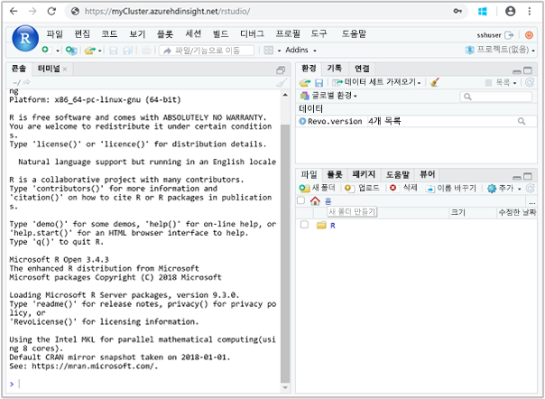

# <a name="quickstart-execute-an-r-script-on-an-ml-services-cluster-in-azure-hdinsight-using-rstudio-server"></a>빠른 시작: RStudio Server를 사용하여 Azure HDInsight의 ML Services 클러스터에서 R 스크립트 실행

Azure HDInsight에서 ML Services를 사용하면 R 스크립트에서 Apache Spark 및 Apache Hadoop MapReduce를 사용하여 분산 컴퓨팅을 실행할 수 있습니다. ML Services는 컴퓨팅 컨텍스트를 설정하여 호출 실행 방법을 제어합니다. 클러스터의 에지 노드는 클러스터에 연결하고 R 스크립트를 실행하는 데 편리한 위치를 제공합니다. 에지 노드를 사용하는 경우 에지 노드 서버의 코어에서 RevoScaleR의 병렬화된 분산 함수를 실행하는 옵션이 제공됩니다. 또한 RevoScaleR의 Hadoop Map Reduce 또는 Apache Spark 컴퓨팅 컨텍스트를 사용하여 클러스터의 노드에서 함수를 실행할 수도 있습니다.

이 빠른 시작에서는 분산 R 컴퓨팅을 위해 Spark를 사용하여 보여 주는 RStudio Server로 R 스크립트를 실행하는 방법을 알아봅니다. 컴퓨팅 컨텍스트를 정의하여 에지 노드에서 로컬로 컴퓨팅을 수행하고 HDInsight 클러스터의 노드 간에 다시 분산됩니다.

## <a name="prerequisite"></a>필수 요소

HDInsight의 ML Services 클러스터. [Azure Portal을 사용하여 Apache Hadoop 클러스터 만들기](../hdinsight-hadoop-create-linux-clusters-portal.md)를 참조하고 **클러스터 유형** 으로 **ML Services** 를 선택합니다.

## <a name="connect-to-rstudio-server"></a>RStudio Server에 연결

RStudio Server는 클러스터의 에지 노드에서 실행됩니다. 다음 URL로 이동합니다. 여기서 `CLUSTERNAME`은 여러분이 만든 ML Services 클러스터의 이름입니다.

```
https://CLUSTERNAME.azurehdinsight.net/rstudio/
```

처음 로그인할 때는 두 번 인증해야 합니다. 첫 번째 인증 프롬프트에서는 클러스터 관리자 로그인 및 암호를 입력합니다. 기본값은 `admin`입니다. 두 번째 인증 프롬프트에서는 SSH 로그인 및 암호를 입력합니다. 기본값은 `sshuser`입니다. 그 다음부터는 로그인할 때 SSH 자격 증명만 필요합니다.

연결되면 다음 스크린샷과 유사한 화면이 표시됩니다.



## <a name="use-a-compute-context"></a>컴퓨팅 컨텍스트 사용

1. RStudio Server에서 다음 코드를 사용하여 HDInsight의 기본 스토리지에 예제 데이터를 로드합니다.

    ```RStudio
    # Set the HDFS (WASB) location of example data
     bigDataDirRoot <- "/example/data"
    
     # create a local folder for storing data temporarily
     source <- "/tmp/AirOnTimeCSV2012"
     dir.create(source)
    
     # Download data to the tmp folder
     remoteDir <- "https://packages.revolutionanalytics.com/datasets/AirOnTimeCSV2012"
     download.file(file.path(remoteDir, "airOT201201.csv"), file.path(source, "airOT201201.csv"))
     download.file(file.path(remoteDir, "airOT201202.csv"), file.path(source, "airOT201202.csv"))
     download.file(file.path(remoteDir, "airOT201203.csv"), file.path(source, "airOT201203.csv"))
     download.file(file.path(remoteDir, "airOT201204.csv"), file.path(source, "airOT201204.csv"))
     download.file(file.path(remoteDir, "airOT201205.csv"), file.path(source, "airOT201205.csv"))
     download.file(file.path(remoteDir, "airOT201206.csv"), file.path(source, "airOT201206.csv"))
     download.file(file.path(remoteDir, "airOT201207.csv"), file.path(source, "airOT201207.csv"))
     download.file(file.path(remoteDir, "airOT201208.csv"), file.path(source, "airOT201208.csv"))
     download.file(file.path(remoteDir, "airOT201209.csv"), file.path(source, "airOT201209.csv"))
     download.file(file.path(remoteDir, "airOT201210.csv"), file.path(source, "airOT201210.csv"))
     download.file(file.path(remoteDir, "airOT201211.csv"), file.path(source, "airOT201211.csv"))
     download.file(file.path(remoteDir, "airOT201212.csv"), file.path(source, "airOT201212.csv"))
    
     # Set directory in bigDataDirRoot to load the data into
     inputDir <- file.path(bigDataDirRoot,"AirOnTimeCSV2012")
    
     # Make the directory
     rxHadoopMakeDir(inputDir)
    
     # Copy the data from source to input
     rxHadoopCopyFromLocal(source, bigDataDirRoot)
    ```

    이 단계를 완료하려면 8분 정도 걸릴 수 있습니다.

1. 몇 가지 데이터 정보를 만들고 두 개의 데이터 원본을 정의합니다. RStudio에서 다음 코드를 입력합니다.

    ```RStudio
    # Define the HDFS (WASB) file system
     hdfsFS <- RxHdfsFileSystem()
    
     # Create info list for the airline data
     airlineColInfo <- list(
          DAY_OF_WEEK = list(type = "factor"),
          ORIGIN = list(type = "factor"),
          DEST = list(type = "factor"),
          DEP_TIME = list(type = "integer"),
          ARR_DEL15 = list(type = "logical"))
    
     # get all the column names
     varNames <- names(airlineColInfo)
    
     # Define the text data source in hdfs
     airOnTimeData <- RxTextData(inputDir, colInfo = airlineColInfo, varsToKeep = varNames, fileSystem = hdfsFS)
    
     # Define the text data source in local system
     airOnTimeDataLocal <- RxTextData(source, colInfo = airlineColInfo, varsToKeep = varNames)
    
     # formula to use
     formula = "ARR_DEL15 ~ ORIGIN + DAY_OF_WEEK + DEP_TIME + DEST"
    ```

1. **로컬** 컴퓨팅 컨텍스트를 사용하여 데이터에 대해 로지스틱 회귀 분석을 실행합니다. RStudio에서 다음 코드를 입력합니다.

    ```RStudio
    # Set a local compute context
     rxSetComputeContext("local")
    
     # Run a logistic regression
     system.time(
        modelLocal <- rxLogit(formula, data = airOnTimeDataLocal)
     )
    
     # Display a summary
     summary(modelLocal)
    ```

    컴퓨팅은 7분 이내에 완료해야 합니다. 다음 코드 조각과 유사한 줄로 끝나는 출력이 나타나야 합니다.

    ```output
    Data: airOnTimeDataLocal (RxTextData Data Source)
     File name: /tmp/AirOnTimeCSV2012
     Dependent variable(s): ARR_DEL15
     Total independent variables: 634 (Including number dropped: 3)
     Number of valid observations: 6005381
     Number of missing observations: 91381
     -2*LogLikelihood: 5143814.1504 (Residual deviance on 6004750 degrees of freedom)
    
     Coefficients:
                      Estimate Std. Error z value Pr(>|z|)
      (Intercept)   -3.370e+00  1.051e+00  -3.208  0.00134 **
      ORIGIN=JFK     4.549e-01  7.915e-01   0.575  0.56548
      ORIGIN=LAX     5.265e-01  7.915e-01   0.665  0.50590
      ......
      DEST=SHD       5.975e-01  9.371e-01   0.638  0.52377
      DEST=TTN       4.563e-01  9.520e-01   0.479  0.63172
      DEST=LAR      -1.270e+00  7.575e-01  -1.676  0.09364 .
      DEST=BPT         Dropped    Dropped Dropped  Dropped
    
      ---
    
      Signif. codes:  0 ‘**_’ 0.001 ‘_*’ 0.01 ‘*’ 0.05 ‘.’ 0.1 ‘ ’ 1
    
      Condition number of final variance-covariance matrix: 11904202
      Number of iterations: 7
    ```

1. **Spark** 컨텍스트를 사용하여 동일한 로지스틱 회귀 분석을 실행합니다. Spark 컨텍스트는 HDInsight 클러스터의 모든 작업자 노드에서 처리를 분산시킵니다. RStudio에서 다음 코드를 입력합니다.

    ```RStudio
    # Define the Spark compute context
     mySparkCluster <- RxSpark()
    
     # Set the compute context
     rxSetComputeContext(mySparkCluster)
    
     # Run a logistic regression
     system.time(  
        modelSpark <- rxLogit(formula, data = airOnTimeData)
     )
    
     # Display a summary
     summary(modelSpark)
    ```

    컴퓨팅은 5분 이내에 완료해야 합니다.

## <a name="clean-up-resources"></a>리소스 정리

빠른 시작을 완료한 후 클러스터를 삭제하는 것이 좋습니다. HDInsight를 사용하면 데이터가 Azure Storage에 저장되기 때문에 클러스터를 사용하지 않을 때 안전하게 삭제할 수 있습니다. HDInsight 클러스터를 사용하지 않는 기간에도 요금이 청구됩니다. 클러스터에 대한 요금이 스토리지에 대한 요금보다 몇 배 더 많기 때문에, 클러스터를 사용하지 않을 때는 삭제하는 것이 경제적인 면에서 더 합리적입니다.

클러스터를 삭제하려면 [브라우저, PowerShell 또는 Azure CLI를 사용하여 HDInsight 클러스터 삭제](../hdinsight-delete-cluster.md)를 참조하세요.

## <a name="next-steps"></a>다음 단계

이 빠른 시작에서는 분산 R 컴퓨팅을 위해 Spark를 사용하여 보여 주는 RStudio Server로 R 스크립트를 실행하는 방법을 알아보았습니다.  다음 문서로 이동하여 에지 노드 또는 HDInsight 클러스터의 코어에서 실행 병렬 처리 여부 및 방법을 지정하기 위해 사용할 수 있는 옵션에 대해 알아봅니다.

> [!div class="nextstepaction"]
>[HDInsight의 ML Services에 대한 컴퓨팅 컨텍스트 옵션](./r-server-compute-contexts.md)

> [!NOTE]
> 이 페이지에서는 RStudio 소프트웨어의 기능을 설명합니다. Microsoft Azure HDInsight는 RStudio, Inc와 관련이 없습니다.
