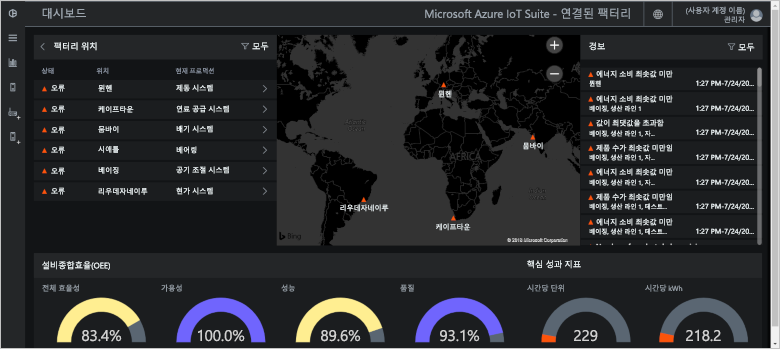

# Azure IoT 솔루션 가속기란?

일반적으로 클라우드 기반 IoT 솔루션은 사용자 지정 코드 및 클라우드 서비스를 사용하여 디바이스 연결, 데이터 처리와 분석 및 표시를 관리합니다.

IoT 솔루션 가속기는 일반적인 IoT 시나리오를 구현하는 완전하고 배포 준비가 완료된 IoT 솔루션입니다. 이러한 시나리오에는 원격 모니터링, 연결된 팩터리, 예측 유지 관리 및 디바이스 시뮬레이션이 포함됩니다. 솔루션 가속기를 배포할 때 배포에는 필수 응용 프로그램 코드와 함께 모든 필수 클라우드 기반 서비스가 포함됩니다.

솔루션 가속기는 고유한 IoT 솔루션에 대한 시작점입니다. 모든 솔루션 가속기의 소스 코드는 오픈 소스이며 GitHub에서 사용할 수 있습니다. 요구 사항에 맞게 솔루션 가속기를 다운로드하고 사용자 지정하는 것이 좋습니다.

또한 처음부터 사용자 지정 IoT 솔루션을 빌드하기 전에 솔루션 가속기를 학습 도구로 사용할 수 있습니다. 솔루션 가속기는 수행할 클라우드 기반 IoT 솔루션에 대해 검증된 사례를 구현합니다.

각 솔루션 가속기의 애플리케이션 코드에는 솔루션 가속기를 관리할 수 있는 웹앱이 포함되어 있습니다.

## 지원되는 IoT 시나리오

현재 네 가지 솔루션 가속기를 배포에 사용할 수 있습니다.

### 원격 모니터링

이 솔루션 가속기를 사용하여 원격 디바이스에서 원격 분석을 수집하고 제어합니다. 예제 디바이스에는 고객의 온-프레미스에 설치된 시스템 또는 원격 펌프 스테이션에 설치된 밸브를 냉각하는 작업이 포함됩니다.

원격 모니터링 대시보드를 사용하여 연결된 디바이스의 원격 분석을 보고, 새 디바이스를 프로비전하고, 연결된 디바이스에서 펌웨어를 업그레이드할 수 있습니다.

### 연결된 팩터리

이 솔루션 가속기를 사용하여 [OPC 통합 아키텍처](https://opcfoundation.org/about/opc-technologies/opc-ua/) 인터페이스를 사용하여 산업 자산의 원격 분석을 수집하고 제어합니다. 산업 자산에는 공장 생산 라인에서 어셈블리 및 테스트 스테이션이 포함될 수 있습니다.

연결된 팩터리 대시보드를 사용하여 산업용 디바이스를 모니터링하고 관리할 수 있습니다.

### 예측 유지 관리

이 솔루션 가속기를 사용하여 원격 디바이스가 실패한다고 예측되는 시기를 예측합니다. 따라서 디바이스에 오류가 발생하기 전에 유지 관리를 수행할 수 있습니다. 이 솔루션 가속기는 기계 학습 알고리즘을 사용하여 디바이스 원격 분석에서 오류를 예측합니다. 예제 디바이스는 항공기 엔진 또는 엘리베이터일 수 있습니다.

예측 유지 관리 대시보드를 사용하여 예측 유지 관리 분석을 볼 수 있습니다.

### 디바이스 시뮬레이션

이 솔루션 가속기를 사용하여 사실적 원격 분석을 생성하는 시뮬레이션된 디바이스를 실행합니다. 이 솔루션 가속기를 사용하여 다른 솔루션 가속기의 동작을 테스트하거나 고유한 사용자 지정 IoT 솔루션을 테스트할 수 있습니다.

디바이스 시뮬레이션 웹앱을 사용하여 시뮬레이션을 구성하고 실행할 수 있습니다.

## 디자인 원칙

모든 솔루션 가속기는 동일한 디자인 원칙 및 목표를 수행합니다. 다음과 같이 설계되었습니다.

* **확장 가능**, 수백만 개의 연결된 장치를 연결하고 관리할 수 있습니다.
* **확장 가능**, 요구 사항에 맞게 사용자 지정할 수 있습니다.
* **포괄 가능**, 작동 방식 및 구현되는 방법을 이해할 수 있습니다.
* **모듈식**, 대안에 대한 서비스를 교환할 수 있습니다.
* **보안**, 기본 제공 연결 및 장치 보안 기능을 사용하여 Azure 보안을 결합합니다.

## 아키텍처 및 언어

원래 솔루션 가속기는 MVC(모델-뷰-컨트롤러) 아키텍처를 사용하는 .NET을 사용하여 작성되었습니다. Microsoft는 솔루션 가속기를 새로운 마이크로 서비스 아키텍처로 업데이트하고 있습니다. 다음 표에서는 GitHub 리포지토리에 대한 링크를 사용하여 솔루션 가속기의 현재 상태를 보여줍니다.

| 솔루션 가속기   | 아키텍처  | 언어     |
| ---------------------- | ------------- | ------------- |
| 원격 모니터링      | 마이크로 서비스 | [Java](https://github.com/Azure/azure-iot-pcs-remote-monitoring-java) 및 [.NET](https://github.com/Azure/azure-iot-pcs-remote-monitoring-dotnet) |
| 예측 유지 관리 | MVC           | [.NET](https://github.com/Azure/azure-iot-predictive-maintenance)          |
| 연결된 팩터리      | MVC           | [.NET](https://github.com/Azure/azure-iot-connected-factory)          |
| 디바이스 시뮬레이션      | 마이크로 서비스 | [.NET](https://github.com/Azure/device-simulation-dotnet)          |

마이크로 서비스 아키텍처에 대한 자세한 내용은 [.NET 애플리케이션 아키텍처](https://www.microsoft.com/net/learn/architecture) 및 [마이크로 서비스: 클라우드에서 제공하는 애플리케이션 혁명](https://azure.microsoft.com/blog/microservices-an-application-revolution-powered-by-the-cloud/)을 참조하세요.

## 배포 옵션

[Microsoft Azure IoT 솔루션 가속기](https://www.azureiotsolutions.com/Accelerators#) 사이트에서 또는 명령줄을 사용하여 솔루션 가속기를 배포할 수 있습니다.

원격 모니터링 솔루션 가속기를 다음 구성으로 배포할 수 있습니다.

* **Standard:** 프로덕션 배포를 개발할 수 있도록 확장된 인프라 배포입니다. Azure Container Service는 마이크로 서비스를 여러 개의 Azure 가상 머신에 배포합니다. Kubernetes는 개별 마이크로 서비스를 호스팅하는 Docker 컨테이너를 오케스트레이션합니다.
* **Basic:** 데모 또는 배포 테스트에 대한 비용을 절약할 수 있는 버전입니다. 모든 마이크로 서비스가 단일 Azure 가상 머신에 배포됩니다.
* **로컬:** 테스트 및 개발을 위한 로컬 컴퓨터 배포입니다. 이 방법은 마이크로 서비스를 로컬 Docker 컨테이너에 배포하고, 클라우드의 IoT Hub, Azure Cosmos DB 및 Azure Storage 서비스에 연결합니다.

솔루션 가속기를 실행하는 비용은 조합된 [기본 Azure 서비스 실행 비용](https://azure.microsoft.com/pricing)입니다. 배포 옵션을 선택할 때 사용되는 Azure 서비스의 세부 정보가 표시됩니다.

## 다음 단계

IoT 솔루션 가속기 중 하나를 사용해 보려면 다음 빠른 시작을 확인하세요.

* [원격 모니터링 솔루션 사용](quickstart-remote-monitoring-deploy.md)
* [연결된 팩터리 솔루션 사용](quickstart-connected-factory-deploy.md)
* [예측 유지 관리 솔루션 사용](quickstart-predictive-maintenance-deploy.md)
* [장치 시뮬레이션 솔루션 사용](quickstart-device-simulation-deploy.md)
