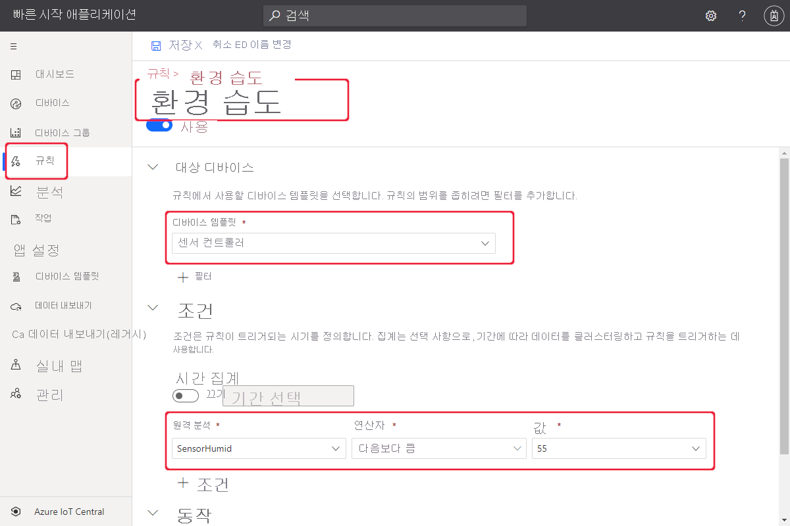
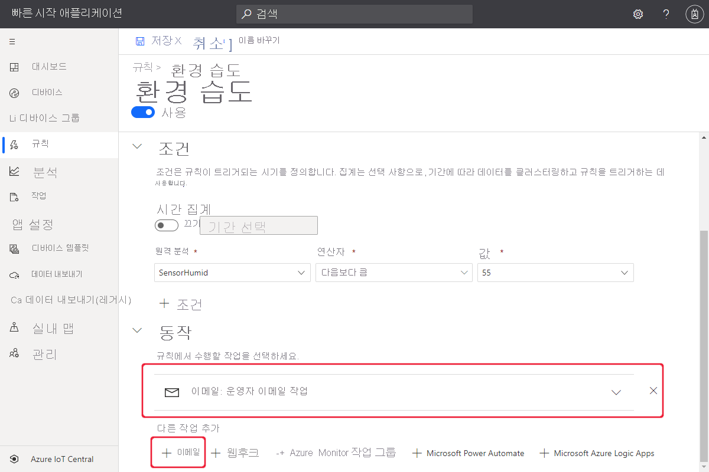

# 빠른 시작: Azure IoT Central에서 디바이스에 대한 규칙 및 작업 구성

*이 문서는 운영자, 빌더 및 관리자에게 적용됩니다.*

이 빠른 시작에서는 환경 센서가 보고한 온도가 90&deg; F를 초과하는 경우 이메일을 보내는 규칙을 만듭니다.

## 사전 요구 사항

시작하기 전에 두 가지 이전 빠른 시작인 [Azure IoT Central 애플리케이션 만들기](./quick-deploy-iot-central.md) 및 [IoT Central 애플리케이션에 시뮬레이션된 디바이스 추가](./quick-create-pnp-device.md)를 완료하여 작업할 **MXChip IoT DevKit** 디바이스 템플릿을 만들어야 합니다.

## 원격 분석 기반 규칙 만들기

1. 애플리케이션에 새 원격 분석 기반 규칙을 추가하려면 왼쪽 창에서 **규칙**을 선택합니다.

1. 새 규칙을 만들려면 **+** 을 선택합니다.

1. **환경 온도**를 규칙 이름으로 입력합니다.

1. **대상 디바이스** 섹션에서 **MXChip IoT DevKit**를 디바이스 템플릿으로 선택합니다. 이 옵션은 디바이스 템플릿 유형별로 규칙이 적용되는 디바이스를 필터링합니다. **+ 필터**를 선택하여 더 많은 필터 조건을 추가할 수 있습니다.

1. **조건** 섹션에서 규칙을 트리거하는 항목을 정의합니다. 다음 정보를 사용하여 온도 원격 분석을 기반으로 하는 조건을 정의합니다.

    | 필드        | 값            |
    | ------------ | ---------------- |
    | 측정  | 온도      |
    | 연산자     | 다음보다 큼  |
    | 값        | 90               |

    조건을 더 추가하려면 **+ 조건**을 선택합니다.

    

1. 규칙이 트리거될 때 실행할 메일 작업을 추가하려면 **+메일**을 선택합니다.

1. 다음 표의 정보를 사용하여 작업을 정의한 다음, **완료**를 선택합니다.

    | 설정   | 값                                             |
    | --------- | ------------------------------------------------- |
    | 표시 이름 | 운영자 메일 작업                          |
    | 수행할 작업        | 이메일 주소                                |
    | 메모     | 환경 온도가 임계값을 초과했습니다. |

    > [!NOTE]
    > 이메일 알림을 받으려면 이메일 주소가 [애플리케이션의 사용자 ID](howto-administer.md)여야 하며, 사용자는 최소 한 번 이상 애플리케이션에 로그인했어야 합니다.

    

1. **저장**을 선택합니다. **규칙** 페이지에 규칙이 나열됩니다.

## 규칙 테스트

규칙은 저장 한 직후 발효됩니다. 규칙에서 정의된 조건이 충족되면 애플리케이션은 작업에서 지정된 이메일 주소로 메시지를 보냅니다.

> [!NOTE]
> 테스트를 완료한 후에는 받은 편지함에 경고가 수신되지 않도록 규칙을 해제합니다.

## 다음 단계

이 빠른 시작에서는 다음을 수행하는 방법을 알아보았습니다.

* 원격 분석 기반 규칙 만들기
* 작업 추가

애플리케이션에 연결된 디바이스를 모니터링하는 방법에 대해 자세히 알아보려면 빠른 시작을 계속 진행합니다.

> [!div class="nextstepaction"]
> [Azure IoT Central을 사용하여 디바이스를 모니터링](quick-monitor-devices.md)합니다.
