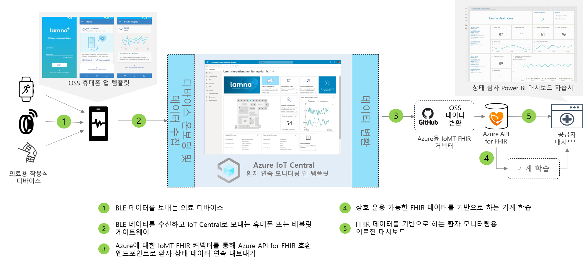

# 환자 연속 모니터링 아키텍처

지속적인 환자 모니터링 솔루션은 제공된 앱 템플릿을 사용하고 아래에서 설명하는 아키텍처를 지침으로 사용하여 빌드할 수 있습니다.

>[!div class="mx-imgBorder"] 
>

1. BLE(Bluetooth 저에너지)를 사용하여 통신하는 의료 디바이스
1. BLE 데이터를 수신하고 IoT Central로 보내는 휴대폰 게이트웨이
1. Azure API for FHIR로 지속적인 환자 의료 데이터 내보내기&reg;
1. 상호 운용 가능한 데이터를 기반으로 하는 기계 학습
1. FHIR 데이터를 기반으로 하는 의료진 대시보드

## 세부 정보
이 섹션에서는 아키텍처 다이어그램의 각 부분을 자세히 설명합니다.

### BLE 의료 디바이스
의료 IoT 공간에 사용되는 많은 의료 착용식 장치는 Bluetooth 저 에너지 디바이스입니다. 클라우드로 직접 말할 수 없으며 게이트웨이를 통해 전달해야 합니다. 이 아키텍처에서는 휴대폰 애플리케이션을 이 게이트웨이로 사용하는 것을 제안합니다. 

### 휴대폰 게이트웨이
휴대폰 애플리케이션의 기본 기능은 의료 디바이스에서 BLE 데이터를 수집하여 Azure IoT Central에 전달하는 것입니다. 또한 앱은 디바이스 설정 및 프로비저닝 흐름을 통해 환자를 안내하고, 환자들이 자신의 개인 의료 데이터를 볼 수 있도록 표시하는 데 유용합니다. 다른 솔루션은 동일한 통신 흐름을 달성할 수 있도록 병실 내부에 있는 경우 태블릿 게이트웨이 또는 정적 게이트웨이를 사용할 수 있습니다. Android 및 iOS에서 사용할 수 있는 오픈 소스 샘플 모바일 애플리케이션을 만들어 애플리케이션 개발 작업을 바로 시작하는 출발점으로 사용할 수 있습니다. IoT Central Continuous Patient Monitoring 모바일 앱 샘플에 대한 자세한 내용은 [Azure 샘플](https://docs.microsoft.com/samples/iot-for-all/iotc-cpm-sample/iotc-cpm-sample/)을 참조하세요.

### Azure API for FHIR에 배포&reg;
Azure IoT Central은 HIPAA 규격을 준수하고 HITRUST&reg; 인증을 받았지만, 환자 의료 관련 데이터를 Azure API for FHIR로 보낼 수도 있습니다. [Azure API for FHIR](../../healthcare-apis/overview.md)은 임상 의료 데이터를 위한 완전 관리형 표준 기반 규격 API로, 의료 데이터를 활용하여 새로운 참여 시스템을 만들 수 있습니다. FHIR API를 통해 신속한 데이터 교환을 지원하며, 클라우드에서 관리형 PaaS(Platform-as-a Service) 제품으로 지원됩니다. IoT Central의 연속 데이터 내보내기 기능을 사용하여 [FHIR용 Azure IoT 커넥터](https://docs.microsoft.com/azure/healthcare-apis/iot-fhir-portal-quickstart)를 통해 Azure API for FHIR에 데이터를 보낼 수 있습니다.

### 기계 학습
데이터를 집계하여 FHIR 형식으로 변환한 후, 인사이트를 보강하고 의료진이 더 현명한 결정을 내릴 수 있도록 기계 학습 모델을 구축할 수 있습니다. 기계 학습 모델을 빌드, 훈련 및 배포하는 데 사용할 수 있는 다양한 종류의 서비스가 있습니다. Azure의 기계 학습 제품을 사용하는 방법에 대한 자세한 내용은 [기계 학습 설명서](../../machine-learning/index.yml)를 참조하세요.

### 공급자 대시보드
Azure API for FHIR에 있는 데이터는 환자 인사이트 대시보드를 빌드하는 데 사용하거나 EMR에 직접 통합하여 의료진이 환자 상태를 시각화하는 데 도움을 줄 수 있습니다. 의료진은 이 대시보드를 사용하여 도움이 필요한 환자를 돌보고 악화 징후를 조기에 발견할 수 있습니다. Power BI 실시간 공급자 대시보드를 빌드하는 방법을 알아보려면 [방법 가이드](howto-health-data-triage.md)를 수행하세요.

## 다음 단계
* [지속적인 환자 모니터링 애플리케이션 템플릿 배포 방법 알아보기](tutorial-continuous-patient-monitoring.md)