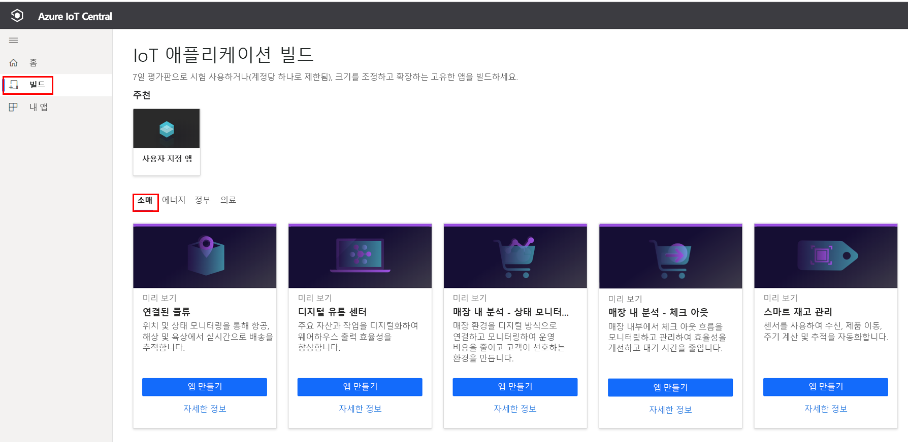

# 자습서: 커넥티드 물류 애플리케이션 템플릿 배포 및 살펴보기

이 자습서에서는 IoT Central *커넥티드 물류* 애플리케이션 템플릿을 시작하는 방법을 보여 줍니다. 템플릿을 배포하고 사용하는 방법에 대해 알아봅니다.

이 자습서에서는 다음 작업 방법을 알아봅니다.

> [!div class="checklist"]
> * 연결된 물류 애플리케이션을 만듭니다.
> * 애플리케이션의 주요 기능을 사용합니다.
> * 대시보드를 사용하여 중요한 물류 디바이스 작업 활동을 표시합니다.
> * 디바이스 템플릿 사용
> * 규칙 따르기
> * 작업 사용

## 사전 요구 사항

* 이 앱을 배포하는 데 필요한 특정 필수 구성 요소가 없습니다.
* 무료 가격 책정 요금제를 사용하거나 Azure 구독을 사용할 수 있습니다.

## 커넥티드 물류 애플리케이션 만들기

다음 단계를 사용하여 애플리케이션을 만듭니다.

1. [Azure IoT Central 빌드](https://aka.ms/iotcentral) 사이트로 이동합니다. 그런 다음, Microsoft 개인, 회사 또는 학교 계정으로 로그인합니다. 왼쪽 탐색 모음에서 **빌드** 를 선택한 다음, **소매** 탭을 선택합니다.

    :::image type="content" source="media/tutorial-iot-central-connected-logistics/iotc-retail-homepage.png" alt-text="연결된 물류 템플릿":::

1. **커넥티드 물류 애플리케이션** 에서 **앱 만들기** 를 선택합니다.

1. **앱 만들기** 에서 **새 애플리케이션** 양식이 열립니다. 다음 세부 정보를 입력합니다.

    * **애플리케이션 이름**: 제안된 기본 이름을 사용하거나 친숙한 애플리케이션 이름을 입력할 수 있습니다.
    * **URL**: 제안된 기본 URL을 사용하거나 기억하기 쉬운 고유한 URL을 입력할 수 있습니다. 다음으로, Azure 구독이 이미 있는 경우 기본 설정이 권장됩니다. 7일 무료 평가판 가격 책정 플랜으로 시작하여 평가판이 만료되기 전에 언제든지 표준 가격 책정 플랜으로 전환할 수 있습니다.
    * **청구 정보**: 리소스를 프로비저닝하려면 디렉터리, Azure 구독 및 지역 세부 정보가 필요합니다.
    * **만들기**: 페이지 맨 아래에서 만들기를 선택하여 애플리케이션을 배포합니다.

    :::image type="content" source="media/tutorial-iot-central-connected-logistics/connected-logistics-app-create.png" alt-text="연결된 물류 앱 템플릿":::

    :::image type="content" source="media/tutorial-iot-central-connected-logistics/connected-logistics-app-create-billinginfo.png" alt-text="연결된 물류 청구 정보":::

## 애플리케이션 살펴보기

다음은 연결된 물류 애플리케이션 템플릿을 선택하는 방법을 보여 주는 스크린샷입니다.

> [!div class="mx-imgBorder"]
> 

다음 섹션에서는 애플리케이션의 주요 기능을 안내합니다.

### 대시보드

애플리케이션 템플릿을 배포하면 기본 대시보드는 커넥티드 물류 운영자 중심 포털이 됩니다. Northwind Trader는 해상이나 육지에서 화물 차량을 관리하는 가상 물류 공급자입니다. 이 대시보드에서는 관련된 명령, 직무 및 작업과 함께 배송의 원격 분석을 제공하는 두 개의 다른 게이트웨이를 볼 수 있습니다.

> [!div class="mx-imgBorder"]
> 

> [!div class="mx-imgBorder"]
> 

이 대시보드는 중요한 물류 디바이스 작업 활동을 보여 주기 위해 미리 구성되어 있습니다.

대시보드는 서로 다른 두 게이트웨이 디바이스 관리 작업을 사용하도록 설정합니다.

* 트럭 배송에 대한 물류 경로 및 해상 배송의 위치 세부 정보를 확인합니다.
* 게이트웨이 상태 및 기타 관련 정보를 확인합니다.

:::image type="content" source="media/tutorial-iot-central-connected-logistics/connected-logistics-dashboard1.png" alt-text="연결된 물류 대시보드":::

* 게이트웨이, 활성 및 알 수 없는 태그의 총 수를 추적할 수 있습니다.
* 펌웨어 업데이트, 센서 사용 안 함, 센서 사용, 센서 임계값 업데이트, 원격 분석 간격 업데이트, 디바이스 서비스 계약 업데이트 등의 디바이스 관리 작업을 수행할 수 있습니다.
* 디바이스 배터리 사용량을 확인합니다.

:::image type="content" source="media/tutorial-iot-central-connected-logistics/connected-logistics-dashboard2.png" alt-text="연결된 물류 대시보드 상태":::

#### 디바이스 템플릿

**디바이스 템플릿** 을 선택하여 게이트웨이 기능 모델을 확인합니다. 기능 모델은 **게이트웨이 원격 분석 및 속성** 및 **게이트웨이 명령** 인터페이스를 통해 구성됩니다.

**게이트웨이 원격 분석 및 속성** - 이 인터페이스는 센서, 위치 및 디바이스 정보와 관련된 모든 원격 분석을 정의합니다. 또한 이 인터페이스는 센서 임계값 및 업데이트 간격과 같은 디바이스 쌍 속성 기능을 정의합니다.

:::image type="content" source="media/tutorial-iot-central-connected-logistics/connected-logistics-devicetemplate1.png" alt-text="원격 분석 및 속성 인터페이스":::

**게이트웨이 명령** - 이 인터페이스는 모든 게이트웨이 명령 기능을 구성합니다.

:::image type="content" source="media/tutorial-iot-central-connected-logistics/connected-logistics-devicetemplate2.png" alt-text="게이트웨이 명령 인터페이스":::

### 규칙

이 애플리케이션 템플릿의 규칙에 대한 **규칙** 탭을 선택합니다. 이러한 규칙은 추가 조사를 위해 운영자에게 이메일 알림을 보내도록 구성됩니다.

**게이트웨이 도난 경고**: 이 규칙은 진행 중에 센서가 예기치 않은 광원을 감지할 때 트리거됩니다. 잠재적 도난을 조사할 수 있도록 운영자에게 즉시 알림을 제공해야 합니다.

**응답하지 않는 게이트웨이**: 이 규칙은 게이트웨이가 장기간 클라우드에 보고하지 않는 경우에 트리거됩니다. 배터리 부족, 연결 손실 또는 디바이스 손상으로 인해 게이트웨이가 응답하지 않을 수 있습니다.

:::image type="content" source="media/tutorial-iot-central-connected-logistics/connected-logistics-rules.png" alt-text="규칙 정의":::

### 작업

**작업** 탭을 선택하여 이 애플리케이션의 작업을 표시합니다.

:::image type="content" source="media/tutorial-iot-central-connected-logistics/connected-logistics-jobs.png" alt-text="실행할 작업":::

작업을 사용하여 애플리케이션 전체 작업을 수행할 수 있습니다. 이 애플리케이션의 작업은 디바이스 명령 및 쌍 기능을 사용하여 모든 게이트웨이에서 특정 센서를 사용하지 않도록 설정하거나 배송 모드 및 경로에 따라 센서 임계값을 수정하는 등의 작업을 수행합니다.

* 배터리를 절약하기 위해 해양 운송 동안 충격 센서를 사용하지 않도록 설정하거나 콜드 체인 운송 동안 온도 임계값을 줄이는 것이 표준 작업입니다.

* 작업을 사용하여 게이트웨이의 펌웨어 업데이트 또는 서비스 계약을 업데이트하여 유지 관리 작업을 최신 상태로 유지하는 등의 시스템 차원의 작업을 수행할 수 있습니다.

## 리소스 정리

이 애플리케이션을 계속 사용하지 않으려면 **관리** > **애플리케이션 설정** 을 방문하여 애플리케이션 템플릿을 삭제하고 **삭제** 를 선택합니다.

:::image type="content" source="media/tutorial-iot-central-connected-logistics/connected-logistics-cleanup.png" alt-text="템플릿 정리":::

## 다음 단계

 추가 정보:

> [!div class="nextstepaction"]
> [연결된 물류 개념](./architecture-connected-logistics.md)
