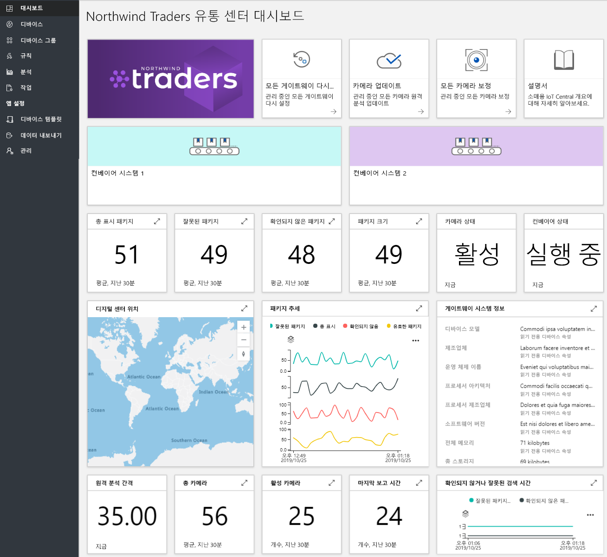
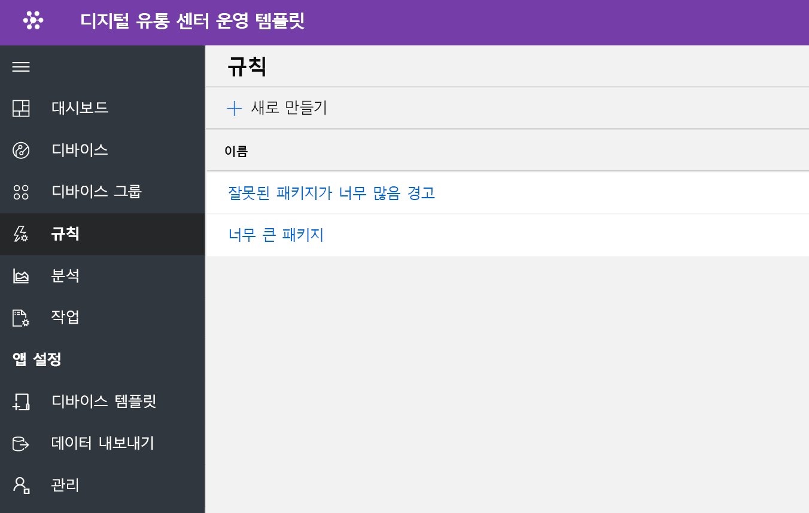
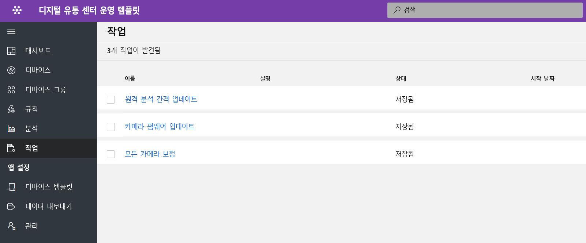

# 자습서: 디지털 배포 센터 애플리케이션 템플릿 배포 및 살펴보기

이 자습서에서는 IoT Central **디지털 배포 센터** 애플리케이션 템플릿을 배포하여 시작하는 방법을 보여 줍니다. 템플릿을 배포하는 방법, 기본적으로 제공되는 항목 및 다음에 수행할 수 있는 작업을 알아봅니다.

이 자습서에서는 다음 방법에 대해 알아봅니다. 

> [!div class="checklist"]
> * 디지털 배포 센터 애플리케이션 만들기 
> * 애플리케이션 살펴보기 

## 사전 요구 사항
* 이 앱을 배포하는 데 필요한 특정 필수 구성 요소가 없습니다.
* Azure 구독이 있는 것이 좋지만, 없더라도 시도해 볼 수 있습니다.

## 디지털 배포 센터 애플리케이션 만들기 탬플릿

다음 단계를 사용하여 애플리케이션을 만들 수 있습니다.

1. Azure IoT Central 애플리케이션 관리자 웹 사이트로 이동합니다. 왼쪽 탐색 모음에서 **빌드** 를 선택하고 **소매** 탭을 클릭합니다.

    :::image type="content" source="media/tutorial-iot-central-ddc/iotc-retail-homepage.png" alt-text="디지털 배포 센터 애플리케이션 탬플릿":::
1. **소매** 탭을 선택하고 **디지털 배포 센터 애플리케이션** 에서 **앱 만들기** 를 선택합니다.

1. **앱 만들기** 를 선택하면 아래와 같이 새 애플리케이션 양식이 열리고 요청된 세부 정보가 입력됩니다.
   **애플리케이션 이름**: 제안된 기본 이름을 사용하거나 친숙한 애플리케이션 이름을 입력할 수 있습니다.
   **URL**: 제안된 기본 URL을 사용하거나 기억하기 쉬운 고유한 URL을 입력할 수 있습니다. 다음으로, Azure 구독이 이미 있는 경우 기본 설정이 권장됩니다. 7일 무료 평가판 가격 책정 플랜으로 시작하여 평가판이 만료되기 전에 언제든지 표준 가격 책정 플랜으로 전환할 수 있습니다.
   **청구 정보**: 리소스를 프로비저닝하려면 디렉터리, Azure 구독 및 지역 세부 정보가 필요합니다.
   **만들기**: 페이지 맨 아래에서 만들기를 선택하여 애플리케이션을 배포합니다.

   :::image type="content" source="media/tutorial-iot-central-ddc/ddc-create.png" alt-text="디지털 유통 센터 애플리케이션 템플릿에서 앱을 만드는 방법을 보여주는 스크린샷":::

   :::image type="content" source="media/tutorial-iot-central-ddc/ddc-create-billinginfo.png" alt-text="애플리케이션을 만들 때 청구 옵션을 보여주는 스크린샷":::

## 애플리케이션 대시보드 살펴보기 

앱 템플릿을 성공적으로 배포하면 기본 대시보드는 배포 센터 운영자 중심 포털이 됩니다. Northwind Trader는 컨베이어 시스템을 관리하는 가상의 배포 센터 솔루션 공급자입니다. 

이 대시보드에는 IoT 디바이스 역할을 하는 하나의 게이트웨이와 하나의 카메라가 표시됩니다. 게이트웨이는 연결된 디바이스 쌍 속성과 함께 유효함, 유효하지 않음, 미확인, 크기 등의 패키지에 대한 원격 분석을 제공합니다. 모든 다운스트림 명령은 IoT 디바이스(예: 카메라)에서 실행됩니다. 이 대시보드는 중요한 배포 센터 디바이스 작업 활동을 보여 주기 위해 미리 구성되어 있습니다.

대시보드는 Azure IoT 게이트웨이 및 IoT 디바이스의 디바이스 관리 기능을 표시하도록 논리적으로 구성되어 있습니다.  
   * 게이트웨이 명령 및 제어 작업을 수행할 수 있습니다.
   * 솔루션에 포함된 모든 카메라를 관리합니다. 

> [!div class="mx-imgBorder"]
> 

## 디바이스 템플릿

디바이스 템플릿 탭을 클릭하면 게이트웨이 기능 모델이 표시됩니다. 기능 모델은 **카메라** 및 **디지털 배포 게이트웨이** 의 두 가지 다른 인터페이스로 구성됩니다.

> [!div class="mx-imgBorder"]
> 

**카메라** - 이 인터페이스는 모든 카메라 관련 명령 기능을 구성합니다. 

> [!div class="mx-imgBorder"]
> 

**디지털 배포 게이트웨이** - 이 인터페이스는 카메라, 클라우드 정의 디바이스 쌍 속성 및 게이트웨이 정보에서 들어오는 모든 원격 분석을 나타냅니다.

> [!div class="mx-imgBorder"]
> 

## 게이트웨이 명령
이 인터페이스는 모든 게이트웨이 명령 기능을 구성합니다.

> [!div class="mx-imgBorder"]
> 

## 규칙
규칙 탭을 선택하여 이 애플리케이션 템플릿에 존재하는 두 가지 다른 규칙을 표시합니다. 이러한 규칙은 추가 조사를 위해 운영자에게 메일 알림을 보내도록 구성됩니다.

 **잘못된 패키지가 너무 많음 경고** - 카메라에서 컨베이어 시스템을 통해 전달되는 많은 수의 잘못된 패키지를 감지하는 경우 이 규칙이 트리거됩니다.
 
**대규모 패키지** - 카메라에서 품질을 검사할 수 없는 방대한 패키지를 감지하는 경우 이 규칙이 트리거됩니다. 

> [!div class="mx-imgBorder"]
> 

## 작업
작업 탭을 선택하여 이 애플리케이션 템플릿의 일부로 존재하는 5개의 다른 작업을 표시합니다. 작업 기능을 활용하여 솔루션 전체 작업을 수행할 수 있습니다. 여기에서 디지털 배포 센터 작업은 디바이스 명령 및 쌍 기능을 사용하여 다음과 같은 작업을 수행합니다.
   * 패키지 감지를 시작하기 전에 카메라 보정 
   * 정기적으로 카메라 펌웨어 업데이트
   * 데이터 업로드를 관리하는 원격 분석 간격 수정

> [!div class="mx-imgBorder"]
> 

## 리소스 정리
이 애플리케이션을 계속 사용하지 않으려면 **관리** > **애플리케이션 설정** 을 방문하여 애플리케이션 템플릿을 삭제하고 **삭제** 를 클릭합니다.

> [!div class="mx-imgBorder"]
> 

## 다음 단계

디지털 유통 센터 솔루션 아키텍처에 대해 자세히 알아봅니다.

> [!div class="nextstepaction"]
> [디지털 유통 센터 개념](./architecture-digital-distribution-center.md)
