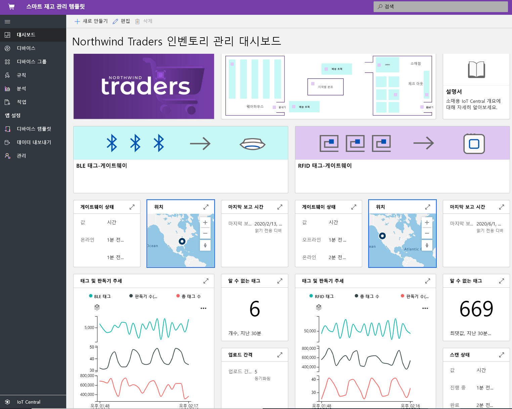
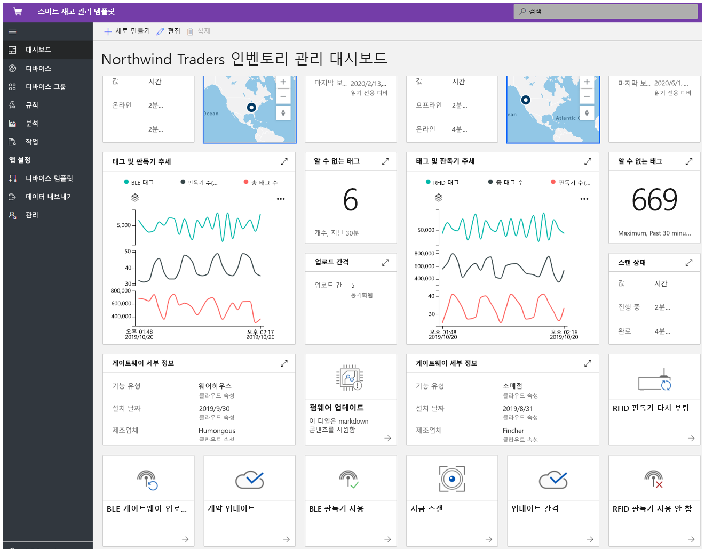
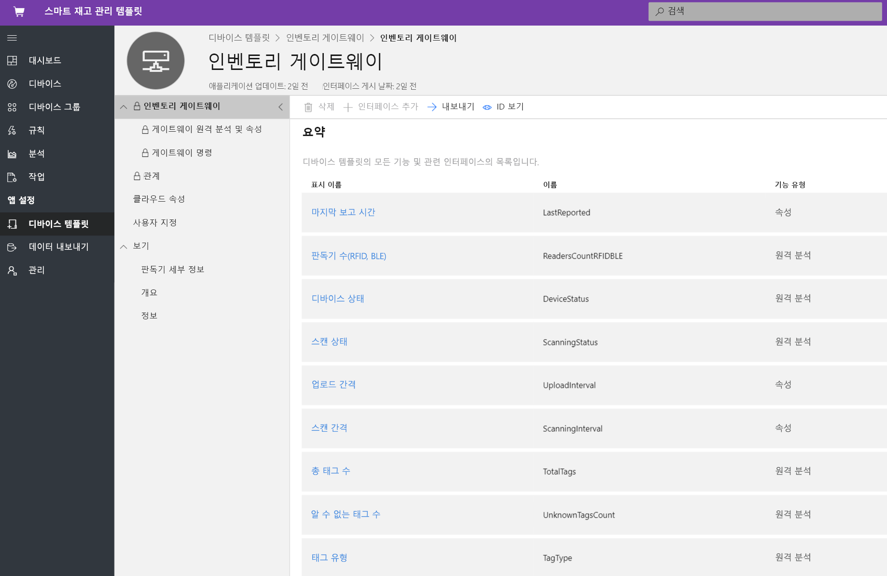
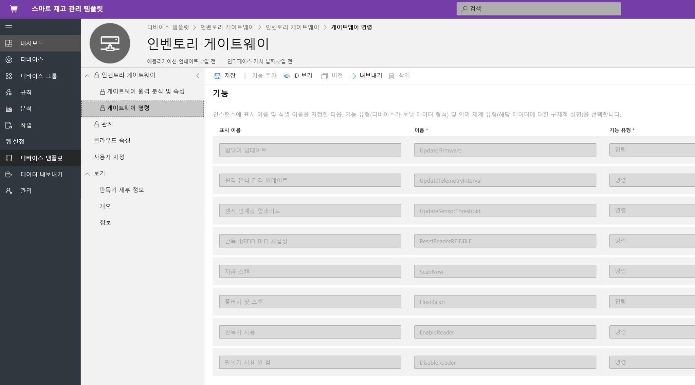
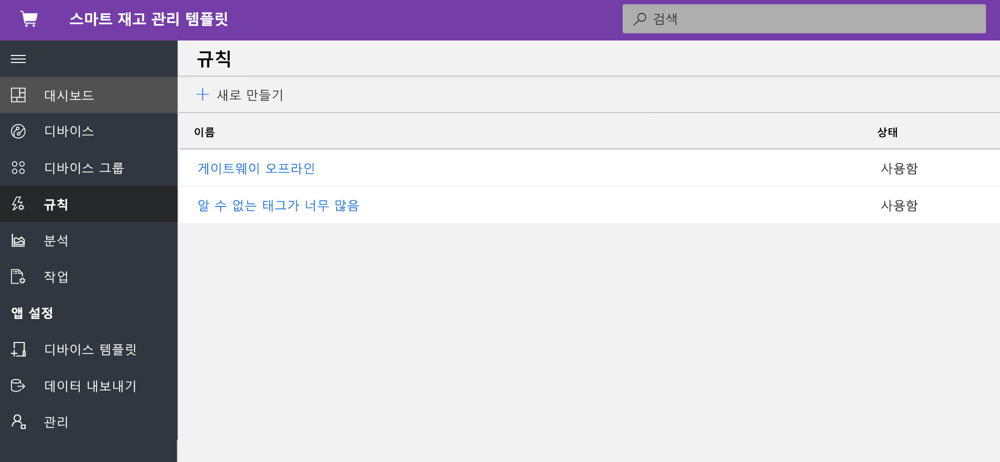
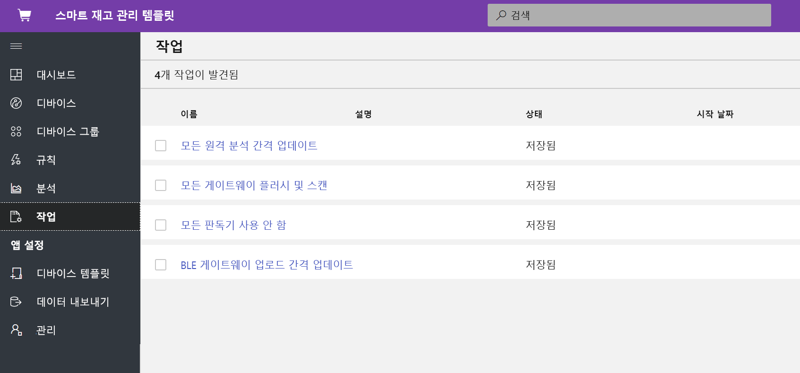

# 자습서: 스마트 재고 관리 애플리케이션 템플릿 배포 및 살펴보기

이 자습서에서는 IoT Central **스마트 재고 관리** 애플리케이션 템플릿을 배포하여 시작하는 방법을 보여 줍니다. 템플릿을 배포하는 방법, 기본적으로 제공되는 항목 및 다음에 수행할 수 있는 작업을 알아봅니다.

이 자습서에서는 다음 방법에 대해 알아봅니다.

> [!div class="checklist"]
> 스마트 재고 관리 애플리케이션 만들기 애플리케이션 살펴보기 

## 사전 요구 사항

* 이 앱을 배포하는 데 필요한 특정 필수 구성 요소가 없습니다.
* Azure 구독이 있는 것이 좋지만, 없더라도 시도해 볼 수 있습니다.

## 스마트 재고 관리 애플리케이션 만들기 템플릿

다음 단계를 사용하여 애플리케이션을 만들 수 있습니다.

1. Azure IoT Central 애플리케이션 관리자 웹 사이트로 이동합니다. 왼쪽 탐색 모음에서 **빌드** 를 선택하고 **소매** 탭을 클릭합니다.

    :::image type="content" source="media/tutorial-iot-central-smart-inventory-management/iotc_retail_homepage.png" alt-text="스마트 재고 관리 애플리케이션 템플릿을 선택하는 방법을 보여주는 스크린샷":::

2. **소매** 탭을 선택하고 **스마트 재고 관리** 에서 **앱 만들기** 를 선택합니다.

3. **앱 만들기** 를 선택하면 아래와 같이 새 애플리케이션 양식이 열리고 요청된 세부 정보가 입력됩니다.
    **애플리케이션 이름**: 제안된 기본 이름을 사용하거나 친숙한 애플리케이션 이름을 입력할 수 있습니다.
    **URL**: 제안된 기본 URL을 사용하거나 기억하기 쉬운 고유한 URL을 입력할 수 있습니다. 다음으로, Azure 구독이 이미 있는 경우 기본 설정이 권장됩니다. 7일 무료 평가판 가격 책정 플랜으로 시작하여 평가판이 만료되기 전에 언제든지 표준 가격 책정 플랜으로 전환할 수 있습니다.
    **청구 정보**: 리소스를 프로비저닝하려면 디렉터리, Azure 구독 및 지역 세부 정보가 필요합니다.
    **만들기**: 페이지 맨 아래에서 만들기를 선택하여 애플리케이션을 배포합니다.

    :::image type="content" source="media/tutorial-iot-central-smart-inventory-management/smart_inventory_management_app_create.png" alt-text="스마트 재고 관리 애플리케이션 템플릿에서 앱을 만드는 방법을 보여주는 스크린샷":::

    :::image type="content" source="media/tutorial-iot-central-smart-inventory-management/smart-inventory-management-app-create-billinginfo.png" alt-text="애플리케이션을 만들 때 청구 옵션을 보여주는 스크린샷":::

## 애플리케이션 살펴보기 

### 대시보드 

앱 템플릿을 성공적으로 배포하면 기본 대시보드는 스마트 재고 관리 운영자 중심 포털이 됩니다. Northwind Trader는 BLE(블루투스 저에너지) 및 RFID(전파 식별)를 사용하여 도매점을 관리하는 가상의 스마트 재고 공급자입니다. 이 대시보드에서는 관련된 명령, 직무 및 수행할 수 있는 작업과 함께 재고에 대한 원격 분석을 제공하는 두 개의 다른 게이트웨이를 볼 수 있습니다. 이 대시보드는 중요한 스마트 재고 관리 디바이스 작업 활동을 보여 주기 위해 미리 구성되어 있습니다.
대시보드는 서로 다른 두 게이트웨이 디바이스 관리 작업 사이에서 논리적으로 분할됩니다. 
   * 도매점에서는 더 큰 시설에서 재고를 추적하기 위해 화물 운반대에 고정된 BLE 게이트웨이 및 BLE 태그를 배치합니다.
   * 소매점에서는 추적할 항목 수준에서 개별적으로 고정 RFID 게이트웨이 및 RFID 태그를 배치하여 소매 아울렛의 재고를 추적합니다.
   * 게이트웨이 위치, 상태 및 관련 세부 정보 보기 

> [!div class="mx-imgBorder"]
> 

   * 게이트웨이, 활성 및 알 수 없는 태그의 총 수를 쉽게 추적할 수 있습니다.
   * 펌웨어 업데이트, 센서 사용 안 함, 센서 임계값 업데이트, 원격 분석 간격 업데이트, 디바이스 서비스 계약 업데이트 등의 디바이스 관리 작업을 수행할 수 있습니다.
   * 게이트웨이 디바이스는 전체 또는 증분 검색을 통해 주문형 인벤토리 관리를 수행할 수 있습니다.

> [!div class="mx-imgBorder"]
> 

## 디바이스 템플릿
디바이스 템플릿 탭을 클릭하면 게이트웨이 기능 모델이 표시됩니다. 기능 모델은 두 개의 다른 인터페이스인 **게이트웨이 원격 분석 및 속성** 및 **게이트웨이 명령** 을 통해 구성됩니다.

**게이트웨이 원격 분석 및 속성** - 이 인터페이스는 게이트웨이 임계값 및 업데이트 간격과 같은 센서, 위치, 디바이스 정보 및 디바이스 쌍 속성 기능과 관련된 모든 원격 분석을 나타냅니다.

> [!div class="mx-imgBorder"]
> 

**게이트웨이 명령** - 이 인터페이스는 모든 게이트웨이 명령 기능을 구성합니다.

> [!div class="mx-imgBorder"]
> 

## 규칙
규칙 탭을 선택하여 이 애플리케이션 템플릿에 존재하는 두 가지 다른 규칙을 표시합니다. 이러한 규칙은 추가 조사를 위해 운영자에게 메일 알림을 보내도록 구성됩니다.

**게이트웨이 오프라인**: 이 규칙은 게이트웨이가 장기간 클라우드에 보고하지 않는 경우에 트리거됩니다. 배터리 부족 모드, 연결 손실, 디바이스 상태 때문에 게이트웨이가 응답하지 않을 수 있습니다.

**알 수 없는 태그**: 자산과 연결된 모든 RFID 및 BLE 태그를 추적하는 것이 중요합니다. 게이트웨이에서 알 수 없는 태그를 너무 많이 감지하는 경우 태그 소싱 애플리케이션에 동기화 문제가 있는 것을 나타냅니다.

> [!div class="mx-imgBorder"]
> 

## 작업
작업 탭을 선택하여 이 애플리케이션 템플릿의 일부로 존재하는 5개의 다른 작업을 표시합니다. 작업 기능을 사용하여 솔루션 전체 작업을 수행할 수 있습니다. 여기에서 재고 관리 작업은 디바이스 명령 및 쌍 기능을 사용하여 다음과 같은 작업을 수행합니다.
   * 모든 게이트웨이에서 판독기를 사용하지 않도록 설정
   * 원격 분석 임계값 수정 
   * 전체 솔루션에서 주문형 인벤토리 검색 수행

> [!div class="mx-imgBorder"]
> 

## 리소스 정리

이 애플리케이션을 계속 사용하지 않으려면 **관리** > **애플리케이션 설정** 을 방문하여 애플리케이션 템플릿을 삭제하고 **삭제** 를 클릭합니다.

> [!div class="mx-imgBorder"]
> 

## 다음 단계

스마트 재고 관리에 대해 자세히 알아보세요.

> [!div class="nextstepaction"]
> [스마트 재고 관리 개념](./architecture-smart-inventory-management.md)
