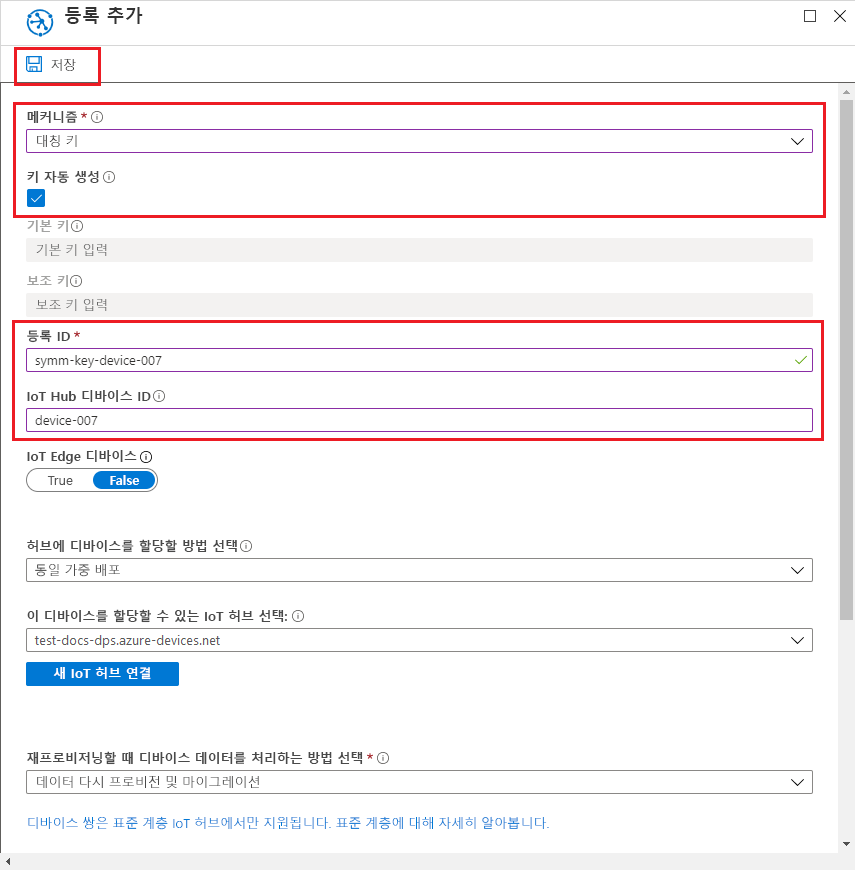
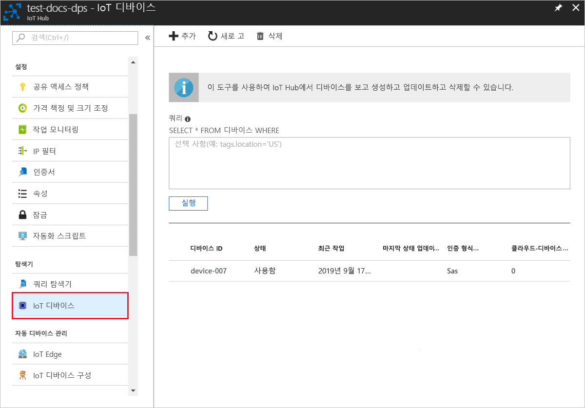

# <a name="quickstart-provision-a-simulated-device-with-symmetric-keys"></a>빠른 시작: 대칭 키를 사용하여 시뮬레이션된 디바이스 프로비전

이 빠른 시작에서는 Windows 개발 머신에서 디바이스 시뮬레이터를 만들고 실행하는 방법을 알아봅니다. 대칭 키를 사용하여 Device Provisioning Service 인스턴스로 인증하고 IoT 허브에 할당되도록 이 시뮬레이션된 디바이스를 구성합니다. [Azure IoT C SDK](https://github.com/Azure/azure-iot-sdk-c)의 샘플 코드는 프로비전을 시작하는 디바이스에 대한 부팅 시퀀스를 시뮬레이션하는 데 사용됩니다. 디바이스는 프로비전 서비스 인스턴스의 개별 등록을 기반으로 인식되고 IoT 허브에 할당됩니다.

이 문서에서는 개별 등록을 통한 프로비저닝을 보여주지만 등록 그룹을 사용할 수 있습니다. 등록 그룹을 사용할 때는 몇 가지 차이점이 있습니다. 예를 들어 디바이스에 대한 고유한 등록 ID가 있는 파생된 디바이스 키를 사용해야 합니다. 대칭 키 등록 그룹은 레거시 디바이스로 제한되지 않지만 [대칭 키 증명을 사용하여 레거시 디바이스를 프로비전하는 방법](how-to-legacy-device-symm-key.md)은 등록 그룹 예제를 제공합니다. 자세한 내용은 [대칭 키 증명에 대한 그룹 등록](concepts-symmetric-key-attestation.md#group-enrollments)을 참조하세요.

자동 프로비전 프로세스에 익숙하지 않은 경우 [자동 프로비전 개념](concepts-auto-provisioning.md)을 검토하세요. 

이 빠른 시작을 계속하기 전에 [Azure Portal에서 IoT Hub Device Provisioning Service 설정](./quick-setup-auto-provision.md)의 단계를 완료해야 합니다. 이 빠른 시작에서는 Device Provisioning Service 인스턴스를 이미 만들었어야 합니다.

이 문서는 Windows 기반 워크스테이션에 적용됩니다. 그러나 Linux에서 절차를 수행할 수 있습니다. Linux 예제는 [다중 테넌트를 지원하기 위해 장치를 프로비전하는 방법](how-to-provision-multitenant.md)을 참조하세요.


[!INCLUDE [quickstarts-free-trial-note](../../includes/quickstarts-free-trial-note.md)]


## <a name="prerequisites"></a>사전 요구 사항

다음 필수 구성 요소는 Windows 개발 환경을 위한 것입니다. Linux 또는 macOS의 경우 SDK 설명서에서 [개발 환경 준비](https://github.com/Azure/azure-iot-sdk-c/blob/master/doc/devbox_setup.md)의 해당 섹션을 참조하세요.

* ['C++를 사용한 데스크톱 개발'](https://docs.microsoft.com/cpp/?view=vs-2019#pivot=workloads) 워크로드를 사용하도록 설정된 [Visual Studio](https://visualstudio.microsoft.com/vs/) 2019. Visual Studio 2015와 Visual Studio 2017도 지원됩니다.

* 최신 버전의 [Git](https://git-scm.com/download/) 설치

<a id="setupdevbox"></a>

## <a name="prepare-an-azure-iot-c-sdk-development-environment"></a>Azure IoT C SDK 개발 환경 준비

이 섹션에서는 [Azure IoT C SDK](https://github.com/Azure/azure-iot-sdk-c)를 빌드하는 데 사용되는 개발 환경을 준비합니다. 

SDK에는 시뮬레이션된 디바이스의 샘플 코드가 포함되어 있습니다. 이 시뮬레이트된 디바이스는 디바이스의 부팅 시퀀스 중에 프로비저닝을 시도합니다.

1. [CMake 빌드 시스템](https://cmake.org/download/)을 다운로드합니다.

    `CMake` 설치를 시작하기 **전에** Visual Studio 필수 구성 요소(Visual Studio 및 'C++를 사용한 데스크톱 개발' 워크로드)를 머신에 설치해야 합니다. 필수 구성 요소가 설치되고 다운로드를 확인하면 CMake 빌드 시스템을 설치합니다.

    이전 버전의 CMake 빌드 시스템은 이 문서에 사용된 솔루션 파일을 생성하지 못합니다. 최신 버전의 CMake를 사용해야 합니다.

2. **태그**를 클릭하고 [Azure IoT C SDK의 릴리스 페이지](https://github.com/Azure/azure-iot-sdk-c/releases/latest)에서 최신 릴리스에 대한 태그 이름을 찾습니다.

3. 명령 프롬프트 또는 Git Bash 셸을 엽니다. 다음 명령을 실행하여 [Azure IoT C SDK](https://github.com/Azure/azure-iot-sdk-c) GitHub 리포지토리의 최신 릴리스를 복제합니다. 이전 단계에서 찾은 태그를 `-b` 매개 변수의 값으로 사용합니다.

    ```cmd/sh
    git clone -b <release-tag> https://github.com/Azure/azure-iot-sdk-c.git
    cd azure-iot-sdk-c
    git submodule update --init
    ```

    이 작업을 완료하는 데 몇 분 정도가 걸립니다.

4. Git 리포지토리의 루트 디렉터리에서 `cmake` 하위 디렉터리를 만들고 해당 폴더로 이동합니다. `azure-iot-sdk-c` 디렉터리에서 다음 명령을 실행합니다.

    ```cmd/sh
    mkdir cmake
    cd cmake
    ```

5. 개발 클라이언트 플랫폼에 관련된 SDK 버전을 빌드하는 다음 명령을 실행합니다. 또한 시뮬레이션된 디바이스에 대한 Visual Studio 솔루션이 `cmake` 디렉터리에서 생성됩니다. 

    ```cmd
    cmake -Dhsm_type_symm_key:BOOL=ON -Duse_prov_client:BOOL=ON  ..
    ```
    
    `cmake`에서 C++ 컴파일러를 찾지 못하면 위의 명령을 실행하는 동안 빌드 오류가 발생할 수 있습니다. 이 경우에는 [Visual Studio 명령 프롬프트](https://docs.microsoft.com/dotnet/framework/tools/developer-command-prompt-for-vs)에서 이 명령을 실행합니다. 

    빌드가 성공되면 마지막 몇몇 출력 줄은 다음 출력과 유사하게 표시됩니다.

    ```cmd/sh
    $ cmake -Dhsm_type_symm_key:BOOL=ON -Duse_prov_client:BOOL=ON  ..
    -- Building for: Visual Studio 15 2017
    -- Selecting Windows SDK version 10.0.16299.0 to target Windows 10.0.17134.
    -- The C compiler identification is MSVC 19.12.25835.0
    -- The CXX compiler identification is MSVC 19.12.25835.0

    ...

    -- Configuring done
    -- Generating done
    -- Build files have been written to: E:/IoT Testing/azure-iot-sdk-c/cmake
    ```

## <a name="create-a-device-enrollment-entry-in-the-portal"></a>포털에서 디바이스 등록 항목 만들기

1. [Azure Portal](https://portal.azure.com)에 로그인하여 왼쪽 메뉴에서 **모든 리소스** 단추를 선택하고 Device Provisioning 서비스를 엽니다.

2. **등록 관리** 탭을 선택한 다음, 위쪽에서 **개별 등록 추가** 단추를 선택합니다. 

3. **등록 추가** 패널에서 다음 정보를 입력하고 **저장** 단추를 누릅니다.

   - **메커니즘**: **대칭 키**를 ID 증명 *메커니즘*으로 선택합니다.

   - **키 자동 생성**: 이 확인란을 선택합니다.

   - **등록 ID**: 등록을 식별하는 등록 ID를 입력합니다. 소문자 영숫자 및 대시('-') 문자만을 사용합니다. 예를 들어 **symm-key-device-007**입니다.

   - **IoT Hub 디바이스 ID:** 디바이스 식별자를 입력합니다. 예: **device-007**

     

4. 등록을 저장하면 **기본 키** 및 **보조 키**가 생성되고 등록 항목에 추가됩니다. 대칭 키 디바이스 등록이 *개별 등록* 탭의 *등록 ID* 열에 **symm-key-device-007**로 표시됩니다. 

    등록을 열고 생성된 **기본 키**의 값을 복사합니다.


<a id="firstbootsequence"></a>

## <a name="simulate-first-boot-sequence-for-the-device"></a>디바이스에 대한 첫 번째 부팅 시퀀스 시뮬레이션

이 섹션에서는 디바이스의 부팅 시퀀스를 Device Provisioning Service 인스턴스에 보내도록 샘플 코드를 업데이트합니다. 이 부팅 시퀀스를 사용하면 디바이스가 인식되고 Device Provisioning Service 인스턴스에 연결된 IoT Hub에 할당됩니다.


1. Azure Portal에서 Device Provisioning 서비스에 대한 **개요** 탭을 선택하고 **_ID 범위_** 값을 기록해 둡니다.

     

2. Visual Studio에서 CMake를 실행하여 생성된 **azure_iot_sdks.sln** 솔루션 파일을 엽니다. 솔루션 파일은 다음 위치에 있습니다.

    ```
    \azure-iot-sdk-c\cmake\azure_iot_sdks.sln
    ```

    파일이 Cmake 디렉터리에 생성되지 않는 경우 최신 버전의 CMake 빌드 시스템을 사용했는지 확인합니다.

3. Visual Studio의 *솔루션 탐색기* 창에서 **Provision\_Samples** 폴더로 이동합니다. **prov\_dev\_client\_sample**이라는 샘플 프로젝트를 확장합니다. **원본 파일**을 확장하고, **prov\_dev\_client\_sample.c**를 엽니다.

4. `id_scope` 상수를 찾고, 값을 앞에서 복사한 **ID 범위** 값으로 바꿉니다. 

    ```c
    static const char* id_scope = "0ne00002193";
    ```

5. 동일한 파일에서 `main()` 함수에 대한 정의를 찾습니다. 아래와 같이 `hsm_type` 변수가 `SECURE_DEVICE_TYPE_SYMMETRIC_KEY`로 설정되었는지 확인합니다.

    ```c
    SECURE_DEVICE_TYPE hsm_type;
    //hsm_type = SECURE_DEVICE_TYPE_TPM;
    //hsm_type = SECURE_DEVICE_TYPE_X509;
    hsm_type = SECURE_DEVICE_TYPE_SYMMETRIC_KEY;
    ```

6. **prov\_dev\_client\_sample.c**에서 주석으로 처리된 `prov_dev_set_symmetric_key_info()` 호출을 찾습니다.

    ```c
    // Set the symmetric key if using they auth type
    //prov_dev_set_symmetric_key_info("<symm_registration_id>", "<symmetric_Key>");
    ```

    함수 호출의 주석 처리를 제거하고 자리 표시자 값(꺾쇠괄호 포함)을 사용자 등록 ID 및 기본 키 값으로 바꿉니다.

    ```c
    // Set the symmetric key if using they auth type
    prov_dev_set_symmetric_key_info("symm-key-device-007", "your primary key here");
    ```
   
    파일을 저장합니다.

7. **prov\_dev\_client\_sample** 프로젝트를 마우스 오른쪽 단추로 클릭하고 **시작 프로젝트로 설정**을 선택합니다. 

8. Visual Studio 메뉴에서 **디버그** > **디버깅하지 않고 시작**을 선택하여 솔루션을 실행합니다. 프로젝트를 다시 빌드하라는 프롬프트에서 **예**를 선택하여 실행하기 전에 프로젝트를 다시 빌드합니다.

    다음 출력은 시뮬레이션된 디바이스를 성공적으로 부팅하고, IoT 허브에 할당할 프로비저닝 서비스 인스턴스에 연결하는 예제입니다.

    ```cmd
    Provisioning API Version: 1.2.8

    Registering Device

    Provisioning Status: PROV_DEVICE_REG_STATUS_CONNECTED
    Provisioning Status: PROV_DEVICE_REG_STATUS_ASSIGNING
    Provisioning Status: PROV_DEVICE_REG_STATUS_ASSIGNING

    Registration Information received from service: 
    test-docs-hub.azure-devices.net, deviceId: device-007    
    Press enter key to exit:
    ```

9. 포털에서 시뮬레이션된 디바이스가 할당된 IoT 허브로 이동하고, **IoT 디바이스** 탭을 선택합니다. 시뮬레이션된 디바이스가 허브에 성공적으로 프로비전되면 *상태*가 **사용**인 디바이스 ID가 **IoT 디바이스** 블레이드에 표시됩니다. 위쪽에서 **새로 고침** 단추를 눌러야 할 수도 있습니다. 

     


## <a name="clean-up-resources"></a>리소스 정리

디바이스 클라이언트 샘플을 계속해서 작업하고 탐색할 계획인 경우 이 빠른 시작에서 만든 리소스를 정리하지 마세요. 계속하지 않으려는 경우 다음 단계를 사용하여 이 빠른 시작에서 만든 모든 리소스를 삭제합니다.

1. 컴퓨터에서 디바이스 클라이언트 샘플 출력 창을 닫습니다.
1. Azure Portal의 왼쪽 메뉴에서 **모든 리소스**를 선택한 다음, Device Provisioning Service를 선택합니다. 서비스에 대한 **등록 관리**를 연 다음, **개별 등록** 탭을 선택합니다. 이 빠른 시작에 등록한 디바이스의 *등록 ID* 옆에 있는 확인란을 선택하고, 창 위쪽에 있는 **삭제** 단추를 누릅니다. 
1. Azure Portal의 왼쪽 메뉴에서 **모든 리소스**를 선택한 다음, 사용자의 IoT 허브를 선택합니다. 허브에 대한 **IoT 디바이스**를 열고 이 빠른 시작에 등록한 디바이스의 *디바이스 ID* 옆에 있는 확인란을 선택한 다음, 창 위쪽에 있는 **삭제** 단추를 누릅니다.

## <a name="next-steps"></a>다음 단계

이 빠른 시작에서는 시뮬레이션된 디바이스를 Windows 머신에 만들고, 포털에서 Azure IoT Hub Device Provisioning Service로 대칭 키를 사용하여 IoT 허브에 이 디바이스를 프로비저닝했습니다. 프로그래밍 방식으로 디바이스를 등록하는 방법을 알아보려면 프로그래밍 방식으로 X.509 디바이스를 등록하는 빠른 시작을 계속 진행하세요. 

> [!div class="nextstepaction"]
> [Azure 빠른 시작 - Azure IoT Hub Device Provisioning Service에 X.509 디바이스 등록](quick-enroll-device-x509-java.md)
