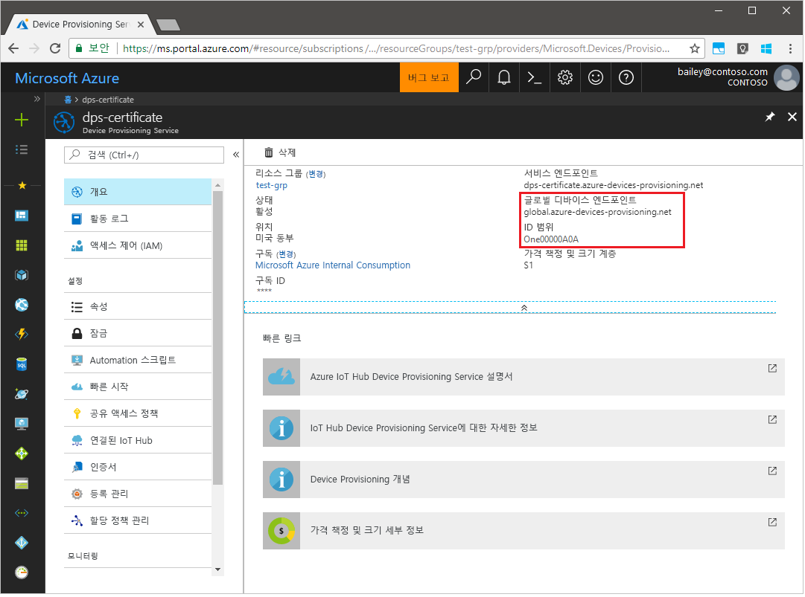

# <a name="create-and-provision-a-simulated-tpm-device-using-java-device-sdk-for-azure-iot-hub-device-provisioning-service"></a>Azure IoT Hub Device Provisioning Service용 Java 장치 SDK를 사용하여 시뮬레이션된 TPM 장치 만들기 및 프로비전

[!INCLUDE [iot-dps-selector-quick-create-simulated-device-tpm](../../includes/iot-dps-selector-quick-create-simulated-device-tpm.md)]

다음 단계에서는 Windows OS를 실행 중인 개발 컴퓨터에서 시뮬레이션된 장치를 만들고 Windows TPM 시뮬레이터를 장치의 [HSM(하드웨어 보안 모듈)](https://azure.microsoft.com/blog/azure-iot-supports-new-security-hardware-to-strengthen-iot-security/)으로 실행하며 코드 샘플을 사용하여 시뮬레이션된 장치를 Device Provisioning Service 및 IoT Hub와 연결하는 방법을 보여 줍니다. 

자동 프로비전 프로세스에 익숙하지 않은 경우 [자동 프로비전 개념](concepts-auto-provisioning.md)도 검토하세요. 계속하기 전에 [Azure Portal에서 IoT Hub Device Provisioning Service 설정](./quick-setup-auto-provision.md)의 단계를 완료해야 합니다. 

[!INCLUDE [IoT Device Provisioning Service basic](../../includes/iot-dps-basic.md)]

## <a name="prepare-the-environment"></a>환경 준비 

1. 컴퓨터에 [Java SE Development Kit 8](http://www.oracle.com/technetwork/java/javase/downloads/jdk8-downloads-2133151.html)이 설치되어 있는지 확인합니다.

1. [Maven](https://maven.apache.org/install.html)을 다운로드하고 설치합니다.

1. 컴퓨터에 `git`이 설치되어 있고 명령 창에서 액세스할 수 있는 환경 변수에 추가되었는지 확인합니다. 설치할 `git` 도구의 최신 버전은 [Software Freedom Conservancy의 Git 클라이언트 도구](https://git-scm.com/download/)를 참조하세요. 여기에는 로컬 Git 리포지토리와 상호 작용하는 데 사용할 수 있는 명령줄 앱인 **Git Bash**가 포함됩니다. 

1. 명령 프롬프트를 엽니다. 장치 시뮬레이션 샘플 코드에 대한 GitHub 리포지토리를 복제합니다.
    
    ```cmd/sh
    git clone https://github.com/Azure/azure-iot-sdk-java.git --recursive
    ```

1. [TPM](https://docs.microsoft.com/windows/device-security/tpm/trusted-platform-module-overview) 시뮬레이터를 실행합니다. _Windows 방화벽_ 설정을 변경하려면 **액세스 허용**을 클릭합니다. 포트 2321 및 2322에서 소켓을 수신 대기합니다. 이 창은 닫지 마세요. 이 빠른 시작 가이드가 끝날 때까지 이 시뮬레이터를 계속 실행해야 합니다. 

    ```cmd/sh
    .\azure-iot-sdk-java\provisioning\provisioning-tools\tpm-simulator\Simulator.exe
    ```

    

1. 별도의 명령 프롬프트에서 루트 폴더로 이동하고 샘플 종속성을 빌드합니다.

    ```cmd/sh
    cd azure-iot-sdk-java
    mvn install -DskipTests=true
    ```

1. 샘플 폴더로 이동합니다.

    ```cmd/sh
    cd provisioning/provisioning-samples/provisioning-tpm-sample
    ```

1. Azure Portal에 로그인하고, 왼쪽 메뉴에서 **모든 리소스** 단추를 클릭하고, Device Provisioning Service를 엽니다. _ID 범위_ 및 _Provisioning Service Global Endpoint_(프로비전 서비스 전역 엔드포인트)를 참고합니다.

    

1. 앞에서 설명한 대로 _ID 범위_ 및 _Provisioning Service Global Endpoint_ (프로비전 서비스 전역 엔드포인트)를 포함하도록 `src/main/java/samples/com/microsoft/azure/sdk/iot/ProvisioningTpmSample.java` 를 편집합니다.  

    ```java
    private static final String idScope = "[Your ID scope here]";
    private static final String globalEndpoint = "[Your Provisioning Service Global Endpoint here]";
    private static final ProvisioningDeviceClientTransportProtocol PROVISIONING_DEVICE_CLIENT_TRANSPORT_PROTOCOL = ProvisioningDeviceClientTransportProtocol.HTTPS;
    ```

1. 프로젝트를 빌드합니다. 대상 폴더로 이동하고 만든 jar 파일을 실행합니다.

    ```cmd/sh
    mvn clean install
    cd target
    java -jar ./provisioning-tpm-sample-{version}-with-deps.jar
    ```

1. 프로그램이 실행되기 시작합니다. 다음 섹션에 대한 _인증 키_와 _등록 ID_를 참고하고 프로그램을 실행 상태로 둡니다.

    
    

## <a name="create-a-device-enrollment-entry"></a>장치 등록 항목 만들기

1. Azure Portal에 로그인하고, 왼쪽 메뉴에서 **모든 리소스** 단추를 클릭하고, Device Provisioning Service를 엽니다.

1. Device Provisioning Service 요약 블레이드에서 **등록 관리**를 선택합니다. **개별 등록** 탭을 선택하고 맨 위에서 **개별 등록 추가** 단추를 클릭합니다. 

1. **등록 추가** 아래에서 다음 정보를 입력합니다.
    - ID 증명 *메커니즘*으로 **TPM**을 선택합니다.
    - 앞에서 설명한 대로 TPM 장치에 대한 *등록 ID* 및 *인증 키*를 입력합니다. 
    - 프로비전 서비스와 연결된 IoT Hub를 선택합니다.
    - 고유한 장치 ID를 입력합니다. 장치 이름을 지정할 때 중요한 데이터가 포함되지 않도록 합니다.
    - 장치에 대해 원하는 초기 구성으로 **초기 장치 쌍 상태**를 업데이트합니다.
    - 완료되면 **저장** 단추를 클릭합니다. 

      

   성공적으로 등록되면 장치의 *등록 ID*가 *개별 등록* 탭 아래의 목록에 표시됩니다. 


## <a name="simulate-the-device"></a>장치 시뮬레이션

1. 컴퓨터에서 Java 샘플 코드를 실행하는 명령 창에서 Enter 키를 눌러 응용 프로그램 실행을 계속합니다. 장치를 부팅하고 IoT Hub 정보를 얻기 위해 Device Provisioning Service에 연결하는 과정을 시뮬레이션하는 메시지를 확인합니다.  

    

1. 시뮬레이션된 장치를 프로비전 서비스와 연결된 IoT Hub로 성공적으로 프로비전하면 장치 ID가 허브의 **Device Explorer** 블레이드에 나타납니다.

     

    장치에 대한 등록 항목의 기본값으로부터 *초기 장치 쌍 상태*를 변경한 경우, 허브에서 원하는 쌍 상태를 가져와서 그에 맞게 작동할 수 있습니다. 자세한 내용은 [IoT Hub의 장치 쌍 이해 및 사용](../iot-hub/iot-hub-devguide-device-twins.md)을 참조하세요.


## <a name="clean-up-resources"></a>리소스 정리

장치 클라이언트 샘플을 계속해서 작업하고 탐색할 계획인 경우 이 빠른 시작에서 만든 리소스를 정리하지 마세요. 계속하지 않으려는 경우 다음 단계를 사용하여 이 빠른 시작에서 만든 모든 리소스를 삭제합니다.

1. 컴퓨터에서 장치 클라이언트 샘플 출력 창을 닫습니다.
1. 컴퓨터에서 TPM 시뮬레이터 창을 닫습니다.
1. Azure Portal의 왼쪽 메뉴에서 **모든 리소스**를 클릭한 다음 사용자의 Device Provisioning Service를 선택합니다. 서비스에 대한 **등록 관리** 블레이드를 연 다음, **개별 등록** 탭을 클릭합니다. 이 빠른 시작에서 등록한 장치의 *등록 ID*를 선택하고, 위쪽의 **삭제** 단추를 클릭합니다. 
1. Azure Portal의 왼쪽 메뉴에서 **모든 리소스**를 클릭한 다음 사용자의 IoT Hub를 선택합니다. 허브에 대한 **IoT 장치** 블레이드를 열고, 이 빠른 시작에서 등록한 장치의 *장치 ID*를 선택한 다음, 위쪽의 **삭제** 단추를 클릭합니다.

## <a name="next-steps"></a>다음 단계

이 빠른 시작에서는 시뮬레이션된 TPM 장치를 컴퓨터에 만들고, IoT Hub Device Provisioning Service를 사용하여 IoT Hub에 이 장치를 프로비전했습니다. 프로그래밍 방식으로 TPM 장치를 등록하는 방법을 알아보려면 프로그래밍 방식으로 TPM 장치를 등록하는 빠른 시작으로 계속 진행하세요. 

> [!div class="nextstepaction"]
> [Azure 빠른 시작 - Azure IoT Hub Device Provisioning Service에 TPM 장치 등록](quick-enroll-device-tpm-java.md)
