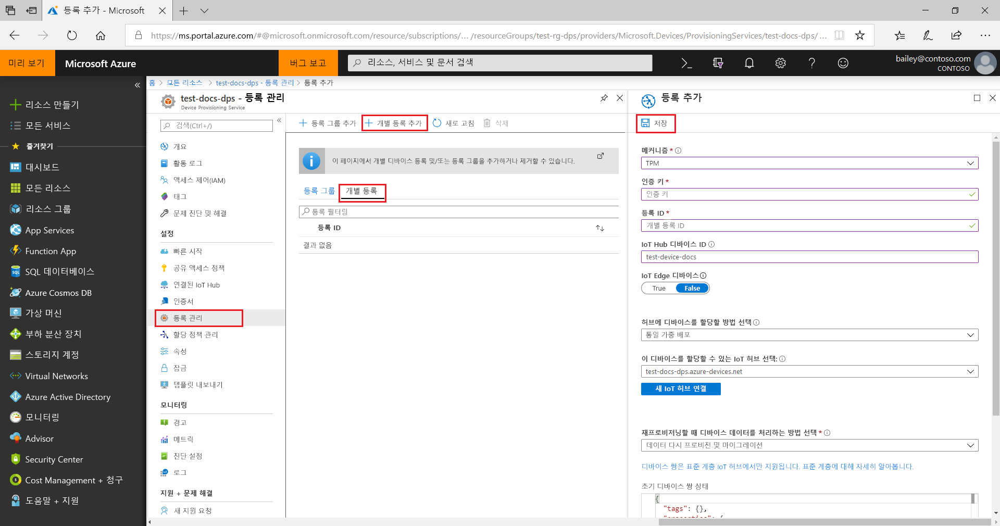
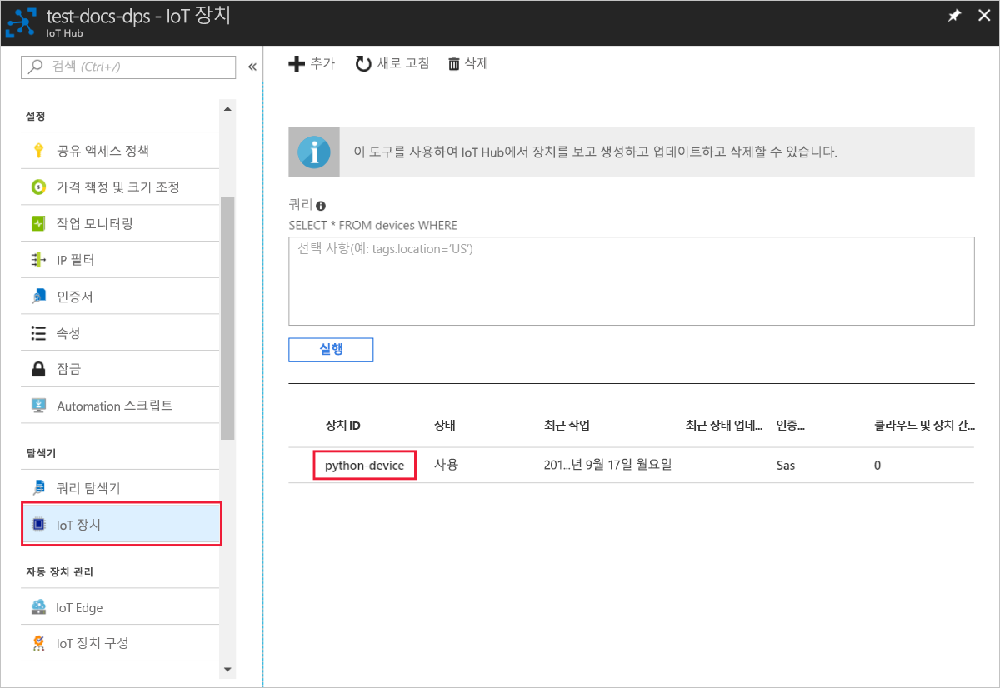

# <a name="quickstart-create-and-provision-a-simulated-tpm-device-using-python-device-sdk-for-iot-hub-device-provisioning-service"></a>빠른 시작 - IoT Hub Device Provisioning Service용 Python 디바이스 SDK를 사용하여 시뮬레이션된 X.509 디바이스 만들고 프로비저닝합니다.

[!INCLUDE [iot-dps-selector-quick-create-simulated-device-tpm](../../includes/iot-dps-selector-quick-create-simulated-device-tpm.md)]

이 빠른 시작에서는 Windows 컴퓨터에서 시뮬레이션 된 IoT 디바이스를 만듭니다. 시뮬레이션된 디바이스에는 HSM(하드웨어 보안 모듈)으로 TPM 시뮬레이터가 포함되어 있습니다. 디바이스 Python 코드 샘플을 사용하여 DPS(Device Provisioning Service)에서 개별 등록을 통해 이 시뮬레이션된 디바이스를 IoT 허브에 연결합니다.

## <a name="prerequisites"></a>필수 구성 요소

- [프로비저닝](about-iot-dps.md#provisioning-process) 개념에 대해 잘 알아야 합니다.
- [Azure Portal에서 IoT Hub Device Provisioning Service 설정](./quick-setup-auto-provision.md) 완료
- 활성 구독이 있는 Azure 계정. [체험 계정 만들기](https://azure.microsoft.com/free/?ref=microsoft.com&utm_source=microsoft.com&utm_medium=docs&utm_campaign=visualstudio)
- [Visual Studio 2015 이상](https://visualstudio.microsoft.com/vs/)(C++를 사용하는 데스크톱 개발 포함)
- [CMake 빌드 시스템](https://cmake.org/download/)
- [Git](https://git-scm.com/download/)

> [!IMPORTANT]
> 이 문서는 더 이상 사용되지 않는 V1 Python SDK에만 적용됩니다. IoT Hub Device Provisioning Service에 대한 디바이스 및 서비스 클라이언트는 아직 V2에서 사용할 수 없습니다. 이 팀은 현재 V2를 기능 패리티로 가져오기 위해 노력하고 있습니다.

[!INCLUDE [IoT Device Provisioning Service basic](../../includes/iot-dps-basic.md)]

## <a name="prepare-the-environment"></a>환경 준비 

1. Visual Studio 설치를 위해 'C++를 사용한 데스크톱 개발' 워크로드를 사용하도록 설정한 상태에서 [Visual Studio](https://visualstudio.microsoft.com/vs/) 2015 이상을 설치했는 지 확인합니다.

1. [CMake 빌드 시스템](https://cmake.org/download/)을 다운로드하여 설치합니다.

1. 컴퓨터에 `git`이 설치되어 있고 명령 창에서 액세스할 수 있는 환경 변수에 추가되었는지 확인합니다. 설치할 `git` 도구의 최신 버전은 [Software Freedom Conservancy의 Git 클라이언트 도구](https://git-scm.com/download/)를 참조하세요. 여기에는 로컬 Git 리포지토리와 상호 작용하는 데 사용할 수 있는 명령줄 앱인 **Git Bash**가 포함됩니다. 

1. 명령 프롬프트 또는 Git Bash를 엽니다. 디바이스 시뮬레이션 샘플 코드에 대한 GitHub 리포지토리를 복제합니다.
    
    ```cmd/sh
    git clone --single-branch --branch v1-deprecated https://github.com/Azure/azure-iot-sdk-python.git --recursive
    ```

1. CMake 빌드 프로세스에 대한 이 GitHub 리포지토리의 로컬 복사본에 폴더를 만듭니다. 

    ```cmd/sh
    cd azure-iot-sdk-python/c
    mkdir cmake
    cd cmake
    ```

1. 이 샘플 코드는 Windows TPM 시뮬레이터를 사용합니다. 다음 명령을 실행하여 SAS 토큰 인증을 사용하도록 설정합니다. 또한 시뮬레이션된 디바이스에 대해 Visual Studio 솔루션을 생성합니다.

    ```cmd/sh
    cmake -Duse_prov_client:BOOL=ON -Duse_tpm_simulator:BOOL=ON ..
    ```

1. 별도의 명령 프롬프트에서 TPM 시뮬레이터 폴더로 이동하고, 시뮬레이션된 디바이스의 [HSM](https://azure.microsoft.com/blog/azure-iot-supports-new-security-hardware-to-strengthen-iot-security/)이 되도록 [TPM](https://docs.microsoft.com/windows/device-security/tpm/trusted-platform-module-overview) 시뮬레이터를 실행합니다. **액세스 허용**을 클릭합니다. 포트 2321 및 2322에서 소켓을 수신 대기합니다. 이 명령 창을 닫지 마세요. 이 빠른 시작 가이드가 끝날 때까지 이 시뮬레이터가 실행되는 상태를 유지해야 합니다. 

    ```cmd/sh
    .\azure-iot-sdk-python\c\provisioning_client\deps\utpm\tools\tpm_simulator\Simulator.exe
    ```

    


## <a name="create-a-device-enrollment-entry"></a>디바이스 등록 항목 만들기

Azure IoT Device Provisioning 서비스는 다음과 같은 두 가지 등록을 지원합니다.

- [등록 그룹](concepts-service.md#enrollment-group): 여러 관련 디바이스를 등록하는 데 사용됩니다.
- [개별 등록](concepts-service.md#individual-enrollment): 단일 디바이스를 등록하는 데 사용됩니다.

이 문서에서는 개별 등록을 보여 줍니다.

1. *cmake* 폴더에 생성된 `azure_iot_sdks.sln`이라는 솔루션을 열고 Visual Studio에서 빌드합니다.

1. **tpm_device_provision** 프로젝트를 마우스 오른쪽 단추로 클릭한 다음 **시작 프로젝트로 설정**을 선택합니다. 솔루션을 실행합니다. 출력 창에 디바이스 등록에 필요한 **_인증 키_** 와 **_등록 ID_** 가 표시됩니다. 이러한 값을 기록해 둡니다. 

    

1. Azure Portal에 로그인하여 왼쪽 메뉴에서 **모든 리소스** 단추를 선택하고 Device Provisioning 서비스를 엽니다.

1. Device Provisioning Service 메뉴에서 **등록 관리**를 선택합니다. **개별 등록** 탭을 선택하고 맨 위에서 **개별 등록 추가** 단추를 선택합니다. 

1. **등록 추가** 패널에서 다음 정보를 입력합니다.
   - ID 증명 *메커니즘*으로 **TPM**을 선택합니다.
   - 앞에서 기록한 값에서 TPM 디바이스에 대한 *등록 ID* 및 *인증 키*를 입력합니다.
   - 프로비전 서비스와 연결된 IoT Hub를 선택합니다.
   - 필요에 따라 다음 정보를 입력합니다.
       - 고유한 *디바이스 ID*를 입력합니다. 디바이스 이름을 지정할 때 중요한 데이터가 포함되지 않도록 합니다. 제공하지 않도록 선택하면 등록 ID가 대신 디바이스를 식별하는 데 사용됩니다.
       - 디바이스에 대해 원하는 초기 구성으로 **초기 디바이스 쌍 상태**를 업데이트합니다.
   - 완료되면 **저장** 단추를 누릅니다. 

       

   등록에 성공하면 디바이스의 *등록 ID*가 *개별 등록* 탭 아래 목록에 나타납니다. 


## <a name="simulate-the-device"></a>디바이스 시뮬레이션

1. [Python 2.x 또는 3.x](https://www.python.org/downloads/)를 다운로드하고 설치합니다. 설치 프로그램의 요구 사항에 따라 32비트 또는 64비트 설치를 사용해야 합니다. 설치하는 동안 메시지가 표시되면 플랫폼 특정 환경 변수에 Python을 추가해야 합니다.
    - Windows OS를 사용하는 경우 Python에서 네이티브 DLL을 사용하기 위해 [Visual C++ 재배포 가능 패키지](https://support.microsoft.com/help/2977003/the-latest-supported-visual-c-downloads)가 필요합니다.

1. [이러한 지침](https://github.com/Azure/azure-iot-sdk-python/blob/v1-deprecated/doc/python-devbox-setup.md)에 따라 Python 패키지를 빌드합니다.

   > [!NOTE]
   > `build_client.cmd`를 실행하는 경우 `--use-tpm-simulator` 플래그를 사용해야 합니다.
   > 
   > [!NOTE]
   > `pip`를 사용하는 경우 `azure-iot-provisioning-device-client` 패키지도 설치해야 합니다. 릴리스된 PIP 패키지는 시뮬레이터가 아닌 실제 TPM을 사용하고 있습니다. 시뮬레이터를 사용하려면 `--use-tpm-simulator` 플래그를 사용하여 원본에서 컴파일해야 합니다.

1. samples 폴더로 이동합니다.

    ```cmd/sh
    cd azure-iot-sdk-python/provisioning_device_client/samples
    ```

1. Python IDE를 사용하여 **provisioning\_device\_client\_sample.py**라는 python 스크립트를 편집합니다. *GLOBAL\_PROV\_URI* 및 *ID\_SCOPE* 변수를 앞에서 설명한 값으로 수정합니다. 또한 *보안\_디바이스\_유형*을 `ProvisioningSecurityDeviceType.TPM`으로 설정합니다.

    ```python
    GLOBAL_PROV_URI = "{globalServiceEndpoint}"
    ID_SCOPE = "{idScope}"
    SECURITY_DEVICE_TYPE = ProvisioningSecurityDeviceType.TPM
    PROTOCOL = ProvisioningTransportProvider.HTTP
    ```

    

1. 예제를 실행합니다. 

    ```cmd/sh
    python provisioning_device_client_sample.py
    ```

1. 디바이스를 부팅하고 IoT Hub 정보를 얻기 위해 Device Provisioning Service에 연결하는 과정을 시뮬레이션하는 메시지를 확인합니다. 

    

1. 프로비저닝 서비스와 연결된 IoT 허브에 시뮬레이션된 디바이스를 성공적으로 프로비저닝하면 디바이스 ID가 허브의 **IoT 디바이스** 블레이드에 표시됩니다.

     

    디바이스에 대한 등록 항목의 기본값으로부터 *초기 디바이스 쌍 상태*를 변경한 경우, 허브에서 원하는 쌍 상태를 가져와서 그에 맞게 작동할 수 있습니다. 자세한 내용은 [IoT Hub의 디바이스 쌍 이해 및 사용](../iot-hub/iot-hub-devguide-device-twins.md)을 참조하세요.


## <a name="clean-up-resources"></a>리소스 정리

디바이스 클라이언트 샘플을 계속해서 작업하고 탐색할 계획인 경우 이 빠른 시작에서 만든 리소스를 정리하지 마세요. 계속하지 않으려는 경우 다음 단계를 사용하여 이 빠른 시작에서 만든 모든 리소스를 삭제합니다.

1. 컴퓨터에서 디바이스 클라이언트 샘플 출력 창을 닫습니다.
1. 컴퓨터에서 TPM 시뮬레이터 창을 닫습니다.
1. Azure Portal의 왼쪽 메뉴에서 **모든 리소스**를 선택한 다음, Device Provisioning Service를 선택합니다. 서비스에 대한 **등록 관리** 블레이드를 연 다음, **개별 등록** 탭을 선택합니다. 이 빠른 시작에 등록한 디바이스의 *등록 ID* 옆에 있는 확인란을 선택하고, 창 위쪽에 있는 **삭제** 단추를 누릅니다. 
1. Azure Portal의 왼쪽 메뉴에서 **모든 리소스**를 선택한 다음, 사용자의 IoT 허브를 선택합니다. 허브에 대한 **IoT 디바이스** 블레이드를 열고, 이 빠른 시작에 등록한 디바이스의 *디바이스 ID* 옆에 있는 확인란을 선택한 다음, 창 위쪽에 있는 **삭제** 단추를 누릅니다.

## <a name="next-steps"></a>다음 단계

이 빠른 시작에서는 시뮬레이션된 TPM 디바이스를 머신에 만들고, IoT Hub Device Provisioning Service를 사용하여 IoT 허브에 이 디바이스를 프로비저닝했습니다. 프로그래밍 방식으로 TPM 디바이스를 등록하는 방법을 알아보려면 프로그래밍 방식으로 TPM 디바이스를 등록하는 빠른 시작을 계속 진행하세요. 

> [!div class="nextstepaction"]
> [Azure 빠른 시작 - Azure IoT Hub Device Provisioning Service에 TPM 디바이스 등록](quick-enroll-device-tpm-python.md)
