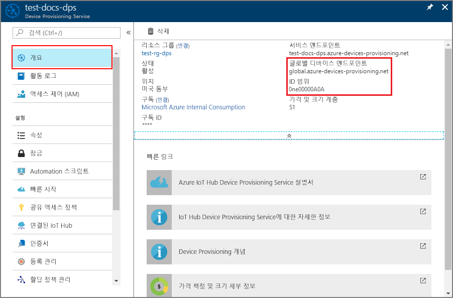
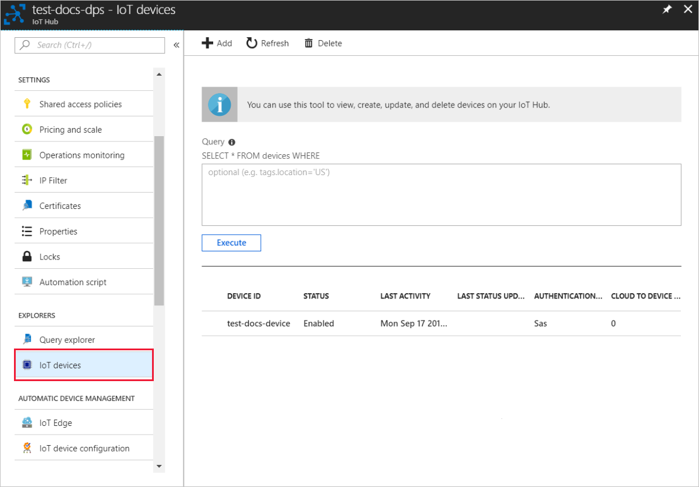

# <a name="quickstart-create-and-provision-an-x509-simulated-device-using-nodejs-device-sdk-for-iot-hub-device-provisioning-service"></a>빠른 시작: IoT Hub Device Provisioning Service용 Node.js 디바이스 SDK를 사용하여 시뮬레이션된 X.509 디바이스 만들기 및 프로비전
[!INCLUDE [iot-dps-selector-quick-create-simulated-device-x509](../../includes/iot-dps-selector-quick-create-simulated-device-x509.md)]

다음 단계에서는 Device Provisioning Service에서 등록 항목을 만들고, 개발 컴퓨터에서 X.509 디바이스를 시뮬레이션하며, 시뮬레이션된 디바이스를 Device Provisioning Service와 연결하고, [Azure IoT Hub Node.js 디바이스 SDK](https://github.com/Azure/azure-iot-sdk-node)를 사용하여 디바이스를 IoT 허브에 등록하는 방법을 보여줍니다.

자동 프로비전 프로세스에 익숙하지 않은 경우 [자동 프로비전 개념](concepts-auto-provisioning.md)도 검토하세요. 계속하기 전에 [Azure Portal에서 IoT Hub Device Provisioning Service 설정](./quick-setup-auto-provision.md)의 단계를 완료해야 합니다. 

Azure IoT Device Provisioning 서비스는 다음과 같은 두 가지 등록을 지원합니다.
- [등록 그룹](concepts-service.md#enrollment-group): 여러 관련 디바이스를 등록하는 데 사용됩니다.
- [개별 등록](concepts-service.md#individual-enrollment): 단일 디바이스를 등록하는 데 사용됩니다.

이 문서에서는 개별 등록을 설명합니다.

[!INCLUDE [IoT Device Provisioning Service basic](../../includes/iot-dps-basic.md)]

## <a name="prepare-the-environment"></a>환경 준비 

1. 계속 진행하기 전에 [Azure Portal에서 IoT Hub Device Provisioning Service 설정](./quick-setup-auto-provision.md)의 단계를 완료합니다.

2. 컴퓨터에 [Node.js v4.0 이상](https://nodejs.org)이 설치되어 있는지 확인합니다.

3. [Git](https://git-scm.com/download/)이 컴퓨터에 설치되어 있고 명령 창에서 액세스할 수 있는 환경 변수에 추가되었는지 확인합니다. 

4. [OpenSSL](https://www.openssl.org/)이 컴퓨터에 설치되어 있고 명령 창에서 액세스할 수 있는 환경 변수에 추가되었는지 확인합니다. 이 라이브러리는 원본에서 빌드하고 설치하거나 [여기](https://sourceforge.net/projects/openssl/)와 같은 [타사](https://wiki.openssl.org/index.php/Binaries)에서 다운로드하고 설치할 수 있습니다. 

    > [!NOTE]
    > _루트_, _중간_ 및/또는 _리프_ X.509 인증서를 이미 만들었으면, 이 단계 및 다음에 이어지는 생성과 관련된 모든 단계를 건너뛸 수 있습니다.
    >

## <a name="create-a-self-signed-x509-device-certificate-and-individual-enrollment-entry"></a>자체 서명된 X.509 디바이스 인증서 및 개별 등록 항목 만들기

이 섹션에서는 자체 서명된 X.509 인증서를 사용하고 다음에 유의해야 합니다.

* 자체 서명된 인증서는 테스트 목적으로만 사용되며 프로덕션 환경에서 사용하지 마십시오.
* 자체 서명된 인증서에 대한 기본 만료일은 1년입니다.

[Node.js용 Azure IoT SDK](https://github.com/Azure/azure-iot-sdk-node.git)의 샘플 코드를 사용하여 시뮬레이션된 디바이스에 대한 개별 등록 항목에서 사용될 인증서를 만듭니다.


1. 명령 프롬프트를 엽니다. 코드 샘플용 GitHub 리포지토리를 복제합니다.
    
    ```cmd/sh
    git clone https://github.com/Azure/azure-iot-sdk-node.git --recursive
    ```

2. 인증서 생성기 스크립트로 이동하여 프로젝트를 빌드합니다. 

    ```cmd/sh
    cd azure-iot-sdk-node/provisioning/tools
    npm install
    ```

3. 사용자 고유의 _인증서 이름_을 사용하는 스크립트를 실행하여 _리프_ X.509 인증서를 만듭니다. 리프 인증서의 일반 이름은 [등록 ID](https://docs.microsoft.com/azure/iot-dps/concepts-device#registration-id)가 되므로 소문자 영숫자와 하이픈만 사용해야 합니다.

    ```cmd/sh
    node create_test_cert.js device {certificate-name}
    ```

4. [Azure Portal](https://portal.azure.com)에 로그인하여 왼쪽 메뉴에서 **모든 리소스** 단추를 선택하고, Device Provisioning Service 인스턴스를 엽니다.

5. Device Provisioning Service 메뉴에서 **등록 관리**를 선택합니다. **개별 등록** 탭을 선택하고 맨 위에서 **개별 등록 추가** 단추를 선택합니다. 

6. **등록 추가** 패널에서 다음 정보를 입력합니다.
   - ID 증명 *메커니즘*으로 **X.509**를 선택합니다.
   - *기본 인증서 .pem 또는 .cer 파일* 아래에서 *파일 선택*을 선택하여 이전 단계에서 만든 **{certificate-name}_cert.pem** 인증서 파일을 선택합니다.  
   - 필요에 따라 다음 정보를 입력합니다.
     - 프로비전 서비스와 연결된 IoT Hub를 선택합니다.
     - 고유한 디바이스 ID를 입력합니다. 디바이스 이름을 지정할 때 중요한 데이터가 포함되지 않도록 합니다. 
     - 디바이스에 대해 원하는 초기 구성으로 **초기 디바이스 쌍 상태**를 업데이트합니다.
     - 완료되면 **저장** 단추를 누릅니다. 

     [](./media/quick-create-simulated-device-x509-node/device-enrollment.png#lightbox)

     성공적으로 등록되면 X.509 디바이스가 *개별 등록* 탭의 *등록 ID* 열 아래에 **{certificatename}** 으로 표시됩니다. 나중에 사용하기 위해 이 값을 적어 둡니다.

## <a name="simulate-the-device"></a>디바이스 시뮬레이션

[Azure IoT Hub Node.js 디바이스 SDK](https://github.com/Azure/azure-iot-sdk-node)는 디바이스를 시뮬레이션하는 쉬운 방법을 제공합니다. 자세한 내용은 [디바이스 개념](https://docs.microsoft.com/azure/iot-dps/concepts-device)을 참조하세요.

1. Azure Portal에서 Device Provisioning Service에 대한 **개요** 블레이드를 선택하고, **_글로벌 디바이스 엔드포인트_** 및 **_ID 범위_** 값을 적어 둡니다.

     

2. _인증서_ 및 _키_를 샘플 폴더에 복사합니다.

    ```cmd/sh
    copy .\{certificate-name}_cert.pem ..\device\samples\{certificate-name}_cert.pem
    copy .\{certificate-name}_key.pem ..\device\samples\{certificate-name}_key.pem
    ```

3. 디바이스 테스트 스크립트로 이동하고 프로젝트를 빌드합니다. 

    ```cmd/sh
    cd ..\device\samples
    npm install
    ```

4. **register\_x509.js** 파일을 편집합니다. 내용을 다음과 같이 변경한 후 파일을 저장합니다.
    - `provisioning host`를 위의 **1단계**에서 적어 둔 **_전역 디바이스 엔드포인트_** 로 바꿉니다.
    - `id scope`를 위의 **1단계**에 적어 둔 **_ID 범위_** 로 바꿉니다. 
    - `registration id`를 이전 섹션에서 적어 둔 **_등록 ID_** 로 바꿉니다.
    - `cert filename` 및 `key filename`을 위의 **2단계**에서 복사한 파일로 바꿉니다. 

5. 스크립트를 실행하고 디바이스가 성공적으로 프로비전되었는지 확인합니다.

    ```cmd/sh
    node register_x509.js
    ```   

6. 포털에서 프로비저닝 서비스와 연결된 IoT 허브로 이동하여 **IoT 디바이스** 블레이드를 엽니다. 시뮬레이션된 X.509 디바이스가 허브에 성공적으로 프로비저닝되면 *상태*가 **사용**인 디바이스 ID가 **IoT 디바이스** 블레이드에 표시됩니다. 샘플 디바이스 애플리케이션을 실행하기 전에 블레이드가 이미 열려 있으면 위쪽의 **새로 고침** 단추를 눌러야 할 수도 있습니다. 

     

    디바이스에 대한 등록 항목의 기본값으로부터 *초기 디바이스 쌍 상태*를 변경한 경우, 허브에서 원하는 쌍 상태를 가져와서 그에 맞게 작동할 수 있습니다. 자세한 내용은 [IoT Hub의 디바이스 쌍 이해 및 사용](../iot-hub/iot-hub-devguide-device-twins.md)을 참조하세요.


## <a name="clean-up-resources"></a>리소스 정리

디바이스 클라이언트 샘플을 계속해서 작업하고 탐색할 계획인 경우 이 빠른 시작에서 만든 리소스를 정리하지 마세요. 계속하지 않으려는 경우 다음 단계를 사용하여 이 빠른 시작에서 만든 모든 리소스를 삭제합니다.

1. 컴퓨터에서 디바이스 클라이언트 샘플 출력 창을 닫습니다.
2. Azure Portal의 왼쪽 메뉴에서 **모든 리소스**를 선택한 다음, Device Provisioning Service를 선택합니다. 서비스에 대한 **등록 관리** 블레이드를 연 다음, **개별 등록** 탭을 선택합니다. 이 빠른 시작에 등록한 디바이스의 *등록 ID* 옆에 있는 확인란을 선택하고, 창 위쪽에 있는 **삭제** 단추를 누릅니다. 
3. Azure Portal의 왼쪽 메뉴에서 **모든 리소스**를 선택한 다음, 사용자의 IoT 허브를 선택합니다. 허브에 대한 **IoT 디바이스** 블레이드를 열고, 이 빠른 시작에 등록한 디바이스의 *디바이스 ID* 옆에 있는 확인란을 선택한 다음, 창 위쪽에 있는 **삭제** 단추를 누릅니다.


## <a name="next-steps"></a>다음 단계

이 빠른 시작에서는 포털에서 Azure IoT Hub Device Provisioning Service를 사용하여 시뮬레이션된 X.509 디바이스를 만들고 IoT 허브에 프로비저닝했습니다. 프로그래밍 방식으로 X.509 디바이스를 등록하는 방법을 알아보려면 프로그래밍 방식으로 X.509 디바이스를 등록하는 빠른 시작을 계속 진행하세요. 

> [!div class="nextstepaction"]
> [Azure 빠른 시작 - Azure IoT Hub Device Provisioning Service에 X.509 디바이스 등록](quick-enroll-device-x509-node.md)
