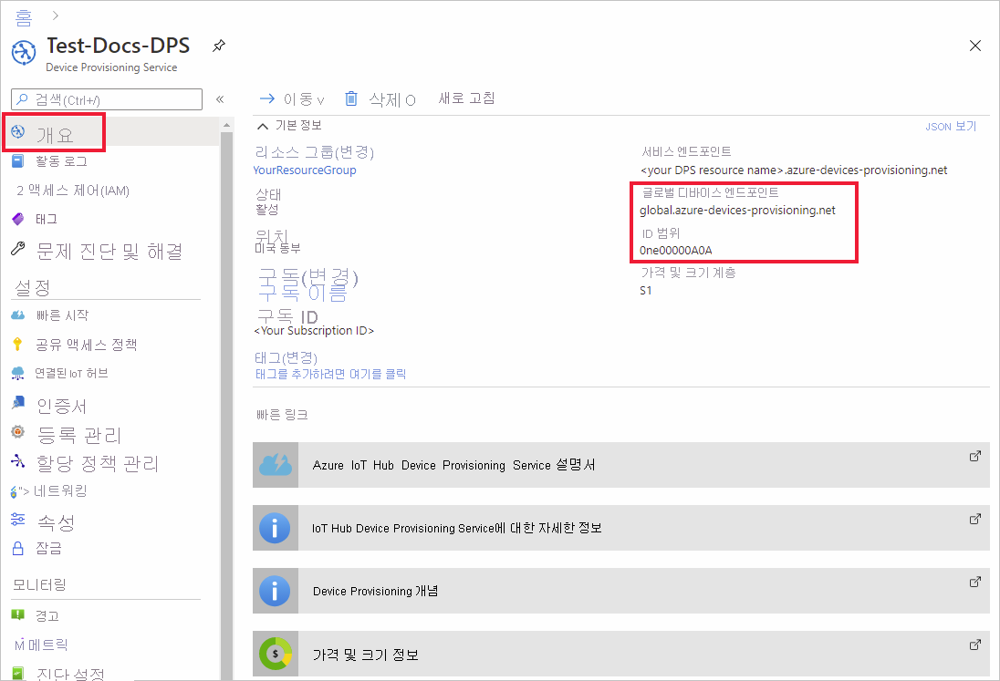
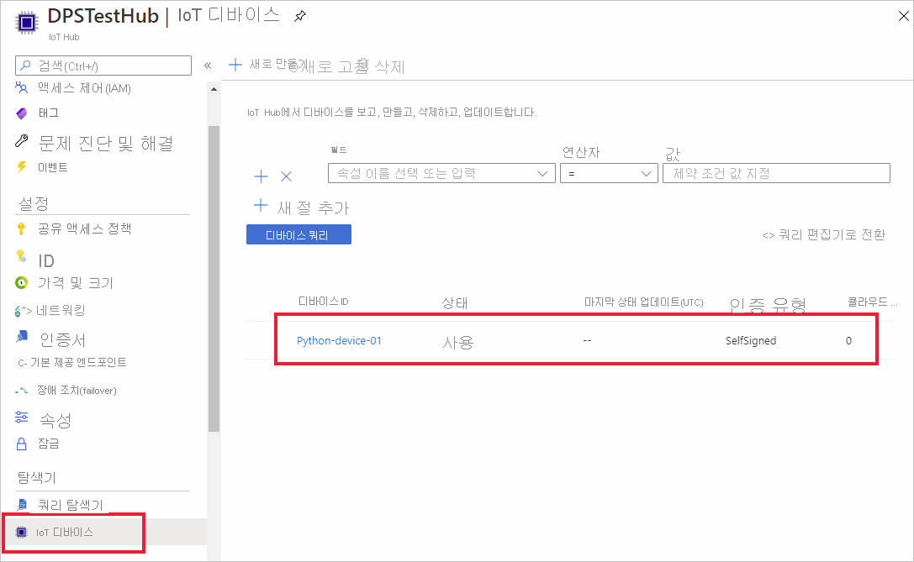

# <a name="quickstart-create-and-provision-a-simulated-x509-device-using-python-device-sdk-for-iot-hub-device-provisioning-service"></a>빠른 시작: IoT Hub Device Provisioning Service용 Python 디바이스 SDK를 사용하여 시뮬레이션된 X.509 디바이스 만들기 및 프로비전

[!INCLUDE [iot-dps-selector-quick-create-simulated-device-x509](../../includes/iot-dps-selector-quick-create-simulated-device-x509.md)]

다음 단계에서는 Windows OS를 실행하는 개발 머신에서 X.509 디바이스를 시뮬레이션하고, Python 샘플 코드를 사용하여 이 시뮬레이션된 디바이스를 Device Provisioning Service 및 IoT Hub와 연결하는 방법을 보여줍니다. 

> [!IMPORTANT]
> 이 문서는 더 이상 사용되지 않는 V1 Python SDK에만 적용됩니다. IoT Hub Device Provisioning Service에 대한 디바이스 및 서비스 클라이언트는 아직 V2에서 사용할 수 없습니다. 이 팀은 현재 V2를 기능 패리티로 가져오기 위해 노력하고 있습니다.

자동 프로비전 프로세스에 익숙하지 않은 경우 [자동 프로비전 개념](concepts-auto-provisioning.md)도 검토하세요. 계속하기 전에 [Azure Portal에서 IoT Hub Device Provisioning Service 설정](./quick-setup-auto-provision.md)의 단계를 완료해야 합니다. 

Azure IoT Device Provisioning 서비스는 다음과 같은 두 가지 등록을 지원합니다.
- [등록 그룹](concepts-service.md#enrollment-group): 여러 관련 디바이스를 등록하는 데 사용됩니다.
- [개별 등록](concepts-service.md#individual-enrollment): 단일 디바이스를 등록하는 데 사용됩니다.

이 문서에서는 개별 등록을 설명합니다.

[!INCLUDE [IoT Device Provisioning Service basic](../../includes/iot-dps-basic.md)]

## <a name="prepare-the-environment"></a>환경 준비 

1. Visual Studio 설치를 위해 'C++를 사용한 데스크톱 개발' 워크로드를 사용하도록 설정한 상태에서 [Visual Studio](https://visualstudio.microsoft.com/vs/) 2015 이상을 설치했는 지 확인합니다.

2. [CMake 빌드 시스템](https://cmake.org/download/)을 다운로드하여 설치합니다.

3. 컴퓨터에 `git`이 설치되어 있고 명령 창에서 액세스할 수 있는 환경 변수에 추가되었는지 확인합니다. 설치할 `git` 도구의 최신 버전은 [Software Freedom Conservancy의 Git 클라이언트 도구](https://git-scm.com/download/)를 참조하세요. 여기에는 로컬 Git 리포지토리와 상호 작용하는 데 사용할 수 있는 명령줄 앱인 **Git Bash**가 포함됩니다. 

4. 명령 프롬프트 또는 Git Bash를 엽니다. 디바이스 시뮬레이션 샘플 코드에 대한 GitHub 리포지토리를 복제합니다.
    
    ```cmd/sh
    git clone https://github.com/Azure/azure-iot-sdk-python.git --recursive
    ```

5. CMake 빌드 프로세스에 대한 이 GitHub 리포지토리의 로컬 복사본에 폴더를 만듭니다. 

    ```cmd/sh
    cd azure-iot-sdk-python/c
    mkdir cmake
    cd cmake
    ```

6. 다음 명령을 실행하여 프로비전 클라이언트에 대한 Visual Studio 솔루션을 만듭니다.

    ```cmd/sh
    cmake -Duse_prov_client:BOOL=ON ..
    ```


## <a name="create-a-self-signed-x509-device-certificate-and-individual-enrollment-entry"></a>자체 서명된 X.509 디바이스 인증서 및 개별 등록 항목 만들기

이 섹션에서는 자체 서명된 X.509 인증서를 사용합니다. 다음 사항에 주의하세요.

* 자체 서명된 인증서는 테스트 목적으로만 사용되며 프로덕션 환경에서 사용하지 마십시오.
* 자체 서명된 인증서에 대한 기본 만료일은 1년입니다.

Azure IoT C SDK의 샘플 코드를 사용하여 시뮬레이션된 디바이스에 대한 개별 등록 항목에서 사용될 인증서를 만듭니다.

1. *cmake* 폴더에 생성된 `azure_iot_sdks.sln`이라는 솔루션을 열고 Visual Studio에서 빌드합니다.

2. **Provision\_Samples** 폴더 아래에서 **dice\_device\_enrollment** 프로젝트를 마우스 오른쪽 단추로 클릭하고 **시작 프로젝트로 설정**을 선택합니다. 솔루션을 실행합니다. 

3. 출력 창에서 메시지가 표시되면 개별 등록에 대한 `i`를 입력합니다. 출력 창에는 시뮬레이션된 디바이스에 대해 로컬로 생성된 X.509 인증서가 표시됩니다. 
    
    첫 번째 인증서를 클립보드에 복사합니다. 첫 번째 항목으로 시작합니다.
    
        -----BEGIN CERTIFICATE----- 
        
    첫 번째 항목이 발견된 후 복사를 종료합니다.
    
        -----END CERTIFICATE-----
        
    이러한 줄도 모두 포함해야 합니다. 

    
 
4. Windows 컴퓨터에 **_X509testcertificate.pem_** 이라는 파일을 만들고, 원하는 편집기에서 이 파일을 열고, 클립보드의 내용을 이 파일에 복사합니다. 파일을 저장합니다. 

5. Azure Portal에 로그인하여 왼쪽 메뉴에서 **모든 리소스** 단추를 선택하고 프로비저닝 서비스를 엽니다.

6. Device Provisioning Service 메뉴에서 **등록 관리**를 선택합니다. **개별 등록** 탭을 선택하고 맨 위에서 **개별 등록 추가** 단추를 선택합니다. 

7. **등록 추가** 패널에서 다음 정보를 입력합니다.
   - ID 증명 *메커니즘*으로 **X.509**를 선택합니다.
   - *기본 인증서 .pem 또는 .cer 파일* 아래에서 *파일 선택*을 선택하여 이전 단계에서 만든 **X509testcertificate.pem** 인증서 파일을 선택합니다.
   - 필요에 따라 다음 정보를 입력합니다.
     - 프로비전 서비스와 연결된 IoT Hub를 선택합니다.
     - 고유한 디바이스 ID를 입력합니다. 디바이스 이름을 지정할 때 중요한 데이터가 포함되지 않도록 합니다. 
     - 디바이스에 대해 원하는 초기 구성으로 **초기 디바이스 쌍 상태**를 업데이트합니다.
   - 완료되면 **저장** 단추를 누릅니다. 

     [](./media/python-quick-create-simulated-device-x509/device-enrollment.png#lightbox)

   등록에 성공하면 X.509 디바이스가 *개별 등록* 탭의 *등록 ID* 열에 **riot-device-cert**로 표시됩니다. 

## <a name="simulate-the-device"></a>디바이스 시뮬레이션

1. Device Provisioning Service 메뉴에서 **개요**를 선택합니다. _ID 범위_와 _Global Service Endpoint_(글로벌 서비스 엔드포인트)를 참고합니다.

    

2. [Python 2.x 또는 3.x](https://www.python.org/downloads/)를 다운로드하고 설치합니다. 설치 프로그램의 요구 사항에 따라 32비트 또는 64비트 설치를 사용해야 합니다. 설치하는 동안 메시지가 표시되면 플랫폼 특정 환경 변수에 Python을 추가해야 합니다. Python 2.x를 사용하는 경우 [*pip* Python 패키지 관리 시스템을 설치 또는 업그레이드](https://pip.pypa.io/en/stable/installing/)해야 할 수 있습니다.
    
    > [!NOTE] 
    > Windows를 사용하는 경우 [Visual Studio 2015용 Visual C++ 재배포 가능 패키지](https://support.microsoft.com/help/2977003/the-latest-supported-visual-c-downloads)도 설치합니다. C DLL을 로드/실행하기 위해 pip 패키지에서 재배포 가능 패키지가 필요합니다.

3. [이러한 지침](https://github.com/Azure/azure-iot-sdk-python/blob/v1-deprecated/doc/python-devbox-setup.md)에 따라 Python 패키지를 빌드합니다.

   > [!NOTE]
   > `pip`를 사용하는 경우 `azure-iot-provisioning-device-client` 패키지도 설치해야 합니다.

4. samples 폴더로 이동합니다.

    ```cmd/sh
    cd azure-iot-sdk-python/provisioning_device_client/samples
    ```

5. Python IDE를 사용하여 **provisioning\_device\_client\_sample.py**라는 python 스크립트를 편집합니다. _GLOBAL\_PROV\_URI_ 및 _ID\_SCOPE_ 변수를 앞에서 설명한 값으로 수정합니다.

    ```python
    GLOBAL_PROV_URI = "{globalServiceEndpoint}"
    ID_SCOPE = "{idScope}"
    SECURITY_DEVICE_TYPE = ProvisioningSecurityDeviceType.X509
    PROTOCOL = ProvisioningTransportProvider.HTTP
    ```

6. 샘플을 실행합니다. 

    ```cmd/sh
    python provisioning_device_client_sample.py
    ```

7. 애플리케이션이 연결되어 디바이스를 등록하고 성공적인 등록 메시지를 표시합니다.

    

8. 포털에서 프로비전 서비스에 연결된 IoT 허브로 이동하여 **디바이스 탐색기** 블레이드를 엽니다. 시뮬레이션된 X.509 디바이스가 허브에 성공적으로 프로비전되면 디바이스 ID가 **Device Explorer** 블레이드에 표시되고 *상태*가 **사용**으로 표시됩니다. 샘플 디바이스 애플리케이션을 실행하기 전에 블레이드가 이미 열려 있으면 위쪽의 **새로 고침** 단추를 눌러야 할 수도 있습니다. 

     

> [!NOTE]
> 디바이스에 대한 등록 항목의 기본값으로부터 *초기 디바이스 쌍 상태*를 변경한 경우, 허브에서 원하는 쌍 상태를 가져와서 그에 맞게 작동할 수 있습니다. 자세한 내용은 [IoT Hub의 디바이스 쌍 이해 및 사용](../iot-hub/iot-hub-devguide-device-twins.md)을 참조하세요.
>

## <a name="clean-up-resources"></a>리소스 정리

디바이스 클라이언트 샘플을 계속해서 작업하고 탐색할 계획인 경우 이 빠른 시작에서 만든 리소스를 정리하지 마세요. 계속하지 않으려는 경우 다음 단계를 사용하여 이 빠른 시작에서 만든 모든 리소스를 삭제합니다.

1. 컴퓨터에서 디바이스 클라이언트 샘플 출력 창을 닫습니다.
2. Azure Portal의 왼쪽 메뉴에서 **모든 리소스**를 선택한 다음, 사용자의 Device Provisioning 서비스를 선택합니다. 서비스에 대한 **등록 관리** 블레이드를 연 다음, **개별 등록** 탭을 선택합니다. 이 빠른 시작에 등록한 디바이스의 *등록 ID* 옆의 확인란을 선택하고 창 위쪽에 있는 **삭제** 단추를 누릅니다. 
3. Azure Portal의 왼쪽 메뉴에서 **모든 리소스**를 선택한 다음, 사용자의 IoT 허브를 선택합니다. 허브에 대한 **IoT 디바이스** 블레이드를 열고 이 빠른 시작에 등록한 디바이스의 *디바이스 ID* 옆의 확인란을 선택한 다음, 창 위쪽에 있는 **삭제** 단추를 누릅니다.

## <a name="next-steps"></a>다음 단계

이 빠른 시작에서는 시뮬레이션된 X.509 디바이스를 Windows 머신에 만들고, 포털에서 Azure IoT Hub Device Provisioning Service를 사용하여 IoT 허브에 이 디바이스를 프로비저닝했습니다. 프로그래밍 방식으로 X.509 디바이스를 등록하는 방법을 알아보려면 프로그래밍 방식으로 X.509 디바이스를 등록하는 빠른 시작으로 계속 진행하세요. 

> [!div class="nextstepaction"]
> [Azure 빠른 시작 - Azure IoT Hub Device Provisioning Service에 X.509 디바이스 등록](quick-enroll-device-x509-python.md)
