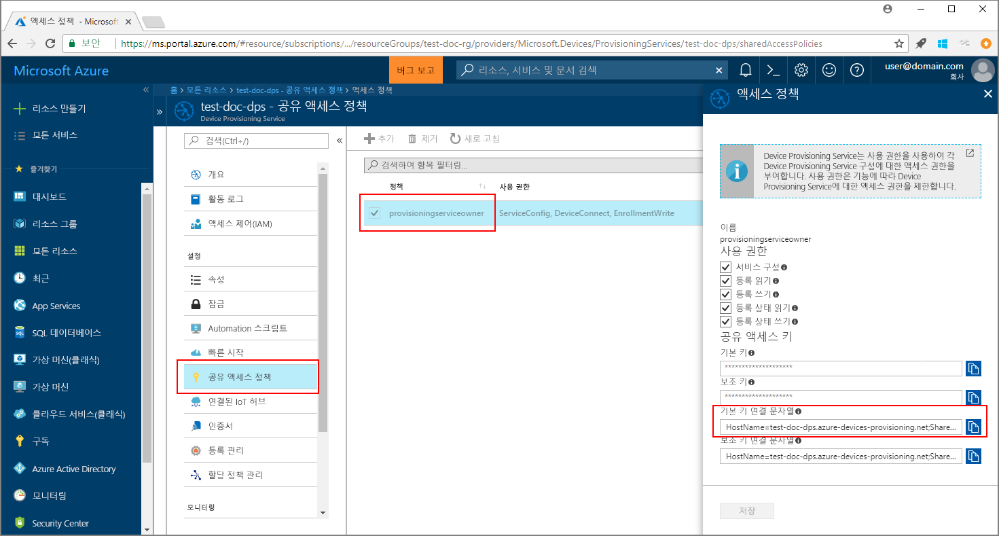

# <a name="quickstart-enroll-tpm-device-to-iot-hub-device-provisioning-service-using-java-service-sdk"></a>빠른 시작: Java 서비스 SDK를 사용하여 IoT Hub Device Provisioning Service에 TPM 디바이스 등록

[!INCLUDE [iot-dps-selector-quick-enroll-device-tpm](../../includes/iot-dps-selector-quick-enroll-device-tpm.md)]

이 빠른 시작에서는 Java 애플리케이션 샘플을 통해 Java 서비스 SDK를 사용하여 Azure IoT Hub Device Provisioning Service에서 시뮬레이션된 TPM 디바이스에 대한 개별 등록을 프로그래밍 방식으로 만듭니다.

## <a name="prerequisites"></a>사전 요구 사항

- [Azure Portal에서 IoT Hub Device Provisioning Service 설정](./quick-setup-auto-provision.md) 완료
- [TPM 디바이스의 암호화 키 읽기](quick-create-simulated-device.md#simulatetpm) 완료
- 활성 구독이 있는 Azure 계정. [체험 계정 만들기](https://azure.microsoft.com/free/?ref=microsoft.com&utm_source=microsoft.com&utm_medium=docs&utm_campaign=visualstudio)
- [Java SE Development Kit 8](https://aka.ms/azure-jdks). 이 빠른 시작에서는 아래 [Java 서비스 SDK](https://azure.github.io/azure-iot-sdk-java/service/)를 설치합니다. Windows와 Linux 모두에서 작동합니다. 이 빠른 시작에서는 Windows를 사용합니다.
- [Maven 3](https://maven.apache.org/download.cgi)
- [Git](https://git-scm.com/download/)

<a id="setupdevbox"></a>

## <a name="prepare-the-development-environment"></a>개발 환경 준비 

1. 컴퓨터에 [Java SE Development Kit 8](https://aka.ms/azure-jdks)이 설치되어 있는지 확인합니다. 

2. Java 설치 환경 변수를 설정합니다. `PATH` 변수에는 *jdk1.8.x\bin* 디렉터리의 전체 경로가 포함되어야 합니다. 컴퓨터의 첫 번째 Java 설치인 경우 `JAVA_HOME`이라는 새 환경 변수를 만들고 *jdk1.8.x* 디렉터리의 전체 경로를 가리키도록 지정합니다. Windows 머신에서 이 디렉터리는 *C:\\Program Files\\Java\\* 폴더에 있으며, Windows 머신의 **제어판**에서 **시스템 환경 변수 편집**을 검색하여 환경 변수를 만들거나 편집할 수 있습니다. 

   명령 창에서 다음 명령을 실행하여 Java가 컴퓨터에 성공적으로 설치되었는지 확인할 수 있습니다.

    ```cmd\sh
    java -version
    ```

3. 컴퓨터에서 [Maven 3](https://maven.apache.org/download.cgi)을 다운로드하고 추출합니다. 

4. Maven이 추출된 폴더 내의 *apache-maven-3.x.x\\bin* 폴더를 가리키도록 `PATH` 환경 변수를 편집합니다. 명령 창에서 다음 명령을 실행하여 Maven이 성공적으로 설치되었는지 확인할 수 있습니다:

    ```cmd\sh
    mvn --version
    ```

5. 컴퓨터에 [git](https://git-scm.com/download/)가 설치되어 있고 `PATH` 환경 변수에 추가되었는지 확인합니다. 


<a id="javasample"></a>

## <a name="download-and-modify-the-java-sample-code"></a>Java 샘플 코드 다운로드 및 수정

이 섹션에서는 TPM 디바이스에 대한 프로비전 세부 정보를 샘플 코드에 추가하는 방법을 보여줍니다. 

1. 명령 프롬프트를 엽니다. [Java 서비스 SDK](https://azure.github.io/azure-iot-sdk-java/service/)를 사용하여 디바이스 등록 코드 샘플에 대한 GitHub 리포지토리를 복제합니다.
    
    ```cmd\sh
    git clone https://github.com/Azure/azure-iot-sdk-java.git --recursive
    ```

2. 다운로드한 소스 코드에서 **_azure-iot-sdk-java/provisioning/provisioning-samples/service-enrollment-sample_** 샘플 폴더로 이동합니다. 원하는 편집기에서 **_/src/main/java/samples/com/microsoft/azure/sdk/iot/ServiceEnrollmentSample.java_** 파일을 열고 다음 세부 정보를 추가합니다.

   1. 다음과 같이 포털에서 프로비전 서비스에 대한 `[Provisioning Connection String]`을 추가합니다.
       1. [Azure Portal](https://portal.azure.com)에서 프로비전 서비스로 이동합니다. 
       2. **공유 액세스 정책**을 열고, *EnrollmentWrite* 권한이 있는 정책을 선택합니다.
       3. **기본 키 연결 문자열**을 복사합니다. 

             

       4. **_ServiceEnrollmentSample.java_** 샘플 코드 파일에서 `[Provisioning Connection String]`을 **기본 키 연결 문자열**로 바꿉니다.
    
           ```Java
           private static final String PROVISIONING_CONNECTION_STRING = "[Provisioning Connection String]";
           ```

   2. TPM 디바이스 세부 정보를 추가합니다.
       1. [TPM 디바이스 시뮬레이션](quick-create-simulated-device.md#simulatetpm) 섹션으로 이어지는 단계에 따라 TPM 디바이스 시뮬레이션에 대한 *등록 ID* 및 *TPM 인증 키*를 가져옵니다.
       2. 이전 단계 출력의 **_등록 ID_** 와 **_인증 키_** 를 사용하여 **_ServiceEnrollmentSample.java_** 샘플 코드 파일의 `[RegistrationId]` 및 `[TPM Endorsement Key]`를 바꿉니다.
        
           ```Java
           private static final String REGISTRATION_ID = "[RegistrationId]";
           private static final String TPM_ENDORSEMENT_KEY = "[TPM Endorsement Key]";
           ```

   3. 필요에 따라 샘플 코드를 통해 프로비전 서비스를 구성할 수 있습니다.
      - 이 구성을 샘플에 추가하려면 다음 단계를 수행합니다.
        1. [Azure Portal](https://portal.azure.com)에서 프로비전 서비스와 연결된 IoT Hub로 이동합니다. 허브에 대한 **개요** 탭을 열고 **호스트 이름**을 복사합니다. *IOTHUB_HOST_NAME* 매개 변수에 이 **호스트 이름**을 할당합니다.
            ```Java
            private static final String IOTHUB_HOST_NAME = "[Host name].azure-devices.net";
            ```
        2. *DEVICE_ID* 매개 변수에 이름을 할당하고 *PROVISIONING_STATUS*를 기본 *ENABLED* 값으로 유지합니다. 
    
      - 또는 프로비전 서비스를 구성하지 않도록 선택하는 경우 _ServiceEnrollmentSample.java_ 파일에서 다음 명령문을 주석 처리하거나 삭제합니다.
          ```Java
          // The following parameters are optional. Remove it if you don't need.
          individualEnrollment.setDeviceId(DEVICE_ID);
          individualEnrollment.setIotHubHostName(IOTHUB_HOST_NAME);
          individualEnrollment.setProvisioningStatus(PROVISIONING_STATUS);
          ```

   4. 샘플 코드를 조사합니다. 개별 TPM 디바이스 등록을 생성, 업데이트, 쿼리 및 삭제합니다. 포털에서 성공적으로 등록되었는지 확인하려면 _ServiceEnrollmentSample.java_ 파일 끝에 다음 코드 줄을 일시적으로 주석 처리합니다.
    
       ```Java
       // *********************************** Delete info of individualEnrollment ************************************
       System.out.println("\nDelete the individualEnrollment...");
       provisioningServiceClient.deleteIndividualEnrollment(REGISTRATION_ID);
       ```

   5. _ServiceEnrollmentSample.java_ 파일을 저장합니다.

<a id="runjavasample"></a>

## <a name="build-and-run-the-java-sample-code"></a>Java 샘플 코드 빌드 및 실행

1. 명령 창을 열고 **_azure-iot-sdk-java/provisioning/provisioning-samples/service-enrollment-sample_** 폴더로 이동합니다.

2. 다음 명령을 사용하여 샘플 코드를 빌드합니다.

    ```cmd\sh
    mvn install -DskipTests
    ```

   이 명령은 [`com.microsoft.azure.sdk.iot.provisioning.service`](https://www.mvnrepository.com/artifact/com.microsoft.azure.sdk.iot.provisioning/provisioning-service-client) Maven 패키지를 컴퓨터에 다운로드합니다. 이 패키지에는 샘플 코드에서 빌드해야 하는 [Java 서비스 SDK](https://azure.github.io/azure-iot-sdk-java/service/)의 이진 파일이 포함되어 있습니다. 

3. 명령 창에서 다음 명령을 사용하여 샘플을 실행합니다.

    ```cmd\sh
    cd target
    java -jar ./service-enrollment-sample-{version}-with-deps.jar
    ```

4. 성공적으로 등록되었는지 출력 창을 확인합니다. 

5. Azure Portal에서 프로비전 서비스로 이동합니다. **등록 관리**를 선택하고 **개별 등록** 탭을 선택합니다. 이제 시뮬레이션된 TPM 디바이스의 *등록 ID*가 나열됩니다. 

      

## <a name="clean-up-resources"></a>리소스 정리
Java 서비스 샘플을 탐색하려면 이 빠른 시작에서 만든 리소스를 정리하지 마세요. 계속하지 않으려는 경우 다음 단계를 사용하여 이 빠른 시작에서 만든 모든 리소스를 삭제합니다.

1. 컴퓨터에서 Java 샘플 출력 창을 닫습니다.
1. TPM 디바이스를 시뮬레이션하기 위해 만든 TPM 시뮬레이터 창을 닫습니다.
1. Azure Portal에서 Device Provisioning Service로 이동하고, **등록 관리**를 선택한 다음, **개별 등록** 탭을 선택합니다. 이 빠른 시작을 사용하여 만든 등록 항목에 대한 *등록 ID* 옆의 확인란을 선택하고 창 위쪽에 있는 **삭제** 단추를 누릅니다.

## <a name="next-steps"></a>다음 단계
이 빠른 시작에서는 시뮬레이션된 TPM 디바이스를 Device Provisioning Service에 등록했습니다. 디바이스 프로비전에 대해 자세히 알아보려면 Azure Portal에서 Device Provisioning Service 설치에 대한 자습서를 살펴보세요. 

> [!div class="nextstepaction"]
> [Azure IoT Hub Device Provisioning Service 자습서](./tutorial-set-up-cloud.md)
