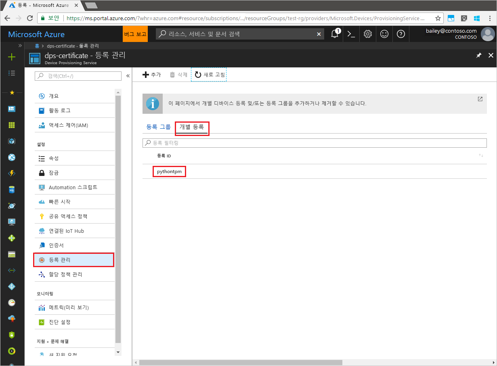

# <a name="quickstart-enroll-tpm-device-to-iot-hub-device-provisioning-service-using-python-provisioning-service-sdk"></a>빠른 시작: Python 프로비전 서비스 SDK를 사용하여 IoT Hub Device Provisioning Service에 TPM 디바이스 등록
[!INCLUDE [iot-dps-selector-quick-enroll-device-tpm](../../includes/iot-dps-selector-quick-enroll-device-tpm.md)]

다음 단계에서는 샘플 Python 애플리케이션을 통해 [Python 프로비전 서비스 SDK](https://github.com/Azure/azure-iot-sdk-python/tree/master/provisioning_service_client)를 사용하여 Azure IoT Hub Device Provisioning Service에서 TPM 장치에 대한 개별 등록을 프로그래밍 방식으로 만드는 방법을 보여 줍니다. Python 서비스 SDK는 Windows 및 Linux 컴퓨터에서 모두 작동하지만, 이 문서에서는 Windows 개발 컴퓨터를 사용하여 등록 프로세스를 안내합니다.

계속 진행하기 전에 [Azure Portal에서 IoT Hub Device Provisioning Service를 설정](./quick-setup-auto-provision.md)해야 합니다.


<a id="prepareenvironment"></a>

## <a name="prepare-the-environment"></a>환경 준비 

1. [Python 2.x 또는 3.x](https://www.python.org/downloads/)를 다운로드하고 설치합니다. 설치 프로그램의 요구 사항에 따라 32비트 또는 64비트 설치를 사용해야 합니다. 설치하는 동안 메시지가 표시되면 플랫폼 특정 환경 변수에 Python을 추가해야 합니다. 

1. 다음 옵션 중 하나를 선택합니다.

    - **Azure IoT Python SDK**를 빌드하고 컴파일합니다. [이러한 지침](https://github.com/Azure/azure-iot-sdk-python/blob/master/doc/python-devbox-setup.md)에 따라 Python 패키지를 빌드합니다. Windows OS를 사용하는 경우 [Visual C++ 재배포 가능 패키지](https://www.microsoft.com/download/confirmation.aspx?id=48145)를 설치하여 Python의 네이티브 DLL을 사용할 수 있게 합니다.

    - [*pip* Python 패키지 관리 시스템을 설치 또는 업그레이드](https://pip.pypa.io/en/stable/installing/)하고 다음 명령을 통해 패키지를 설치합니다.

        ```cmd/sh
        pip install azure-iothub-provisioningserviceclient
        ```

1. 디바이스에 대한 인증 키가 필요합니다. [시뮬레이션된 디바이스 만들기 및 프로비전](quick-create-simulated-device.md) 빠른 시작을 수행하여 시뮬레이션된 TPM 디바이스를 만든 경우 해당 디바이스에 대해 만든 키를 사용합니다. 그렇지 않으면 SDK와 함께 제공되는 다음 인증 키를 사용할 수 있습니다.

    ```
    AToAAQALAAMAsgAgg3GXZ0SEs/gakMyNRqXXJP1S124GUgtk8qHaGzMUaaoABgCAAEMAEAgAAAAAAAEAtW6MOyCu/Nih47atIIoZtlYkhLeCTiSrtRN3q6hqgOllA979No4BOcDWF90OyzJvjQknMfXS/Dx/IJIBnORgCg1YX/j4EEtO7Ase29Xd63HjvG8M94+u2XINu79rkTxeueqW7gPeRZQPnl1xYmqawYcyzJS6GKWKdoIdS+UWu6bJr58V3xwvOQI4NibXKD7htvz07jLItWTFhsWnTdZbJ7PnmfCa2vbRH/9pZIow+CcAL9mNTNNN4FdzYwapNVO+6SY/W4XU0Q+dLMCKYarqVNH5GzAWDfKT8nKzg69yQejJM8oeUWag/8odWOfbszA+iFjw3wVNrA5n8grUieRkPQ==
    ```


## <a name="modify-the-python-sample-code"></a>Python 샘플 코드 수정

이 섹션에서는 TPM 디바이스에 대한 프로비전 세부 정보를 샘플 코드에 추가하는 방법을 보여줍니다. 

1. 텍스트 편집기를 사용하여 새 **TpmEnrollment.py** 파일을 만듭니다.

1. **TpmEnrollment.py** 파일의 시작 부분에 다음 `import` 문 및 변수를 추가합니다. 그런 다음, `dpsConnectionString`을 **Azure Portal**의 **Device Provisioning Service**에서 **공유 액세스 정책** 아래에 있는 연결 문자열로 바꿉니다. `endorsementKey`를 [환경 준비](quick-enroll-device-tpm-python.md#prepareenvironment)에서 이전에 기록한 값으로 바꿉니다. 마지막으로 고유한 `registrationid`를 만들고, 소문자 영숫자와 하이픈으로만 구성되어야 합니다.  
   
    ```python
    from provisioningserviceclient import ProvisioningServiceClient
    from provisioningserviceclient.models import IndividualEnrollment, AttestationMechanism

    CONNECTION_STRING = "{dpsConnectionString}"

    ENDORSEMENT_KEY = "{endorsementKey}"

    REGISTRATION_ID = "{registrationid}"
    ```

1. 다음 함수 및 함수 호출을 추가하여 그룹 등록 만들기를 구현합니다.
   
    ```python
    def main():
        print ( "Starting individual enrollment..." )

        psc = ProvisioningServiceClient.create_from_connection_string(CONNECTION_STRING)

        att = AttestationMechanism.create_with_tpm(ENDORSEMENT_KEY)
        ie = IndividualEnrollment.create(REGISTRATION_ID, att)

        ie = psc.create_or_update(ie)
    
        print ( "Individual enrollment successful." )
    
    if __name__ == '__main__':
        main()
    ```

1. **TpmEnrollment.py** 파일을 저장하고 닫습니다.
 

## <a name="run-the-sample-tpm-enrollment"></a>샘플 TPM 등록 실행

1. 명령 프롬프트를 열고 스크립트를 실행합니다.

    ```cmd/sh
    python TpmEnrollment.py
    ```

1. 성공적으로 등록되는지 확인하기 위해 결과를 관찰합니다.

1. Azure Portal에서 프로비전 서비스로 이동합니다. **등록 관리**를 클릭합니다. 앞에서 만든 이름(`registrationid`)이 있는 TPM 디바이스가 **개별 등록** 탭 아래에 표시됩니다. 

      


## <a name="clean-up-resources"></a>리소스 정리
Java 서비스 샘플을 탐색하려면 이 빠른 시작에서 만든 리소스를 정리하지 마세요. 계속하지 않으려는 경우 다음 단계를 사용하여 이 빠른 시작에서 만든 모든 리소스를 삭제합니다.

1. 컴퓨터에서 Python 샘플 출력 창을 닫습니다.
1. 시뮬레이션된 TPM 디바이스를 만든 경우 TPM 시뮬레이터 창을 닫습니다.
1. Azure Portal에서 Device Provisioning Service로 이동하고, **등록 관리**를 클릭한 다음, **개별 등록** 탭을 선택합니다. 이 빠른 시작을 사용하여 만든 등록 항목에 대한 *등록 ID*를 선택하고, 블레이드 위쪽의 **삭제** 단추를 클릭합니다.  


## <a name="next-steps"></a>다음 단계
이 빠른 시작에서는 TPM 디바이스에 대한 개별 등록 항목을 프로그래밍 방식으로 만들고, 필요에 따라 머신에 시뮬레이션된 TPM 디바이스를 만들고, Azure IoT Hub Device Provisioning Service를 사용하여 IoT Hub에 이 디바이스를 프로비전했습니다. 디바이스 프로비전에 대해 자세히 알아보려면 Azure Portal에서 Device Provisioning Service 설치에 대한 자습서를 살펴보세요.

> [!div class="nextstepaction"]
> [Azure IoT Hub Device Provisioning Service 자습서](./tutorial-set-up-cloud.md)
