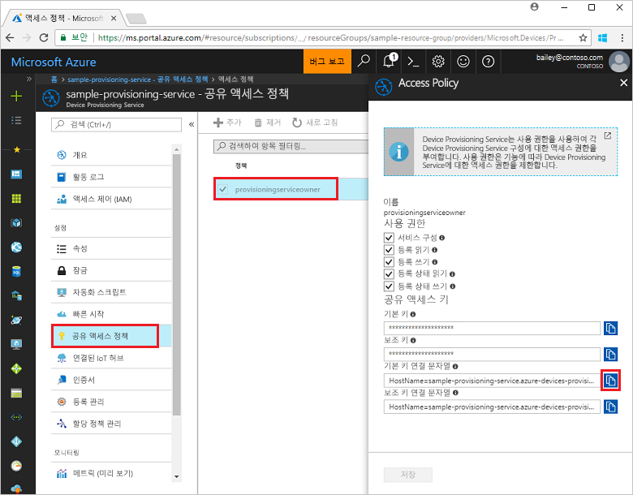
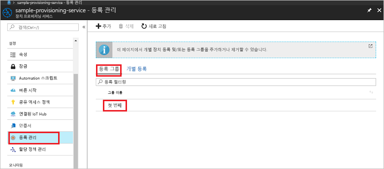

# <a name="quickstart-enroll-x509-devices-to-the-device-provisioning-service-using-nodejs"></a>빠른 시작: Node.js를 사용하여 Device Provisioning Service에 X.509 디바이스 등록

[!INCLUDE [iot-dps-selector-quick-enroll-device-x509](../../includes/iot-dps-selector-quick-enroll-device-x509.md)]

이 빠른 시작에서는 Node.js를 사용하여 중간 또는 루트 CA X.509 인증서를 사용하는 [등록 그룹](concepts-service.md#enrollment-group)을 프로그래밍 방식으로 만드는 방법을 보여줍니다. 등록 그룹은 [IoT SDK for Node.js](https://github.com/Azure/azure-iot-sdk-node) 및 샘플 Node.js 애플리케이션을 사용하여 만듭니다. 등록 그룹은 해당 인증서 체인에 일반적인 서명 인증서를 공유하는 디바이스의 프로비전 서비스에 대한 액세스를 제어합니다. 자세히 알아보려면 [X.509 인증서를 사용하여 프로비전 서비스에 대한 디바이스 액세스 제어](./concepts-security.md#controlling-device-access-to-the-provisioning-service-with-x509-certificates)를 참조하세요. Azure IoT Hub 및 Device Provisioning Service에서 X.509 인증서 기반 PKI(공개 키 인프라)를 사용하는 방법에 대한 자세한 내용은 [X.509 CA 인증서 보안 개요](https://docs.microsoft.com/azure/iot-hub/iot-hub-x509ca-overview)를 참조하세요. 

이 빠른 시작에서는 IoT 허브 및 Device Provisioning Service 인스턴스를 이미 만들었다고 예상합니다. 이러한 리소스를 아직 만들지 않은 경우 이 문서를 계속하기 전에 [Azure Portal을 사용하여 IoT Hub Device Provisioning Service 설정](./quick-setup-auto-provision.md)을 완료합니다.

이 문서의 단계는 Windows 및 Linux 머신 모두에서 작동하지만 이 문서는 Windows 개발 머신을 위해 개발되었습니다.

[!INCLUDE [quickstarts-free-trial-note](../../includes/quickstarts-free-trial-note.md)]


## <a name="prerequisites"></a>사전 요구 사항

- [Node.js v4.0 이상](https://nodejs.org)을 설치합니다.
- [Git](https://git-scm.com/download/)를 설치합니다.


## <a name="prepare-test-certificates"></a>테스트 인증서 준비

이 빠른 시작의 경우 중간 또는 루트 CA X.509 인증서의 공개 부분을 포함하는 .pem 또는 .cer 파일이 있어야 합니다. 이 인증서는 프로비전 서비스에 업로드되고 서비스에서 확인되어야 합니다. 

[Azure IoT C SDK](https://github.com/Azure/azure-iot-sdk-c)에는 X.509 인증서 체인을 만들고, 해당 체인에서 루트 또는 중간 인증서를 업로드하고, 인증서를 확인하기 위해 서비스를 통해 소유 증명을 수행하는 데 도움이 되는 테스트 도구가 포함되어 있습니다. SDK 도구를 사용하여 만든 인증서는 **개발 테스트 용도로만** 사용하도록 설계되었습니다. 이러한 인증서는 **프로덕션 환경에서 사용할 수 없습니다**. 30일 후 만료되는 하드 코드된 암호("1234")를 포함합니다. 프로덕션 사용에 적합한 인증서 가져오기에 대한 자세한 내용은 Azure IoT Hub 설명서에서 [X.509 CA 인증서를 가져오는 방법](https://docs.microsoft.com/azure/iot-hub/iot-hub-x509ca-overview#how-to-get-an-x509-ca-certificate)을 참조하세요.

이 테스트 도구를 사용하여 인증서를 생성하려면 다음 단계를 수행합니다.
 
1. Azure IoT C SDK의 [최신 릴리스](https://github.com/Azure/azure-iot-sdk-c/releases/latest)에 대한 태그 이름을 찾습니다.

2. 명령 프롬프트 또는 Git Bash 셸을 열고, 머신의 작업 폴더로 변경합니다. 다음 명령을 실행하여 [Azure IoT C SDK](https://github.com/Azure/azure-iot-sdk-c) GitHub 리포지토리의 최신 릴리스를 복제합니다. 이전 단계에서 찾은 태그를 `-b` 매개 변수의 값으로 사용합니다.

    ```cmd/sh
    git clone -b <release-tag> https://github.com/Azure/azure-iot-sdk-c.git
    cd azure-iot-sdk-c
    git submodule update --init
    ```

    이 작업을 완료하는 데 몇 분 정도가 걸립니다.

   테스트 도구는 복제한 리포지토리의 *azure-iot-sdk-c/tools/CACertificates*에 있습니다.

3. [샘플 및 자습서에 대한 테스트 CA 인증서 관리](https://github.com/Azure/azure-iot-sdk-c/blob/master/tools/CACertificates/CACertificateOverview.md)의 단계를 따릅니다. 


## <a name="create-the-enrollment-group-sample"></a>등록 그룹 샘플 만들기 

 
1. 작업 폴더의 명령 창에서 다음을 실행합니다.
  
     ```cmd\sh
     npm install azure-iot-provisioning-service
     ```  

2. 텍스트 편집기를 사용하여 작업 폴더에 **create_enrollment_group.js** 파일을 만듭니다. 다음 코드를 파일에 추가하고 저장합니다.

    ```
    'use strict';
    var fs = require('fs');

    var provisioningServiceClient = require('azure-iot-provisioning-service').ProvisioningServiceClient;

    var serviceClient = provisioningServiceClient.fromConnectionString(process.argv[2]);

    var enrollment = {
      enrollmentGroupId: 'first',
      attestation: {
        type: 'x509',
        x509: {
          signingCertificates: {
            primary: {
              certificate: fs.readFileSync(process.argv[3], 'utf-8').toString()
            }
          }
        }
      },
      provisioningStatus: 'disabled'
    };

    serviceClient.createOrUpdateEnrollmentGroup(enrollment, function(err, enrollmentResponse) {
      if (err) {
        console.log('error creating the group enrollment: ' + err);
      } else {
        console.log("enrollment record returned: " + JSON.stringify(enrollmentResponse, null, 2));
        enrollmentResponse.provisioningStatus = 'enabled';
        serviceClient.createOrUpdateEnrollmentGroup(enrollmentResponse, function(err, enrollmentResponse) {
          if (err) {
            console.log('error updating the group enrollment: ' + err);
          } else {
            console.log("updated enrollment record returned: " + JSON.stringify(enrollmentResponse, null, 2));
          }
        });
      }
    });
    ```

## <a name="run-the-enrollment-group-sample"></a>등록 그룹 샘플 실행
 
1. 샘플을 실행하려면 프로비전 서비스에 대한 연결 문자열이 필요합니다. 
    1. Azure Portal에 로그인하여 왼쪽 메뉴에서 **모든 리소스** 단추를 선택하고 Device Provisioning 서비스를 엽니다. 
    2. **공유 액세스 정책**을 클릭한 다음, 사용하려는 액세스 정책을 선택하여 해당 속성을 엽니다. **액세스 정책** 창에서 기본 키 연결 문자열을 복사하고 적어 둡니다. 

        


3. [테스트 인증서 준비](quick-enroll-device-x509-node.md#prepare-test-certificates)에서 설명한 것처럼, 프로비전 서비스를 사용하여 이전에 업로드되고 확인된 X.509 중간 또는 루트 CA 인증서가 포함된 .pem 파일도 필요합니다. 인증서가 업로드되고 확인되었는지 확인하려면 Azure Portal의 Device Provisioning Service 요약 페이지에서 **인증서**를 선택합니다. 그룹 등록에 사용하려는 인증서를 찾아 해당 상태 값이 *확인됨*인지 확인합니다.

     

1. 인증서에 대한 등록 그룹을 만들려면 다음 명령을 실행합니다(명령 인수를 따옴표로 묶음).
 
     ```cmd\sh
     node create_enrollment_group.js "<the connection string for your provisioning service>" "<your certificate's .pem file>"
     ```
 
3. 성공적으로 만들어지면 명령 창에 새 등록 그룹에 대한 속성이 표시됩니다.

     

4. 등록 그룹이 만들어졌는지 확인합니다. Azure Portal의 Device Provisioning Service 요약 블레이드에서 **등록 관리**를 선택합니다. **등록 그룹** 탭을 선택하고 새 등록 항목(*첫 번째*)이 있는지 확인합니다.

     
 
## <a name="clean-up-resources"></a>리소스 정리
Node.js 서비스 샘플을 탐색하려면 이 빠른 시작에서 만든 리소스를 정리하지 마세요. 계속하지 않으려면 다음 단계를 사용하여 이 빠른 시작에서 만든 모든 Azure 리소스를 삭제합니다.
 
1. 컴퓨터에서 Node.js 샘플 출력 창을 닫습니다.
2. Azure Portal에서 Device Provisioning Service로 이동하여 **등록 관리**를 선택한 다음, **등록 그룹** 탭을 선택합니다. 이 빠른 시작을 사용하여 등록한 X.509 디바이스의 *그룹 이름* 옆에 있는 확인란을 선택하고 창 위쪽의 **삭제** 단추를 누릅니다.    
3. Azure Portal의 Device Provisioning Service에서 **인증서**를 선택하여 이 빠른 시작을 위해 업로드한 인증서를 선택하고 **인증서 세부 정보** 창 위쪽의 **삭제** 단추를 누릅니다.  
 
## <a name="next-steps"></a>다음 단계
이 빠른 시작에서는 Azure IoT Hub Device Provisioning Service를 사용하여 X.509 중간 또는 루트 CA 인증서에 대한 그룹 등록을 만들었습니다. 디바이스 프로비전에 대해 자세히 알아보려면 Azure Portal에서 Device Provisioning Service 설치에 대한 자습서를 살펴보세요. 
 
> [!div class="nextstepaction"]
> [Azure IoT Hub Device Provisioning Service 자습서](./tutorial-set-up-cloud.md)