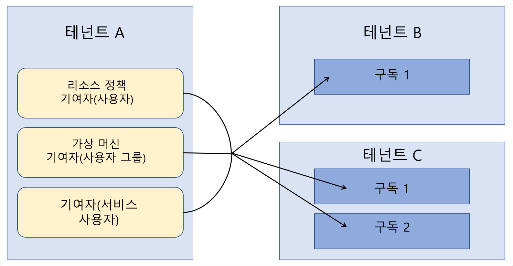

# 엔터프라이즈 시나리오의 Azure Lighthouse

[Azure Lighthouse](../overview.md) 에 대 한 일반적인 시나리오는 고객의 azure AD (Azure Active Directory) 테 넌 트에서 리소스를 관리 하는 서비스 공급자입니다. 그러나 Azure Lighthouse의 기능을 사용 하 여 여러 Azure AD 테 넌 트를 사용 하는 엔터프라이즈 내에서 교차 테 넌 트 관리를 단순화할 수도 있습니다.

## 단일 및 다중 테넌트 비교

대부분의 조직에서는 단일 Azure AD 테넌트를 사용하여 더 쉽게 관리할 수 있습니다. 모든 리소스가 한 테넌트 내에 있으면 해당 테넌트 내의 지정된 사용자, 사용자 그룹 또는 서비스 주체가 관리 작업을 중앙 집중식으로 수행할 수 있습니다. 가능한 경우에는 언제든지 하나의 테넌트만 조직에 사용하는 것이 좋습니다. 그러나 일부 조직에는 여러 Azure AD 테 넌 트가 있을 수 있습니다. 경우에 따라 가져오기가 수행 되 고 장기 테 넌 트 통합 전략이 아직 정의 되지 않은 경우 처럼 일시적인 상황이 발생할 수 있습니다. 다른 경우에는 조직에서 완전히 독립적인 자회사, 지리적 또는 법적 요구 사항 또는 기타 고려 사항으로 인해 지속적으로 여러 테 넌 트를 유지 해야 할 수도 있습니다.

다중 테 넌 트 아키텍처가 필요한 경우에는 Azure Lighthouse를 통해 관리 작업을 중앙 집중화 하 고 간소화할 수 있습니다. [Azure 위임 된 리소스 관리](azure-delegated-resource-management.md)를 사용 하 여 하나의 테 넌 트에 있는 사용자는 중앙 집중화 되 고 확장 가능한 방식으로 [교차 테 넌 트 관리 기능](cross-tenant-management-experience.md) 을 수행할 수 있습니다.

## 테넌트 관리 아키텍처

엔터프라이즈에서 Azure Lighthouse를 사용 하려면 다른 테 넌 트에서 관리 작업을 수행 하는 사용자를 포함 하는 테 넌 트를 결정 해야 합니다. 즉, 다른 테 넌 트를 관리 하는 테 넌 트를 결정 해야 합니다.

예를 들어 조직에 *테 넌 트 a* 를 호출 하는 단일 테 넌 트가 있다고 가정 합니다. 그러면 조직에서 *테 넌 트 B* 와 *테 넌 트 C* 를 획득 하 고 별도의 테 넌 트로 유지 관리 해야 하는 비즈니스 이유가 있습니다.

조직에서는 모든 테넌트에서 동일한 정책 정의, 백업 사례 및 보안 프로세스를 사용하려고 합니다. 테 넌 트 A에는 이러한 작업을 담당 하는 사용자가 이미 포함 되어 있으므로 테 넌 트 B에서 구독을 등록 하 여 테 넌 트 A의 동일한 사용자가 해당 작업을 수행할 수 있습니다.

## 보안 및 액세스 고려 사항

대부분의 엔터프라이즈 시나리오에서는 Azure Lighthouse에 전체 구독을 위임 합니다. 구독 내에서 특정 리소스 그룹만 위임 하도록 선택할 수도 있습니다.

어떤 방법을 사용 하 든, [위임 된 리소스에 대 한 액세스 권한이 있는 사용자를 정의할 때 최소 권한 원칙을 따라야](recommended-security-practices.md#assign-permissions-to-groups-using-the-principle-of-least-privilege)합니다. 이렇게 하면 필요한 작업을 수행하는 데 필요한 권한만 사용자에게 부여하고 실수로 인한 오류가 발생할 가능성을 줄일 수 있습니다.

Azure Lighthouse는 데이터 또는 리소스를 물리적으로 이동 하는 대신 관리 테 넌 트와 관리 되는 테 넌 트 간의 논리적 링크만 제공 합니다. 또한 액세스는 항상 관리 테넌트에서 관리형 테넌트로의 한 방향으로만 진행됩니다.  관리 테넌트의 사용자와 그룹은 관리형 테넌트 리소스에 대한 관리 작업을 수행할 때 다단계 인증을 계속 사용해야 합니다.

내부 또는 외부 거버넌스 및 규정 준수 가드 레일을 사용하는 엔터프라이즈는 투명성 요구 사항을 충족하기 위해 [Azure 활동 로그](../../azure-monitor/essentials/platform-logs-overview.md)를 사용할 수 있습니다. 엔터프라이즈 테 넌 트가 관리 및 관리 되는 테 넌 트 관계를 설정 하면 각 테 넌 트의 사용자가 기록 된 작업을 보고 테 넌 트의 사용자가 수행한 작업을 볼 수 있습니다.

## 온 보 딩 고려 사항

Azure Resource Manager 템플릿을 배포 하거나 Azure Marketplace에 게시 된 관리 서비스 제공을 통해 구독 또는 구독 내의 리소스 그룹을 Azure Lighthouse로 등록 수 있습니다.

엔터프라이즈 사용자는 일반적으로 엔터프라이즈 테 넌 트에 직접 액세스할 수 있으며 관리 제품을 시장 또는 홍보 하지 않아도 되기 때문에 일반적으로 빠르고 간단 하 Azure Resource Manager 템플릿을 배포할 수 있습니다. [온 보 딩 지침은](../how-to/onboard-customer.md) 서비스 공급자 및 고객을 의미 하는 반면, 기업에서는 동일한 프로세스를 사용 하 여 테 넌 트를 등록할 수 있습니다.

원하는 경우 [Azure Marketplace에 관리 서비스 제안을 게시](../how-to/publish-managed-services-offers.md)하여 엔터프라이즈 내의 테넌트를 온보딩할 수 있습니다. 제안을 적절한 테넌트에서만 사용할 수 있도록 하려면 계획이 비공개로 표시되어야 합니다. 비공개 요금제를 사용 하면 등록 하려는 각 테 넌 트의 구독 Id를 제공 하 고, 다른 사용자는 제안을 받을 수 없습니다.

## 용어 정보

엔터프라이즈 내에서 테 넌 트 간 관리를 위해 Azure Lighthouse 설명서의 서비스 공급자에 대 한 참조는 Azure Lighthouse를 통해 다른 테 넌 트의 리소스를 관리 하는 사용자를 포함 하는 테 넌 트, 기업 내에서 관리 하는 테 넌 트에 적용 하도록 이해할 수 있습니다. 마찬가지로, 고객이 관리 하는 테 넌 트의 사용자를 통해 관리할 리소스를 위임 하는 테 넌 트에 적용 하도록 고객에 대 한 모든 참조를 이해할 수 있습니다.

예를 들어 위에서 설명한 예에서 테넌트 A는 서비스 공급자 테넌트(관리 테넌트)로 간주하고, 테넌트 B와 테넌트 C는 고객 테넌트로 간주할 수 있습니다.

이 예에서 적절한 권한이 있는 테넌트 A 사용자는 Azure Portal의 **내 고객** 페이지에서 [위임된 리소스를 보고 관리](../how-to/view-manage-customers.md)할 수 있습니다. 마찬가지로 적절한 권한이 있는 테넌트 B 및 테넌트 C 사용자는 Azure Portal의 **서비스 공급자** 페이지에서 테넌트 A에 [위임된 리소스를 보고 관리](../how-to/view-manage-service-providers.md)할 수 있습니다.

## 다음 단계

- [테넌트 간 관리 환경](cross-tenant-management-experience.md)에 대해 알아봅니다.
- [Azure 위임 리소스 관리](azure-delegated-resource-management.md)에 대해 알아봅니다.