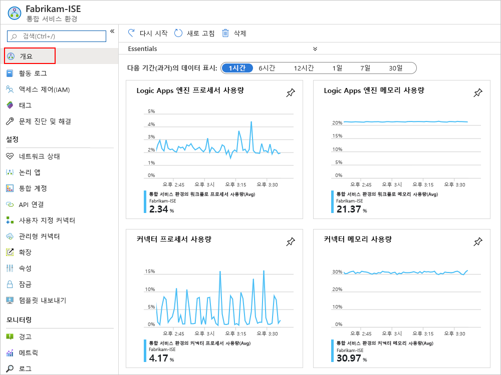
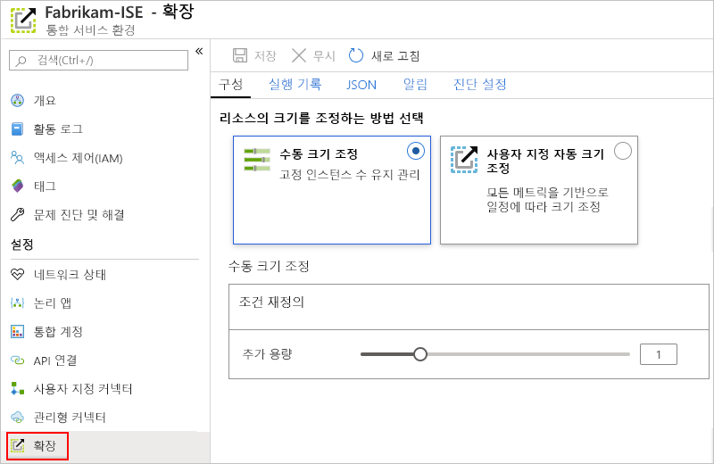
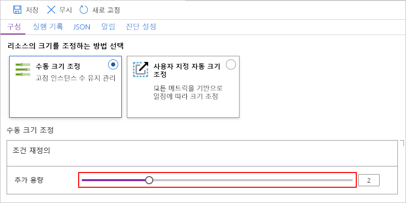
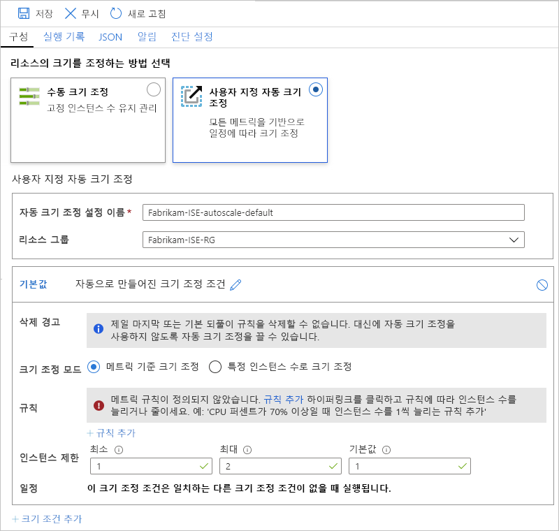

# Azure 논리 앱에서 ISE(통합 서비스 환경 관리)

이 문서에서는 [ISE(통합 서비스 환경)에](../logic-apps/connect-virtual-network-vnet-isolated-environment-overview.md)대한 관리 작업을 수행하는 방법을 보여 줍니다.

* ISE에서 논리 앱, 연결, 통합 계정 및 커넥터와 같은 리소스를 관리합니다.
* ISE의 네트워크 상태를 확인합니다.
* 용량을 추가하거나 ISE를 다시 시작하거나 ISE를 삭제하면 이 항목의 단계를 따릅니다. ISE에 이러한 아티팩트를 추가하려면 [통합 서비스 환경에 아티팩트 추가를 참조하세요.](../logic-apps/add-artifacts-integration-service-environment-ise.md)

## ISE 보기

1. [Azure 포털에](https://portal.azure.com)로그인합니다.

1. 포털의 검색 상자에서 "통합 서비스 환경"을 입력한 다음 **통합 서비스 환경을**선택합니다.

   

1. 결과 목록에서 통합 서비스 환경을 선택합니다.

   

1. 다음 섹션으로 계속 이동하여 ISE에서 논리 앱, 연결, 커넥터 또는 통합 계정을 찾습니다.

## 네트워크 상태 확인

ISE 메뉴에서 **설정에서** **네트워크 상태를**선택합니다. 이 창에는 서브넷의 상태와 다른 서비스에 대한 아웃바운드 종속성이 표시됩니다.

## 로직 앱 관리

ISE에 있는 논리 앱을 보고 관리할 수 있습니다.

1. ISE 메뉴에서 **설정에서** **논리 앱을**선택합니다.

   

1. ISE에서 더 이상 필요하지 않은 논리 앱을 제거하려면 해당 논리 앱을 선택한 다음 **삭제를**선택합니다. 삭제하려는 지 확인하려면 **예**를 선택합니다.

## API 연결 관리

ISE에서 실행되는 논리 앱에 의해 생성된 연결을 보고 관리할 수 있습니다.

1. ISE 메뉴에서 **설정에서** **API 연결을**선택합니다.

   

1. ISE에서 더 이상 필요하지 않은 연결을 제거하려면 해당 연결을 선택한 다음 **삭제를**선택합니다. 삭제하려는 지 확인하려면 **예**를 선택합니다.

## ISE 커넥터 관리

ISE에 배포된 API 커넥터를 보고 관리할 수 있습니다.

1. ISE 메뉴에서 **설정에서** **관리되는 커넥터를 선택합니다.**

   

1. ISE에서 사용할 수 없는 커넥터를 제거하려면 해당 커넥터를 선택한 다음 **삭제를**선택합니다. 삭제하려는 지 확인하려면 **예**를 선택합니다.

## 사용자 지정 커넥터 관리

ISE에 배포한 사용자 지정 커넥터를 보고 관리할 수 있습니다.

1. ISE 메뉴에서 **설정에서** **사용자 지정 커넥터를 선택합니다.**

   

1. ISE에서 더 이상 필요하지 않은 사용자 지정 커넥터를 제거하려면 해당 커넥터를 선택한 다음 **삭제를**선택합니다. 삭제하려는 지 확인하려면 **예**를 선택합니다.

## 통합 계정 관리

1. ISE 메뉴에서 **설정에서** **통합 계정을**선택합니다.

   

1. 더 이상 필요하지 않은 경우 ISE에서 통합 계정을 제거하려면 해당 통합 계정을 선택한 다음 **삭제를**선택합니다.

## ISE 용량 추가

프리미엄 ISE 기본 장치에는 고정 용량이 있으므로 처리량이 더 필요한 경우 생성 중또는 이후에 더 많은 스케일 단위를 추가할 수 있습니다. 개발자 SKU에는 축척 단위를 추가하는 기능이 포함되어 있지 않습니다.

1. Azure [포털에서](https://portal.azure.com)ISE로 이동합니다.

1. ISE의 사용 및 성능 메트릭을 검토하려면 ISE 메뉴에서 **개요를**선택합니다.

   

1. **설정에서** **배율 조정을 선택합니다.** **구성** 창에서 다음 옵션을 선택합니다.

   * [**수동 배율**](#manual-scale): 사용하려는 처리 장치 수에 따라 배율을 조정합니다.
   * [**사용자 지정 자동 크기 조정**](#custom-autoscale): 다양한 기준에서 선택하고 해당 기준을 충족하기 위한 임계값 조건을 지정하여 성능 메트릭을 기반으로 배율을 조정합니다.

   

### 수동 크기 조정

1. **추가 용량에**대해 **수동 배율**조정을 선택한 후 사용할 배율 단위 수를 선택합니다.

   

1. 완료되면 **저장**을 선택합니다.

### 사용자 지정 자동 크기 조정

1. 자동 크기 조정 설정 **이름에**대해 사용자 지정 자동 크기 **조정을**선택한 후 설정에 대한 이름을 제공하고 선택적으로 설정이 속한 Azure 리소스 그룹을 선택합니다.

   

1. **기본** 조건의 경우 **메트릭을 기준으로 배율을** 선택하거나 **특정 인스턴스 수로 배율을 조정합니다.**

   * 인스턴스 기반을 선택하는 경우 처리 단위의 번호를 입력합니다(0에서 10까지의 값).

   * 메트릭 기반을 선택하는 경우 다음 단계를 따르십시오.

     1. **규칙** 섹션에서 규칙 **추가를 선택합니다.**

     1. **[Scale] 규칙** 창에서 규칙이 트리거될 때 수행하도록 기준과 작업을 설정합니다.

     1. **예를 들어 제한은**다음 값을 지정합니다.

        * **최소**: 사용할 처리 장치의 최소 개수
        * **최대**: 사용할 최대 처리 장치 수
        * **기본값**: 리소스 메트릭을 읽는 동안 문제가 발생하고 현재 용량이 기본 용량 보다 낮은 경우 자동 크기 조정이 기본 처리 단위 수로 확장됩니다. 그러나 현재 용량이 기본 용량을 초과하면 자동 크기 조정이 확장되지 않습니다.

1. 다른 조건을 추가하려면 **축척 조건 추가를**선택합니다.

1. 자동 크기 조정 설정이 완료되면 변경 내용을 저장합니다.

## ISE 다시 시작

DNS 서버 또는 DNS 서버 설정을 변경하는 경우 ISE가 이러한 변경 사항을 선택할 수 있도록 ISE를 다시 시작해야 합니다. 프리미엄 SKU ISE를 다시 시작하면 재활용 중에 한 번에 하나씩 다시 시작하는 중복성 및 구성 요소로 인해 가동 중지 시간이 발생하지 않습니다. 그러나 개발자 SKU ISE는 중복성이 없기 때문에 가동 중지 시간이 있습니다. 자세한 내용은 [ISE SCO를](../logic-apps/connect-virtual-network-vnet-isolated-environment-overview.md#ise-level)참조하십시오.

1. Azure [포털에서](https://portal.azure.com)ISE로 이동합니다.

1. ISE 메뉴에서 **개요를 선택합니다.** 개요 도구 모음에서 **다시 시작**합니다.

   

## ISE 삭제

더 이상 필요하지 않은 ISE 또는 ISE가 포함된 Azure 리소스 그룹을 삭제하기 전에 이러한 항목이 삭제를 차단할 수 있으므로 이러한 리소스또는 Azure 가상 네트워크에 이러한 리소스가 포함된 Azure 리소스 그룹에 정책이나 잠금이 없는지 확인합니다.

ISE를 삭제한 후 Azure 가상 네트워크 또는 서브넷을 삭제하려면 최대 9시간 까지 기다려야 할 수 있습니다.

## 다음 단계

* [통합 서비스 환경에 리소스 추가](../logic-apps/add-artifacts-integration-service-environment-ise.md)