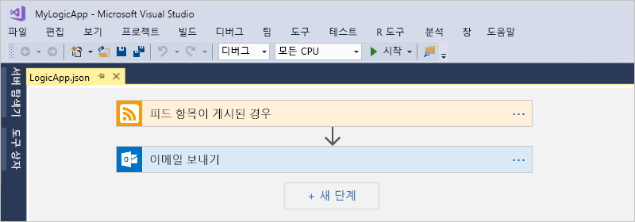
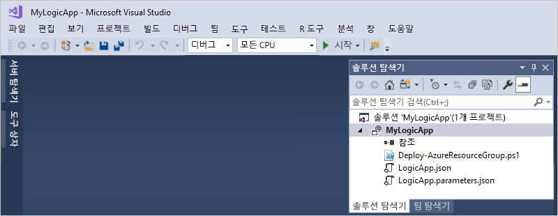
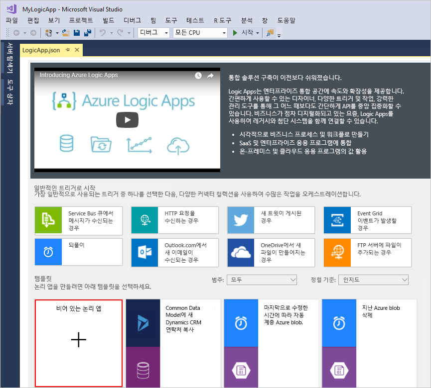
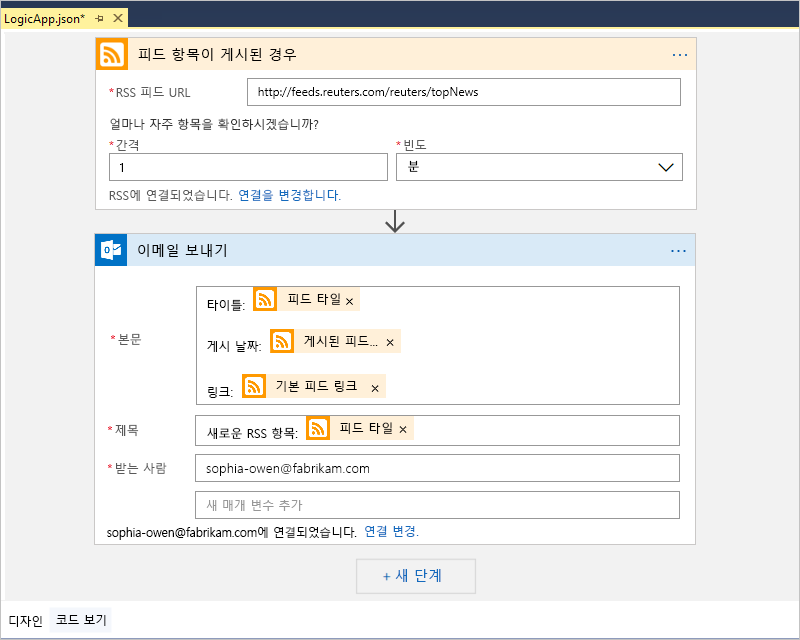
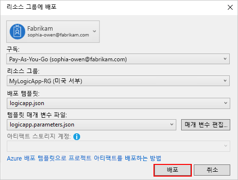
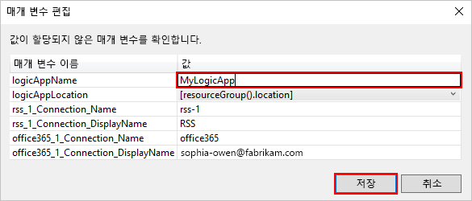
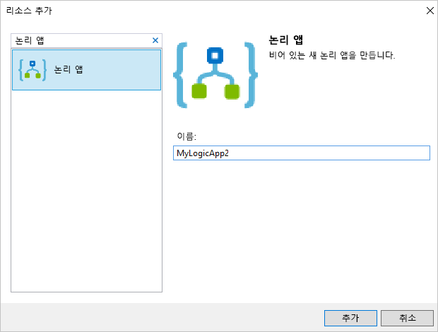
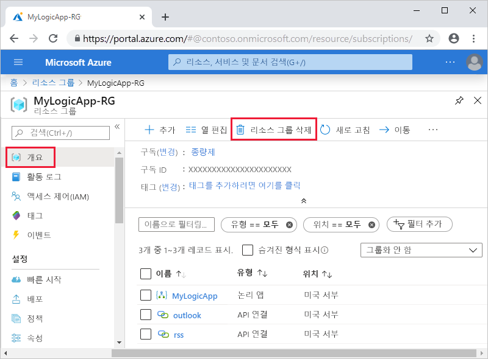

# 빠른 시작: Azure Logic Apps를 사용하여 자동화된 작업, 프로세스 및 워크플로 만들기 - Visual Studio

[Azure Logic Apps](../logic-apps/logic-apps-overview.md) 및 Visual Studio를 사용하여 기업 및 조직에서 앱, 데이터, 시스템 및 서비스를 통합하는 작업 및 프로세스를 자동화하도록 워크플로를 만들 수 있습니다. 이 빠른 시작에서는 Visual Studio에서 논리 앱을 만들고 Azure에 해당 앱을 배포하여 이러한 워크플로를 디자인하고 빌드할 수 있는 방법을 보여줍니다. Azure Portal에서 이러한 작업을 수행할 수 있다고 해도 Visual Studio를 사용하면 소스 제어에 논리 앱을 추가하고 다른 버전을 게시하고 다른 배포 환경에 대한 Azure Resource Manager 템플릿을 만들 수 있습니다.

Azure Logic Apps을 처음 사용하는 경우 기본 개념만 알아보려면 [Azure Portal에서 논리 앱을 만들기 위한 빠른 시작](../logic-apps/quickstart-create-first-logic-app-workflow.md)을 시도해보세요. 논리 앱 디자이너는 Azure Portal 및 Visual Studio에서 유사하게 작동합니다.

이 빠른 시작에서는 Visual Studio를 사용하여 Azure Portal 빠른 시작과 동일한 논리 앱을 만듭니다. [Visual Studio Code에서 예제 앱을 생성](quickstart-create-logic-apps-visual-studio-code.md)하고 [Azure CLI(Azure 명령줄 인터페이스)를 통해 논리 앱을 만들고 관리](quickstart-logic-apps-azure-cli.md)하는 방법에 대해서도 배울 수 있습니다. 이 논리 앱은 웹 사이트의 RSS 피드를 모니터링하고 해당 피드의 각 새 항목에 대한 이메일을 보냅니다. 완성한 논리 앱은 다음과 같은 대략적인 워크플로와 비슷한 모양입니다.

## 사전 요구 사항

* Azure 계정 및 구독 구독이 없는 경우 [Azure 체험 계정에 등록](https://azure.microsoft.com/free/)합니다. Azure Government 구독이 있는 경우 다음 추가 단계에 따라 [Azure Government Cloud용 Visual Studio를 설정](#azure-government)합니다.

* 다음 도구가 없으면 다운로드하여 설치합니다.

  * [Visual Studio 2019, 2017 또는 2015 - Community Edition 이상](https://aka.ms/download-visual-studio). 이 빠른 시작에서는 Visual Studio Community 2017을 사용합니다.

    > [!IMPORTANT]
    > Visual Studio 2019 또는 2017을 설치할 때는 **Azure 개발** 워크로드를 선택해야 합니다.

  * [.NET용 Microsoft Azure SDK(2.9.1 이상)](https://azure.microsoft.com/downloads/). [Azure SDK for .NET](/dotnet/azure/dotnet-tools?tabs=vs)에 대해 자세히 알아보세요.

  * [Azure PowerShell](https://github.com/Azure/azure-powershell#installation)

  * 원하는 버전에 대한 Visual Studio 확장용 최신 Azure Logic Apps 도구는 다음과 같습니다.

    * [Visual Studio 2019](https://aka.ms/download-azure-logic-apps-tools-visual-studio-2019)

    * [Visual Studio 2017](https://aka.ms/download-azure-logic-apps-tools-visual-studio-2017)

    * [Visual Studio 2015](https://aka.ms/download-azure-logic-apps-tools-visual-studio-2015)
  
    Visual Studio Marketplace에서 직접 Azure Logic Apps 도구를 다운로드해 설치하거나 [Visual Studio 내에서 이 확장을 설치하는 방법](/visualstudio/ide/finding-and-using-visual-studio-extensions)을 알아볼 수 있습니다. 설치를 완료하면 Visual Studio를 다시 시작하도록 합니다.

* 임베디드 논리 앱 디자이너를 사용하는 동안 웹에 액세스

  디자이너가 Azure에서 리소스를 만들고 논리 앱의 커넥터에서 속성 및 데이터를 읽으려면 인터넷 연결이 필요합니다.

* Microsoft 365용 Outlook, Outlook.com, Gmail 등 Logic Apps에서 지원하는 이메일 계정입니다. 다른 공급자에 대한 내용은 [여기서 커넥터 목록](/connectors/)을 검토하세요. 이 예에서는 Office 365 Outlook을 사용합니다. 다른 공급자를 사용하는 경우 전체 단계는 동일하지만 UI가 약간 다를 수 있습니다.

  > [!IMPORTANT]
  > Gmail 커넥터를 사용하려는 경우 G Suite 비즈니스 계정만 논리 앱에서 제한 없이 이 커넥터를 사용할 수 있습니다. Gmail 소비자 계정이 있는 경우 특정 Google 승인 서비스에서만 이 커넥터를 사용하거나 [Gmail 커넥터 인증에 사용할 Google 클라이언트 앱을 만들](/connectors/gmail/#authentication-and-bring-your-own-application) 수 있습니다. 자세한 내용은 [Azure Logic Apps의 Google 커넥터에 대한 데이터 보안 및 개인정보처리방침](../connectors/connectors-google-data-security-privacy-policy.md)을 참조하세요.

## Azure Government용 Visual Studio 업데이트

### Visual Studio 2017

[Visual Studio Marketplace](https://marketplace.visualstudio.com/items?itemName=SteveMichelotti.AzureEnvironmentSelector)에서 다운로드하여 설치할 수 있는 [Azure 환경 선택기 Visual Studio 확장](https://devblogs.microsoft.com/azuregov/introducing-the-azure-environment-selector-visual-studio-extension/)을 사용할 수 있습니다.

### Visual Studio 2019

Azure Logic Apps에서 Azure Government 구독을 사용하려면 [Visual Studio에 Azure Government Cloud의 검색 엔드포인트를 추가](../azure-government/documentation-government-connect-vs.md)해야 합니다. 그러나 *Azure Government 계정을 사용하여 Visual Studio에 로그인하기 전* 에 다음 단계를 수행하여 검색 엔드포인트를 추가한 후 생성된 JSON 파일의 이름을 바꿔야 합니다.

1. Visual Studio를 닫습니다.

1. 다음 위치에서 `Azure U.S. Government-A3EC617673C6C70CC6B9472656832A26.Configuration`이라는 생성된 JSON 파일을 찾습니다.

   `%localappdata%\.IdentityService\AadConfigurations`
 
1. JSON 파일의 이름을 `AadProvider.Configuration.json`으로 바꿉니다.

1. Visual Studio를 다시 시작합니다.

1. Azure Government 계정으로 로그인하는 단계를 계속 진행합니다.

이 설정을 되돌리려면 다음 위치에서 JSON 파일을 삭제하고 Visual Studio를 다시 시작합니다.

`%localappdata%\.IdentityService\AadConfigurations\AadProvider.Configuration.json`

## Azure 리소스 그룹 프로젝트 만들기

시작하려면 [Azure 리소스 그룹 프로젝트](../azure-resource-manager/templates/create-visual-studio-deployment-project.md)를 만듭니다. [Azure 리소스 그룹 및 리소스](../azure-resource-manager/management/overview.md)에 대해 자세히 알아봅니다.

1. Visual Studio를 시작합니다. Azure 계정으로 로그인합니다.

1. **파일** 메뉴에서 **새로 만들기** > **프로젝트** 를 선택합니다. (키보드: Ctrl + Shift + N)

   

1. **설치됨** 아래에서 **Visual C#** 또는 **Visual Basic** 을 선택합니다. **클라우드** > **Azure 리소스 그룹** 을 선택합니다. 예를 들어 프로젝트 이름을 지정합니다.

   

   > [!NOTE]
   > 리소스 그룹 이름은 문자, 숫자, 마침표(`.`), 밑줄(`_`), 하이픈(`-`) 및 괄호(`(`, `)`)만 포함할 수 있지만 마침표(`.`)로 *종료* 할 수 없습니다.
   >
   > **클라우드** 나 **Azure 리소스 그룹** 이 나타나지 않으면 Visual Studio 용 Azure SDK를 설치해야 합니다.

   Visual Studio 2019를 사용하는 경우 다음 단계를 따르세요.

   1. **새 프로젝트 만들기** 상자에서 Visual C# 또는 Visual Basic용 **Azure 리소스 그룹** 을 선택합니다. **다음** 을 선택합니다.

   1. 사용하려는 Azure 리소스 그룹의 이름과 기타 프로젝트 정보를 제공합니다. **만들기** 를 선택합니다.

1. 템플릿 목록에서 **논리 앱** 템플릿을 선택합니다. **확인** 을 선택합니다.

   

   Visual Studio에서 프로젝트를 만든 후 솔루션 탐색기가 열리고 솔루션이 표시됩니다. 솔루션에서 **LogicApp.json** 파일은 논리 앱 정의를 저장할 뿐만 아니라 배포에 사용할 수 있는 Azure Resource Manager 템플릿이기도 합니다.

   

## 빈 논리 앱을 만들기

Azure 리소스 그룹 프로젝트를 사용하는 경우 **빈 논리 앱** 템플릿으로 논리 앱을 만듭니다.

1. 솔루션 탐색기에서 **LogicApp.json** 파일에 대한 바로 가기 메뉴를 엽니다. **Logic Apps 디자이너를 사용하여 열기** 를 선택합니다. (키보드: Ctrl + L)

   

   > [!TIP]
   > Visual Studio 2019에 이 명령이 없으면 Visual Studio에 대한 최신 업데이트가 있는지 확인합니다.

   논리 앱 및 연결을 위한 리소스를 만들고 배포하기 위한 Azure 구독 및 Azure 리소스 그룹을 묻는 메시지가 Visual Studio에 표시됩니다.

1. **구독** 에 대해 Azure 구독을 선택합니다. **리소스 그룹** 에 대해서는 **새로 만들기** 를 선택하여 또 다른 Azure 리소스 그룹을 만듭니다.

   

   | 설정 | 예제 값 | Description |
   | ------- | ------------- | ----------- |
   | 사용자 계정 | Fabrikam   sophia-owen@fabrikam.com | Visual Studio에 로그인 할 때 사용한 계정 |
   | **구독** | Pay-As-You-Go   (sophia-owen@fabrikam.com) | Azure 구독 및 연결된 계정에 대한 이름 |
   | **리소스 그룹** | MyLogicApp-RG   (미국 서부) | 논리 앱의 리소스를 저장하고 배포하는 Azure 리소스 그룹 및 위치 |
   | **위치** | **리소스 그룹과 동일** | 논리 앱을 배포하기 위한 위치 유형 및 특정 위치입니다. 위치 유형은 Azure 지역이거나 기존 [ISE(통합 서비스 환경)](connect-virtual-network-vnet-isolated-environment.md)입니다. 
이 빠른 시작에서는 위치 유형을 **지역** 으로, 위치를 **리소스 그룹과 동일** 로 설정합니다. 
**참고** : 리소스 그룹 프로젝트를 만든 후에는 [위치 유형 및 위치를 변경](manage-logic-apps-with-visual-studio.md#change-location)할 수 있지만 위치 유형마다 다양한 방식으로 논리 앱에 영향을 줍니다. |
   ||||

1. 소개 비디오 및 많이 사용되는 트리거를 보여주는 페이지가 Logic Apps 디자이너에 열립니다. 비디오를 지나 아래로 스크롤하여 **템플릿** 을 트리거하고 **비어 있는 논리 앱** 을 선택합니다.

   

## 논리 앱 워크플로 빌드

다음으로, 새 피드 항목이 나타나면 실행되는 RSS [트리거](../logic-apps/logic-apps-overview.md#logic-app-concepts)를 추가합니다. 모든 논리 앱은 특정 조건을 충족할 경우 실행되는 트리거로 시작됩니다. 트리거가 발생될 때마다 Logic Apps 엔진은 워크플로를 실행하는 논리 앱 인스턴스를 만듭니다.

1. 논리 앱 디자이너의 검색 상자에서 **모두** 를 선택합니다. 검색 상자에 "rss"를 입력합니다. 트리거 목록에서 다음 트리거를 선택합니다. **피드 항목이 게시된 경우**

   

1. 디자이너에 트리거가 나타나면, [Azure Portal 빠른 시작](../logic-apps/quickstart-create-first-logic-app-workflow.md#add-rss-trigger)의 워크플로 단계를 수행하여 논리 앱 빌드를 마친 다음, 이 문서로 돌아옵니다. 완료 시 논리 앱은 다음 예와 같습니다.

   

1. Visual Studio 솔루션을 저장합니다. (키보드: Ctrl + S)

## Azure에 논리 앱 배포

논리 앱을 실행하고 테스트하기 전에 Visual Studio에서 Azure에 앱을 배포합니다.

1. 프로젝트 바로 가기 메뉴의 솔루션 탐색기에서 **배포** > **새로 만들기** 를 선택합니다. 메시지가 표시되면 Azure 계정으로 로그인합니다.

   

1. 이 배포에 대해서는 기본 Azure 구독, 리소스 그룹 및 다른 설정을 유지합니다. **배포** 를 선택합니다.

   

1. **매개 변수 편집** 상자가 나타나면 논리 앱의 리소스 이름을 제공합니다. 설정을 저장합니다.

   

   배포가 시작되면 Visual Studio **출력** 창에 앱의 배포 상태가 표시됩니다. 상태가 표시되지 않으면 **출력 표시** 목록을 연 다음, Azure 리소스 그룹을 선택 합니다.

   

   선택한 커넥터에 입력이 필요하면 PowerShell 창이 백그라운드에서 열리고 필요한 암호나 비밀 키를 묻는 메시지가 나타납니다. 이 정보를 입력한 후에 배포가 계속됩니다.

   

   배포가 완료되면 논리 앱이 Azure Portal에 상주하면서 지정한 일정(1분마다)에 따라 실행됩니다. 트리거가 새 피드 항목을 찾으면 트리거가 실행되어 논리 앱의 작업을 실행하는 워크플로 인스턴스를 만듭니다. 논리 앱은 각각의 새 항목에 대해 이메일을 보냅니다. 그렇지 않고, 트리거가 새 항목을 찾지 못하면 해당 트리거는 실행되지 않고 워크플로 인스턴스화도 "건너뜁니다". 논리 앱은 다음 간격까지 대기한 후 다시 확인합니다.

   논리 앱이 보내는 샘플 이메일은 다음과 같습니다. 전자 메일을 받지 못한 경우 정크 메일 폴더를 확인합니다.

   

축하합니다. Visual Studio를 사용하여 논리 앱을 성공적으로 빌드하고 배포했습니다. 논리 앱을 관리하고 해당 실행 기록을 검토하려면 [Visual Studio를 사용하여 논리 앱 관리](../logic-apps/manage-logic-apps-with-visual-studio.md)를 참조합니다.

## 새 논리 앱 추가

기존 Azure Resource Group 프로젝트가 있는 경우 JSON 개요 창을 사용하여 해당 프로젝트에 빈 논리 앱을 새로 추가할 수 있습니다.

1. 솔루션 탐색기에서 `<logic-app-name>.json` 파일을 엽니다.

1. **보기** 메뉴에서 **다른 창** > **JSON 개요** 를 선택합니다.

1. 템플릿 파일에 리소스를 추가하려면 JSON 개요 창의 위쪽에서 **리소스 추가** 를 선택합니다. 또는 JSON 개요 창에서 **리소스** 바로 가기 메뉴를 열고 **새 리소스 추가** 를 선택합니다.

   

1. **리소스 추가** 대화 상자의 검색 상자에서 `logic app`을 찾은 후 **논리 앱** 을 선택합니다. 논리 앱의 이름을 지정하고 **추가** 를 선택합니다.

   

## 리소스 정리

논리 앱 과정을 마쳤으면 논리 앱 및 관련 리소스가 포함된 리소스 그룹을 삭제합니다.

1. 논리 앱을 만드는 데 사용된 동일한 계정으로 [Azure Portal](https://portal.azure.com)에 로그인합니다.

1. Azure Portal 메뉴에서 **리소스 그룹** 을 선택하거나 검색하여 어느 페이지에서든 **리소스 그룹** 을 선택합니다. 논리 앱의 리소스 그룹을 선택합니다.

1. **개요** 페이지에서 **리소스 그룹 삭제** 를 선택합니다. 리소스 그룹 이름을 입력하여 확인하고, **삭제** 를 선택합니다.

   

1. 로컬 컴퓨터에서 Visual Studio 솔루션을 삭제합니다.

## 다음 단계

이 아티클에서는 Visual Studio를 사용하여 논리 앱을 빌드하고 배포하고 실행했습니다. Visual Studio를 사용하여 논리 앱에 대한 고급 배포를 관리하고 수행하는 방법을 알아보려면 다음 문서를 참조하세요.

> [!div class="nextstepaction"]
> [Visual Studio에서 논리 앱 관리](../logic-apps/manage-logic-apps-with-visual-studio.md)
