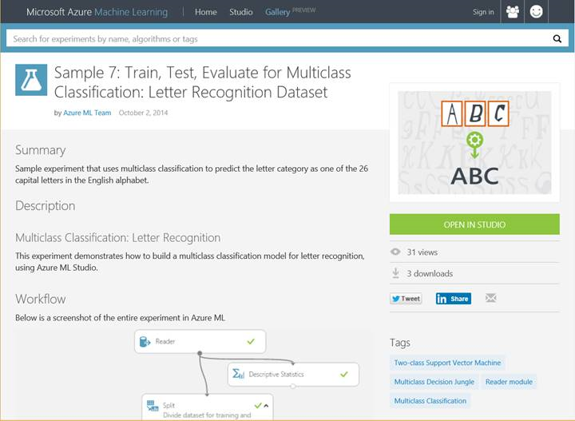
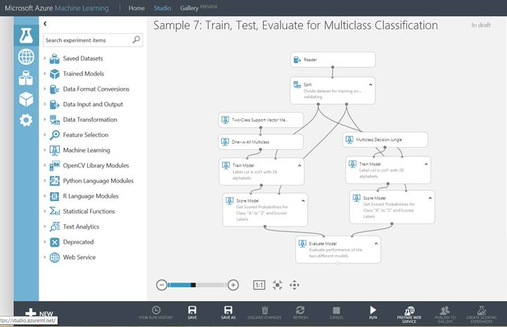

<properties 
    pageTitle="샘플 실험을 사용하여 새 실험 만들기 | Azure" 
    description="샘플 실험 및 커뮤니티에서 공유된 실험을 통해 새로운 Azure 기계 학습 실험을 만듭니다." 
    services="machine-learning" 
    documentationCenter="" 
    authors="cjgronlund" 
    manager="paulettm" 
    editor="cgronlun"/>

<tags 
    ms.service="machine-learning" 
    ms.workload="data-services" 
    ms.tgt_pltfrm="na" 
    ms.devlang="na" 
    ms.topic="article" 
    ms.date="02/16/2015" 
    ms.author="chhavib;olgali"/>

# 샘플 실험을 사용하여 새 실험 만들기
실험을 만들려는 경우 기계 학습 팀 샘플 실험 및 기계 학습 커뮤니티에서 공유된 실험에서 예를 찾아보세요. [갤러리](http://gallery.azureml.net/)에서 실험에 대한 질문을 하거나 의견을 게시할 수도 있습니다.

[AZURE.INCLUDE [machine-learning-free-trial](../includes/machine-learning-free-trial.md)]

## 갤러리 찾아보기
1. [갤러리](http://gallery.azureml.net/)로 이동합니다.
2. **추세 실험** 또는 **Microsoft 샘플**로 이동하여 찾습니다.
3. 검색 및 필터를 사용하여 결과 범위를 좁힙니다. 

4. 실험을 클릭하여 자세히 알아봅니다. 실험을 실행 및/또는 수정하려면 **Studio에서 열기**를 클릭합니다. 

5.  Microsoft 계정 자격 증명으로 로그인합니다. 아직 기계 학습 작업 영역이 없는 경우 무료 평가판 작업 영역이 만들어집니다. [기계 학습 무료 평가판에 포함된 항목 알아보기](http://azure.microsoft.com/pricing/details/machine-learning/)  

## Studio에서 템플릿으로 사용
1. Microsoft 계정 자격 증명을 사용하여 [Studio](https://studio.azureml.net)에 로그인한 다음 **새로 만들기**\*를 클릭하여 새 실험을 만듭니다. 
2. 샘플 콘텐츠를 살펴보고 템플릿으로 사용할 내용을 선택합니다.

## 다음 단계
- [데이터 준비](machine-learning-import-data.md)
- [실험에서 R 사용 시도](machine-learning-r-quickstart.md)
- [샘플 R 실험 검토](machine-learning-r-csharp-web-service-examples.md)
- [웹 서비스 API 만들기](machine-learning-publish-a-machine-learning-web-service.md)
- [바로 사용할 수 있는 응용 프로그램 찾아보기](https://datamarket.azure.com/browse?query=machine+learning)

<!--HONumber=54-->