# 빠른 시작: Machine Learning Studio(클래식)에서 첫 번째 데이터 과학 실험 만들기

**적용 대상:**  Machine Learning Studio(클래식)   [Azure Machine Learning](../overview-what-is-machine-learning-studio.md#ml-studio-classic-vs-azure-machine-learning-studio)

[!INCLUDE [Designer notice](../../../includes/designer-notice.md)]

이 빠른 시작에서는 [Azure Machine Learning Studio(클래식)](../overview-what-is-machine-learning-studio.md#ml-studio-classic-vs-azure-machine-learning-studio)에서 제조업체 및 기술 사양과 같은 다양한 변수에 따라 자동차 가격을 예측하는 기계 학습 실험을 만듭니다.

기계 학습을 처음 사용하는 경우 [초급자를 위한 데이터 과학](data-science-for-beginners-the-5-questions-data-science-answers.md) 비디오 시리즈는 일상적인 언어와 개념을 사용하는 기계 학습에 대한 훌륭한 소개입니다.

이 빠른 시작에서 수행하는 기본 실험 워크플로는 다음과 같습니다.

1. **모델 만들기**
    - [데이터 가져오기]
    - [데이터 준비]
    - [기능 정의]
1. **모델 학습**
    - [알고리즘 선택 및 적용]
1. **모델 점수 매기기 및 테스트**
    - [새 자동차 가격 예측]

[데이터 가져오기]: #get-the-data
[데이터 준비]: #prepare-the-data
[기능 정의]: #define-features
[알고리즘 선택 및 적용]: #choose-and-apply-an-algorithm
[새 자동차 가격 예측]: #predict-new-automobile-prices

## 데이터 가져오기

기계 학습에 가장 먼저 필요한 것은 데이터입니다.
사용할 수 있는 몇 가지 데이터 세트 샘플이 Studio(클래식)에 포함되어 있거나 여러 원본에서 데이터를 가져올 수 있습니다. 이 예제에서는 작업 영역에 포함되어 있는 샘플 데이터 세트, 즉 **자동차 가격 데이터(원시)** 를 사용합니다.
이 데이터 세트에는 제조업체, 모델, 기술 사양 및 가격과 같은 정보를 포함하여 여러 개별 자동차에 대한 항목이 포함되어 있습니다.

> [!TIP]
> 다음 실험의 작업 복사본은 [Azure AI Gallery](https://gallery.azure.ai)에서 찾을 수 있습니다. **[첫 번째 데이터 과학 실험 - 자동차 자격 예측](https://gallery.azure.ai/Experiment/Your-first-data-science-experiment-Automobile-price-prediction-1)** 으로 이동하고, **Studio에서 열기** 를 클릭하여 실험의 복사본을 Machine Learning Studio(클래식) 작업 영역으로 다운로드합니다.

실험에 데이터 세트를 가져오는 방법은 다음과 같습니다.

1. Machine Learning Studio(클래식) 창의 아래쪽에서 **+새로 만들기** 를 클릭하여 새 실험을 만듭니다. **실험** >  **빈 실험** 을 차례로 선택합니다.

1. 실험은 캔버스의 위쪽에서 볼 수 있는 기본 이름이 지정됩니다. 이 텍스트를 선택하고 **자동차 가격 예측** 과 같이 의미 있는 것으로 이름을 바꿉니다. 이름은 고유할 필요가 없습니다.

    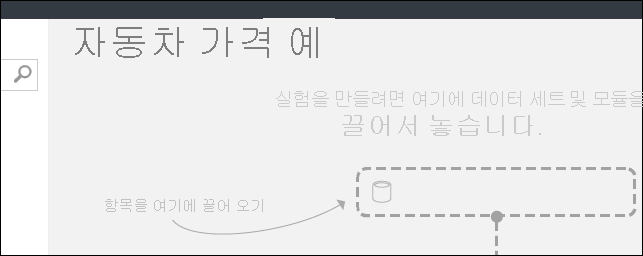

1. 실험 캔버스 왼쪽에는 데이터 세트와 모듈의 팔레트가 있습니다. 이 팔레트 맨 위에 있는 검색 상자에 **automobile** 을 입력하여 레이블이 **Automobile price data (Raw)** 인 데이터 세트를 찾습니다. 실험 캔버스에 데이터 세트를 끌어 놓습니다.

    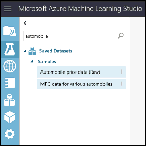

이 데이터의 모양을 확인하려면 자동차 데이터 세트의 아래쪽에 있는 출력 포트를 클릭한 다음, **시각화** 를 선택합니다.

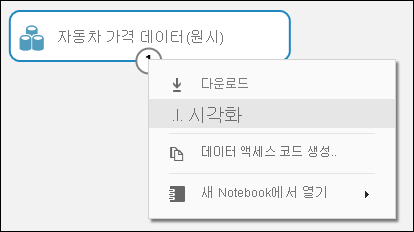

> [!TIP]
> 데이터 세트 및 모듈에는 쪽의 입력 포트, 아래쪽의 출력을 작은 원으로 나타내는 입력 및 출력 포트가 있습니다.
실험을 통해 데이터 흐름을 만들려면 한 모듈의 출력 포트를 다른 모듈의 입력 포트에 연결합니다.
언제든지 데이터 흐름에서 해당 지점에서 데이터가 어떻게 보이는지 알아보려면 데이터 세트 또는 모듈의 출력 포트를 클릭할 수 있습니다.

이 데이터 세트에서 각 행은 자동차를 나타내며, 각 자동차와 연결된 변수는 열로 표시됩니다. 특정 자동차에 대한 변수를 사용하여 가격을 맨 오른쪽 열(26열의 "가격")에 예측합니다.

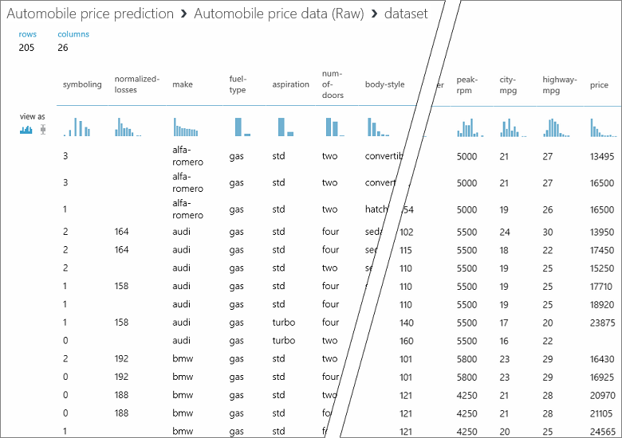

오른쪽 위 모서리에서 " **x** "를 클릭하여 시각화 창을 닫습니다.

## 데이터 준비

데이터 세트는 일반적으로 전처리를 거쳐야 분석할 수 있습니다. 여러 행의 열에 누락된 값이 있는 것을 볼 수 있습니다. 모델에서 데이터를 올바르게 분석할 수 있도록 이러한 누락된 값을 정리해야 합니다. 누락된 값이 있는 모든 행이 제거됩니다. 또한 **normalized-losses** 열에 값이 누락된 비율이 크므로 여기서는 해당 열을 모델에서 완전히 제외하겠습니다.

> [!TIP]
> 입력 데이터에서 누락 값을 정리하는 것은 대부분의 모듈을 사용하기 위한 필수 조건입니다.

먼저 **normalized-losses** 열을 완전히 제거하는 모듈을 추가합니다. 그런 다음, 데이터가 누락된 행을 제거하는 또 다른 모듈을 추가합니다.

1. 모듈 팔레트의 위쪽에 있는 검색 상자에서 **열 선택** 을 입력하여 [데이터 세트에서 열 선택][select-columns] 모듈을 찾습니다. 그런 다음, 실험 캔버스로 끌어서 놓습니다. 이 모듈을 사용하면 모델에서 포함하거나 제외할 데이터 열을 선택할 수 있습니다.

1. **자동차 가격 데이터(원시)** 데이터 세트의 출력 포트를 '데이터 세트에서 열 선택'의 입력 포트에 연결합니다.

    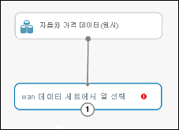

1. [데이터 세트에서 열 선택][select-columns] 모듈을 클릭하고 **속성** 창에서 **열 선택기 시작** 을 클릭합니다.

   - 왼쪽에서 **규칙으로**
   - **다음으로 시작** 에서 **모든 열** 을 클릭합니다. 이 규칙은 [데이터 세트에서 열 선택][select-columns]에서 모든 열(제외하려는 열 제외)을 통과하도록 지정합니다.
   - 다음 드롭다운에서 **제외** 및 **열 이름** 을 선택한 후 텍스트 상자 내부를 클릭합니다. 열 목록이 표시됩니다. **normalized-losses** 를 선택하면 텍스트 상자에 추가됩니다.
   - 확인 표시(OK) 단추(오른쪽 아래)를 클릭하여 열 선택기를 닫습니다.

     

     이제 **데이터 세트에서 열 선택** 의 속성 창은 **nomalized-losses** 를 제외한 데이터 세트의 모든 열을 통과한다는 것을 나타냅니다.

     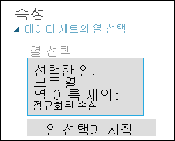

     > [!TIP] 
     > 모듈을 두 번 클릭하고 텍스트를 입력하여 모듈에 주석을 추가할 수 있습니다. 그러면 모듈이 실험에서 수행하는 내용을 한눈에 볼 수 있습니다. 이 경우 [데이터 세트에서 열 선택][select-columns] 모듈을 두 번 클릭하고 "정규화된 손실 제외"라는 주석을 입력합니다.

     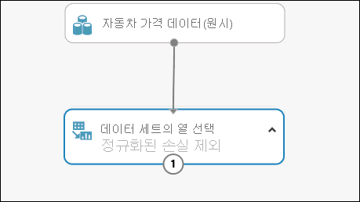

1. [누락 데이터 정리][clean-missing-data] 모듈을 실험 캔버스로 끌어 놓고 [데이터 세트에서 열 선택][select-columns] 모듈과 연결합니다. **속성** 창에서 **정리 모드** 아래 **전체 열 제거** 를 선택합니다. 이 옵션은 [누락 데이터 정리][clean-missing-data]에서 누락된 값이 있는 행을 제거하여 데이터를 정리하도록 지정합니다. 모듈을 두 번 클릭하고 주석 "Remove missing value rows"를 입력합니다.

    

1. 페이지 아래쪽의 **실행** 을 클릭하여 실험을 실행합니다.

    실험이 실행 완료되면 모든 모듈에 성공적으로 완료되었음을 나타내는 녹색 확인 표시가 표시됩니다. 오른쪽 위 모서리에서 **Finished running** 상태도 확인됩니다.

    

> [!TIP]
> 왜 지금 실험을 실행했을까요? 실험을 실행하여 데이터에 대한 열 정의는 데이터 세트에서 [누락된 데이터 정리][select-columns] 모듈을 통해, 그리고 [누락된 데이터 정리][clean-missing-data] 모듈을 통해 전달됩니다. 즉, [누락된 데이터 정리][clean-missing-data]에 연결하는 모든 모듈은 같은 정보를 갖게 됩니다.

이제 데이터가 정리되었습니다. 정리된 데이터 세트를 보려면 [누락된 데이터 정리][clean-missing-data] 모듈의 왼쪽 출력 포트를 클릭하고 **시각화** 를 선택합니다. **normalized-losses** 열이 더 이상 포함되지 않으며, 누락된 값이 없습니다.

데이터가 정리되었으며, 이제 예측 모델에서 사용할 특성을 지정할 수 있습니다.

## 기능 정의

기계 학습에서 *기능* 은 관심 있는 항목에 대한 측정 가능한 개별 속성입니다. 여기서는 데이터 세트의 각 행이 하나의 자동차를 나타내고 각 열은 해당 자동차의 기능입니다.

예측 모델을 만들기에 적절한 기능 집합을 찾으려면 해결하려는 문제에 대한 실험과 지식이 있어야 합니다. 일부 기능은 다른 기능에 비해 대상 예측에 더 유용합니다. 일부 기능은 다른 기능과 강력한 상관 관계가 있으며 제거할 수 있습니다. 예를 들어 city-mpg와 highway-mpg는 밀접한 관련이 있으므로 예측에 크게 영향을 주지 않고 하나를 유지하고 다른 하나를 제거할 수 있습니다.

데이터 세트에서 기능 하위 집합을 사용하는 모델을 빌드하겠습니다. 다시 돌아와서 다양한 특성을 선택하고 실험을 다시 실행하여 더 나은 결과가 나오는지 확인할 수 있습니다. 하지만 시작하려면 다음과 같은 기능을 시도해 보겠습니다.

> 만들기, 본문 스타일, 휠 기반, 엔진 크기, 마력, 최대 rpm, 고속도로-mpg, 가격

1. 다른 [데이터 세트에서 열 선택][select-columns] 모듈을 실험 캔버스에 끌어다 놓습니다. [누락된 데이터 정리][clean-missing-data] 모듈의 왼쪽 출력 포트를 [데이터 세트에서 열 선택][select-columns] 모듈의 입력 포트에 연결합니다.

    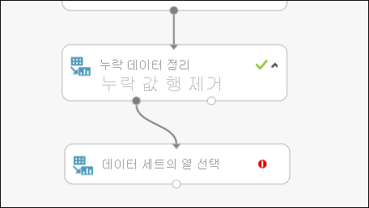

1. 모듈을 두 번 클릭하고 "Select features for prediction"을 입력합니다.

1. **Properties** 창에서 **Launch column selector** 를 클릭합니다.

1. **규칙으로** 를 클릭합니다.

1. **다음으로 시작** 에서 **열 없음** 을 클릭합니다. 필터 행에서 **포함** 및 **열 이름** 을 선택하고 텍스트 상자에 열 이름 목록을 선택합니다. 이 필터는 모듈에서 지정한 열을 제외한 모든 열(기능)을 통과하지 못하도록 지정합니다.

1. 확인 표시(확인) 단추를 클릭합니다.

    

이 모듈은 다음 단계에서 사용할 학습 알고리즘에 전달하려는 기능만 포함하도록 필터링된 데이터 세트를 생성합니다. 나중에 돌아와서 다른 선택 기능을 사용하여 다시 시도할 수 있습니다.

## 알고리즘 선택 및 적용

데이터가 준비되었으며, 예측 모델 생성은 학습과 테스트로 구성됩니다. 데이터를 사용하여 모델을 학습한 다음 모델을 테스트하여 어느 정도 근접한 가격을 예측할 수 있는지 확인합니다.
<!-- For now, don't worry about *why* we need to train and then test a model.-->

*분류* 와 *회귀* 는 감독 기계 학습 알고리즘의 두 형식입니다. 분류는 색(빨강, 파랑 또는 녹색)과 같이 정의된 범주 집합에서 답변을 예측합니다. 회귀는 숫자를 예측하는 데 사용됩니다.

숫자인 가격을 예측하기 위해 회귀 모델을 사용합니다. 이 예에서는 *선형 회귀* 모델을 사용합니다.

가격을 포함하는 데이터 집합을 부여하여 모델을 학습합니다. 이 모델은 데이터를 검색하고 자동차의 기능과 해당 가격 간의 상관 관계를 찾습니다. 그런 다음 모델 테스트합니다. 익숙한 자동차 기능 집합을 제공하고 모델이 얼마나 근접하게 알려진 가격을 예측하는지 확인합니다.

데이터 세트를 별도로 학습하고 테스트하도록 데이터를 분할하여 모델을 학습하고 테스트하는 데 모두 데이터를 사용합니다.

1. [데이터 분할][split] 모듈을 선택하여 실험 캔버스로 끌어 놓고 마지막 [데이터 세트에서 열 선택][select-columns] 모듈에 연결합니다.

1. [데이터 분할][split] 모듈을 클릭하여 선택합니다. **첫 번째 출력 데이터 세트의 행 분수** (캔버스의 오른쪽에 있는 **속성** 창에서)를 찾아서 0.75로 설정합니다. 그러면 데이터의 75%를 모델 학습에 사용하고 25%는 테스트용으로 보유합니다.

    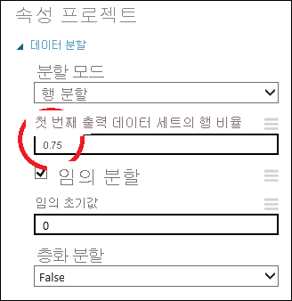

    > [!TIP]
    > **Random seed** 매개 변수를 변경하면 학습 및 테스트용으로 서로 다른 무작위 샘플을 생성할 수 있습니다. 이 매개 변수는 난수 발생기의 시드를 제어합니다.

1. 실험을 실행합니다. 실험이 실행되면 [데이터 세트에서 열 선택][select-columns] 및 [데이터 분할][split] 모듈이 다음에 추가할 모듈에 열 정의를 전달합니다.  

1. 학습 알고리즘을 선택하려면 캔버스 왼쪽의 모듈 팔레트에서 **Machine Learning** 범주를 확장한 후 **Initialize Model** 을 확장합니다. 기계 학습 알고리즘을 초기화하는 데 사용할 수 있는 몇 가지 범주의 모듈이 표시됩니다. 이 예제의 경우 **회귀** 범주 아래 [선형 회귀][linear-regression] 모듈을 선택하고 실험 캔버스로 끌어 놓습니다. (팔레트 검색 상자에 "linear regression"을 입력하여 모듈을 찾을 수도 있습니다.)

1. [모델 학습][train-model] 모듈을 찾아서 실험 캔버스로 끌어 놓습니다. [선형 회귀][linear-regression] 모듈의 출력을 [모델 학습][train-model] 모듈의 왼쪽 입력에 연결하고 [데이터 분할][split] 모듈의 학습 데이터 출력(왼쪽 포트)을 [모델 학습][train-model] 모듈의 오른쪽 입력에 연결합니다.

    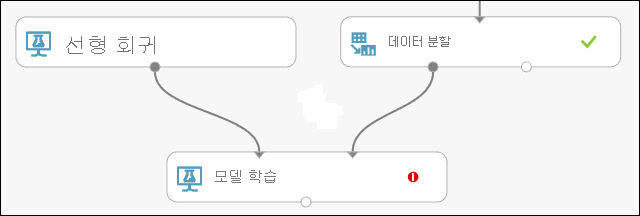

1. [모델 학습][train-model] 모듈을 선택하고 **속성** 창에서 **열 선택기 시작** 을 클릭한 다음, **가격** 열을 선택합니다. **가격** 은 모델에서 예측할 값입니다.

    **사용 가능한 열** 목록에서 가격 열을 **선택한 열** 목록으로 이동하여 열 선택기에서 **가격** 열을 선택합니다.

    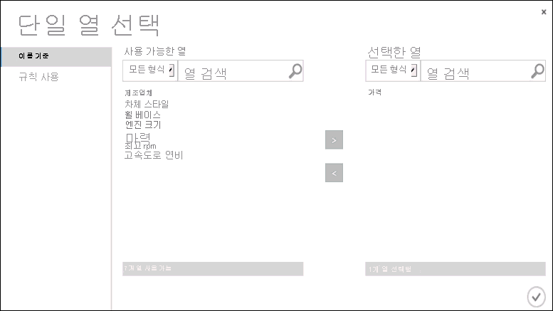

1. 실험을 실행합니다.

이제 가격을 예측하는 데 새 자동차 데이터의 점수를 매기는 데 사용할 수 있는 학습된 회귀 모델이 있습니다.

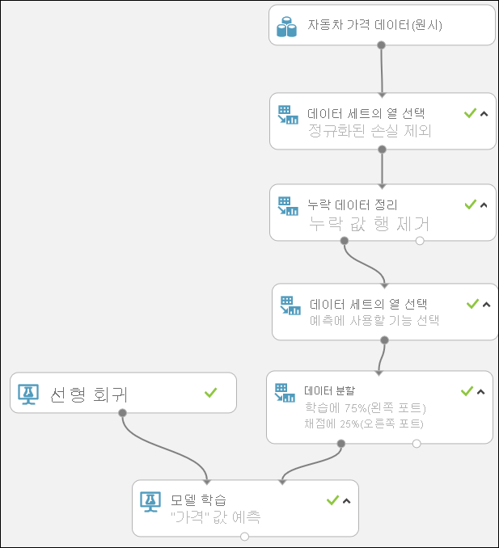

## 새 자동차 가격 예측

데이터의 75%를 사용하여 모델을 학습했으며, 이제 모델을 사용하여 나머지 25% 데이터의 점수를 매겨 모델 기능이 얼마나 좋은지 확인할 수 있습니다.

1. [모델 점수 매기기][score-model] 모듈을 찾아 실험 캔버스로 끌어 놓습니다. [모델 학습][train-model] 모듈의 출력을 [모델 점수 매기기][score-model]의 왼쪽 입력 포트에 연결합니다. [데이터 분할][split] 모듈의 테스트 데이터 출력(오른쪽 포트)을 [모델 점수 매기기][score-model]의 오른쪽 입력 포트에 연결합니다.

    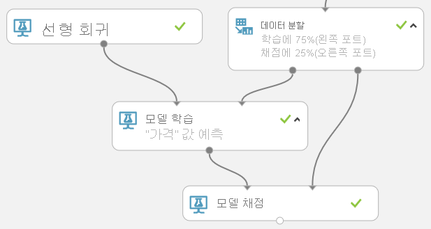

1. 실험을 실행하고, [모델 점수 매기기][score-model]의 출력 포트를 클릭하여 [모델 점수 매기기][score-model] 모듈의 출력을 보고, **시각화** 를 선택합니다. 출력에 테스트 데이터에서 가져온 알려진 값과 함께 가격 예측 값이 표시됩니다.  

    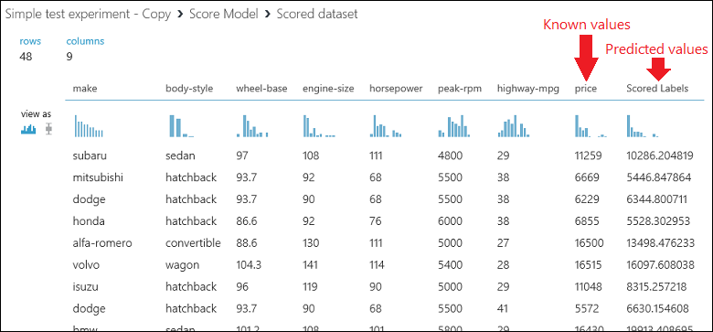

1. 마지막으로 결과의 품질을 테스트합니다. [모델 평가][evaluate-model] 모듈을 선택하여 실험 캔버스로 끌어 놓은 후 [모델 점수 매기기][score-model] 모듈의 출력 포트를 [모델 평가][evaluate-model]의 왼쪽 입력 포트에 연결합니다. 최종 실험은 다음과 같이 표시됩니다.

    

1. 실험을 실행합니다.

[모델 평가][evaluate-model] 모듈의 출력을 보려면 출력 포트를 클릭한 다음, **시각화** 를 선택합니다.

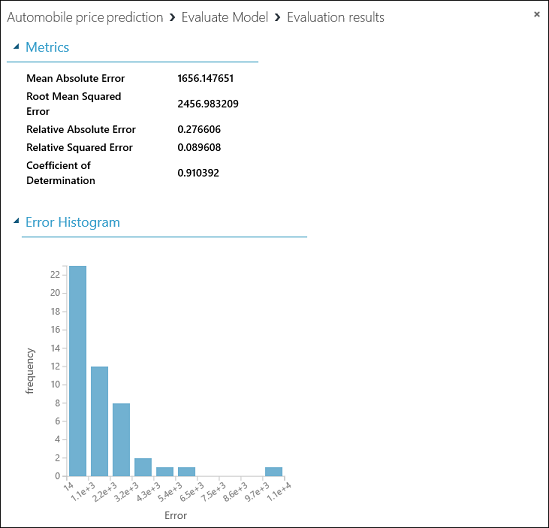

모델에 대한 다음 통계가 표시됩니다.

- MAE( **절대 평균 오차** ): 절대 평균 오차입니다(‘오차’는 예측 값과 실제 값 사이의 차이임).
- RMSE( **제곱 평균 오차** ): 테스트 데이터 세트에 대해 예측한 제곱 평균 오차의 제곱근입니다.
- **상대 절대 오차** : 실제 값과 모든 실제 값 평균 사이의 절대값 차에 대해 상대적인 절대 평균 오차입니다.
- **상대 제곱 오차** : 실제 값과 모든 실제 값 평균 사이의 제곱 차에 대해 상대적인 제곱 평균 오차입니다.
- **결정 계수** : **R 제곱 값** 이라고도 하며, 모델이 데이터에 얼마나 적합한지 나타내는 통계 메트릭입니다.

각 오차 통계는 작을수록 좋습니다. 값이 작을수록 예측이 실제 값과 더 근접하게 일치함을 나타냅니다. **결정 계수** 의 경우 값이 1(1.0)에 가까울수록 더 잘 예측한 것입니다.

## 리소스 정리

[!INCLUDE [machine-learning-studio-clean-up](../../../includes/machine-learning-studio-clean-up.md)]

## 다음 단계

이 빠른 시작에서는 샘플 데이터 세트 샘플을 사용하여 간단한 실험을 만들었습니다. 모델을 만들고 배포하는 프로세스를 자세히 살펴보려면 예측 솔루션 자습서로 계속 진행하세요.

> [!div class="nextstepaction"]
> [자습서: Studio(클래식)에서 예측 솔루션 개발](tutorial-part1-credit-risk.md)

<!-- Module References -->
[evaluate-model]: /azure/machine-learning/studio-module-reference/evaluate-model
[linear-regression]: /azure/machine-learning/studio-module-reference/linear-regression
[clean-missing-data]: /azure/machine-learning/studio-module-reference/clean-missing-data
[select-columns]: /azure/machine-learning/studio-module-reference/select-columns-in-dataset
[score-model]: /azure/machine-learning/studio-module-reference/score-model
[split]: /azure/machine-learning/studio-module-reference/split-data
[train-model]: /azure/machine-learning/studio-module-reference/train-model