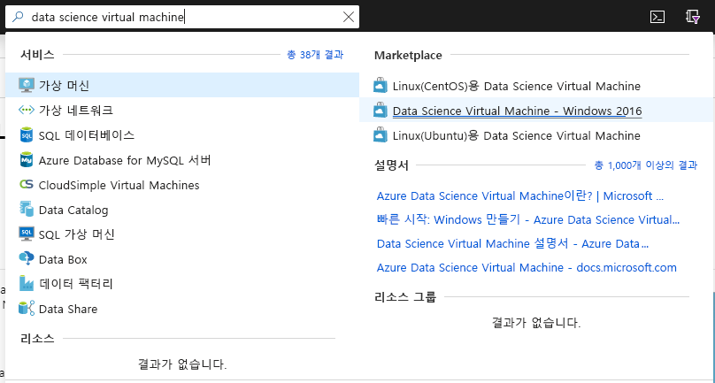
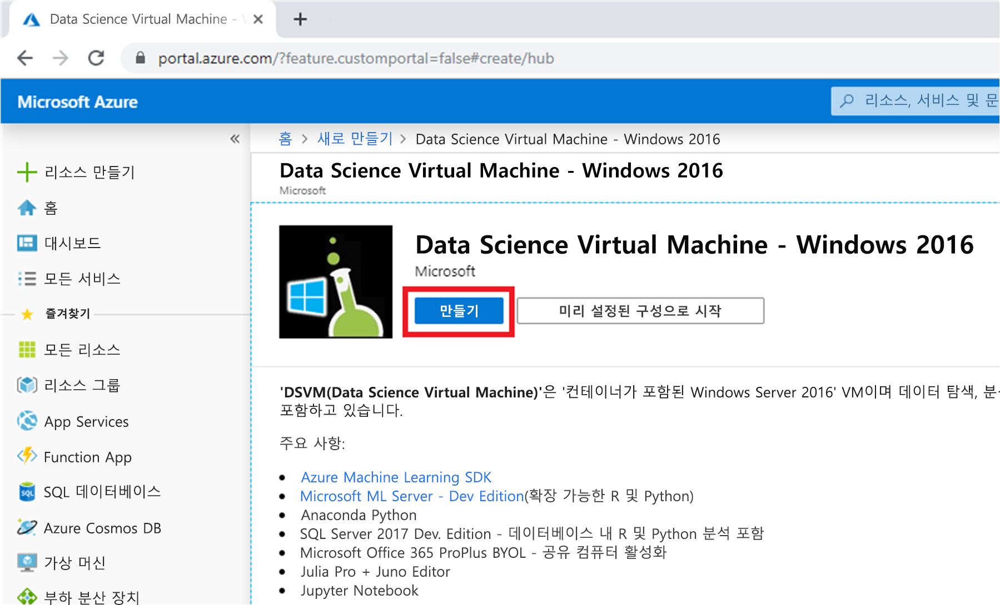
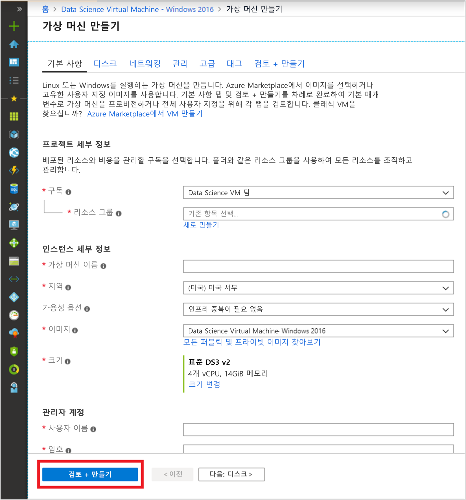

# 빠른 시작: Windows용 Data Science Virtual Machine 설정

Windows Data Science Virtual Machine을 준비하고 실행합니다.

## 필수 요소

Windows Data Science Virtual Machine을 만들려면 Azure 구독이 있어야 합니다. [Azure 평가판 체험하기](https://azure.com/free).
Azure 체험 계정은 GPU 사용 가상 머신 SKU를 지원하지 않습니다.

## DSVM 만들기

DSVM 인스턴스를 만들려면

1. [Azure Portal](https://portal.azure.com)로 이동하세요. 아직 로그인하지 않은 경우 Azure 계정에 로그인하라는 메시지가 표시될 수 있습니다.
1. "데이터 과학 가상 머신"을 입력하고 "Data Science Virtual Machine - Windows 2016"을 선택하여 가상 머신 목록을 찾습니다.

    

1. 아래쪽에 있는 **만들기** 단추를 선택합니다.

    

1. "가상 머신 만들기" 블레이드로 리디렉션됩니다.
   

1. **기본** 탭을 채웁니다.
      * **구독**: 둘 이상의 구독이 있으면 머신을 만들고 요금을 청구할 구독을 선택합니다. 이 구독에 대한 리소스 만들기 권한이 있어야 합니다.
      * **리소스 그룹**: 새 그룹을 만들거나 기존 그룹을 사용합니다.
      * **가상 머신 이름**: 가상 머신의 이름을 입력합니다. 입력한 대로 Azure Portal에 표시됩니다.
      * **위치**: 가장 적합한 데이터 센터를 선택합니다. 가장 빠른 네트워크 액세스를 위해 대부분의 데이터가 있거나 물리적 위치에 가장 가까운 데이터 센터입니다. [Azure 지역](https://azure.microsoft.com/global-infrastructure/regions/)에 대해 자세히 알아보세요.
      * **이미지**: 기본값을 그대로 둡니다.
      * **크기**: 일반 워크로드에 적합한 크기가 자동으로 채워집니다. [Azure에서 Windows VM 크기](../../virtual-machines/windows/sizes.md)에 대해 자세히 읽어보세요.
      * **사용자 이름**: 관리자 사용자 이름을 입력합니다. 가상 머신에 로그인할 때 사용할 사용자 이름이며 Azure 사용자 이름과 같지 않아도 됩니다.
      * **암호**: 가상 머신에 로그인하는 데 사용할 암호를 입력합니다.    
1. **검토 + 만들기**를 선택합니다.
1. **검토+만들기**
   * 입력한 모든 정보가 올바른지 확인합니다. 
   * **만들기**를 선택합니다.

> [!NOTE]
> * 가상 머신에 미리 로드된 소프트웨어에 대한 라이선스 요금은 지불하지 않습니다. **크기** 단계에서 선택한 서버 크기에 대한 컴퓨팅 비용을 지불합니다.
> * 프로비저닝하는 데 10~20분이 걸립니다. Azure Portal에서 VM의 상태를 볼 수 있습니다.

## DSVM에 액세스

VM을 만들고 프로비저닝한 후에 [Azure 기반 가상 머신에 연결](../../marketplace/cloud-partner-portal/virtual-machine/cpp-connect-vm.md)에 나열된 단계를 따릅니다. 가상 머신 만들기의 **기본** 단계에서 구성한 관리자 계정 자격 증명을 사용합니다. 

VM에 설치되고 구성된 도구를 사용할 준비가 되었습니다. 대부분의 도구에는 **시작** 메뉴 타일과 바탕 화면 아이콘을 통해 액세스할 수 있습니다.

또한 Azure Notebooks에 DSVM을 연결하여 VM에서 Jupyter Notebooks를 실행하고 체험 서비스 계층의 제한을 무시할 수 있습니다. 자세한 내용은 [Notebooks 프로젝트 관리 및 구성](../../notebooks/configure-manage-azure-notebooks-projects.md#manage-and-configure-projects)을 참조하세요.

## 다음 단계

* **시작** 메뉴를 열어서 DSVM의 도구를 살펴봅니다.
* [Azure Machine Learning이란?](../service/overview-what-is-azure-ml.md)을 참조하여 Azure Machine Learning에 대해 알아보고 [자습서](../index.yml)를 사용해 보세요.
* 엔터프라이즈 규모의 데이터 분석을 지원하는 R에서 RevoScaleR 라이브러리를 사용하는 샘플을 보려면 파일 탐색기에서 C:\Program Files\Microsoft\ML Server\R_SERVER\library\RevoScaleR\demoScripts로 이동합니다. 
* [Data Science Virtual Machine으로 할 수 있는 10가지 작업](https://aka.ms/dsvmtenthings) 문서를 참조합니다.
* [팀 데이터 과학 프로세스](../team-data-science-process/index.yml)를 사용하여 엔드투엔드 분석 솔루션을 체계적으로 빌드하는 방법을 알아봅니다.
* Azure에서 Azure Machine Learning 및 관련 데이터 서비스를 사용하는 기계 학습 및 데이터 분석 샘플을 보려면 [Azure AI Gallery](https://gallery.cortanaintelligence.com)를 방문합니다. 또한 가상 머신의 **시작** 메뉴 및 바탕 화면에는 이 갤러리에 대한 아이콘도 제공됩니다.

