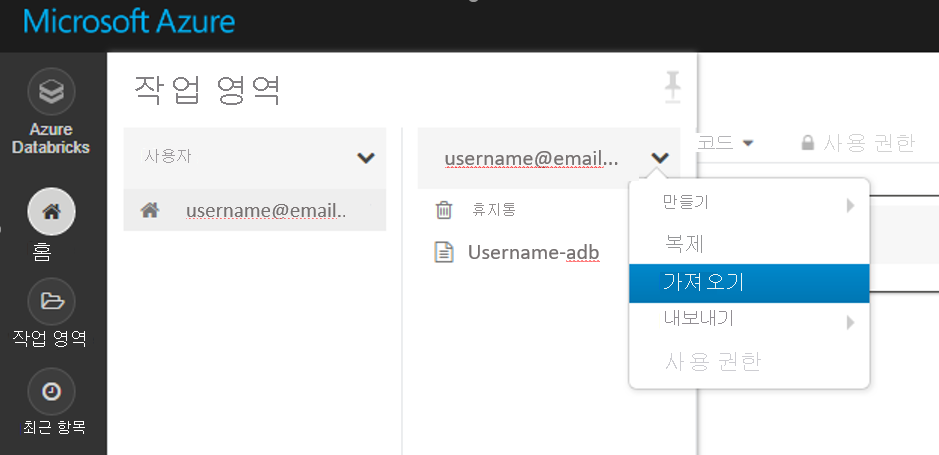

# <a name="set-up-a-development-environment-with-azure-databricks-and-automl-in-azure-machine-learning"></a>Azure Databricks 및 autoML을 사용 하 여 개발 환경 설정 Azure Machine Learning 

Azure Databricks 및 자동화 된 ML을 사용 하는 Azure Machine Learning에서 개발 환경을 구성 하는 방법에 대해 알아봅니다.

Azure Databricks는 Azure 클라우드의 확장 가능 Apache Spark 플랫폼에서 대규모의 집약적 기계 학습 워크플로를 실행 하는 데 적합 합니다. CPU 또는 GPU 기반 계산 클러스터가 포함 된 공동 노트북 기반 환경을 제공 합니다.

다른 기계 학습 개발 환경에 대 한 자세한 내용은 [Python 개발 환경 설정](how-to-configure-environment.md)을 참조 하세요.


## <a name="prerequisite"></a>필수 조건

Azure Machine Learning 작업 영역입니다. 없는 경우 [Azure Portal](how-to-manage-workspace.md), [Azure CLI](how-to-manage-workspace-cli.md#create-a-workspace)및 [Azure Resource Manager 템플릿을](how-to-create-workspace-template.md)통해 Azure Machine Learning 작업 영역을 만들 수 있습니다.


## <a name="azure-databricks-with-azure-machine-learning-and-automl"></a>Azure Machine Learning 및 autoML을 사용 하 여 Azure Databricks

Azure Databricks Azure Machine Learning 및 해당 autoML 기능과 통합 됩니다. 

Azure Databricks를 사용할 수 있습니다.

+ Spark MLlib를 사용 하 여 모델을 학습 하 고 ACI/AKS에 모델을 배포 합니다.
+ Azure ML SDK를 사용 하는 [자동화 된 기계 학습](concept-automated-ml.md) 기능 사용.
+ [Azure Machine Learning 파이프라인](concept-ml-pipelines.md)에서 계산 대상으로

## <a name="set-up-a-databricks-cluster"></a>Databricks 클러스터 설정

[Databricks 클러스터](/azure/databricks/scenarios/quickstart-create-databricks-workspace-portal)를 만듭니다. 일부 설정은 Databricks에서 자동화 된 기계 학습을 위해 SDK를 설치 하는 경우에만 적용 됩니다.

**클러스터를 만드는 데 몇 분이 걸립니다.**

사용할 설정

| 설정 |적용 대상| 값 |
|----|---|---|
| 클러스터 이름 |always| yourclustername |
| Databricks Runtime 버전 |always| 런타임 7.1 (scala 2.21, spark 3.0.0)-ML이 아님|
| Python 버전 |always| 3 |
| 작업자 유형 <br>(최대 동시 반복 횟수를 결정 합니다.) |자동화된 ML<br>전용| 메모리 최적화 VM 기본 설정 |
| 작업자 |always| 2 이상 |
| 자동 크기 조정 사용 |자동화된 ML<br>전용| 선택 취소 |

계속 진행하기 전에 클러스터가 실행될 때까지 기다립니다.

## <a name="add-the-azure-ml-sdk-to-databricks"></a>Databricks에 Azure ML SDK 추가

클러스터가 실행 되 면 [라이브러리를 만들어](https://docs.databricks.com/user-guide/libraries.html#create-a-library) 적절 한 Azure Machine Learning SDK 패키지를 클러스터에 연결 합니다. 

자동 ML을 사용 하려면 AutoML을 사용 하 [여 AZURE ML SDK 추가](#add-the-azure-ml-sdk-with-automl-to-databricks)로 건너뜁니다.


1. 라이브러리를 저장 하려는 현재 작업 영역 폴더를 마우스 오른쪽 단추로 클릭 합니다. 라이브러리 **만들기**  >  **Library** 를 선택 합니다.
    
    > [!TIP]
    > 이전 SDK 버전이 있는 경우 클러스터의 설치 된 라이브러리에서 선택을 취소 하 고 휴지통으로 이동 합니다. 새 SDK 버전을 설치하고 클러스터를 다시 시작합니다. 다시 시작한 후 문제가 발생 하면 클러스터를 분리 하 고 다시 연결 합니다.

1. 다음 옵션을 선택 합니다 (다른 SDK 설치는 지원 되지 않음).

   |SDK &nbsp; 패키지 추가 기능 &nbsp;|원본|PyPi &nbsp; 이름&nbsp;&nbsp;&nbsp;&nbsp;&nbsp;&nbsp;|
   |----|---|---|
   |Databricks의 경우| Python 업로드 Egg 또는 PyPI | azureml-sdk[databricks]|

   > [!WARNING]
   > 다른 SDK 추가 기능을 설치할 수 없습니다. [ `databricks` ] 옵션만 선택 합니다.

   * **모든 클러스터에 자동으로 연결을** 선택 하지 않습니다.
   * 클러스터 이름 옆에 있는  **연결** 을 선택 합니다.

1. 상태가 **연결** 됨으로 변경 될 때까지 오류를 모니터링 합니다 .이는 몇 분 정도 걸릴 수 있습니다.  이 단계가 실패 하는 경우:

   다음을 수행 하 여 클러스터를 다시 시작 합니다.
   1. 왼쪽 창에서 **클러스터** 를 선택합니다.
   1. 테이블에서 클러스터 이름을 선택합니다.
   1. **라이브러리** 탭에서 **다시 시작** 을 선택합니다.

   성공적인 설치는 다음과 같습니다. 

   

## <a name="add-the-azure-ml-sdk-with-automl-to-databricks"></a>Databricks에 AutoML을 사용 하 여 Azure ML SDK 추가
클러스터가 ML이 *아닌* Databricks Runtime 7.1 이상으로 만들어진 경우 노트북의 첫 번째 셀에서 다음 명령을 실행 하 여 AML SDK를 설치 합니다.

```
%pip install --upgrade --force-reinstall -r https://aka.ms/automl_linux_requirements.txt
```
7.0 이하의 Databricks Runtime [init 스크립트](https://github.com/Azure/MachineLearningNotebooks/blob/master/how-to-use-azureml/azure-databricks/automl/README.md)를 사용 하 여 Azure Machine Learning SDK를 설치 합니다.

### <a name="automl-config-settings"></a>AutoML 구성 설정

AutoML config에서 Azure Databricks 사용 하는 경우 다음 매개 변수를 추가 합니다.

- ```max_concurrent_iterations``` 는 클러스터의 작업자 노드 수를 기반으로 합니다.
- ```spark_context=sc``` 는 기본 spark 컨텍스트를 기반으로 합니다.

## <a name="ml-notebooks-that-work-with-azure-databricks"></a>Azure Databricks 사용 하는 ML 노트북

사용해보기:
+ 많은 샘플 노트북을 사용할 수 있지만 **[이러한 샘플 노트북](https://github.com/Azure/MachineLearningNotebooks/blob/master/how-to-use-azureml/azure-databricks) 만 Azure Databricks 작업을 수행 합니다.**

+ 작업 영역에서 직접 이러한 샘플을 가져옵니다. 다음을 참조 하세요. 
 

+ [Databricks를 학습 계산으로 사용 하 여 파이프라인을 만드는](how-to-create-your-first-pipeline.md)방법에 대해 알아봅니다.

## <a name="next-steps"></a>다음 단계

- MNIST 데이터 집합을 사용 하 여 Azure Machine Learning에 대 한 [모델을 학습](tutorial-train-models-with-aml.md) 합니다.
- [AZURE MACHINE LEARNING SDK For Python 참조](/python/api/overview/azure/ml/intro?preserve-view=true&view=azure-ml-py)를 참조 하세요.
