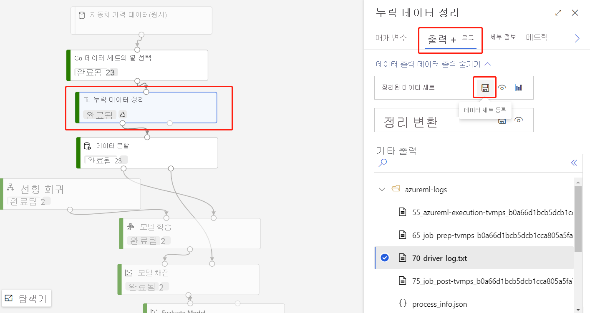

# Azure Machine Learning designer로 데이터 가져오기 (미리 보기)

이 문서에서는 사용자 지정 솔루션을 만드는 디자이너에서 사용자 고유의 데이터를 가져오는 방법에 대해 알아봅니다. 다음 두 가지 방법으로 데이터를 디자이너로 가져올 수 있습니다. 

* **Azure Machine Learning 데이터 집합** -데이터를 관리 하는 데 도움이 되는 고급 기능을 사용할 수 있도록 Azure Machine Learning의 데이터 [집합](concept-data.md#datasets) 을 등록 합니다.
* **데이터 가져오기 모듈** - [데이터 가져오기](algorithm-module-reference/import-data.md) 모듈을 사용 하 여 온라인 데이터 원본에서 데이터에 직접 액세스 합니다.

## Azure Machine Learning 데이터 집합 사용

데이터 [집합](concept-data.md#datasets) 을 사용 하 여 디자이너로 데이터를 가져오는 것이 좋습니다. 데이터 집합을 등록할 때 [버전 관리, 추적](how-to-version-track-datasets.md) 및 [데이터 모니터링과](how-to-monitor-datasets.md)같은 고급 데이터 기능을 모두 활용할 수 있습니다.

### 데이터 집합 등록

기존 데이터 집합을 [SDK를 사용 하 여 프로그래밍 방식으로](how-to-create-register-datasets.md#use-the-sdk) 등록 하거나 [Azure Machine Learning studio에서 시각적](how-to-create-register-datasets.md#use-the-ui)으로 등록할 수 있습니다.

모든 디자이너 모듈의 출력을 데이터 집합으로 등록할 수도 있습니다.

1. 등록 하려는 데이터를 출력 하는 모듈을 선택 합니다.

1. 속성 창에서 **출력** > **데이터 집합 등록**을 선택 합니다.

    

### 데이터 집합 사용

등록 된 데이터 집합은 모듈 팔레트의 **데이터** > 집합**내 데이터**집합에서 찾을 수 있습니다. 데이터 집합을 사용 하려면 파이프라인 캔버스로 끌어 놓습니다. 그런 다음 데이터 집합의 출력 포트를 색상표의 다른 모듈에 연결 합니다.

> [!NOTE]
> 디자이너는 현재 [테이블 형식 데이터 집합](how-to-create-register-datasets.md#dataset-types)처리만 지원 합니다. [파일 데이터 집합](how-to-create-register-datasets.md#dataset-types)을 사용 하려면 Python 및 R에 사용할 수 있는 Azure Machine Learning SDK를 사용 합니다.

## 데이터 가져오기 모듈을 사용 하 여 데이터 가져오기

데이터 집합을 사용 하 여 데이터를 가져오는 것이 좋지만 [데이터 가져오기](algorithm-module-reference/import-data.md) 모듈을 사용할 수도 있습니다. 데이터 가져오기 모듈은 Azure Machine Learning에서 데이터 집합 등록을 건너뛰고 데이터 [저장소](concept-data.md#datastores) 또는 HTTP URL에서 직접 데이터를 가져옵니다.

데이터 가져오기 모듈을 사용 하는 방법에 대 한 자세한 내용은 [데이터 참조 가져오기 페이지](algorithm-module-reference/import-data.md)를 참조 하세요.

> [!NOTE]
> 데이터 집합에 너무 많은 열이 있는 경우 "크기 제한으로 인해 유효성 검사에 실패 했습니다." 라는 오류가 발생할 수 있습니다. 이를 방지 하려면 데이터 집합 [인터페이스에 데이터 집합을 등록](how-to-create-register-datasets.md#use-the-ui)합니다.

## 지원 되는 원본

이 섹션에서는 디자이너가 지 원하는 데이터 원본을 나열 합니다. 데이터는 데이터 저장소 또는 [테이블 형식 데이터 집합](how-to-create-register-datasets.md#dataset-types)에서 디자이너로 제공 됩니다.

### 데이터 저장소 원본
지원 되는 데이터 저장소 원본 목록은 [Azure storage 서비스에서 데이터 액세스](how-to-access-data.md#supported-data-storage-service-types)를 참조 하세요.

### 테이블 형식 데이터 집합 소스

디자이너는 다음 원본에서 만든 테이블 형식 데이터 집합을 지원 합니다.
 * 구분 기호로 분리된 파일
 * JSON 파일
 * Parquet 파일
 * SQL 쿼리

## 데이터 형식

디자이너는 내부적으로 다음 데이터 형식을 인식 합니다.

* 문자열
* 정수
* Decimal
* 부울
* Date

디자이너는 내부 데이터 형식을 사용 하 여 모듈 간에 데이터를 전달 합니다. 데이터 [집합으로 변환](algorithm-module-reference/convert-to-dataset.md) 모듈을 사용 하 여 데이터를 데이터 테이블 형식으로 명시적으로 변환할 수 있습니다. 내부 형식이 아닌 형식을 허용 하는 모든 모듈은 데이터를 다음 모듈로 전달 하기 전에 자동으로 변환 합니다.

## 데이터 제약 조건

디자이너의 모듈은 계산 대상의 크기로 제한 됩니다. 큰 데이터 집합의 경우 더 큰 Azure Machine Learning 계산 리소스를 사용 해야 합니다. Azure Machine Learning 계산에 대 한 자세한 내용은 [Azure Machine Learning 계산 대상 이란?](concept-compute-target.md#azure-machine-learning-compute-managed) 을 참조 하세요.

## 다음 단계

디자이너를 [사용 하 여 자동차 가격 예측 자습서:](tutorial-designer-automobile-price-train-score.md)디자이너의 기본 사항에 대해 알아봅니다.
