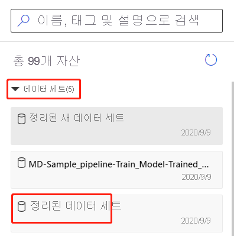

# Azure 기계 학습 디자이너로 데이터 가져오기(미리 보기)

이 문서에서는 사용자 지정 솔루션을 만들기 위해 디자이너에서 사용자 고유의 데이터를 가져오는 방법을 배웁니다. 디자이너로 데이터를 가져올 수 있는 방법에는 두 가지가 있습니다. 

* **Azure 기계 학습 데이터 집합** - Azure 기계 학습에서 데이터 [집합을](concept-data.md#datasets) 등록하여 데이터를 관리하는 데 도움이 되는 고급 기능을 활성화합니다.
* **데이터 가져오기 모듈** 가져오기 - [데이터 가져오기](algorithm-module-reference/import-data.md) 모듈을 사용하여 온라인 데이터 원본의 데이터에 직접 액세스합니다.

## Azure 기계 학습 데이터 집합 사용

[데이터 집합을](concept-data.md#datasets) 사용하여 디자이너로 데이터를 가져오는 것이 좋습니다. 데이터 집합을 등록할 때 [버전 전환 및 추적 및](how-to-version-track-datasets.md) 데이터 [모니터링과](how-to-monitor-datasets.md)같은 고급 데이터 기능을 최대한 활용할 수 있습니다.

### 데이터 집합 등록

기존 데이터 집합을 [SDK에 프로그래밍 방식으로](how-to-create-register-datasets.md#use-the-sdk) 등록하거나 Azure 기계 학습 스튜디오에서 [시각적으로 등록할](how-to-create-register-datasets.md#use-the-ui)수 있습니다.

모든 디자이너 모듈의 출력을 데이터 집합으로 등록할 수도 있습니다.

1. 등록할 데이터를 출력하는 모듈을 선택합니다.

1. 속성 창에서 출력**레지스터 데이터 집합을** **선택합니다.** > 

    

### 데이터 집합 사용

등록된 데이터 집합은 **데이터 집합** > **내 데이터 집합**의 모듈 팔레트에서 찾을 수 있습니다. 데이터 집합을 사용하려면 데이터 집합을 끌어서 파이프라인 캔버스에 놓습니다. 그런 다음 데이터 집합의 출력 포트를 팔레트의 다른 모듈에 연결합니다.

> [!NOTE]
> 디자이너는 현재 [테이블 형식 데이터 집합](how-to-create-register-datasets.md#dataset-types)처리만 지원합니다. [파일 데이터 집합을](how-to-create-register-datasets.md#dataset-types)사용하려면 Python 및 R에 사용할 수 있는 Azure 기계 학습 SDK를 사용합니다.

## 데이터 가져오기 모듈을 사용하여 데이터 가져오기

데이터 집합을 사용하여 데이터를 가져오는 것이 좋습니다. [Import Data](algorithm-module-reference/import-data.md) 데이터 가져오기 모듈은 Azure 기계 학습에서 데이터 집합등록을 건너뛰고 [데이터스토어](concept-data.md#datastores) 또는 HTTP URL에서 직접 데이터를 가져옵니다.

데이터 가져오기 모듈사용 방법에 대한 자세한 내용은 [데이터 가져오기 참조 페이지를](algorithm-module-reference/import-data.md)참조하십시오.

> [!NOTE]
> 데이터 집합에 열이 너무 많은 경우 "크기 제한으로 인해 유효성 검사가 실패했습니다"라는 오류가 발생할 수 있습니다. 이를 방지하려면 [데이터 집합 인터페이스에서 데이터 집합을 등록합니다.](how-to-create-register-datasets.md#use-the-ui)

## 지원되는 소스

이 섹션에서는 디자이너가 지원하는 데이터 원본을 나열합니다. 데이터는 데이터 스토어 또는 [테이블 형식 데이터 집합에서](how-to-create-register-datasets.md#dataset-types)디자이너로 들어옵니다.

### 데이터 스토어 원본
지원되는 데이터 스토어 원본 목록은 [Azure 저장소 서비스의 Access 데이터를](how-to-access-data.md#supported-data-storage-service-types)참조하십시오.

### 테이블 형식 데이터 집합 원본

디자이너는 다음 소스에서 만든 테이블 형식 데이터 집합을 지원합니다.
 * 구분 기호로 분리된 파일
 * JSON 파일
 * Parquet 파일
 * SQL 쿼리

## 데이터 형식

디자이너는 내부적으로 다음과 같은 데이터 형식을 인식합니다.

* String
* 정수
* Decimal
* 부울
* Date

디자이너는 내부 데이터 형식을 사용하여 모듈 간에 데이터를 전달합니다. 데이터 [집합으로 변환](algorithm-module-reference/convert-to-dataset.md) 모듈을 사용하여 데이터를 데이터 테이블 형식으로 명시적으로 변환할 수 있습니다. 내부 형식 이외의 형식을 허용하는 모든 모듈은 다음 모듈로 전달하기 전에 데이터를 자동으로 변환합니다.

## 데이터 제약 조건

디자이너의 모듈은 계산 대상의 크기에 의해 제한됩니다. 대규모 데이터 집합의 경우 더 큰 Azure 기계 학습 계산 리소스를 사용해야 합니다. Azure 기계 학습 계산에 대한 자세한 내용은 [Azure 기계 학습의 계산 대상을 참조하세요.](concept-compute-target.md#azure-machine-learning-compute-managed)

## 다음 단계

튜토리얼디자이너의 기본 사항 [알아보기: 디자이너와 함께 자동차 가격을 예측한다.](tutorial-designer-automobile-price-train-score.md)
