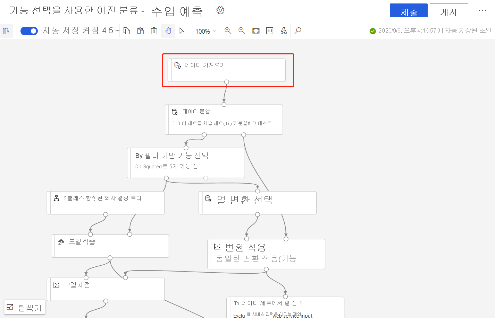

# Azure Machine Learning 디자이너(미리 보기)를 사용하여 모델 다시 학습
[!INCLUDE [applies-to-skus](../../includes/aml-applies-to-enterprise-sku.md)]

이 방법 문서에서는 Azure 기계 학습 디자이너를 사용하여 기계 학습 모델을 다시 학습하는 방법을 알아봅니다. 게시된 파이프라인을 사용하여 워크플로우를 자동화하고 매개 변수를 설정하여 새 데이터에 대한 모델을 학습합니다. 

이 문서에서는 다음 방법을 설명합니다.

> [!div class="checklist"]
> * 기계 학습 모델 학습
> * 파이프라인 매개 변수를 만듭니다.
> * 교육 파이프라인을 게시합니다.
> * 새 매개변수로 모델을 다시 학습합니다.

## 사전 요구 사항

* Enterprise SKU를 사용하는 Azure Machine Learning 작업 영역
* 디자이너가 액세스할 수 있는 데이터 집합입니다. 다음 중 하나일 수 있습니다.
   * Azure 기계 학습 등록된 데이터 집합
    
     **-또는-**
   * Azure 기계 학습 데이터 스토어에 저장된 데이터 파일입니다.
   
디자이너를 사용하여 데이터 액세스에 대한 자세한 내용은 [디자이너로 데이터를 가져오는 방법을](how-to-designer-import-data.md)참조하십시오.

또한 이 문서에서는 디자이너에서 파이프라인을 빌드하는 데 대한 기본 지식이 있다고 가정합니다. 가이드 소개를 들어, [자습서를](tutorial-designer-automobile-price-train-score.md)완료 . 

### 샘플 파이프라인

이 문서에서 사용되는 파이프라인은 샘플 [3: 소득 예측의](samples-designer.md#classification-samples)변경된 버전입니다. 파이프라인은 샘플 데이터 집합 대신 [데이터 가져오기](algorithm-module-reference/import-data.md) 모듈을 사용하여 사용자 고유의 데이터를 사용하여 모델을 학습하는 방법을 보여 줍니다.

## 파이프라인 매개 변수 만들기

파이프라인 매개 변수를 만들어 런타임시 변수를 동적으로 설정합니다. 이 예제에서는 다른 데이터에서 모델을 다시 학습할 수 있도록 학습 데이터 경로를 고정 값에서 매개 변수로 변경합니다.

1. 데이터 가져오기 모듈을 **선택합니다.**

    > [!NOTE]
    > 이 예제에서는 데이터 가져오기 모듈을 사용하여 등록된 데이터 스토어의 데이터에 액세스합니다. 그러나 대체 데이터 액세스 패턴을 사용하는 경우 유사한 단계를 따를 수 있습니다.

1. 모듈 세부 정보 창에서 캔버스 오른쪽의 데이터 원본을 선택합니다.

1. 데이터에 대한 경로를 입력합니다. **경로 찾아보기를** 선택하여 파일 트리를 찾아볼 수도 있습니다. 

1. **경로** 필드를 마우스오버하고 나타나는 **경로** 필드 위의 타원을 선택합니다.

    

1. **파이프라인 매개 변수에 추가를**선택합니다.

1. 매개 변수 이름과 기본값을 제공합니다.

   > [!NOTE]
   > 파이프라인 초안 제목 옆에 있는 **설정** 기어 아이콘을 선택하여 파이프라인 매개변수를 검사하고 편집할 수 있습니다. 

1. **저장**을 선택합니다.

1. 파이프라인 실행을 제출합니다.

## 학습된 모델 찾기

디자이너는 학습된 모델을 포함한 모든 파이프라인 출력을 기본 작업 영역 저장소 계정에 저장합니다. 디자이너에서 직접 학습된 모델에 액세스할 수도 있습니다.

1. 파이프라인실행이 완료될 때까지 기다립니다.
1. **모델 학습** 모듈을 선택합니다.
1. 모듈 세부 정보 창에서 캔버스 오른쪽에 있는 **출력 + 로그를 선택합니다.**
1. 실행 로그와 함께 **기타 출력에서** 모델을 찾을 수 있습니다.
1. 또는 출력 보기 아이콘을 **선택합니다.** 여기에서 대화 상자의 지시에 따라 데이터스토어로 직접 이동할 수 있습니다. 

## 교육 파이프라인 게시

파이프라인 끝점에 파이프라인을 게시하여 나중에 파이프라인을 쉽게 재사용할 수 있습니다. 파이프라인 끝점은 나중에 파이프라인을 호출하는 REST 끝점을 만듭니다. 이 예제에서는 파이프라인 끝점을 사용하여 파이프라인을 재사용하여 다른 데이터에서 모델을 다시 학습할 수 있습니다.

1. 디자이너 캔버스 위에 **게시를** 선택합니다.
1. 파이프라인 끝점을 선택하거나 작성합니다.

   > [!NOTE]
   > 여러 파이프라인을 단일 끝점에 게시할 수 있습니다. 지정된 끝점의 각 파이프라인에는 파이프라인 끝점을 호출할 때 지정할 수 있는 버전 번호가 지정됩니다.

1. **게시**를 선택합니다.

## 모델 다시 학습시키기

게시된 교육 파이프라인이 있으므로 이를 사용하여 새 데이터에 대한 모델을 다시 학습할 수 있습니다. 스튜디오 작업 공간에서 또는 프로그래밍 방식으로 파이프라인 끝점에서 실행을 제출할 수 있습니다.

### 디자이너를 사용하여 실행 을 제출

다음 단계를 사용하여 디자이너에서 매개 변수화된 파이프라인 끝점 실행을 제출합니다.

1. 스튜디오 작업 공간의 **끝점** 페이지로 이동합니다.
1. 파이프라인 **끝점** 탭을 선택합니다. 그런 다음 파이프라인 끝점을 선택합니다.
1. 게시된 **파이프라인 탭을 선택합니다.** 그런 다음 실행할 파이프라인 버전을 선택합니다.
1. **제출**을 선택합니다.
1. 설치 대화 상자에서 실행에 대한 매개 변수 값을 지정할 수 있습니다. 이 예제에서는 데이터 경로를 업데이트하여 US 이외의 데이터 집합을 사용하여 모델을 학습합니다.

### 코드를 사용하여 실행 제출

게시된 파이프라인의 REST 끝점은 개요 패널에서 찾을 수 있습니다. 끝점을 호출하여 게시된 파이프라인을 다시 학습할 수 있습니다.

REST 호출하려면 OAuth 2.0 베어러 유형 인증 헤더가 필요합니다. 작업 영역에 대한 인증을 설정하고 매개 변수가 설정된 REST 호출을 만드는 자세한 내용은 [일괄 처리 점수를 위한 Azure 기계 학습 파이프라인 빌드를](tutorial-pipeline-batch-scoring-classification.md#publish-and-run-from-a-rest-endpoint)참조하십시오.

## 다음 단계

이 문서에서는 디자이너를 사용하여 매개 변수화된 학습 파이프라인 끝점을 만드는 방법을 배웠습니다.

모델을 배포하여 예측하는 방법에 대한 전체 연습은 회귀 모델을 학습하고 배포하는 [디자이너 자습서를](tutorial-designer-automobile-price-train-score.md) 참조하십시오.
