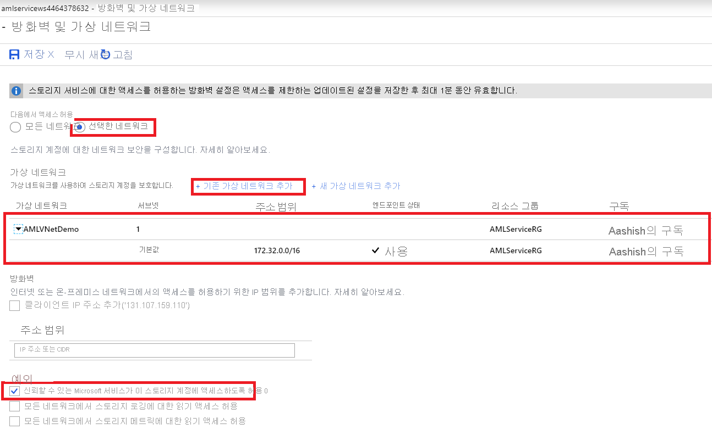
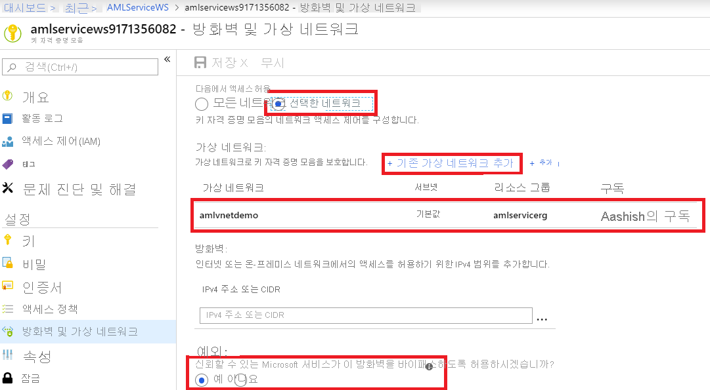

# <a name="secure-an-azure-machine-learning-workspace-with-virtual-networks"></a>가상 네트워크를 사용 하 여 Azure Machine Learning 작업 영역 보호

이 문서에서는 가상 네트워크에서 Azure Machine Learning 작업 영역 및 연결 된 리소스를 보호 하는 방법에 대해 알아봅니다.


이 문서는 Azure Machine Learning 워크플로를 보호 하는 과정을 안내 하는 5 부 시리즈의 2 부입니다. 먼저 전체 아키텍처를 이해 하려면 [1 부: VNet 개요](how-to-network-security-overview.md) 를 읽어 보는 것이 좋습니다. 

이 시리즈의 다른 문서를 참조 하세요.

[1. VNet 개요](how-to-network-security-overview.md)  >  **2. 작업 영역 3을 보호**합니다  >  [. 학습 환경 4를 안전 하 게 보호](how-to-secure-training-vnet.md)합니다  >  [. 추론 환경 5를 보호](how-to-secure-inferencing-vnet.md)합니다  >  [. 스튜디오 기능 사용](how-to-enable-studio-virtual-network.md)

이 문서에서는 가상 네트워크에서 다음 작업 영역 리소스를 사용 하도록 설정 하는 방법을 알아봅니다.
> [!div class="checklist"]
> - Azure Machine Learning 작업 영역
> - Azure Storage 계정
> - Azure Machine Learning 데이터 저장소 및 데이터 집합
> - Azure Key Vault
> - Azure Container Registry

## <a name="prerequisites"></a>사전 요구 사항

+ 일반적인 가상 네트워크 시나리오 및 전반적인 가상 네트워크 아키텍처를 이해 하려면 [네트워크 보안 개요](how-to-network-security-overview.md) 문서를 참조 하세요.

+ 계산 리소스에 사용할 기존 가상 네트워크 및 서브넷

+ 가상 네트워크 또는 서브넷에 리소스를 배포 하려면 사용자 계정에 Azure 역할 기반 액세스 제어 (RBAC)에서 다음 작업을 수행할 수 있는 권한이 있어야 합니다.

    - 가상 네트워크 리소스에 대 한 "Microsoft. Network/virtualNetworks/join/action".
    - 서브넷 리소스에 대 한 "Microsoft. Network/virtualNetworks/subnet/join/action".

    네트워크를 사용 하는 RBAC에 대 한 자세한 내용은 [네트워킹 기본 제공 역할](/azure/role-based-access-control/built-in-roles#networking) 을 참조 하세요.


## <a name="secure-the-workspace-with-private-endpoint"></a>개인 끝점을 사용 하 여 작업 영역 보호

Azure 개인 링크를 사용 하면 개인 끝점을 사용 하 여 작업 영역에 연결할 수 있습니다. 프라이빗 엔드포인트는 가상 네트워크 내에 있는 일련의 개인 IP 주소입니다. 그런 다음 개인 IP 주소를 통해서만 발생 하도록 작업 영역에 대 한 액세스를 제한할 수 있습니다. 개인 링크를 사용 하면 데이터 exfiltration의 위험을 줄일 수 있습니다.

개인 링크 작업 영역을 설정 하는 방법에 대 한 자세한 내용은 [개인 링크를 구성 하는 방법](how-to-configure-private-link.md)을 참조 하세요.


## <a name="secure-azure-storage-accounts"></a>Azure storage 계정 보호

이 섹션에서는 서비스 끝점을 사용 하 여 Azure storage 계정을 보호 하는 방법에 대해 알아봅니다. 그러나 개인 끝점을 사용 하 여 Azure storage를 보호할 수도 있습니다. 자세한 내용은 [Azure Storage 전용 끝점 사용](../storage/common/storage-private-endpoints.md)을 참조 하세요.

> [!IMPORTANT]
> Azure Machine Learning의 _기본 스토리지 계정_이나 기본이 아닌 스토리지 계정 모두를 가상 네트워크에 배치할 수 있습니다.
>
> 기본 스토리지 계정은 작업 영역을 만들 때 자동으로 프로비저닝됩니다.
>
> 기본이 아닌 스토리지 계정의 경우 [`Workspace.create()`함수](https://docs.microsoft.com/python/api/azureml-core/azureml.core.workspace%28class%29?view=azure-ml-py&preserve-view=true#create-name--auth-none--subscription-id-none--resource-group-none--location-none--create-resource-group-true--sku--basic---friendly-name-none--storage-account-none--key-vault-none--app-insights-none--container-registry-none--cmk-keyvault-none--resource-cmk-uri-none--hbi-workspace-false--default-cpu-compute-target-none--default-gpu-compute-target-none--exist-ok-false--show-output-true-)의 `storage_account` 매개 변수를 사용하여 Azure 리소스 ID로 사용자 지정 스토리지 계정을 지정할 수 있습니다.

가상 네트워크의 작업 영역에 Azure 스토리지 계정을 사용하려면 다음 단계를 사용합니다.

1. Azure Portal에서 작업 영역에서 사용 하려는 저장소 서비스로 이동 합니다.

   [](./media/how-to-enable-virtual-network/workspace-storage.png#lightbox)

1. Storage 서비스 계정 페이지에서 __방화벽 및 가상 네트워크__를 선택 합니다.

   

1. __방화벽 및 가상 네트워크__ 페이지에서 다음 작업을 수행합니다.
    1. __선택한 네트워크__를 선택합니다.
    1. __가상 네트워크__에서 __기존 가상 네트워크 추가__ 링크를 선택합니다. 이 작업을 수행 하면 계산이 있는 가상 네트워크가 추가 됩니다 (1 단계 참조).

        > [!IMPORTANT]
        > 스토리지 계정은 학습 또는 유추에 사용되는 컴퓨팅 인스턴스 또는 클러스터와 동일한 가상 네트워크 및 서브넷에 있어야 합니다.

    1. __신뢰할 수 있는 Microsoft 서비스가 이 스토리지 계정에 액세스하도록 허용합니다__ 확인란을 선택합니다.

    > [!IMPORTANT]
    > Azure Machine Learning SDK를 사용하는 경우 개발 환경에서 Azure Storage 계정에 연결할 수 있어야 합니다. 스토리지 계정이 가상 네트워크 내에 있는 경우 방화벽에서 개발 환경 IP 주소의 액세스를 반드시 허용해야 합니다.
    >
    > 스토리지 계정에 액세스가 가능하도록 설정하려면 개발 클라이언트의 웹 브라우저에서 스토리지 계정에 대한 __방화벽 및 가상 네트워크__를 방문하세요. 그런 다음, __클라이언트 IP 주소 추가__ 확인란을 사용하여 클라이언트의 IP 주소를 __주소 범위__에 추가합니다. __주소 범위__ 필드를 사용하여 개발 환경의 IP 주소를 수동으로 입력할 수도 있습니다. 클라이언트의 IP 주소가 추가되고 나면 SDK를 사용하여 스토리지 계정에 액세스할 수 있습니다.

   [](./media/how-to-enable-virtual-network/storage-firewalls-and-virtual-networks-page.png#lightbox)

## <a name="secure-datastores-and-datasets"></a>데이터 저장소 및 데이터 집합 보안

이 섹션에서는 가상 네트워크에서 SDK 환경에 대해 데이터 저장소 및 데이터 집합 사용량을 사용 하는 방법에 대해 알아봅니다. 스튜디오 환경에 대 한 자세한 내용은 [가상 네트워크에서 Azure Machine Learning Studio 사용](how-to-enable-studio-virtual-network.md)을 참조 하세요.

SDK를 사용 하 여 데이터에 액세스 하려면 데이터가 저장 되는 개별 서비스에 필요한 인증 방법을 사용 해야 합니다. 예를 들어 Azure Data Lake Store Gen2에 액세스 하기 위해 데이터 저장소를 등록 하는 경우 [Azure storage 서비스에 연결](how-to-access-data.md#azure-data-lake-storage-generation-2)에 설명 된 대로 서비스 주체를 계속 사용 해야 합니다.

### <a name="disable-data-validation"></a>데이터 유효성 검사 사용 안 함

기본적으로 Azure Machine Learning는 SDK를 사용 하 여 데이터에 액세스 하려고 할 때 데이터 유효성 및 자격 증명 확인을 수행 합니다. 데이터가 가상 네트워크 뒤에 있는 경우 Azure Machine Learning는 이러한 검사를 완료할 수 없습니다. 이를 방지 하려면 유효성 검사를 건너뛰는 데이터 저장소 및 데이터 집합을 만들어야 합니다.

### <a name="use-datastores"></a>데이터 저장소 사용

 Azure Data Lake Store Gen1 및 Azure Data Lake Store Gen2는 기본적으로 유효성 검사를 건너뛰고 추가 작업이 필요 하지 않습니다. 그러나 다음 서비스의 경우 유사한 구문을 사용 하 여 데이터 저장소 유효성 검사를 건너뛸 수 있습니다.

- Azure Blob Storage
- Azure 파일 공유
- PostgreSQL
- Azure SQL Database

다음 코드 샘플은 새 Azure Blob 데이터 저장소 및 집합을 만듭니다 `skip_validation=True` .

```python
blob_datastore = Datastore.register_azure_blob_container(workspace=ws,  

                                                         datastore_name=blob_datastore_name,  

                                                         container_name=container_name,  

                                                         account_name=account_name, 

                                                         account_key=account_key, 

                                                         skip_validation=True ) // Set skip_validation to true
```

### <a name="use-datasets"></a>데이터 집합 사용

데이터 집합 유효성 검사를 건너뛰는 구문은 다음과 같은 데이터 집합 형식에 대해 유사 합니다.
- 구분 된 파일
- JSON 
- Parquet
- SQL
- 파일

다음 코드는 새 JSON 데이터 집합을 만들고를 설정 `validate=False` 합니다.

```python
json_ds = Dataset.Tabular.from_json_lines_files(path=datastore_paths, 

validate=False) 

```

## <a name="secure-azure-key-vault"></a>보안 Azure Key Vault

Azure Machine Learning는 연결 된 Key Vault 인스턴스를 사용 하 여 다음 자격 증명을 저장 합니다.
* 연결된 스토리지 계정 연결 문자열
* Azure Container Repository 인스턴스에 대한 암호
* 데이터 저장소에 대한 연결 문자열

가상 네트워크 뒤 Azure Key Vault에서 Azure Machine Learning 실험 기능을 사용하려면 다음 단계를 사용하세요.

1. 작업 영역과 연결 된 Key Vault로 이동 합니다.

1. __Key Vault__ 페이지의 왼쪽 창에서 __네트워킹__을 선택 합니다.

1. __방화벽 및 가상 네트워크__ 탭에서 다음 작업을 수행 합니다.
    1. 다음 __에서 액세스 허용에서__ __개인 끝점 및 선택한 네트워크__를 선택 합니다.
    1. __가상 네트워크__에서 __기존 가상 네트워크 추가__를 선택하여 실험 컴퓨팅이 상주하는 가상 네트워크를 추가합니다.
    1. __신뢰할 수 있는 Microsoft 서비스에서이 방화벽을 무시 하도록 허용 하 시겠습니까?__ 에서 __예__를 선택 합니다.

   [](./media/how-to-enable-virtual-network/key-vault-firewalls-and-virtual-networks-page.png#lightbox)

## <a name="enable-azure-container-registry-acr"></a>ACR (Azure Container Registry 사용)

가상 네트워크 내에서 Azure Container Registry를 사용 하려면 다음 요구 사항을 충족 해야 합니다.

* Azure Container Registry은 프리미엄 버전 이어야 합니다. 업그레이드에 대한 자세한 내용은 [SKU 변경](/azure/container-registry/container-registry-skus#changing-skus)을 참조하세요.

* Azure Container Registry가 스토리지 계정 및 학습 또는 유추에 사용되는 컴퓨팅 대상과 동일한 가상 네트워크 및 서브넷에 있어야 합니다.

* Azure Machine Learning 작업 영역에 [Azure Machine Learning 컴퓨팅 클러스터](how-to-create-attach-compute-sdk.md#amlcompute)가 포함되어야 합니다.

    ACR이 가상 네트워크 뒤에 있으면 Azure Machine Learning에서 ACR을 사용하여 Docker 이미지를 직접 빌드할 수 없습니다. 대신 컴퓨팅 클러스터가 이미지를 빌드하는 데 사용됩니다.

* 가상 네트워크에서 Azure Machine Learning와 함께 ACR를 사용 하기 전에이 기능을 사용 하려면 지원 인시던트를 열어야 합니다. 자세한 내용은 [할당량 관리 및 늘리기](how-to-manage-quotas.md#private-endpoint-and-private-dns-quota-increases)를 참조 하세요.

이러한 요구 사항이 충족 되 면 다음 단계를 사용 하 여 Azure Container Registry를 사용 하도록 설정 합니다.

1. 다음 방법 중 하나를 사용 하 여 작업 영역에 대 한 Azure Container Registry의 이름을 찾습니다.

    __Azure Portal__

    작업 영역의 개요 섹션에 __레지스트리__ 값은 Azure Container Registry에 연결됩니다.

    :::image type="content" source="./media/how-to-enable-virtual-network/azure-machine-learning-container-registry.png" alt-text="작업 영역에 대한 Azure Container Registry" border="true":::

    __Azure CLI__

    [Azure CLI용 Machine Learning 확장을 설치](reference-azure-machine-learning-cli.md)했으면 `az ml workspace show` 명령을 사용하여 작업 영역 정보를 표시할 수 있습니다.

    ```azurecli-interactive
    az ml workspace show -w yourworkspacename -g resourcegroupname --query 'containerRegistry'
    ```

    이 명령은 `"/subscriptions/{GUID}/resourceGroups/{resourcegroupname}/providers/Microsoft.ContainerRegistry/registries/{ACRname}"`와 비슷한 값을 반환합니다. 문자열의 마지막 부분은 작업 영역에 대한 Azure Container Registry의 이름입니다.

1. [레지스트리에 대 한 네트워크 액세스 구성](../container-registry/container-registry-vnet.md#configure-network-access-for-registry)의 단계를 사용 하 여 가상 네트워크에 대 한 액세스를 제한 합니다. 가상 네트워크를 추가할 때 Azure Machine Learning 리소스에 대한 가상 네트워크와 서브넷을 선택합니다.

1. Azure Machine Learning Python SDK를 사용하여 Docker 이미지를 빌드하는 컴퓨팅 클러스터를 구성합니다. 다음 코드 조각은 수행하는 방법을 보여줍니다.

    ```python
    from azureml.core import Workspace
    # Load workspace from an existing config file
    ws = Workspace.from_config()
    # Update the workspace to use an existing compute cluster
    ws.update(image_build_compute = 'mycomputecluster')
    ```

    > [!IMPORTANT]
    > 스토리지 계정, 컴퓨팅 클러스터 및 Azure Container Registry는 모두 가상 네트워크의 동일한 서브넷에 있어야 합니다.
    
    자세한 내용은 [update ()](https://docs.microsoft.com/python/api/azureml-core/azureml.core.workspace.workspace?view=azure-ml-py&preserve-view=true#update-friendly-name-none--description-none--tags-none--image-build-compute-none--enable-data-actions-none-) 메서드 참조를 확인하세요.

1. 다음 Azure Resource Manager 템플릿을 적용 합니다. 이 템플릿을 사용하면 작업 영역이 ACR과 통신할 수 있습니다.

    ```json
    {
    "$schema": "https://schema.management.azure.com/schemas/2015-01-01/deploymentTemplate.json#",
    "contentVersion": "1.0.0.0",
    "parameters": {
        "keyVaultArmId": {
        "type": "string"
        },
        "workspaceName": {
        "type": "string"
        },
        "containerRegistryArmId": {
        "type": "string"
        },
        "applicationInsightsArmId": {
        "type": "string"
        },
        "storageAccountArmId": {
        "type": "string"
        },
        "location": {
        "type": "string"
        }
    },
    "resources": [
        {
        "type": "Microsoft.MachineLearningServices/workspaces",
        "apiVersion": "2019-11-01",
        "name": "[parameters('workspaceName')]",
        "location": "[parameters('location')]",
        "identity": {
            "type": "SystemAssigned"
        },
        "sku": {
            "tier": "basic",
            "name": "basic"
        },
        "properties": {
            "sharedPrivateLinkResources":
    [{"Name":"Acr","Properties":{"PrivateLinkResourceId":"[concat(parameters('containerRegistryArmId'), '/privateLinkResources/registry')]","GroupId":"registry","RequestMessage":"Approve","Status":"Pending"}}],
            "keyVault": "[parameters('keyVaultArmId')]",
            "containerRegistry": "[parameters('containerRegistryArmId')]",
            "applicationInsights": "[parameters('applicationInsightsArmId')]",
            "storageAccount": "[parameters('storageAccountArmId')]"
        }
        }
    ]
    }
    ```

## <a name="next-steps"></a>다음 단계

이 문서는 네 부분으로 구성 된 가상 네트워크 시리즈의 1 부입니다. 가상 네트워크를 보호 하는 방법을 알아보려면 나머지 문서를 참조 하세요.

* [1 부: 가상 네트워크 개요](how-to-network-security-overview.md)
* [3 부: 학습 환경 보안](how-to-secure-training-vnet.md)
* [4 부: 추론 환경 보안](how-to-secure-inferencing-vnet.md)
* [5 부: studio 기능 사용](how-to-enable-studio-virtual-network.md)