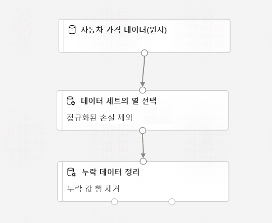
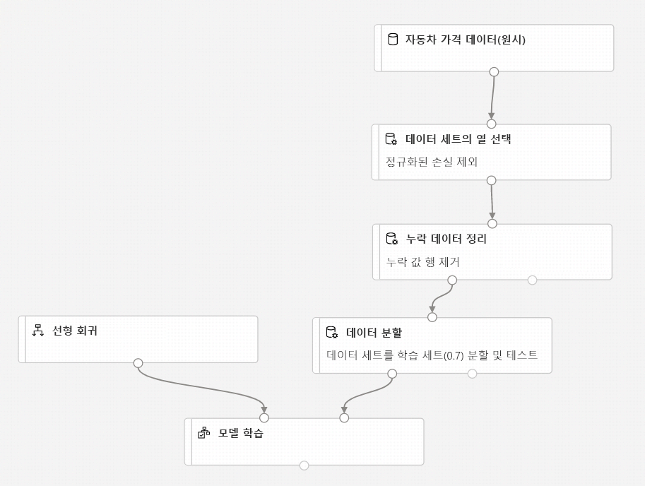
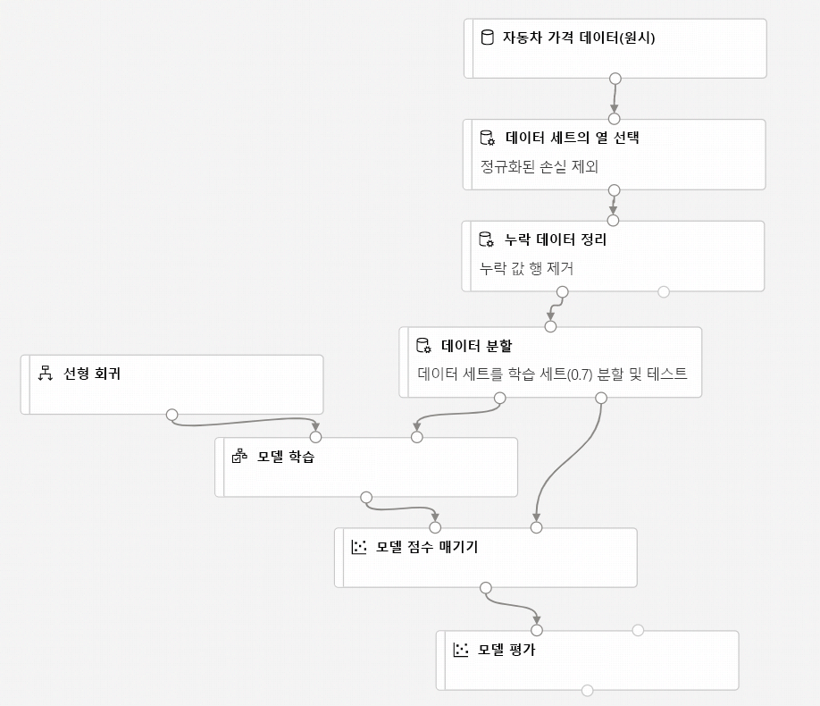
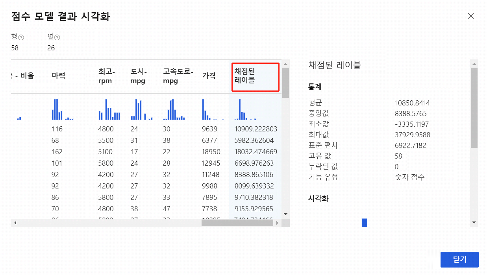

# 자습서: 디자이너를 사용하여 자동차 가격 예측
[!INCLUDE [applies-to-skus](../../includes/aml-applies-to-enterprise-sku.md)]

2부로 구성된 이 자습서에서는 Azure Machine Learning 디자이너를 사용하여 자동차의 가격을 예측하는 예측 분석 솔루션을 개발하고 배포하는 방법을 알아봅니다. 

1부에서는 환경을 설정하고, 모듈을 대화형 캔버스에 끌어오고, 서로 연결하여 Azure Machine Learning 파이프라인을 만듭니다.

이 자습서의 1부에서는 다음 방법에 대해 알아봅니다.

> [!div class="checklist"]
> * 새 파이프라인 만들기
> * 데이터 가져오기
> * 데이터 준비
> * 기계 학습 모델 학습
> * 기계 학습 모델 평가

이 자습서의 [2부](tutorial-designer-automobile-price-deploy.md)에서는 예측 모델을 실시간 유추 엔드포인트로 배포하여 보내는 기술 사양에 따라 자동차의 가격을 예측하는 방법에 대해 알아봅니다. 

> [!NOTE]
>이 자습서의 전체 버전은 샘플 파이프라인으로 사용할 수 있습니다.
>
>이를 찾으려면 작업 영역의 디자이너로 이동합니다. **새 파이프라인** 섹션에서 **샘플 1 - 회귀 분석: 자동차 가격 예측(기본)** 을 선택합니다.

## 새 파이프라인 만들기

Azure Machine Learning 파이프라인은 종속적인 여러 기계 학습 및 데이터 처리 단계를 단일 리소스로 구성합니다. 파이프라인을 사용하면 프로젝트와 사용자 간에 복잡한 기계 학습 워크플로를 구성, 관리 및 재사용할 수 있습니다. Azure Machine Learning 파이프라인을 만들려면 Azure Machine Learning 작업 영역이 필요합니다. 이 섹션에서는 이러한 두 가지 리소스를 만드는 방법에 대해 알아봅니다.

### 새 작업 영역 만들기

Enterprise 버전에 Azure Machine Learning 작업 영역이 있으면 [다음 섹션으로 건너뜁니다](#create-the-pipeline).

[!INCLUDE [aml-create-portal](../../includes/aml-create-in-portal-enterprise.md)]

### 파이프라인 만들기

1. [ml.azure.com](https://ml.azure.com)에 로그인하고, 사용하려는 작업 영역을 선택합니다.

1. **디자이너**를 선택합니다.

    

1. **사용하기 쉬운 미리 작성된 모듈**을 선택합니다.

1. 캔버스 위쪽에서 기본 파이프라인 이름인 **Pipeline-Created-on**을 선택합니다. 이름을 의미 있는 이름으로 바꿉니다. 예를 들어 *자동차 가격 예측*으로 바꿉니다. 이름은 고유할 필요가 없습니다.

## 데이터 가져오기

디자이너에는 실험에 사용할 몇 가지 샘플 데이터 세트가 포함되어 있습니다. 이 자습서에서는 **자동차 가격 데이터(원시)** 를 사용합니다. 

1. 파이프라인 캔버스의 왼쪽에는 데이터 세트와 모듈로 구성된 팔레트가 있습니다. **데이터 세트**를 선택한 다음, **샘플** 섹션에서 사용 가능한 샘플 데이터 세트를 확인합니다.

1. **자동차 가격 데이터(원시)** 데이터 세트를 선택하여 캔버스로 끕니다.

   

### 데이터 시각화

사용할 데이터 세트를 파악하기 위해 데이터를 시각화할 수 있습니다.

1. **자동차 가격 데이터(원시)** 모듈을 선택합니다.

1. 캔버스의 오른쪽에 있는 속성 창에서 **출력**을 선택합니다.

1. 그래프 아이콘을 선택하여 데이터를 시각화합니다.

    

1. 데이터 창에서 다른 열을 선택하여 각 열에 대한 정보를 확인합니다.

    각 행은 자동차를 나타내며, 각 자동차와 연결된 변수는 열로 표시됩니다. 이 데이터 세트에는 205개 행과 26개 열이 있습니다.

## 데이터 준비

데이터 세트는 일반적으로 분석하기 전에 일부 전처리가 필요 합니다. 데이터 세트를 검사할 때 일부 누락된 값이 있을 수 있습니다. 모델에서 데이터를 올바르게 분석할 수 있도록 이러한 누락된 값을 정리해야 합니다.

### 열 제거

모델이 학습되는 경우 누락된 데이터에 대한 작업을 수행해야 합니다. 이 데이터 세트의 **normalized-losses** 열에는 값이 많이 없으므로 모델에서 해당 열을 모두 제외합니다.

1. 팔레트 위쪽의 검색 상자에 **선택**을 입력하여 **데이터 세트에서 열 선택** 모듈을 찾습니다.

1. **데이터 세트에서 열 선택** 모듈을 캔버스로 끕니다. 데이터 세트 아래에 모듈을 놓습니다.

1. **자동차 가격 데이터(원시)** 데이터 세트를 **데이터 세트에서 열 선택**에 연결합니다. 데이터 세트의 출력 포트(캔버스의 데이터 세트 아래쪽에 있는 작은 원)에서 **데이터 세트에서 열 선택**의 입력 포트(모듈 위쪽에 있는 작은 원)로 끌어서 놓습니다.

    > [!TIP]
    > 한 모듈의 출력 포트를 다른 모듈의 입력 포트에 연결할 때 파이프라인을 통해 데이터 흐름을 만듭니다.
    >

    

1. **데이터 세트에서 열 선택** 모듈을 선택합니다.

1. 캔버스의 오른쪽에 있는 속성 창에서 **매개 변수** > **열 편집**을 차례로 선택합니다.

1. **+** 를 선택하여 새 규칙을 추가합니다.

1. 드롭다운 메뉴에서 **제외** 및 **열 이름**을 선택합니다.
    
1. 텍스트 상자에 *normalized-losses*를 입력합니다.

1. 오른쪽 아래에서 **저장**을 선택하여 열 선택기를 닫습니다.

    
        
    속성 창에서 **normalized-losses** 열이 제외되었음이 표시됩니다.

1. **데이터 세트에서 열 선택** 모듈을 선택합니다. 

1. 속성 창에서 **매개 변수** > **설명**을 차례로 선택하고, *정규화된 손실 제외*를 입력합니다.

### 누락 데이터 정리

**normalized-losses** 열을 제거한 후에도 누락된 값이 데이터 세트에 여전히 있습니다. **누락된 데이터 정리** 모듈을 사용하여 남아 있는 누락된 데이터를 제거할 수 있습니다.

> [!TIP]
> 대부분의 모듈을 디자이너에서 사용하려면 입력 데이터에서 누락된 값을 반드시 정리해야 합니다.

1. 검색 상자에 **정리**를 입력하여 **누락된 데이터 정리** 모듈을 찾습니다.

1. **누락된 데이터 정리** 모듈을 파이프라인 캔버스로 끌어서 놓습니다. **데이터 세트에서 열 선택** 모듈에 연결합니다. 

1. 속성 창의 **정리 모드** 아래에서 **전체 행 제거**를 선택합니다.

1. 속성 창의 **설명** 상자에서 *누락된 값 행 제거* 입력합니다. 

    파이프라인이 이제 다음과 같이 표시됩니다.
    
    

## 기계 학습 모델 학습

이제 데이터가 처리되었으므로 예측 모델을 학습시킬 수 있습니다.

### 알고리즘 선택

*분류*와 *회귀*는 감독 기계 학습 알고리즘의 두 형식입니다. 분류는 색(빨강, 파랑 또는 녹색)과 같이 정의된 범주 세트로부터 답변을 예측합니다. 회귀는 숫자를 예측하는 데 사용됩니다.

숫자인 가격을 예측하려고 하므로 회귀 알고리즘을 사용할 수 있습니다. 이 예제에서는 선형 회귀 모델을 사용합니다.

### 데이터 분할

모델을 학습시키고 테스트하기 위해 데이터를 두 개의 개별 데이터 세트로 분할합니다.

1. 검색 상자에 **데이터 분할**을 입력하여 **데이터 분할** 모듈을 찾습니다. **누락된 데이터 정리** 모듈의 왼쪽 포트에 연결합니다.

1. **데이터** 분할 모듈을 선택합니다.

1. 속성 창에서 **첫 번째 출력 데이터 세트의 행 비율**을 0.7로 설정합니다.

    그러면 모델의 학습을 위해 데이터의 70%를 분할하고, 테스트를 위해 30%를 분할합니다.

1. 속성 창의 **설명** 상자에서 *데이터 세트를 학습 세트(0.7) 및 테스트 세트(0.3)로 분할*을 입력합니다.

### 모델 학습

가격을 포함하는 데이터 세트를 부여하여 모델을 학습합니다. 모델에서 데이터를 검사하고, 모델을 구성하기 위해 자동차의 기능과 가격 사이의 상관 관계를 검색합니다.

1. 학습 알고리즘을 선택하려면 모듈 팔레트 검색 상자를 지웁니다.

1. **Machine Learning 알고리즘**을 펼칩니다.
    
    이 옵션은 학습 알고리즘을 초기화하는 데 사용할 수 있는 몇 가지 범주의 모듈을 표시합니다.

1. **회귀** > **선형 회귀**를 선택하여 파이프라인 캔버스로 끌어서 놓습니다.

1. **모델 학습** 모듈을 찾아서 파이프라인 캔버스로 끕니다. 

1. **선형 회귀** 모듈의 출력을 **모델 학습** 모듈의 왼쪽 입력에 연결합니다.

1. **데이터 분할** 모듈의 학습 데이터 출력(왼쪽 포트)을 **모델 학습** 모듈의 오른쪽 입력에 연결합니다.

    

1. **모델 학습** 모듈을 선택합니다.

1. 속성 창에서 **열 편집** 선택기를 선택합니다.

1. **레이블 열** 대화 상자에서 드롭다운 메뉴를 확장하고, **열 이름**을 선택합니다. 

1. 텍스트 상자에서 *가격*을 입력합니다. 가격은 모델에서 예측해야 하는 값입니다.

    파이프라인은 다음과 같습니다.

    

## 기계 학습 모델 평가

데이터의 70%를 사용하여 모델을 학습시킨 후 모델의 작동 방식을 확인하기 위해 나머지 30%의 점수를 매기는 데 이를 사용할 수 있습니다.

1. 검색 상자에 *모델 점수 매기기*를 입력하여 **점수 매기기** 모듈을 찾습니다. 해당 모듈을 파이프라인 캔버스로 끌어서 놓습니다. 

1. **모델 학습** 모듈의 출력을 **모델 점수 매기기**의 왼쪽 입력 포트에 연결합니다. **데이터 분할** 모듈의 테스트 데이터 출력(오른쪽 포트)을 **모델 점수 매기기**의 오른쪽 입력 포트에 연결합니다.

1. 검색 상자에 *평가*를 입력하여 **모델 평가** 모듈을 찾습니다. 해당 모듈을 파이프라인 캔버스로 끌어서 놓습니다. 

1. **모델 점수 매기기** 모듈의 출력을 **모델 평가**의 왼쪽 입력에 연결합니다. 

    최종 파이프라인은 다음과 같습니다.

    

### 파이프라인 실행

[!INCLUDE [aml-ui-create-training-compute](../../includes/aml-ui-create-training-compute.md)]

### 결과 보기

실행이 완료되면 파이프라인 실행의 결과를 확인할 수 있습니다. 

1. **모델 점수 매기기** 모듈을 선택하여 출력을 확인합니다.

1. 속성 창에서 **출력** > **시각화**를 차례로 선택합니다.

    여기서는 테스트 데이터에서 예측된 가격과 실제 가격을 확인할 수 있습니다.

    

1. **모델 평가** 모듈을 선택하여 출력을 확인합니다.

1. 속성 창에서 **출력** > **시각화**를 차례로 선택합니다.

모델에 대한 다음 통계가 표시됩니다.

* **MAE(절대 평균 오차)** : 절대값 평균의 오차입니다. 오차는 예측 값과 실제 값 사이의 차이입니다.
* **제곱 평균 오차의 제곱근(RMSE)** : 테스트 데이터 세트에 대해 예측한 제곱 평균 오차의 제곱근입니다.
* **상대 절대 오차**: 실제 값과 모든 실제 값 평균 사이의 절대값 차에 대해 상대적인 절대 평균 오차입니다.
* **상대 제곱 오차**: 실제 값과 모든 실제 값 평균 사이의 제곱 차에 대해 상대적인 제곱 평균 오차입니다.
* **결정 계수**: R 제곱 값이라고도 하며, 모델이 데이터에 얼마나 적합한지 나타내는 통계 메트릭입니다.

각 오차 통계는 작을수록 좋습니다. 값이 작을수록 예측이 실제 값에 더 가깝다는 것을 나타냅니다. 결정 계수의 경우 값이 1(1.0)에 가까울수록 더 나은 예측입니다.

## 리소스 정리

[!INCLUDE [aml-ui-cleanup](../../includes/aml-ui-cleanup.md)]

## 다음 단계

이 자습서의 1부에서는 다음 작업을 완료했습니다.

* 파이프라인 만들기
* 데이터 준비
* 모델 학습
* 모델 점수 매기기 및 평가

2부에서는 모델을 실시간 엔드포인트로 배포하는 방법에 대해 알아봅니다.

> [!div class="nextstepaction"]
> [모델 배포 계속](tutorial-designer-automobile-price-deploy.md)
