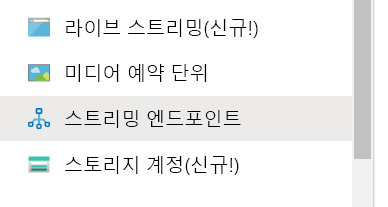
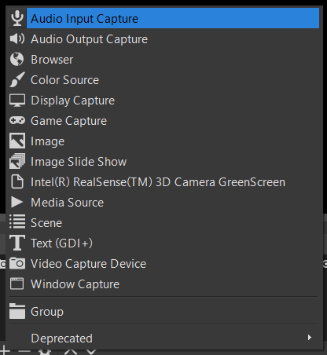
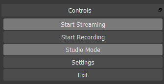

# OBS를 사용하여 Azure Media Services 라이브 스트림 만들기

[!INCLUDE [media services api v3 logo](./includes/v3-hr.md)]

이 빠른 시작은 Azure Portal을 사용하여 Media Services 라이브 스트림을 만들고 OBS(Open Broadcasting Studio)를 사용하여 브로드캐스트하는 데 도움이 됩니다. 여기에서는 Azure 구독이 있고 Media Services 계정을 만들었다고 가정합니다.

이 빠른 시작에서 설명하는 내용은 다음과 같습니다.

- OBS를 사용하여 온-프레미스 인코더 설정
- 라이브 스트림 설정
- 라이브 스트림 출력 설정
- 기본 스트리밍 엔드포인트 실행
- Azure Media Player를 사용하여 라이브 스트림 및 주문형 출력 보기

## 필수 구성 요소

Azure 구독이 아직 없는 경우 시작하기 전에 [체험 계정](https://azure.microsoft.com/free/)을 만듭니다.

## Azure Portal에 로그인

먼저 웹 브라우저를 열고 [Microsoft Azure Portal](https://portal.azure.com/)로 이동합니다. 자격 증명을 입력하여 포털에 로그인합니다. 기본 보기는 서비스 대시보드입니다.

## OBS를 사용하여 온-프레미스 인코더 설정

1. [Open Broadcaster Software 웹 사이트](https://obsproject.com/)에서 운영 체제에 맞는 OBS를 다운로드하여 설치합니다.
1. 애플리케이션을 시작하고 열어 둡니다.

## 기본 스트리밍 엔드포인트 실행

1. Media Services 목록에서 **스트리밍 엔드포인트** 를 선택합니다.

   
1. 기본 스트리밍 엔드포인트 상태가 중지됨이면 선택합니다. 그러면 해당 엔드포인트의 페이지로 이동합니다.
1. **시작** 을 선택합니다.

   

## Azure Media Services 라이브 스트림 설정

1. 포털 내의 Azure Media Services 계정으로 이동한 후 **Media Services** 목록에서 **라이브 스트리밍** 을 선택합니다.

   
1. **라이브 이벤트 추가** 를 선택하여 새 라이브 스트리밍 이벤트를 만듭니다.

   
1. **라이브 이벤트 이름** 상자에 새 이벤트의 이름(예: *TestLiveEvent*)을 입력합니다.

   
1. **설명** 상자에 이벤트에 대한 설명(선택 사항)을 입력합니다.
1. **통과 – 클라우드 인코딩 없음** 옵션을 선택합니다.

   
1. **RTMP** 옵션을 선택합니다.
1. 라이브 이벤트가 준비되기 전에 이 이벤트에 대한 요금이 청구되지 않도록 **시작 라이브 이벤트** 에 대해 **아니요** 옵션을 선택해야 합니다. (라이브 이벤트가 시작되면 청구가 시작됩니다.)

   
1. **검토 + 만들기** 단추를 선택하여 설정을 검토합니다.
1. **만들기** 단추를 선택하여 라이브 이벤트를 만듭니다. 그러면 라이브 이벤트 목록으로 돌아갑니다.
1. 만든 라이브 이벤트에 대한 링크를 선택합니다. 이벤트가 중지되었습니다.
1. 브라우저에서 이 페이지를 열어 둡니다. 나중에 다시 살펴보겠습니다.

## OBS Studio를 사용하여 라이브 스트림 설정

OBS는 기본 장면으로 시작하지만 입력이 선택되지 않았습니다.

   

### 비디오 원본 추가

1. **원본** 패널에서 **추가** 아이콘을 선택하여 새 원본 디바이스를 선택합니다. **원본** 메뉴가 열립니다.

1. 원본 디바이스 메뉴에서 **비디오 캡처 디바이스** 를 선택합니다. **원본 만들기/선택** 메뉴가 열립니다.

   

1. **기존 항목 추가** 라디오 단추를 선택한 다음, **확인** 을 선택합니다. **비디오 디바이스의 속성** 메뉴가 열립니다.

   

1. **디바이스** 드롭다운 목록에서 브로드캐스트에 사용하려는 비디오 입력을 선택합니다. 지금은 나머지 설정을 그대로 두고, **확인** 을 선택합니다. 입력 원본이 **원본** 패널에 추가되고, 비디오 입력 보기가 **미리 보기** 영역에 표시됩니다.

   

### 오디오 원본 추가

1. **원본** 패널에서 **추가** 아이콘을 선택하여 새 원본 디바이스를 선택합니다. [원본 디바이스] 메뉴가 열립니다.

1. 원본 디바이스 메뉴에서 **오디오 입력 캡처** 를 선택합니다. **원본 만들기/선택** 메뉴가 열립니다.

   

1. **기존 항목 추가** 라디오 단추를 선택한 다음, **확인** 을 선택합니다. **오디오 입력 캡처의 속성** 메뉴가 열립니다.

   

1. **디바이스** 드롭다운 목록에서 브로드캐스트에 사용하려는 오디오 캡처 디바이스를 선택합니다. 지금은 나머지 설정을 그대로 두고, [확인]을 선택합니다. 오디오 캡처 디바이스가 오디오 믹서 패널에 추가됩니다.

   

### OBS에서 스트리밍 및 고급 인코딩 설정 지정

다음 절차에서는 브라우저의 Azure Media Services로 돌아가서 입력 URL을 복사하여 출력 설정에 입력합니다.

1. 포털의 Azure Media Services 페이지에서 **시작** 을 선택하여 라이브 스트림 이벤트를 시작합니다. (이제 청구가 시작됩니다.)

   
1. **RTMP** 토글을 **RTMPS** 로 설정합니다.
1. **입력 URL** 상자에서 URL을 클립보드에 복사합니다.

   

1. OBS 애플리케이션으로 전환합니다.

1. **컨트롤** 패널에서 **설정** 단추를 선택합니다. [설정] 옵션이 열립니다.

   

1. **설정** 메뉴에서 **스트림** 을 선택합니다.

1. **서비스** 드롭다운 목록에서 [모두 표시]를 선택한 다음, **사용자 지정...** 을 선택합니다.

1. **서버** 필드에서 복사한 RTMPS URL을 클립보드에 붙여넣습니다.

1. **스트림 키** 필드에 임의로 입력합니다.  실제로 중요하지는 않지만 값이 있어야 합니다.

    

1. **설정** 메뉴에서 **출력** 을 선택합니다.

1. 페이지 위쪽에서 **출력 모드** 드롭다운을 선택하고, **고급** 을 선택하여 사용 가능한 모든 인코더 설정에 액세스합니다.

1. **스트리밍** 탭을 선택하여 인코더를 설정합니다.

1. 시스템에 적합한 인코더를 선택합니다.  하드웨어에서 GPU 가속을 지원하는 경우 NVIDIA **NVENC** H.264 또는 Intel **QuickSync** H.264 중에서 선택합니다. 시스템에 지원되는 GPU가 없는 경우 **X264** 소프트웨어 인코더 옵션을 선택합니다.

#### X264 인코더 설정

1. **X264** 인코딩 옵션을 선택한 경우 **출력 크기 다시 조정** 상자를 선택합니다. Media Services에서 프리미엄 라이브 이벤트를 사용하는 경우 1920x1080을 선택하고, 표준(720P) 라이브 이벤트를 사용하는 경우 1280x720을 선택합니다.  통과 라이브 이벤트를 사용하는 경우 사용 가능한 모든 해상도를 선택할 수 있습니다.

1. **비트 전송률** 을 1,500Kbps에서 4,000Kbps 사이로 설정합니다. 720P에서 표준 인코딩 라이브 이벤트를 사용하는 경우 2,500Kbps를 사용하는 것이 좋습니다. 1080P 프리미엄 라이브 이벤트를 사용하는 경우 4,000Kbps를 사용하는 것이 좋습니다. 네트워크에서 사용 가능한 CPU 기능 및 대역폭을 기준으로 비트 전송률을 조정하여 원하는 품질 설정을 달성할 수 있습니다.

1. **키프레임 간격** 필드에서 *2* 를 입력합니다. 이 값은 Media Services에서 HLS 또는 DASH를 통해 전달되는 조각의 최종 크기를 제어하는 키 프레임 간격을 2초로 설정합니다. 키 프레임 간격을 4초보다 길게 설정하지 마세요.  브로드캐스트할 때 대기 시간이 긴 경우 항상 다시 확인하거나 애플리케이션 사용자에게 이 값을 항상 2초로 설정하도록 알려야 합니다. 대기 시간이 짧은 라이브 전송을 시도하는 경우 이 값을 1초까지 낮게 설정하도록 선택할 수 있습니다.

1. 선택 사항: CPU 사용량 사전 설정을 **매우 빠르게** 로 설정하고, 일부 실험을 실행하여 로컬 CPU에서 충분한 오버헤드를 통해 비트 전송률과 사전 설정의 조합을 처리할 수 있는지 확인합니다. 라이브 스트리밍 중에 문제가 발생하지 않도록 평균 CPU를 80% 이하로 설정해 보세요. 품질을 향상시키기 위해 CPU 제한에 도달할 때까지 **더 빠르게** 및 **빠르게** 사전 설정으로 테스트할 수 있습니다.

   

1. 나머지 설정은 변경하지 않은 상태로 두고, **확인** 을 선택합니다.

#### Nvidia NVENC 인코더 설정

1. **NVENC** GPU 인코딩 옵션을 선택한 경우 **출력 크기 다시 조정** 상자를 선택하고, Media Services에서 프리미엄 라이브 이벤트를 사용하는 경우 1920x1080을 선택하거나 표준(720P) 라이브 이벤트를 사용하는 경우 1280x720을 선택합니다. 통과 라이브 이벤트를 사용하는 경우 사용 가능한 모든 해상도를 선택할 수 있습니다.

1. 상수 비트 전송률 속도 제어를 위해 **속도 제어** 를 CBR로 설정합니다.

1. **비트 전송률** 을 1,500Kbps에서 4,000Kbps 사이로 설정합니다. 720P에서 표준 인코딩 라이브 이벤트를 사용하는 경우 2,500Kbps를 사용하는 것이 좋습니다. 1080P 프리미엄 라이브 이벤트를 사용하는 경우 4,000Kbps를 사용하는 것이 좋습니다. 네트워크에서 사용 가능한 CPU 기능 및 대역폭을 기준으로 이 값을 조정하여 원하는 품질 설정을 달성할 수 있습니다.

1. 위의 X264 옵션 아래에서 설명한 대로 **키 프레임 간격** 을 2초로 설정합니다. 라이브 브로드캐스트의 대기 시간에 큰 영향을 줄 수 있으므로 4초를 초과하지 마세요.

1. 로컬 컴퓨터의 CPU 속도에 따라 **사전 설정** 을 [낮은 대기 시간], [낮은 대기 시간 성능] 또는 [낮은 대기 시간 품질]로 설정합니다. 이러한 설정을 실험하여 자체 하드웨어에서 품질과 CPU 사용률 간의 최적 균형을 달성합니다.

1. 더 강력한 하드웨어 구성을 사용하는 경우 **프로필** 을 "기본" 또는 "높음"으로 설정합니다.

1. **미리 보기** 를 선택하지 않은 상태로 둡니다. 매우 강력한 컴퓨터가 있으면 이를 확인할 수 있습니다.

1. **Psycho 시각적 튜닝** 을 선택하지 않은 상태로 둡니다. 매우 강력한 컴퓨터가 있으면 이를 확인할 수 있습니다.

1. 할당할 GPU를 자동으로 결정하려면 **GPU** 를 0으로 설정합니다. 원하는 경우 GPU 사용량을 제한할 수 있습니다.

1. **최대 B 프레임 수** 를 2로 설정합니다.

   

#### Intel QuickSync 인코더 설정

1. Intel **QuickSync** GPU 인코딩 옵션을 선택한 경우 **출력 크기 다시 조정** 상자를 선택하고, Media Services에서 프리미엄 라이브 이벤트를 사용하는 경우 1920x1080을 선택하거나 표준(720P) 라이브 이벤트를 사용하는 경우 1280x720을 선택합니다. 통과 라이브 이벤트를 사용하는 경우 사용 가능한 모든 해상도를 선택할 수 있습니다.

1. **대상 사용량** 을 "균형 조정"으로 설정하거나 필요한 경우 CPU 및 GPU 조합 부하에 따라 조정합니다. 필요에 따라 조정하고, 하드웨어에서 생성할 수 있는 품질로 평균 80%의 최대 CPU 사용률을 달성할 수 있는지 실험합니다. 더 제한된 하드웨어를 사용하는 경우 "빠르게"로 테스트하거나, 성능 문제가 있는 경우 "매우 빠르게"로 설정합니다.

1. 더 강력한 하드웨어 구성을 사용하는 경우 **프로필** 을 "기본" 또는 "높음"으로 설정합니다.

1. 위의 X264 옵션 아래에서 설명한 대로 **키 프레임 간격** 을 2초로 설정합니다. 라이브 브로드캐스트의 대기 시간에 큰 영향을 줄 수 있으므로 4초를 초과하지 마세요.

1. 상수 비트 전송률 속도 제어를 위해 **속도 제어** 를 CBR로 설정합니다.

1. **비트 전송률** 을 1,500Kbps에서 4,000Kbps 사이로 설정합니다.  720P에서 표준 인코딩 라이브 이벤트를 사용하는 경우 2,500Kbps를 사용하는 것이 좋습니다. 1080P 프리미엄 라이브 이벤트를 사용하는 경우 4,000Kbps를 사용하는 것이 좋습니다. 네트워크에서 사용 가능한 CPU 기능 및 대역폭을 기준으로 이 값을 조정하여 원하는 품질 설정을 달성할 수 있습니다.

1. **대기 시간** 을 "낮음"으로 설정합니다.

1. **B 프레임 수** 를 2로 설정합니다.

1. **주관적인 비디오 고급 기능** 을 선택하지 않은 상태로 둡니다.

   

### 오디오 설정 지정

다음 절차에서는 오디오 인코딩 설정을 조정합니다.

1. [설정]에서 [출력->오디오] 탭을 차례로 선택합니다.

1. 트랙 1 **오디오 비트 전송률** 을 128Kbps로 설정합니다.

   

1. [설정]에서 [오디오] 탭을 선택합니다.

1. **샘플 속도** 를 44.1kHz로 설정합니다.

   

### 스트리밍 시작

1. **컨트롤** 패널에서 **스트리밍 시작** 을 클릭합니다.

    

2. 브라우저에서 Azure Media Services 라이브 이벤트 화면으로 전환하고, **플레이어 다시 로드** 링크를 클릭합니다. 이제 스트림이 [미리 보기] 플레이어에 표시됩니다.

## 출력 설정

여기서는 출력을 설정하고, 라이브 스트림의 기록을 저장할 수 있도록 합니다.  

> [!NOTE]
> 이 출력을 스트리밍하려면 스트리밍 엔드포인트가 실행되고 있어야 합니다. 나중에 [기본 스트리밍 엔드포인트 실행](#run-the-default-streaming-endpoint) 섹션을 참조하세요.

1. **출력** 비디오 뷰어의 아래에 있는 **출력 만들기** 링크를 선택합니다.
1. 원하는 경우 나중에 쉽게 찾을 수 있도록 **이름** 상자에서 출력 이름을 사용자에게 더 친숙한 이름으로 편집합니다.

   
1. 지금은 나머지 상자를 모두 그대로 둡니다.
1. **다음** 을 선택하여 스트리밍 로케이터를 추가합니다.
1. 원하는 경우 로케이터 이름을 사용자에게 더 친숙한 이름으로 변경합니다.

   
1. 지금은 이 화면의 다른 모든 항목을 그대로 둡니다.
1. **만들기** 를 선택합니다.

## Azure Media Player를 사용하여 출력 브로드캐스트 재생

1. **출력** 비디오 플레이어 아래에 스트리밍 URL을 복사합니다.
1. 웹 브라우저에서 [Azure Media Player 데모](https://ampdemo.azureedge.net/azuremediaplayer.html)를 엽니다.
1. 스트리밍 URL을 Azure Media Player의 **URL** 상자에 붙여넣습니다.
1. **플레이어 업데이트** 단추를 선택합니다.
1. 비디오에서 **재생** 아이콘을 선택하여 라이브 스트림을 봅니다.

## 브로드캐스트 중지

콘텐츠를 충분히 스트리밍했다고 생각되면 브로드캐스트를 중지합니다.

1. 포털에서 **중지** 를 선택합니다.

1. OBS의 **컨트롤** 패널에서 **스트리밍 중지** 단추를 선택합니다. 이 단계에서는 OBS에서 브로드캐스트가 중지됩니다.

## Azure Media Player를 사용하여 주문형 출력 재생

이제 스트리밍 엔드포인트가 실행되는 동안에는 사용자가 만든 출력을 주문형 스트리밍에 사용할 수 있습니다.

1. Media Services 목록으로 이동하여 **자산** 을 선택합니다.
1. 이전에 만든 이벤트 출력을 찾아서 자산에 대한 링크를 선택합니다. 자산 출력 페이지가 열립니다.
1. 자산에 대한 비디오 플레이어 아래에 스트리밍 URL을 복사합니다.
1. 브라우저에서 Azure Media Player로 돌아가서 스트리밍 URL을 URL 상자에 붙여넣습니다.
1. **플레이어 업데이트** 를 선택합니다.
1. 비디오에서 **재생** 아이콘을 선택하여 주문형 자산을 봅니다.

## 리소스 정리

> [!IMPORTANT]
> 서비스를 중지하세요! 이 빠른 시작 단계를 완료한 후에는 라이브 이벤트 및 스트리밍 엔드포인트를 중지해야 합니다. 그렇지 않으면 계속 실행되는 시간에 대한 요금이 청구됩니다. 라이브 이벤트를 중지하려면 [브로드캐스트 중지](#stop-the-broadcast) 절차의 2단계와 3단계를 참조하세요.

스트리밍 엔드포인트를 중지하려면:

1. Media Services 목록에서 **스트리밍 엔드포인트** 를 선택합니다.
2. 이전에 시작한 기본 스트리밍 엔드포인트를 선택합니다. 그러면 엔드포인트 페이지가 열립니다.
3. **중지** 를 선택합니다.

> [!TIP]
> 이 이벤트의 자산을 유지하지 않으려면 스토리지에 대한 요금이 청구되지 않도록 해당 자산을 삭제해야 합니다.

## 다음 단계

> [!div class="nextstepaction"]
> [Media Services의 라이브 이벤트 및 라이브 출력](./live-event-outputs-concept.md)
