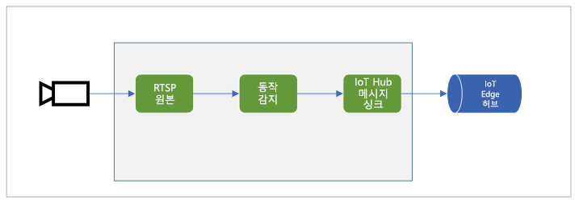
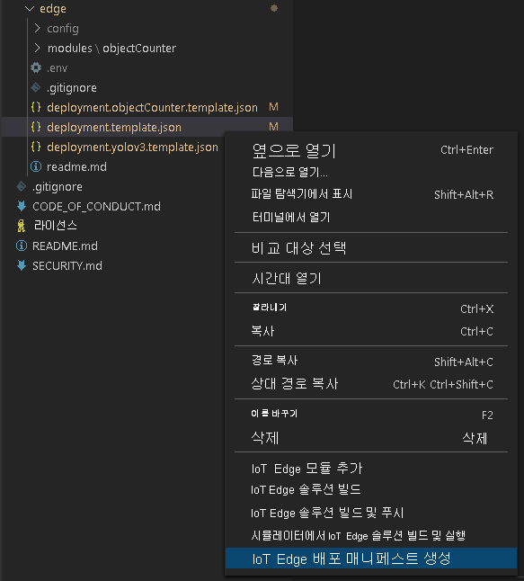

# <a name="quickstart-detect-motion-and-emit-events"></a>빠른 시작: 동작 감지 및 이벤트 내보내기

이 빠른 시작에서는 Live Video Analytics on IoT Edge를 시작하는 단계를 안내합니다. Azure VM을 IoT Edge 디바이스와 시뮬레이션된 라이브 비디오 스트림으로 사용합니다. 설치 단계를 완료한 후에는 해당 스트림에서 동작을 감지하고 보고하는 미디어 그래프를 통해 시뮬레이션된 라이브 비디오 스트림을 실행할 수 있습니다. 아래 다이어그램은 해당 미디어 그래프의 그래픽 표현을 보여 줍니다.

 

이 문서의 모든 [샘플 코드](https://github.com/Azure-Samples/live-video-analytics-iot-edge-csharp)는 C#으로 작성되었습니다.

## <a name="prerequisites"></a>필수 구성 요소

* 활성 구독이 있는 Azure 계정. [체험 계정을 만듭니다](https://azure.microsoft.com/free/?WT.mc_id=A261C142F).
* 머신에 설치된 [Visual Studio Code](https://code.visualstudio.com/)(다음 확장 포함):
    1. [Azure IoT Tools](https://marketplace.visualstudio.com/items?itemName=vsciot-vscode.azure-iot-tools)
    2. [C#](https://marketplace.visualstudio.com/items?itemName=ms-dotnettools.csharp)
* 시스템에 설치된 [.NET Core 3.1 SDK](https://dotnet.microsoft.com/download/dotnet-core/3.1)

> [!TIP]
> Azure IoT Tools 확장을 설치하는 동안 docker를 설치할지 묻는 메시지가 표시될 수 있습니다. 이 메시지는 무시해도 됩니다.

## <a name="set-up-azure-resources"></a>Azure 리소스 설정

이 자습서에 필요한 Azure 리소스는 다음과 같습니다.

* IoT Hub
* 스토리지 계정
* Azure Media Services 계정
* [IoT Edge 런타임](https://docs.microsoft.com/azure/iot-edge/how-to-install-iot-edge-linux)이 설치된 Azure의 Linux VM

이 빠른 시작을 진행하려면 [Live Video Analytics 리소스 설치 스크립트](https://github.com/Azure/live-video-analytics/tree/master/edge/setup)를 사용하여 Azure 구독에서 위에 언급된 Azure 리소스를 배포하는 것이 좋습니다. 이 작업을 수행하려면 다음 단계를 따르세요.

1. [https://www.microsoft.com]\(https://shell.azure.com ) 로 이동합니다.
1. Cloud Shell을 처음 사용하는 경우 스토리지 계정 및 Microsoft Azure 파일 공유를 만들려면 구독을 선택하라는 메시지가 표시됩니다. Cloud Shell 세션 정보를 저장할 스토리지 계정을 만들려면 "스토리지 만들기"를 선택합니다. 이 스토리지 계정은 Azure Media Services 계정에서 사용하기 위해 스크립트에서 만드는 것과 별개입니다.
1. 셸 창의 왼쪽에 있는 드롭다운 목록에서 "Bash"를 환경으로 선택합니다.

    

1. 다음 명령을 실행합니다.

    ```
    bash -c "$(curl -sL https://aka.ms/lva-edge/setup-resources-for-samples)"
    ```

    스크립트가 성공적으로 완료되면 위에서 언급한 모든 리소스가 구독에 표시되어야 합니다.

1. 스크립트가 완료되면 중괄호를 클릭하여 폴더 구조를 표시합니다. ~/clouddrive/lva-sample 디렉터리 아래에 파일 몇 개가 생성된 것을 볼 수 있습니다. 이 빠른 시작에서 유의해야 할 사항은 다음과 같습니다.

     * ~/clouddrive/lva-sample/edge-deployment/.env - Visual Studio Code가 에지 디바이스에 모듈을 배포하는 데 사용하는 속성이 포함되어 있습니다.
     * ~/clouddrive/lva-sample/appsetting.json - Visual Studio Code에서 샘플 코드를 실행하는 데 사용합니다.
     
이는 빠른 시작의 뒷부분에서 Visual Studio Code의 파일을 업데이트하는 데 필요합니다. 지금은 로컬 파일에 복사하는 것이 좋습니다.


 

## <a name="set-up-your-development-environment"></a>개발 환경 설정

1. 여기(https://github.com/Azure-Samples/live-video-analytics-iot-edge-csharp )에서 리포지토리를 복제합니다.
1. Visual Studio Code를 시작하고 리포지토리를 다운로드한 폴더를 엽니다.
1. Visual Studio Code에서 "src/cloud-to-device-console-app" 폴더로 이동하고 "appsettings.json"이라는 파일을 만듭니다. 이 파일에는 프로그램을 실행하는 데 필요한 설정이 포함됩니다.
1. 이전 섹션에서 생성된 ~/clouddrive/lva-sample/appsettings.json 파일의 내용을 복사합니다(5단계 참조).

    텍스트는 다음과 같습니다.

    ```
    {  
        "IoThubConnectionString" : "HostName=xxx.azure-devices.net;SharedAccessKeyName=iothubowner;SharedAccessKey=XXX",  
        "deviceId" : "lva-sample-device",  
        "moduleId" : "lvaEdge"  
    }
    ```
1. 그런 다음, "src/edge" 폴더로 이동하고 ".env"라는 파일을 만듭니다.
1. "/clouddrive/lva-sample/edge-deployment/.env" 파일의 내용을 복사합니다. 텍스트는 다음과 같습니다.

    ```
    SUBSCRIPTION_ID="<Subscription ID>"  
    RESOURCE_GROUP="<Resource Group>"  
    AMS_ACCOUNT="<AMS Account ID>"  
    IOTHUB_CONNECTION_STRING="HostName=xxx.azure-devices.net;SharedAccessKeyName=iothubowner;SharedAccessKey=xxx"  
    AAD_TENANT_ID="<AAD Tenant ID>"  
    AAD_SERVICE_PRINCIPAL_ID="<AAD SERVICE_PRINCIPAL ID>"  
    AAD_SERVICE_PRINCIPAL_SECRET="<AAD SERVICE_PRINCIPAL ID>"  
    INPUT_VIDEO_FOLDER_ON_DEVICE="/home/lvaadmin/samples/input"  
    OUTPUT_VIDEO_FOLDER_ON_DEVICE="/home/lvaadmin/samples/input"
    APPDATA_FOLDER_ON_DEVICE="/var/local/mediaservices"
    CONTAINER_REGISTRY_USERNAME_myacr="<your container registry username>"  
    CONTAINER_REGISTRY_PASSWORD_myacr="<your container registry username>"      
    ```

## <a name="examine-the-sample-files"></a>샘플 파일 검사

1. Visual Studio Code에서 "src/edge"로 이동합니다. 사용자가 만든 .env 파일이 몇 가지 배포 템플릿 파일과 함께 표시됩니다.

    배포 템플릿은 일부 자리 표시자 값이 있는 에지 디바이스에 대한 배포 매니페스트를 나타냅니다. .env 파일에는 이러한 변수에 대한 값이 있습니다.
1. 그런 다음, "src/cloud-to-device-console-app" 폴더로 이동합니다. 여기에는 사용자가 만든 appsettings.json 파일과 몇 가지 다른 파일이 함께 표시됩니다.

    * c2d-console-app.csproj - Visual Studio Code에 대한 프로젝트 파일입니다.
    * operations.json - 이 파일에는 프로그램이 실행할 다양한 작업이 나열됩니다.
    * Program.cs- 다음을 수행하는 샘플 프로그램 코드입니다.
    
        * 앱 설정 로드
        * Live Video Analytics on IoT Edge 모듈에 의해 노출되는 직접 메서드를 호출합니다. 이 모듈을 통해 [직접 메서드](direct-methods.md)를 호출하여 라이브 비디오 스트림을 분석할 수 있습니다. 
        * 터미널 창에서 프로그램의 출력을 검토하고, 출력 창에서 모듈에 의해 생성된 이벤트를 살펴볼 수 있도록 일시 중지합니다.
        * 리소스를 정리하는 직접 메서드를 호출합니다.   

## <a name="generate-and-deploy-the-iot-edge-deployment-manifest"></a>IoT Edge 배포 매니페스트 생성 및 배포

배포 매니페스트는 에지 디바이스에 배포되는 모듈 및 해당 모듈의 구성 설정을 정의합니다. 템플릿 파일에서 이러한 매니페스트를 생성한 후 에지 디바이스에 배포하려면 다음 단계를 수행합니다.

1. Visual Studio Code를 엽니다.
1. 왼쪽 하단에서 AZURE IOT HUB 창 옆에 있는 "추가 작업" 아이콘을 클릭하여 IoTHub 연결 문자열을 설정합니다. src/cloud-to-device-console-app/appsettings.json 파일에서 문자열을 복사할 수 있습니다. 

    
1. 다음으로, "src/edge/deployment.template.json" 파일을 마우스 오른쪽 단추로 클릭하고 "IoT Edge 배포 매니페스트 생성"을 클릭합니다.
    

    이렇게 하면 src/edge/config 폴더에 "deployment.amd64.json"이라는 매니페스트 파일이 생성됩니다.
1. "src/edge/config/deployment.amd64.json"을 마우스 오른쪽 단추로 클릭하고 "단일 디바이스용 배포 만들기"를 클릭하고 에지 디바이스의 이름을 선택합니다.

    
1. 그러면 "IoT Hub 디바이스를 선택"하라는 메시지가 표시됩니다. 드롭다운 목록에서 lva-sample-device를 선택합니다.
1. 약 30초 후에 왼쪽 하단 섹션에서 Azure IoT Hub를 새로 고치면 다음 모듈이 배포된 에지 디바이스가 있을 것입니다.

    * Live Video Analytics on IoT Edge(모듈 이름 "lvaEdge")
    * RTSP 시뮬레이터(모듈 이름 "rtspsim")

RTSP 시뮬레이터 모듈은 [Live Video Analytics 리소스 설치 스크립트](https://github.com/Azure/live-video-analytics/tree/master/edge/setup)를 실행할 때 에지 디바이스에 복사된 비디오 파일을 사용하여 라이브 비디오 스트림을 시뮬레이션합니다. 이 단계에서는 모듈을 배포했지만 미디어 그래프가 활성화되어 있지 않습니다.

## <a name="prepare-for-monitoring-events"></a>이벤트 모니터링 준비

Live Video Analytics on IoT Edge 모듈을 사용하여 들어오는 라이브 비디오 스트림에서 동작을 감지하고 IoT Hub에 이벤트를 전송합니다. 이러한 이벤트를 보려면 다음 단계를 수행합니다.

1. Visual Studio Code에서 탐색기 창을 열고 왼쪽 하단 모서리에서 Azure IoT Hub를 찾습니다.
1. 디바이스 노드를 확장합니다.
1. lva-sample-device를 마우스 오른쪽 단추로 클릭하고 "기본 제공 이벤트 모니터링 시작" 옵션을 선택합니다.

    

## <a name="run-the-sample-program"></a>샘플 프로그램 실행

아래 단계에 따라 샘플 코드를 실행하세요.
1. Visual Studio Code에서 "src/cloud-to-device-console-app/operations.json"으로 이동합니다.
1. GraphTopologySet 노드에서 다음을 확인합니다.

    ` "topologyUrl" : "https://raw.githubusercontent.com/Azure/live-video-analytics/master/MediaGraph/topologies/motion-detection/topology.json"`
1. 그런 다음, GraphInstanceSet 및 GraphTopologyDelete 노드에서 topologyName 값이 위의 그래프 토폴로지의 "name" 속성 값과 일치하는지 확인합니다.

    `"topologyName" : "MotionDetection"`
    
1. 디버깅 세션을 시작합니다(F5 키 누름). 터미널 창에 출력된 일부 메시지가 보이기 시작합니다.
1. GraphTopologyList 및 GraphInstanceList를 호출하면 operations.json이 시작됩니다. 이전 빠른 시작 후에 리소스를 정리한 경우 빈 목록이 반환되고 Enter 키를 누를 때까지 일시 중지됩니다.

    ```
    --------------------------------------------------------------------------
    Executing operation GraphTopologyList
    -----------------------  Request: GraphTopologyList  --------------------------------------------------
    {
        "@apiVersion": "1.0"
    }
    ---------------  Response: GraphTopologyList - Status: 200  ---------------
    {
        "value": []
    }
    --------------------------------------------------------------------------
    Executing operation WaitForInput
    Press Enter to continue
    ```
1. 터미널 창에서 "Enter" 키를 누르면 다음 직접 메서드 호출 세트가 생성됩니다.
     
     * 위의 topologyUrl을 사용한 GraphTopologySet 호출
     * 다음 본문을 사용한 GraphInstanceSet 호출
     
     ```
     {
       "@apiVersion": "1.0",
       "name": "Sample-Graph",
       "properties": {
         "topologyName": "MotionDetection",
         "description": "Sample graph description",
         "parameters": [
           {
             "name": "rtspUrl",
             "value": "rtsp://rtspsim:554/media/camera-300s.mkv"
           },
           {
             "name": "rtspUserName",
             "value": "testuser"
           },
           {
             "name": "rtspPassword",
             "value": "testpassword"
           }
         ]
       }
     }
     ```
     
     * 그래프 인스턴스를 시작하고 비디오 흐름을 시작하는 GraphInstanceActivate 호출
     * 그래프 인스턴스가 실제로 실행 중인 상태임을 보여 주기 위한 두 번째 GraphInstanceList 호출
1. 이제 터미널 창의 출력이 '계속하려면 Enter 키를 누르세요.'라는 메시지에서 일시 중지됩니다. 아직은 "Enter" 키를 누르지 마세요. 위로 스크롤하여 호출한 직접 메서드에 대한 JSON 응답 페이로드를 볼 수 있습니다.
1. 이제 Visual Studio Code의 출력 창으로 전환하면 Live Video Analytics on IoT Edge 모듈이 IoT Hub로 전송한 메시지가 표시됩니다.
     * 이러한 메시지는 아래 섹션에서 설명합니다.
1. 미디어 그래프가 계속 실행되고 결과가 출력됩니다. RTSP 시뮬레이터는 원본 비디오를 계속 반복합니다. 미디어 그래프를 중지하려면 터미널 창으로 돌아가서 "Enter" 키를 누릅니다. 리소스 정리를 위해 다음과 같은 일련의 호출을 수행합니다.
     * 그래프 인스턴스를 비활성화하는 GraphInstanceDeactivate 호출
     * 인스턴스를 삭제하는 GraphInstanceDelete 호출
     * 토폴로지를 삭제하는 GraphTopologyDelete 호출
     * 이제 목록이 비어 있음을 보여 주는 GraphTopologyList에 대한 최종 호출

## <a name="interpret-results"></a>결과 해석

미디어 그래프를 실행하면 동작 감지기 프로세서 노드의 결과가 IoT Hub 싱크 노드를 통해 IoT Hub에 전송됩니다. Visual Studio Code의 출력 창에 표시되는 메시지에는 "body" 섹션과 "applicationProperties" 섹션이 포함되어 있습니다. 이러한 섹션이 나타내는 내용을 이해하려면 [이 문서](https://docs.microsoft.com/azure/iot-hub/iot-hub-devguide-messages-construct)를 참조하세요.

아래 메시지에서 애플리케이션 속성 및 본문의 내용은 Live Video Analytics 모듈에 의해 정의됩니다.

## <a name="mediasession-established-event"></a>MediaSession Established 이벤트

미디어 그래프가 인스턴스화되면 RTSP 원본 노드가 rtspsim-live555 컨테이너에서 실행되는 RTSP 서버에 연결을 시도합니다. 성공하면 이 이벤트가 출력됩니다.

```
[IoTHubMonitor] [9:42:18 AM] Message received from [lvaedgesample/lvaEdge]:  
{  
"body": {
"sdp": "SDP:\nv=0\r\no=- 1586450538111534 1 IN IP4 xxx.xxx.xxx.xxx\r\ns=Matroska video+audio+(optional)subtitles, streamed by the LIVE555 Media Server\r\ni=media/camera-300s.mkv\r\nt=0 0\r\na=tool:LIVE555 Streaming Media v2020.03.06\r\na=type:broadcast\r\na=control:*\r\na=range:npt=0-300.000\r\na=x-qt-text-nam:Matroska video+audio+(optional)subtitles, streamed by the LIVE555 Media Server\r\na=x-qt-text-inf:media/camera-300s.mkv\r\nm=video 0 RTP/AVP 96\r\nc=IN IP4 0.0.0.0\r\nb=AS:500\r\na=rtpmap:96 H264/90000\r\na=fmtp:96 packetization-mode=1;profile-level-id=4D0029;sprop-parameter-sets={SPS}\r\na=control:track1\r\n"  
},  
"applicationProperties": {  
    "dataVersion": "1.0",  
    "topic": "/subscriptions/{subscriptionID}/resourceGroups/{name}/providers/microsoft.media/mediaservices/hubname",  
    "subject": "/graphInstances/GRAPHINSTANCENAMEHERE/sources/rtspSource",  
    "eventType": "Microsoft.Media.MediaGraph.Diagnostics.MediaSessionEstablished",  
    "eventTime": "2020-04-09T16:42:18.1280000Z"  
    }  
}
```

* 메시지는 진단 이벤트입니다. MediaSessionEstablished는 RTSP 원본 노드(주체)가 RTSP 시뮬레이터와 연결을 설정할 수 있었으며, (시뮬레이션된) 라이브 피드를 받기 시작했음을 나타냅니다.
* applicationProperties의 "subject"는 메시지가 생성된 그래프 토폴로지의 노드를 나타냅니다. 이 경우 메시지는 RTSP 원본 노드에서 온 것입니다.
* applicationProperties의 "eventType"은 진단 이벤트임을 나타냅니다.
* "eventTime"은 이벤트가 발생한 시간을 나타냅니다.
* "body"에는 진단 이벤트에 대한 데이터가 포함됩니다. 이 경우에는 [SDP](https://en.wikipedia.org/wiki/Session_Description_Protocol) 세부 정보입니다.


## <a name="motion-detection-event"></a>동작 감지 이벤트

동작이 감지되면 Live Video Analytics Edge 모듈이 유추 이벤트를 보냅니다. 유형은 동작 감지 프로세서의 결과임을 나타내기 위해 "motion"으로 설정되고 eventTime은 동작이 발생한 시간(UTC)을 알려 줍니다. 예제는 아래와 같습니다.

```
  {  
  "body": {  
    "timestamp": 142843967343090,
    "inferences": [  
      {  
        "type": "motion",  
        "motion": {  
          "box": {  
            "l": 0.573222,  
            "t": 0.492537,  
            "w": 0.141667,  
            "h": 0.074074  
          }  
        }  
      }  
    ]  
  },  
  "applicationProperties": {  
    "topic": "/subscriptions/{subscriptionID}/resourceGroups/{name}/providers/microsoft.media/mediaservices/hubname",  
    "subject": "/graphInstances/GRAPHINSTANCENAME/processors/md",  
    "eventType": "Microsoft.Media.Graph.Analytics.Inference",  
    "eventTime": "2020-04-17T20:26:32.7010000Z",
    "dataVersion": "1.0"  
  }  
}  
```

* applicationProperties의 "subject"는 메시지가 생성된 미디어 그래프의 노드를 나타냅니다. 이 경우 메시지는 동작 감지 프로세서 노드에서 온 것입니다.
* applicationProperties의 "eventType"은 분석 이벤트임을 나타냅니다.
* "eventTime"은 이벤트가 발생한 시간을 나타냅니다.
"body"는 분석 이벤트에 대한 데이터를 포함합니다. 이 경우 이벤트는 유추 이벤트이므로 본문에 "timestamp" 및 "inferences" 데이터가 포함됩니다.
* "inferences" 데이터는 "type"이 "motion"이며 "motion" 이벤트에 대한 추가 데이터가 있음을 나타냅니다.
* "box" 섹션은 움직이는 개체 주위의 경계 상자에 대한 좌표를 포함합니다. 값은 비디오의 가로, 세로 픽셀로 정규화됩니다(예: 가로 1920 및 세로 1080).

    ```
    l - distance from left of image
    t - distance from top of image
    w - width of bounding box
    h - height of bounding box
    ```
    
## <a name="cleanup-resources"></a>리소스 정리

다른 빠른 시작을 시도하려면 생성된 리소스를 유지해야 합니다. 그렇지 않으면 Azure Portal로 이동하여 리소스 그룹을 찾고 이 빠른 시작을 실행한 리소스 그룹을 선택한 후 모든 리소스를 삭제합니다.

## <a name="next-steps"></a>다음 단계

다른 빠른 시작을 실행합니다(예: 라이브 비디오 피드에서 개체 감지).        
