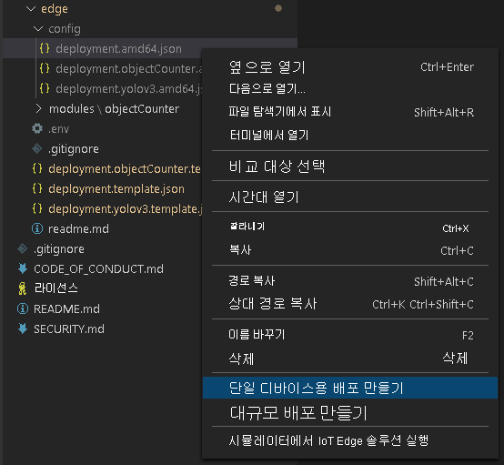

### <a name="examine-and-edit-the-sample-files"></a>샘플 파일 검사 및 편집

필수 구성 요소의 일부로 샘플 코드를 폴더에 다운로드했습니다. 다음 단계에 따라 샘플 파일을 검사하고 편집합니다.

1. Visual Studio Code에서 *src/edge* 로 이동합니다. *env* 파일 및 몇 가지 배포 템플릿 파일이 표시됩니다.

    배포 템플릿은 에지 디바이스에 대한 배포 매니페스트를 나타냅니다. 일부 자리 표시자 값을 포함합니다. *.env* 파일에는 이러한 변수에 대한 값이 포함되어 있습니다.
1. *src/cloud-to-device-console-app* 폴더로 이동합니다. 여기에는 *appsettings.json* 파일 및 몇 가지 다른 파일이 표시됩니다.

    * ***c2d-console-app.csproj*** - Visual Studio Code에 대한 프로젝트 파일
    * ***operations.json*** - 프로그램을 실행하려는 작업의 목록입니다.
    * ***Program.cs*** - 샘플 프로그램 코드입니다. 이 코드에서는 다음을 수행합니다.

        * 앱 설정을 로드합니다.
        * Live Video Analytics on IoT Edge 모듈에서 공개하는 직접 메서드를 호출합니다. 모듈을 사용하여 해당 [직접 메서드](../../../direct-methods.md)를 호출하여 라이브 비디오 스트림을 분석할 수 있습니다.
        * **터미널** 창에서 프로그램의 출력을 검사하고, **출력** 창에서 모듈에서 생성된 이벤트를 검사할 수 있도록 일시 중지합니다.
        * 리소스를 정리하는 직접 메서드를 호출합니다.
1. *operations.json* 파일을 편집합니다.
    * 그래프 토폴로지의 링크를 변경합니다.

        `"topologyUrl" : "https://raw.githubusercontent.com/Azure/live-video-analytics/master/MediaGraph/topologies/httpExtension/2.0/topology.json"`

    * `GraphInstanceSet` 아래에서 이전 링크의 값과 일치하도록 그래프 토폴로지의 이름을 편집합니다.

      `"topologyName" : "InferencingWithHttpExtension"`

    * `GraphTopologyDelete` 아래에서 이름을 편집합니다.

      `"name": "InferencingWithHttpExtension"`

### <a name="generate-and-deploy-the-iot-edge-deployment-manifest"></a>IoT Edge 배포 매니페스트 생성 및 배포

1. 마우스 오른쪽 단추로 *src/edge/ deployment.yolov3.template.json* 파일을 클릭하고, **IoT Edge 배포 매니페스트 생성** 을 클릭합니다.

      

    *deployment.yolov3.amd64.json* 매니페스트 파일은 *src/edge/config* 폴더에 만들어집니다.
1. [동작 감지 및 이벤트 내보내기](../../../detect-motion-emit-events-quickstart.md) 빠른 시작을 완료한 경우 이 단계를 건너뜁니다. 

    그렇지 않으면 왼쪽 아래 모서리의 **Azure IoT Hub** 창 근처에서 **기타 작업** 아이콘을 선택한 다음, **IoT Hub 연결 문자열 설정** 을 선택합니다. *appsettings.json* 파일에서 문자열을 복사할 수 있습니다. 또는 Visual Studio Code 내에서 적절한 IoT 허브를 구성했는지 확인하려면 [IoT 허브 선택 명령](https://github.com/Microsoft/vscode-azure-iot-toolkit/wiki/Select-IoT-Hub)을 사용합니다.
    
    

    > [!NOTE]
    > IoT Hub에 대한 기본 제공 엔드포인트 정보를 제공하라는 메시지가 표시될 수 있습니다. 해당 정보를 가져오려면 Azure Portal에서 IoT Hub로 이동하여 왼쪽 탐색 창에서 **기본 제공 엔드포인트** 옵션을 찾습니다. 여기를 클릭하고 **Event Hub 호환 엔드포인트** 섹션에서 **Event Hub 호환 엔드포인트** 를 찾습니다. 상자의 텍스트를 복사하여 사용합니다. 엔드포인트는 다음과 같이 표시됩니다.  
        ```
        Endpoint=sb://iothub-ns-xxx.servicebus.windows.net/;SharedAccessKeyName=iothubowner;SharedAccessKey=XXX;EntityPath=<IoT Hub name>
        ```

1. 마우스 오른쪽 단추로 *src/edge/config/ deployment.yolov3.amd64.json* 을 클릭하고, **단일 디바이스용 배포 만들기** 를 선택합니다. 

    
1. IoT Hub 디바이스를 선택하라는 메시지가 표시되면 **lva-sample-device** 를 선택합니다.
1. 약 30초 후 창의 왼쪽 아래 모서리에서 Azure IoT Hub를 새로 고칩니다. 이제 에지 디바이스에 다음과 같은 배포된 모듈이 표시됩니다.

    * 이름이 `lvaEdge`인 Live Video Analytics 모듈.
    * `rtspsim` 모듈 - RTSP 서버를 시뮬레이션하고 라이브 비디오 피드의 원본 역할을 합니다.

        > [!NOTE]
        > 위의 단계는 설치 스크립트에서 만든 가상 머신을 사용한다고 가정합니다. 사용자 고유의 에지 디바이스를 사용하는 경우 에지 디바이스로 이동하고, **관리자 권한** 으로 다음 명령을 실행하여 이 빠른 시작에 사용되는 샘플 비디오 파일을 가져와 저장합니다.  
        
        ```
        mkdir /home/lvaedgeuser/samples
        mkdir /home/lvaedgeuser/samples/input    
        curl https://lvamedia.blob.core.windows.net/public/camera-300s.mkv > /home/lvaedgeuser/samples/input/camera-300s.mkv  
        chown -R lvalvaedgeuser:localusergroup /home/lvaedgeuser/samples/  
        ```
        * `yolov3` 모듈 - 컴퓨터 비전을 이미지에 적용하고, 개체 형식의 여러 클래스를 반환하는 YoloV3 개체 감지 모델입니다.
 
      

### <a name="prepare-to-monitor-events"></a>이벤트 모니터링 준비

1. Visual Studio Code에서 **확장** 탭을 열고(또는 Ctrl+Shift+X를 누름) Azure IoT Hub를 검색합니다.
1. 마우스 오른쪽 단추를 클릭하고 **확장 설정** 을 선택합니다.

    > [!div class="mx-imgBorder"]
    > :::image type="content" source="../../../media/run-program/extensions-tab.png" alt-text="확장 설정":::
1. "자세한 정보 메시지 표시"를 검색하고 활성화합니다.

    > [!div class="mx-imgBorder"]
    > :::image type="content" source="../../../media/run-program/show-verbose-message.png" alt-text="자세한 정보 메시지 표시":::
1. 마우스 오른쪽 단추로 Live Video Analytics 디바이스를 클릭하고, **기본 제공 이벤트 엔드포인트 모니터링 시작** 을 선택합니다. 이 단계는 Visual Studio Code의 **출력** 창에서 IoT Hub 이벤트를 모니터링하는 데 필요합니다. 

    

> [!NOTE]
> IoT Hub에 대한 기본 제공 엔드포인트 정보를 제공하라는 메시지가 표시될 수 있습니다. 해당 정보를 가져오려면 Azure Portal에서 IoT Hub로 이동하여 왼쪽 탐색 창에서 **기본 제공 엔드포인트** 옵션을 찾습니다. 여기를 클릭하고 **Event Hub 호환 엔드포인트** 섹션에서 **Event Hub 호환 엔드포인트** 를 찾습니다. 상자의 텍스트를 복사하여 사용합니다. 엔드포인트는 다음과 같이 표시됩니다.  
    ```
    Endpoint=sb://iothub-ns-xxx.servicebus.windows.net/;SharedAccessKeyName=iothubowner;SharedAccessKey=XXX;EntityPath=<IoT Hub name>
    ```
### <a name="run-the-sample-program"></a>샘플 프로그램 실행

1. 디버깅 세션을 시작하려면 F5 키를 선택합니다. **터미널** 창에 메시지가 출력되어 표시됩니다.
1. *operations.json* 코드가 `GraphTopologyList` 및 `GraphInstanceList` 직접 메서드를 호출하여 시작됩니다. 이전 빠른 시작이 완료된 후에 리소스를 정리한 경우 이 프로세스에서 빈 목록을 반환한 다음, 일시 중지합니다. 계속하려면 Enter 키를 선택합니다.

   ```
   --------------------------------------------------------------------------
   Executing operation GraphTopologyList
   -----------------------  Request: GraphTopologyList  --------------------------------------------------
   {
   "@apiVersion": "2.0"
   }
   ---------------  Response: GraphTopologyList - Status: 200  ---------------
   {
   "value": []
   }
   --------------------------------------------------------------------------
   Executing operation WaitForInput
   Press Enter to continue
   ```

    **터미널** 창에 직접 메서드 호출의 다음 세트가 표시됩니다.

     * 이전 `topologyUrl`을 사용하는 `GraphTopologySet`에 대한 호출
     * 다음 본문을 사용하는 `GraphInstanceSet`에 대한 호출

         ```
         {
           "@apiVersion": "2.0",
           "name": "Sample-Graph-1",
           "properties": {
             "topologyName": "InferencingWithHttpExtension",
             "description": "Sample graph description",
             "parameters": [
               {
                 "name": "rtspUrl",
                 "value": "rtsp://rtspsim:554/media/camera-300s.mkv"
               },
               {
                 "name": "rtspUserName",
                 "value": "testuser"
               },
               {
                 "name": "rtspPassword",
                 "value": "testpassword"
               }
             ]
           }
         }
         ```

     * 그래프 인스턴스 및 비디오 흐름을 시작하는 `GraphInstanceActivate`에 대한 호출
     * 그래프 인스턴스가 실행 중 상태임을 보여 주는 `GraphInstanceList`에 대한 두 번째 호출
1. **터미널** 창의 출력이 `Press Enter to continue` 프롬프트에서 일시 중지됩니다. 아직 Enter 키를 선택하지 마세요. 위로 스크롤하여 호출한 직접 메서드에 대한 JSON 응답 페이로드를 확인합니다.
1. Visual Studio Code에서 **출력** 창으로 전환합니다. Live Video Analytics on IoT Edge 모듈에서 IoT 허브에 보내는 메시지가 표시됩니다. 이 빠른 시작의 다음 섹션에서는 이러한 메시지를 설명합니다.
1. 미디어 그래프가 계속 실행되어 결과를 출력합니다. RTSP 시뮬레이터가 원본 비디오를 계속 반복합니다. 미디어 그래프를 중지하려면 **터미널** 창으로 돌아가서 Enter 키를 선택합니다. 

    일련의 다음 호출은 리소스를 정리합니다.
      * `GraphInstanceDeactivate`에 대한 호출은 그래프 인스턴스를 비활성화합니다.
      * `GraphInstanceDelete`에 대한 호출은 인스턴스를 삭제합니다.
      * `GraphTopologyDelete`에 대한 호출은 토폴로지를 삭제합니다.
      * `GraphTopologyList`에 대한 최종 호출은 목록이 비어 있음을 보여 줍니다.
