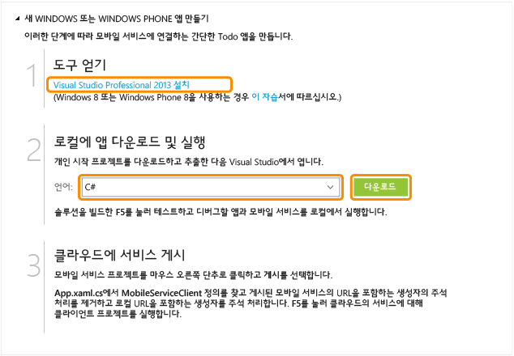

<properties linkid="develop-mobile-tutorials-get-started" pageTitle="Get Started with Mobile Services for Windows Store apps | Mobile Dev Center" metaKeywords="" description="Follow this tutorial to get started using Azure Mobile Services for Windows Store development in C#, VB, or JavaScript. " metaCanonical="" services="" documentationCenter="Mobile" title="Get started with Mobile Services" authors="glenga" solutions="" manager="" editor="" />

모바일 서비스 시작
==================

[Windows 스토어 C\#](/ko-kr/documentation/articles/mobile-services-dotnet-backend-windows-store-dotnet-get-started "Windows 스토어 C#") [Windows 스토어 JavaScript](/ko-kr/documentation/articles/mobile-services-dotnet-backend-windows-store-javascript-get-started "Windows 스토어 JavaScript") [Windows Phone](/ko-kr/documentation/articles/mobile-services-dotnet-backend-windows-phone-get-started "Windows Phone") [iOS](/ko-kr/documentation/articles/mobile-services-dotnet-backend-ios-get-started "iOS") [Android](/ko-kr/documentation/articles/mobile-services-dotnet-backend-android-get-started "Android")

[.NET 백 엔드](/ko-kr/documentation/articles/mobile-services-dotnet-backend-windows-store-dotnet-get-started/ ".NET 백 엔드") | [JavaScript 백 엔드](/ko-kr/documentation/articles/mobile-services-windows-store-get-started/ "JavaScript 백 엔드")

이 자습서는 Azure 모바일 서비스를 사용하여 Windows 스토어 앱에 클라우드 기반 백 엔드 서비스를 추가하는 방법을 보여 줍니다. 이 자습서에서는 새 모바일 서비스와 새 모바일 서비스에 앱 데이터를 저장하는 간단한 *할 일 모음* 앱을 둘 다 만듭니다. 만들게 될 모바일 서비스에서는 지원되는 .NET 언어를 사용하며, 서버 쪽 비즈니스 논리와 모바일 서비스 관리에 Visual Studio를 사용합니다. JavaScript를 사용하여 서버 쪽 비즈니스 논리를 작성하도록 지원하는 모바일 서비스를 만들려면 이 항목의 [JavaScript 백 엔드 버전](/ko-kr/documentation/articles/mobile-services-windows-store-get-started)을 참조하십시오.

> [WACOM.NOTE]이 항목에서는 Azure 관리 포털을 사용하여 새 모바일 서비스 프로젝트 및 Windows 스토어 앱을 만드는 방법에 대해 보여 줍니다. Visual Studio 2013 업데이트 2를 사용하면 기존 Visual Studio 솔루션에 새 모바일 서비스 프로젝트를 추가할 수도 있습니다. 자세한 내용은 Windows 개발자 센터에서 [빠른 시작: 모바일 서비스 추가(.NET 백 엔드)](http://msdn.microsoft.com/ko-kr/library/windows/apps/dn629482.aspx)

완성된 앱의 스크린샷은 다음과 같습니다.


이 자습서를 완료해야 다른 모든 Windows 스토어 앱용 모바일 서비스 자습서를 진행할 수 있습니다.

> [WACOM.NOTE] 이 자습서를 완료하려면 Azure 계정이 필요합니다. 계정이 없는 경우 몇 분 만에 무료 평가판 계정을 만들 수 있습니다. 자세한 내용은 [Azure 무료 평가판](http://www.windowsazure.com/ko-kr/pricing/free-trial/?WT.mc_id=A0E0E5C02&returnurl=http%3A%2F%2Fwww.windowsazure.com%2Fen-us%2Fdocumentation%2Farticles%2Fmobile-services-dotnet-backend-windows-store-get-started%2F)을 참조하십시오.
> 이 자습서를 완료하려면 [Visual Studio Professional 2013](https://go.microsoft.com/fwLink/p/?LinkID=257546)이 필요합니다. 무료 평가판을 이용할 수 있습니다.

새 모바일 서비스 만들기
-----------------------

[WACOM.INCLUDE [mobile-services-dotnet-backend-create-new-service](../includes/mobile-services-dotnet-backend-create-new-service.md)]

새 Windows 스토어 앱 만들기
---------------------------

모바일 서비스를 만든 후 관리 포털에서 쉬운 빠른 시작을 따라 모바일 서비스에 연결할 새 앱을 만들거나 기존 앱을 수정할 수 있습니다.

이 섹션에서는 모바일 서비스에 연결된 새 Windows 스토어 앱을 만듭니다.

1.  관리 포털에서 **모바일 서비스**를 클릭한 후 방금 만든 모바일 서비스를 클릭합니다.

2.  빠른 시작 탭에서 **플랫폼 선택** 아래의 **Windows**를 클릭하고 **새 Windows 스토어 앱 만들기**를 확장합니다.

  ![][6]

  모바일 서비스에 연결된 Windows 스토어 앱을 만드는 간편한 세 가지 단계가 표시됩니다.

  

1.  아직 하지 않은 경우 로컬 컴퓨터나 가상 컴퓨터에 [Visual Studio Professional 2013](https://go.microsoft.com/fwLink/p/?LinkID=257546)을 다운로드하여 설치합니다.

2.  **앱 및 서비스를 로컬로 다운로드 및 실행**에서 Windows 스토어 앱의 언어를 선택하고 **다운로드**를 클릭합니다.

  모바일 서비스 및 여기에 연결된 샘플 *할 일 모음* 응용 프로그램 모두를 위한 프로젝트가 포함된 솔루션이 다운로드됩니다. 압축된 프로젝트 파일을 로컬 컴퓨터에 저장하고 저장 위치를 기록해 둡니다.

1.  **클라우드에 서비스 게시** 아래에서 게시 프로필을 다운로드하고, 다운로드한 파일을 로컬 컴퓨터에 저장하고, 저장 위치를 기록해 둡니다.

로컬 모바일 서비스에 대해 앱 테스트
-----------------------------------

[WACOM.INCLUDE [mobile-services-dotnet-backend-test-local-service-dotnet](../includes/mobile-services-dotnet-backend-test-local-service-dotnet.md)]

> [WACOM.NOTE]모바일 서비스에 액세스하여 데이터를 쿼리 및 삽입하는 코드를 검토할 수 있습니다. 이 코드는 MainPage.xaml.cs 파일에 있습니다.

모바일 서비스 게시
------------------

[WACOM.INCLUDE [mobile-services-dotnet-backend-publish-service](../includes/mobile-services-dotnet-backend-publish-service.md)]

1.  Windows 스토어 앱 프로젝트에서 App.xaml.cs 파일을 열어 [MobileServiceClient](http://msdn.microsoft.com/ko-kr/library/Windowsazure/microsoft.windowsazure.mobileservices.mobileserviceclient.aspx) 인스턴스를 만드는 코드를 찾은 다음, *localhost*를 사용하여 이 클라이언트를 만드는 코드는 주석 처리하고 원격 모바일 서비스 URL을 사용하여 클라이언트를 만드는 코드는 주석 처리를 제거합니다. 다음과 같습니다.

    ``` {}
    public static MobileServiceClient MobileService = new MobileServiceClient(
                "https://todolist.azure-mobile.net/",
                "XXXX-APPLICATION-KEY-XXXXX");
    ```

    이제 클라이언트가 Azure에 게시된 모바일 서비스에 액세스할 수 있습니다.

2.  **F5** 키를 눌러 프로젝트를 다시 빌드하고 앱을 시작합니다.

3.  앱에서 **Insert a TodoItem**에서 *Complete the tutorial* 등의 의미 있는 텍스트를 입력하고 **Save**를 클릭합니다.

    Azure에 호스트된 새 모바일 서비스에 POST 요청이 전송됩니다.


다음 단계
---------

이제 빠른 시작을 완료했으며 모바일 서비스에서 중요한 추가 작업을 수행하는 방법을 알아보겠습니다.

-   [데이터 시작하기](/ko-kr/documentation/articles/mobile-services-dotnet-backend-windows-store-dotnet-get-started-data)
  <br/>모바일 서비스를 사용하여 데이터를 저장 및 쿼리하는 방법에 대해 자세히 알아보십시오.

-   [인증 시작](/ko-kr/documentation/articles/mobile-services-dotnet-backend-windows-store-dotnet-get-started-users)
  <br/>ID 공급자를 사용하여 앱 사용자를 인증하는 방법을 알아봅니다.

-   [푸시 알림 시작](/ko-kr/documentation/articles/mobile-services-dotnet-backend-windows-store-dotnet-get-started-push)
  <br/>기본적인 푸시 알림을 앱에 보내는 방법을 알아봅니다.


<!-- Images. -->
[0]: ./media/mobile-services-dotnet-backend-windows-store-dotnet-get-started/mobile-quickstart-completed.png

[6]: ./media/mobile-services-dotnet-backend-windows-store-dotnet-get-started/mobile-portal-quickstart.png
[7]: ./media/mobile-services-dotnet-backend-windows-store-dotnet-get-started/mobile-quickstart-steps.png
[8]: ./media/mobile-services-dotnet-backend-windows-store-dotnet-get-started/mobile-service-startup.png

[10]: ./media/mobile-services-dotnet-backend-windows-store-dotnet-get-started/mobile-quickstart-startup.png