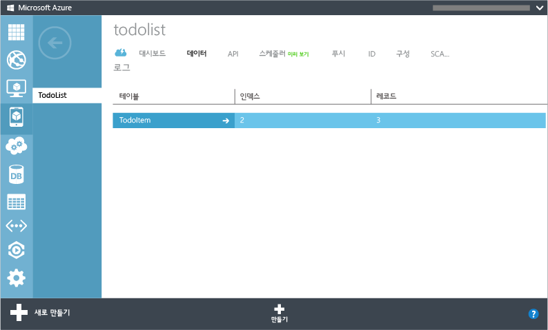
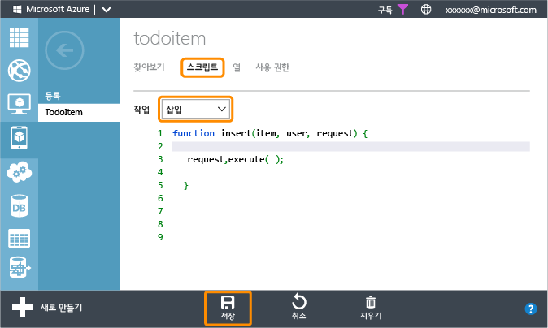

<properties urlDisplayName="Get Started with Push (JS)" pageTitle="푸시 알림 시작(Android JavaScript) | 모바일 개발자 센터" metaKeywords="" description="Learn how to use Azure Mobile Services to send push notifications to your Android JavaScript app." metaCanonical="http://www.windowsazure.com/ko-kr/develop/mobile/tutorials/get-started-with-push-dotnet/" services="mobile-services,notification-hubs" documentationCenter="Mobile" title="Get started with push notifications in Mobile Services " authors="ricksal"  solutions="" writer="ricksal" manager="dwrede" editor=""   />

<tags ms.service="mobile-services" ms.workload="mobile" ms.tgt_pltfrm="Mobile-Android" ms.devlang="Java" ms.topic="article" ms.date="10/16/2014" ms.author="ricksal" />

# 모바일 서비스 앱에 푸시 알림 추가

[WACOM.INCLUDE [mobile-services-selector-get-started-push](../includes/mobile-services-selector-get-started-push.md)]

이 항목에서는 GCM(Google Cloud Messaging)을 사용하는 Android 앱에 Azure 모바일 서비스를 사용하여 푸시 알림을 보내는 방법을 보여 줍니다. 이 자습서에서는 퀵 스타트 프로젝트에 대한 Azure 알림 허브를 사용하여 푸시 알림을 사용하도록 설정합니다. 이 작업을 완료하면 레코드가 삽입될 때마다 모바일 서비스에서 푸시 알림을 전송합니다.

이 자습서에서는 푸시 알림을 사용하도록 설정하는 다음 기본 단계를 단계별로 안내합니다.

1. [Google Cloud Messaging 사용](#register)
2. [모바일 서비스 구성](#configure)
3. [앱에 푸시 알림 추가](#add-push)
4. [푸시 알림을 전송하도록 스크립트 업데이트](#update-scripts)
5. [알림을 받기 위한 데이터 삽입](#test)

>[AZURE.NOTE] 완성된 앱의 소스 코드를 보려면 <a href="https://github.com/RickSaling/mobile-services-samples/tree/futures/GettingStartedWithPush/Android" target="_blank">여기</a>를 참조하세요.

##필수 조건

[WACOM.INCLUDE [mobile-services-android-prerequisites](../includes/mobile-services-android-prerequisites.md)]

##Google Cloud Messaging 사용

>[WACOM.NOTE]이 절차를 완료하려면 검증된 메일 주소가 포함된 Google 계정이 있어야 합니다. 새 Google 계정을 만들려면 <a href="http://go.microsoft.com/fwlink/p/?LinkId=268302" target="_blank">accounts.google.com</a>으로 이동하세요.

[WACOM.INCLUDE [Enable GCM](../includes/mobile-services-enable-Google-cloud-messaging.md)]

다음에는 이 API 키를 사용하여 모바일 서비스에서 GCM에 인증하고 앱 대신 푸시 알림을 보낼 수 있게 합니다.

##푸시 요청을 보내도록 모바일 서비스 구성

1. [Azure 관리 포털]에 로그온하여 **모바일 서비스**를 클릭한 후 앱을 클릭합니다.

   	

2. **푸시** 탭을 클릭하고 이전 절차에서 GCM에서 얻은 **API 키** 값을 입력한 후 **저장**을 클릭합니다.

	>[WACOM.NOTE]이전 모바일 서비스를 사용하여 이 자습서를 완료하는 경우 **푸시** 탭의 맨 아래에 **향상된 푸시 설정**이라는 링크가 표시될 수 있습니다. 이 링크를 클릭하면 알림 허브와 통합되도록 모바일 서비스가 업그레이드됩니다. 이 변경 작업은 되돌릴 수 없습니다. 프로덕션 모바일 서비스에서 향상된 푸시 알림을 설정하는 방법에 대한 자세한 내용은 <a href="http://go.microsoft.com/fwlink/p/?LinkId=391951">이 지침</a>(영문)을 참조하세요.

   	

    
<b>중요</b>
	
포털의 푸시 탭에서 향상된 푸시 알림에 대한 GCM 자격 증명을 설정할 경우 앱에서 알림 허브를 구성하도록 GCM 자격 증명이 알림 허브와 공유됩니다.

    

이제 모바일 서비스와 앱이 GCM 및 알림 허브를 사용하도록 둘 다 구성되었습니다.

##앱에 푸시 알림 추가

###Android SDK 버전 확인

[WACOM.INCLUDE [Verify SDK](../includes/mobile-services-verify-android-sdk-version.md)]

다음 단계에서는 Google Play Services를 설치합니다. Google Cloud Messaging에는 매니페스트의 **minSdkVersion** 속성이 준수해야 하는 개발 및 테스트에 대한 최소 API 수준 요구 사항이 있습니다. 

이전 장치로 테스트할 경우 이 값을 적절하게 설정할 수 있는 최소값을 확인하려면 [Google Play Services SDK 설정](영문)을 참조하세요.

###프로젝트에 Google Play Services 추가

[WACOM.INCLUDE [Add Play Services](../includes/mobile-services-add-Google-play-services.md)]

###코드 추가

[WACOM.INCLUDE [mobile-services-android-getting-started-with-push](../includes/mobile-services-android-getting-started-with-push.md)]

##관리 포털에서 등록된 삽입 스크립트 업데이트

1. 관리 포털에서 **데이터** 탭을 클릭한 후 **TodoItem** 테이블을 클릭합니다. 

   	

2. **todoitem**에서 **스크립트** 탭을 클릭하고 **삽입**을 선택합니다.
   
  	

   	**TodoItem** 테이블에 삽입 시 호출되는 함수가 표시됩니다.

3. 삽입 함수를 다음의 코드로 바꾼 후 **저장**을 클릭합니다.

		function insert(item, user, request) {
		// Define a payload for the Google Cloud Messaging toast notification.
		var payload = {
		    data: {
		        message: item.text 
		    }
		};		
		request.execute({
		    success: function() {
		        // If the insert succeeds, send a notification.
		        push.gcm.send(null, payload, {
		            success: function(pushResponse) {
		                console.log("Sent push:", pushResponse, payload);
		                request.respond();
		                },              
		            error: function (pushResponse) {
		                console.log("Error Sending push:", pushResponse);
		                request.respond(500, { error: pushResponse });
		                }
		            });
		        },
		    error: function(err) {
		        console.log("request.execute error", err)
		        request.respond();
		    }
		  });
		}

   	이 코드는 새 삽입 스크립트를 등록합니다. 그러면 삽입이 성공한 이후에 [gcm 개체]를 사용하여 모든 등록된 장치에 푸시 알림을 보냅니다. 

##앱에서 푸시 알림 테스트

USB 케이블로 Android 휴대폰을 직접 연결하거나 에뮬레이터에서 가상 장치를 사용하여 앱을 테스트할 수 있습니다.

###테스트를 위해 에뮬레이터 설정

에뮬레이터에서 이 앱을 실행하는 경우 Google API를 지원하는 AVD(Android Virtual Device)를 사용해야 합니다.

1. Eclipse를 다시 시작한 후 Package Explorer에서 프로젝트를 마우스 오른쪽 단추로 클릭하고 **Properties**, **Android**를 차례로 클릭한 후 **Google APIs**를 선택하고 **OK**를 클릭합니다.

	

  	프로젝트 대상이 Google API로 설정됩니다.

2. **Window**에서 **Android Virtual Device Manager**를 선택하고 해당 장치를 선택한 후 **Edit**를 클릭합니다.

	

3. **Target**에서 **Google APIs**를 선택한 후 OK를 클릭합니다.

   	

	AVD 대상이 Google API를 사용하도록 설정됩니다.

###테스트 실행

1. Eclipse의 **Run** 메뉴에서 **Run**을 클릭하여 앱을 시작합니다.

2. 앱에서 _새 모바일 서비스 작업_과 같은 의미 있는 텍스트를 입력하고 **Add** 단추를 클릭합니다.

  	

3. 알림을 보려면 화면의 위쪽에서 아래쪽으로 살짝 밀어서 장치의 알림 센터를 엽니다.

이 자습서를 성공적으로 완료했습니다.

## 다음 단계

<!---This tutorial demonstrated the basics of enabling an Android app to use Mobile Services and Notification Hubs to send push notifications. Next, consider completing the next tutorial, [Send push notifications to authenticated users], which shows how to use tags to send push notifications from a Mobile Service to only an authenticated user.

+ [Send push notifications to authenticated users]
	 Learn how to use tags to send push notifications from a Mobile Service to only an authenticated user.

+ [Send broadcast notifications to subscribers]
	 Learn how users can register and receive push notifications for categories they're interested in.

+ [Send template-based notifications to subscribers]
	 Learn how to use templates to send push notifications from a Mobile Service, without having to craft platform-specific payloads in your back-end.
-->

다음 항목에서 모바일 서비스 및 알림 허브에 대해 알아보세요.

* [데이터 시작](영문)
   모바일 서비스를 사용하여 데이터를 저장 및 쿼리하는 방법에 대해 자세히 알아보세요.

* [인증 시작](영문)
   모바일 서비스를 사용하여 서로 다른 계정 유형의 앱 사용자를 인증하는 방법에 대해 알아봅니다.

* [알림 허브 정의]
   모든 주요 클라이언트 플랫폼에 걸쳐 알림 허브가 앱에 알림을 전달하는 방법에 대해 알아봅니다.

* [알림 허브 응용 프로그램 디버그](http://go.microsoft.com/fwlink/p/?linkid=386630)
   알림 허브 솔루션 문제를 해결하고 솔루션을 디버그하기 위한 지침을 얻습니다. 

* [모바일 서비스용 Android 클라이언트 라이브러리를 사용하는 방법]
   모바일 서비스를 Android와 함께 사용하는 방법을 알아봅니다.

* [Mobile Services server script reference]
   모바일 서비스에서 비즈니스 논리를 구현하는 방법에 대해 자세히 알아봅니다.

<!-- Anchors. -->
[푸시 알림을 위한 앱 등록 및 모바일 서비스 구성]: #register
[생성된 푸시 알림 코드 업데이트]: #update-scripts
[알림을 받기 위한 데이터 삽입]: #test
[다음 단계]:#next-steps

<!-- Images. -->
[13]: ./media/mobile-services-windows-store-javascript-get-started-push/mobile-quickstart-push1.png
[14]: ./media/mobile-services-windows-store-javascript-get-started-push/mobile-quickstart-push2.png

<!-- URLs. -->
[앱 제출 페이지]: http://go.microsoft.com/fwlink/p/?LinkID=266582
[내 응용 프로그램]: http://go.microsoft.com/fwlink/p/?LinkId=262039
[Windows용 Live SDK]: http://go.microsoft.com/fwlink/p/?LinkId=262253
[모바일 서비스 시작](영문): /ko-kr/documentation/articles/mobile-services-android-get-started/
[데이터 시작](영문): /ko-kr/documentation/articles/mobile-services-android-get-started-data/
[인증 시작](영문): /ko-kr/documentation/articles/mobile-services-android-get-started-users
[푸시 알림 시작]: /ko-kr/develop/mobile/tutorials/get-started-with-push-js
[앱 사용자에 푸시 알림](영문): /ko-kr/develop/mobile/tutorials/push-notifications-to-users-js
[스크립트를 통해 사용자 권한 부여]: /ko-kr/develop/mobile/tutorials/authorize-users-in-scripts-js
[JavaScript 및 HTML]: /ko-kr/develop/mobile/tutorials/get-started-with-push-js
[Google Play Services SDK 설정](영문): http://go.microsoft.com/fwlink/?LinkId=389801
[Azure 관리 포털]: https://manage.windowsazure.com/
[모바일 서비스용 Android 클라이언트 라이브러리를 사용하는 방법]: /ko-kr/documentation/articles/mobile-services-android-how-to-use-client-library

[gcm 개체]: http://go.microsoft.com/fwlink/p/?LinkId=282645

[모바일 서비스 서버 스크립트 참조]: http://go.microsoft.com/fwlink/?LinkId=262293

[인증된 사용자에게 푸시 알림 보내기]: /ko-kr/documentation/articles/mobile-services-javascript-backend-android-push-notifications-app-users/

[알림 허브 정의]: /ko-kr/documentation/articles/notification-hubs-overview/
[구독자에게 브로드케스트 알림 보내기]: /ko-kr/documentation/articles/notification-hubs-android-send-breaking-news/
[구독자에게 템플릿 기반 알림 보내기]: /ko-kr/documentation/articles/notification-hubs-android-send-localized-breaking-news/

<!--HONumber=35.1-->
