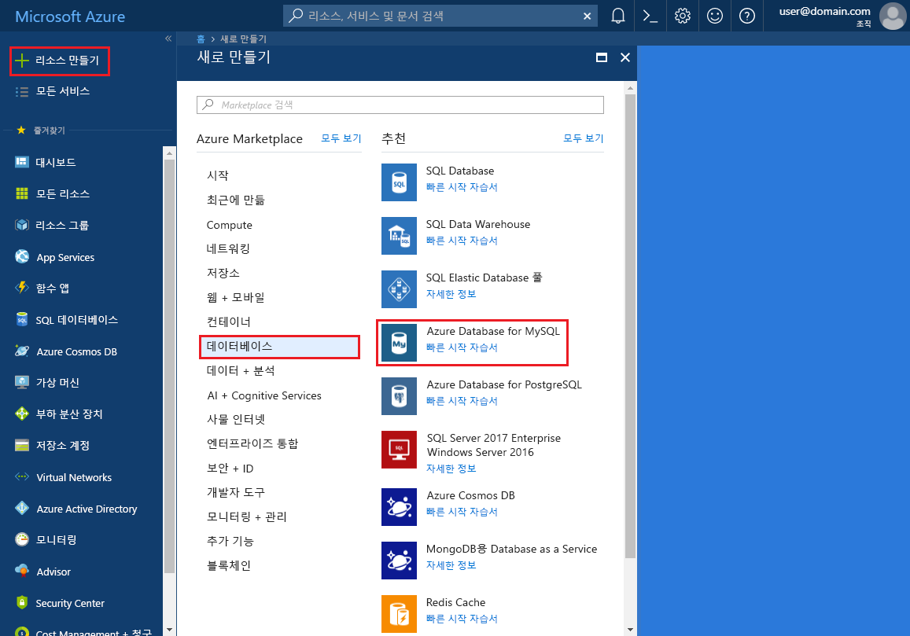

# <a name="create-an-azure-database-for-mysql-server-using-azure-portal"></a>Azure Portal을 사용한 Azure Database for MySQL 서버 만들기

이 문서에서는 Azure Portal을 사용하여 약 5분 안에 Azure Database for MySQL 서버 샘플을 만드는 과정을 안내합니다. 

Azure 구독이 아직 없는 경우 시작하기 전에 [체험](https://azure.microsoft.com/free/) 계정을 만듭니다.

## <a name="log-in-to-azure"></a>Azure에 로그인
먼저 웹 브라우저를 열고 [Microsoft Azure Portal](https://portal.azure.com/)로 이동합니다. 자격 증명을 입력하여 포털에 로그인합니다. 기본 보기는 서비스 대시보드입니다.


## <a name="create-azure-database-for-mysql-server"></a>Azure Database for MySQL 서버 만들기

1. **데이터베이스** > **MySQL**로 이동합니다. **데이터베이스** 범주 아래에서 Azure Database for MySQL 서버가 없는 경우 **모두 표시**를 클릭하여 사용 가능한 모든 데이터베이스 서비스를 표시합니다. 또한 검색 상자에서 **MySQL**을 입력하여 해당 서비스를 빠르게 찾을 수도 있습니다.


2. **MySQL** 아이콘을 클릭한 다음 **만들기**를 클릭합니다.
이 예제에서는 Azure Database for MySQL 페이지를 다음 정보로 채웁니다.

| **양식 필드** | **필드 설명** |
|----------------|-----------------------|
| *서버 이름* | mysqlserver4demo(서버 이름은 전역적으로 고유해야 함) |
| *구독* | MySQLaaS(드롭다운에서 선택함) |
| *리소스 그룹* | myresource(리소스 그룹을 만들거나 기존 리소스 그룹을 사용함) |
| *서버 관리자 로그인* | myadmin(관리자 계정 이름을 설정함) |
| *암호* | 관리자 계정 암호를 설정합니다. |
| *암호 확인* | 관리자 계정 암호를 확인합니다. |
| *위치*: | 북유럽(**북유럽**과 **미국 서부**  중에서 선택함) |
| *버전* | 5.6(MySQL 서버 버전을 선택함) |
| *성능 구성* | 기본(**성능 계층**, **계산 단위**, **저장소**를 선택한 다음 **확인**을 클릭함) |


몇 분 후 Azure Database for MySQL 서버가 프로비전되어 실행됩니다. 도구 모음에서 **알림** 단추(벨 아이콘)를 클릭하여 배포 프로세스를 모니터링합니다.

> [!TIP]
> Azure 서비스를 동일한 지역에 배포하고 가장 가까운 위치를 선택하는 것이 좋습니다. 또한 배포를 쉽게 추적할 수 있도록 **대시보드에 고정** 옵션을 선택할 수 있습니다.

## <a name="configure-the-firewall"></a>방화벽 구성
처음으로 클라이언트에서 Azure Databases for MySQL에 연결하기 전에 먼저 방화벽을 구성하고 클라이언트의 공용 네트워크 IP 주소(또는 IP 주소 범위)를 허용 목록에 추가해야 합니다.

1. 새로 만든 서버를 클릭한 다음 **설정**을 클릭합니다.
  

2. **일반** 섹션 아래에서 **방화벽 설정**을 클릭합니다. **내 IP 추가**를 클릭하여 로컬 컴퓨터의 IP 주소를 추가하거나 IP 주소 범위를 구성할 수 있습니다. 규칙을 만든 후에 **저장**을 클릭해야 합니다.
  

## <a name="get-connection-information"></a>연결 정보 가져오기
Azure Portal에서 Azure MySQL 서버의 정규화된 도메인 이름을 가져옵니다. 정규화된 도메인 이름을 사용하여 **mysql.exe** 명령줄 도구를 통해 서버에 연결합니다.

1.    [Azure Portal](https://portal.azure.com/)의 왼쪽 메뉴에서 **모든 리소스**를 클릭하고 Azure Database for MySQL 서버를 클릭합니다.

2.    **속성**을 클릭합니다. **서버 이름** 및 **서버 관리자 로그인**을 기록해 둡니다.
이 예제에서 서버 이름은 *mysql4doc.database.windows.net*이고, 서버 관리자 로그인은 *mysqladmin@mysql4doc*입니다.

## <a name="connect-to-the-server-using-mysqlexe-command-line-tool"></a>mysqlexe 명령줄 도구를 사용하여 서버에 연결
MySQL 서버 내에서 여러 데이터베이스를 만들 수 있습니다. 만들 수 있는 데이터베이스의 수에는 제한이 없으나 여러 데이터베이스가 동일한 서버 리소스를 공유하는 것입니다.  **mysql.exe** 명령줄 도구를 사용하여 서버에 연결하려면 포털에서 **Azure Cloud Shell**을 열고 다음을 입력합니다.

1. **mysql** 명령줄 도구를 사용하여 서버에 연결:
```dos
 mysql -h mysqlserver4demo.database.windows.net -u myadmin@mysqlserver4demo -p
```

2. 서버 상태 보기:
```dos
 mysql> status
```
  

> [!TIP]
> 다른 명령은 [MySQL 5.6 참조 설명서 - 4.5.1장](https://dev.mysql.com/doc/refman/5.6/en/mysql.html)을 참조하세요.

## <a name="connect-to-the-server-using-the-mysql-workbench-gui-tool"></a>MySQL Workbench GUI 도구로 서버에 연결
1.    클라이언트 컴퓨터에서 MySQL Workbench 응용 프로그램을 실행합니다. MySQL Workbench는 [여기](https://dev.mysql.com/downloads/workbench/)에서 다운로드할 수 있습니다.

2.    **새 연결 설정** 대화 상자의 **매개 변수** 탭에 다음 정보를 입력합니다.

| **매개 변수** | **설명** |
|----------------|-----------------|
|    *연결 이름* | 이 연결에 대한 이름 지정(아무 이름이나 가능) |
| *연결 방법* | 표준(TCP/IP) 선택 |
| *호스트 이름* | mycliserver.database.windows.net(앞서 기록해둔 서버 이름) |
| *포트* | 3306 |
| *사용자 이름* | myadmin@mycliserver (앞서 기록해둔 서버 관리자 이름) |
| *암호* | 자격 증명 모음에 관리자 계정 암호를 저장할 수 있습니다. |


3.    **연결 테스트**를 클릭하여 모든 매개 변수가 올바르게 구성되었는지 테스트합니다.

4.    이제 방금 만든 연결을 클릭하여 서버에 연결할 수 있습니다.

> 서버에서 기본적으로 적용되는 SSL은 연결의 성공을 위해 추가적인 구성이 필요합니다. [MySQL용 Azure 데이터베이스에 안전하게 연결하기 위한 사용자 응용 프로그램의 SSL 연결 구성](./howto-configure-ssl.md)을 참조하세요.  이 빠른 시작에서 SSL을 사용하지 않도록 설정하려면 포털의 "연결 보안"에서 SSL 적용을 해제할 수 있습니다.

## <a name="clean-up-resources"></a>리소스 정리

다른 빠른 시작/자습서에서 이러한 리소스가 필요하지 않으면 다음을 수행하여 삭제할 수 있습니다.

1. Azure Portal의 왼쪽 메뉴에서 **리소스 그룹**과 **myresource**를 차례로 클릭합니다. 
2. 리소스 그룹 페이지에서 **삭제**를 클릭하고 텍스트 상자에 **myresource**를 입력한 후 **삭제**를 클릭합니다.

## <a name="next-steps"></a>다음 단계

> [!div class="nextstepaction"]
> [첫 번째 Azure Database for MySQL 데이터베이스 디자인](./tutorial-design-database-using-portal.md)


